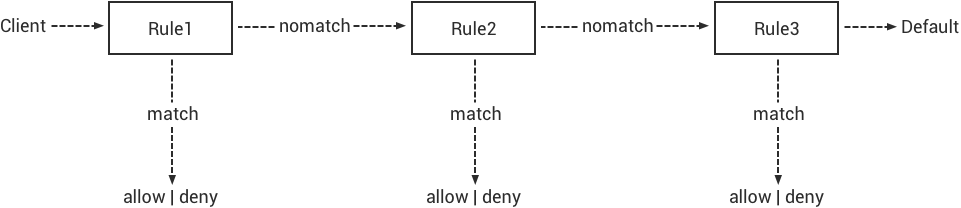

# Configuration 

The main configuration files of the *EMQ X* broker are under 'etc/' folder: 

File               |  Description                    
-------------------|---------------------------------
etc/emqx.conf      |  *EMQ X* 3.0 Configuration File 
etc/acl.conf       |  The default ACL File           
etc/plugins/*.conf |  Config Files of Plugins        

## EMQ X Configuration Change History 

The EMQ X configuration file has been adjusted four times for the convenience of users and plug-in developers. 

  1. The EMQ X 1.x version uses the Erlang native configuration file format etc/emqttd.config: 

    
    
    {emqttd, [
      %% Authentication and Authorization
      {access, [
        %% Authetication. Anonymous Default
        {auth, [
            %% Authentication with username, password
            %{username, []},
    
            %% Authentication with clientid
            %{clientid, [{password, no}, {file, "etc/clients.config"}]},

Erlang's native configuration format is multi-level nested, which is very unfriendly to non-Erlang developer users. 

  2. EMQ X 2.0-beta.x version simplifies the native Erlang configuration file in a format similar to rebar.config or relx.config: 

    
    
    %% Max ClientId Length Allowed.
    {mqtt_max_clientid_len, 512}.
    
    %% Max Packet Size Allowed, 64K by default.
    {mqtt_max_packet_size, 65536}.
    
    %% Client Idle Timeout.
    {mqtt_client_idle_timeout, 30}. % Second

The simplified Erlang native configuration format is user-friendly, but plug-in developers have to rely on the gen_conf library instead of appliaton: get_env to read configuration parameters. 

  3. The EMQ X 2.0-rc.2 integrates the cuttlefish library, adopts the k = V universal format similar to sysctl, and translates it into Erlang native configuration format at system startup: 

    
    
    ## Node name
    node.name = emq@127.0.0.1
    
    ## Max ClientId Length Allowed.
    mqtt.max_clientid_len = 1024

  4. From EMQ X 3.0-beta.1 beta version, the emqttd is renamed to emqx, and configuration names and configuration values/information are changed in corresponding: 

    
    
    ## Profile
    etc/emq.config  ==> etc/emqx.config
    
    ## Node name
    Original:
    node.name = emq@127.0.0.1
    Now:
    node.name = emqx@127.0.0.1
    
    
    Configuration file processing flow during EMQ X start-up::
    
    ----------------------                                          3.0/schema/*.schema      -------------------
    | etc/emqx.conf      |                   -----------------              \|/              | data/app.config |
    |       +            | --> mergeconf --> | data/app.conf | -->  cuttlefish generate  --> |                 |
    | etc/plugins/*.conf |                   -----------------                               | data/vm.args    |
    ----------------------                                                                   -------------------

## OS Environment Variables 

EMQX_NODE_NAME   |  Erlang node name                       
-----------------|-----------------------------------------
EMQX_NODE_COOKIE |  Cookie for distributed erlang node     
EMQX_MAX_PORTS   |  Maximum number of opened sockets       
EMQX_TCP_PORT    |  MQTT TCP Listener Port, Default: 1883  
EMQX_SSL_PORT    |  MQTT SSL Listener Port, Default: 8883  
EMQX_WS_PORT     |  MQTT/WebSocket Port, Default: 8083     
EMQX_WSS_PORT    |  MQTT/WebSocket/SSL Port, Default: 8084 

## EMQ X Cluster Setup 

Cluster name: 
    
    
    cluster.name = emqxcl

Cluster discovery strategy: 
    
    
    cluster.discovery = manual

Cluster Autoheal: 
    
    
    cluster.autoheal = on

Cluster Autoclean: 
    
    
    cluster.autoclean = 5m

### EMQ X Autodiscovery Strategy 

*EMQ X* 3.0 supports node discovery and autocluster with various strategies: 

Strategy |  Description                     
---------|----------------------------------
manual   |  Create cluster manually         
static   |  Autocluster by static node list 
mcast    |  Autocluster by UDP Multicast    
dns      |  Autocluster by DNS A Record     
etcd     |  Autocluster using etcd          
k8s      |  Autocluster on Kubernetes       

**Create cluster manually**

This is the default configuration of clustering, nodes join a cluster by executing  ./bin/emqx_ctl join \<Node> CLI command: 
    
    
    cluster.discovery = manual

**Autocluster by static node list**

Configuration of static cluster discovery: 
    
    
    cluster.discovery = static

Static node list: 
    
    
    cluster.static.seeds = emqx1@127.0.0.1,emqx2@127.0.0.1

**Autocluster by IP Multicast**

Configuration of cluster discovery by IP multicast: 
    
    
    cluster.discovery = mcast

IP multicast address: 
    
    
    cluster.mcast.addr = 239.192.0.1

Multicast port range: 
    
    
    cluster.mcast.ports = 4369,4370

Network adapter address: 
    
    
    cluster.mcast.iface = 0.0.0.0

Multicast TTL: 
    
    
    cluster.mcast.ttl = 255

Whether to send multicast packets cyclically: 
    
    
    cluster.mcast.loop = on

**Autocluster by DNS A Record**

Configuration of cluster discovery by DNS A record: 
    
    
    cluster.discovery = dns

dns name: 
    
    
    cluster.dns.name = localhost

Application name is used to build the node name with the IP address: 
    
    
    cluster.dns.app  = emqx

**Autocluster using etcd**

Configure cluster discovery by etcd: 
    
    
    cluster.discovery = etcd

List of etcd servers, separated by ` , ` : 
    
    
    cluster.etcd.server = http://127.0.0.1:2379

The prefix of the node's path in etcd. Each node in the cluster creates the following path in etcd: v2/keys/\<prefix>/\<cluster.name>/\<node.name>: 
    
    
    cluster.etcd.prefix = emqxcl

The TTL of the node in etcd: 
    
    
    cluster.etcd.node_ttl = 1m

Path containing the client's private PEM encoded key file: 
    
    
    cluster.etcd.ssl.keyfile = etc/certs/client-key.pem

Path containing the client certificate file: 
    
    
    cluster.etcd.ssl.certfile = etc/certs/client.pem

Path containing the PEM-encoded CA certificate file: 
    
    
    cluster.etcd.ssl.cacertfile = etc/certs/ca.pem

**Autocluster on Kubernetes**

Cluster discovery strategy is k8s: 
    
    
    cluster.discovery = k8s

List of Kubernetes API servers, separated by ` , ` : 
    
    
    cluster.k8s.apiserver = http://10.110.111.204:8080

The service name of the EMQ X node in the cluster: 
    
    
    cluster.k8s.service_name = emqx

Address type used to extract hosts from k8s services: 
    
    
    cluster.k8s.address_type = ip

EMQ X node name: 
    
    
    cluster.k8s.app_name = emqx

Kubernetes namespace: 
    
    
    cluster.k8s.namespace = default

## EMQ X Node and Cookie 

Erlang node name: 
    
    
    node.name = emqx@127.0.0.1

Erlang communication cookie within distributed nodes: 
    
    
    node.cookie = emqxsecretcookie

::: tip Tip
The Erlang/OTP platform application is composed of distributed Erlang nodes (processes). Each Erlang node (process) needs to be assigned a node name for mutual communication between nodes. All Erlang nodes (processes) in communication are authenticated by a shared cookie. 
:::

## EMQ X Node Connection Method 

The EMQ X node is based on IPv4, IPv6 or TLS protocol of Erlang/OTP platform for connections: 
    
    
    ##  Specify the Erlang Distributed Communication Protocol: inet_tcp | inet6_tcp | inet_tls
    node.proto_dist = inet_tcp
    
    ## Specify the parameter configuration of Erlang Distributed Communication SSL
    ## node.ssl_dist_optfile = etc/ssl_dist.conf

## Erlang VM Parameters 

Erlang system heartbeat monitoring during running. Comment this line to disable heartbeat monitoring, or set the value as ` on ` to enable the function : 
    
    
    node.heartbeat = on

The number of threads in the asynchronous thread pool, with the valid range: 0-1024: 
    
    
    node.async_threads = 32

The maximum number of processes allowed by the Erlang VM. An MQTT connection consumes 2 Erlang processes: 
    
    
    node.process_limit = 2048000

The maximum number of ports allowed by the Erlang VM. One MQTT connection consumes 1 Port: 
    
    
    node.max_ports = 1024000

Allocate buffer busy limit: 
    
    
    node.dist_buffer_size = 8MB

The maximum number of ETS tables. Note that mnesia and SSL will create a temporary ETS table: 
    
    
    node.max_ets_tables = 256000

GC frequency: 
    
    
    node.fullsweep_after = 1000

Crash dump log file location: 
    
    
    node.crash_dump = log/crash.dump

Specify the Erlang distributed protocol: 
    
    
    node.proto_dist = inet_tcp

Files for storing SSL/TLS options when Erlang distributed using TLS: 
    
    
    node.ssl_dist_optfile = etc/ssl_dist.conf

Tick time of distributed nodes: 
    
    
    node.dist_net_ticktime = 60

Port range of TCP connections for communication between Erlang distributed nodes: 
    
    
    node.dist_listen_min = 6396
    node.dist_listen_max = 6396

## RPC Parameter Configuration 

RPC Mode (sync | async): 
    
    
    rpc.mode = async

Max batch size of async RPC requests: 
    
    
    rpc.async_batch_size = 256

TCP port for RPC (local): 
    
    
    rpc.tcp_server_port = 5369

TCP port for RPC(remote): 
    
    
    rpc.tcp_client_port = 5369

Number of outgoing RPC connections. 
    
    
    rpc.tcp_client_num = 32

RPC connection timeout: 
    
    
    rpc.connect_timeout = 5s

RPC send timeout: 
    
    
    rpc.send_timeout = 5s

Authentication timeout: 
    
    
    rpc.authentication_timeout = 5s

Synchronous call timeout: 
    
    
    rpc.call_receive_timeout = 15s

Maximum keep-alive time when socket is idle: 
    
    
    rpc.socket_keepalive_idle = 900

Socket keep-alive detection interval: 
    
    
    rpc.socket_keepalive_interval = 75s

The maximum number of heartbeat detection failures before closing the connection: 
    
    
    rpc.socket_keepalive_count = 9

Size of TCP send buffer: 
    
    
    rpc.socket_sndbuf = 1MB

Size of TCP receive buffer: 
    
    
    rpc.socket_recbuf = 1MB

Size of user-level software socket buffer: 
    
    
    rpc.socket_buffer = 1MB

## Log Parameter Configuration 

Log output location, it can be set to write to the terminal or write to the file: 
    
    
    log.to = both

Set the log level: 
    
    
    log.level = error

Set the primary logger level and the log level of all logger handlers to the file and terminal. 

Set the storage path of the log file: 
    
    
    log.dir = log

Set the file name for storing the "log.level": 
    
    
    log.file = emqx.log

Set the maximum size of each log file: 
    
    
    log.rotation.size = 10MB

Set the maximum number of files for log rotation: 
    
    
    log.rotation.count = 5

The user can write a level of log to a separate file by configuring additional file logger handlers in the format log.$level.file = $filename. 

For example, the following configuration writes all logs higher than or equal to the info level to the info.log file: 
    
    
    log.info.file = info.log

## Anonymous Authentication and ACL Files 

Whether to allow the client to pass the authentication as an anonymous identity: 
    
    
    allow_anonymous = true

EMQ X supports ACLs based on built-in ACLs and plugins such as MySQL and PostgreSQL. 

Set whether to allow access when all ACL rules cannot match: 
    
    
    acl_nomatch = allow

Set the default file for storing ACL rules: 
    
    
    acl_file = etc/acl.conf

Set whether to allow ACL caching: 
    
    
    enable_acl_cache = on

Set the maximum number of ACL caches for each client: 
    
    
    acl_cache_max_size = 32

Set the effective time of the ACL cache: 
    
    
    acl_cache_ttl = 1m

Etc/acl.conf access control rule definition: 
    
    
    Allow|Deny User|IP Address|ClientID Publish|Subscribe Topic List

The access control rules are in the Erlang tuple format, and the access control module matches the rules one by one: 

` etc/acl.conf ` default access rule settings: 

Allow ` dashboard ` users to subscribe to ` $SYS/# ` : 
    
    
    {allow, {user, "dashboard"}, subscribe, ["$SYS/#"]}.

Allow local users to publish and subscribe all topics: 
    
    
    {allow, {ipaddr, "127.0.0.1"}, pubsub, ["$SYS/#", "#"]}.

Deny users other than local users to subscribe to topics ` $SYS/# ` and ` # ` : 
    
    
    {deny, all, subscribe, ["$SYS/#", {eq, "#"}]}.

Allow any access other than the above rules: 
    
    
    {allow, all}.

::: tip Tip
The default rule only allows local users to subscribe to $SYS/# and与 #. 
:::

When the EMQ X broker receives an Publish or Subscribe request from MQTT client, it will match the ACL rule one by one until the match returns to allow or deny. 

## MQTT Protocol Parameter Configuration 

MQTT maximum packet size: 
    
    
    mqtt.max_packet_size = 1MB

Maximum length of ClientId: 
    
    
    mqtt.max_clientid_len = 65535

Maximum level of Topic, 0 means no limit: 
    
    
    mqtt.max_topic_levels = 0

Maximum allowed QoS: 
    
    
    mqtt.max_qos_allowed = 2

Maximum number of Topic Alias , 0 means Topic Alias is not supported: 
    
    
    mqtt.max_topic_alias = 0

Whether to support MQTT messages retain: 
    
    
    mqtt.retain_available = true

Whether to support MQTT wildcard subscriptions: 
    
    
    mqtt.wildcard_subscription = true

Whether to support MQTT shared subscriptions: 
    
    
    mqtt.shared_subscription = true

Whether to allow the loop deliver of the message: 
    
    
    mqtt.ignore_loop_deliver = false

This configuration is mainly used to implement (backporting) the No Local feature in MQTT v3.1.1. This feature is standardized in MQTT 5. 

## MQTT Zones Parameter Configuration 

EMQ X uses **Zone** to manage configuration groups. A Zone defines a set of configuration items (such as the maximum number of connections, etc.), and Listener can specify to use a Zone to use all the configurations under that Zone. Multiple Listeners can share the same Zone. 

Listeners are configured as follows, with priority Zone > Global > Default:: 
    
    
    ---------              ----------              -----------
    Listeners -------> | Zone  | --nomatch--> | Global | --nomatch--> | Default |
    ---------              ----------              -----------
        |                       |                       |
      match                   match                   match
       \|/                     \|/                     \|/
    Zone Configs            Global Configs           Default Configs

A zone config has a form ` zone.$name.xxx ` , here the ` $name ` is the zone name. Such as ` zone.internal.xxx ` and ` zone.external.xxx ` . User can also define customized zone name. 

### External Zone Parameter Settings 

The maximum time to wait for MQTT CONNECT packet after the TCP connection is established: 
    
    
    zone.external.idle_timeout = 15s

Message Publish rate limit: 
    
    
    ## zone.external.publish_limit = 10,100

Enable blacklist checking: 
    
    
    zone.external.enable_ban = on

Enable ACL check: 
    
    
    zone.external.enable_acl = on

Whether to statistics the information of each connection: 
    
    
    zone.external.enable_stats = on

MQTT maximum packet size: 
    
    
    ## zone.external.max_packet_size = 64KB

ClientId maximum length: 
    
    
    ## zone.external.max_clientid_len = 1024

Topic maximum level, 0 means no limit: 
    
    
    ## zone.external.max_topic_levels = 7

Maximum allowed QoS: 
    
    
    ## zone.external.max_qos_allowed = 2

Maximum number of Topic Alias , 0 means Topic Alias is not supported: 
    
    
    ## zone.external.max_topic_alias = 0

Whether to support MQTT messages retain: 
    
    
    ## zone.external.retain_available = true

Whether to support MQTT wildcard subscriptions: 
    
    
    ## zone.external.wildcard_subscription = false

Whether to support MQTT shared subscriptions: 
    
    
    ## zone.external.shared_subscription = false

The connection time allowed by the server, Commenting this line means that the connection time is determined by the client: 
    
    
    ## zone.external.server_keepalive = 0

Keepalive * backoff * 2 is the actual keep-alive time: 
    
    
    zone.external.keepalive_backoff = 0.75

The maximum number of allowed topic subscriptions , 0 means no limit: 
    
    
    zone.external.max_subscriptions = 0

Whether to allow QoS upgrade: 
    
    
    zone.external.upgrade_qos = off

The maximum size of the in-flight window: 
    
    
    zone.external.max_inflight = 32

Resend interval for QoS 1/2 messages: 
    
    
    zone.external.retry_interval = 20s

The maximum number of QoS2 messages waiting for PUBREL (Client -> Broker), 0 means no limit: 
    
    
    zone.external.max_awaiting_rel = 100

Maximum time to wait for PUBREL before QoS2 message (Client -> Broker) is deleted 
    
    
    zone.external.await_rel_timeout = 300s

Default session expiration time used in MQTT v3.1.1 connections: 
    
    
    zone.external.session_expiry_interval = 2h

Message queue type: 
    
    
    zone.external.mqueue_type = simple

Maximum length of the message queue: 
    
    
    zone.external.max_mqueue_len = 1000

Topic priority: 
    
    
    ## zone.external.mqueue_priorities = topic/1=10,topic/2=8

Whether the message queue stores QoS0 messages: 
    
    
    zone.external.mqueue_store_qos0 = true

Whether to enable flapping detection: 
    
    
    zone.external.enable_flapping_detect = off

The maximum number of state changes allowed during the specified time: 
    
    
    zone.external.flapping_threshold = 10, 1m

Flapping prohibited time: 
    
    
    zone.external.flapping_banned_expiry_interval = 1h

### Internal Zone Parameter Settings 

Allow anonymous access: 
    
    
    zone.internal.allow_anonymous = true

Whether to Statistics the information of each connection: 
    
    
    zone.internal.enable_stats = on

Close ACL checking: 
    
    
    zone.internal.enable_acl = off

Whether to support MQTT wildcard subscriptions: 
    
    
    ## zone.internal.wildcard_subscription = true

Whether to support MQTT shared subscriptions: 
    
    
    ## zone.internal.shared_subscription = true

The maximum number of allowed topic subscriptions, 0 means no limit: 
    
    
    zone.internal.max_subscriptions = 0

The maximum size of the in-flight window: 
    
    
    zone.internal.max_inflight = 32

The maximum number of QoS2 messages waiting for PUBREL (Client -> Broker), 0 means no limit: 
    
    
    zone.internal.max_awaiting_rel = 100

Maximum length of the message queue: 
    
    
    zone.internal.max_mqueue_len = 1000

Whether the message queue stores QoS0 messages: 
    
    
    zone.internal.mqueue_store_qos0 = true

Whether to enable flapping detection: 
    
    
    zone.internal.enable_flapping_detect = off

The maximum number of state changes allowed during the specified time: 
    
    
    zone.internal.flapping_threshold = 10, 1m

Flapping banned time: 
    
    
    zone.internal.flapping_banned_expiry_interval = 1h

## MQTT Listeners Parameter Description 

The EMQ X message server supports the MQTT, MQTT/SSL, and MQTT/WS protocol, the port, maximum allowed connections, and other parameters are configurable through ` listener.tcp|ssl|ws|wss|.* ` . 

The TCP ports of the EMQ X broker that are enabled by default include: 

1883 |  MQTT TCP protocol port       
-----|-------------------------------
8883 |  MQTT/TCP SSL port            
8083 |  MQTT/WebSocket port          
8084 |  MQTT/WebSocket with SSL port 

Listener parameter description: 

listener.tcp.${name}.acceptors       |  TCP Acceptor pool                         
-------------------------------------|--------------------------------------------
listener.tcp.${name}.max_connections |  Maximum number of allowed TCP connections 
listener.tcp.${name}.max_conn_rate   |  Connection limit configuration            
listener.tcp.${name}.zone            |  To which zone the listener belongs        
listener.tcp.${name}.rate_limit      |  Connection rate configuration             

## MQTT/TCP Listener - 1883 

The EMQ X supports the configuration of multiple MQTT protocol listeners, for example, two listeners named ` external ` and ` internal ` : 

TCP listeners: 
    
    
    listener.tcp.external = 0.0.0.0:1883

Receive pool size: 
    
    
    listener.tcp.external.acceptors = 8

Maximum number of concurrent connections: 
    
    
    listener.tcp.external.max_connections = 1024000

Maximum number of connections created per second: 
    
    
    listener.tcp.external.max_conn_rate = 1000

Zone used by the listener: 
    
    
    listener.tcp.external.zone = external

Mountpoint: 
    
    
    ## listener.tcp.external.mountpoint = devicebound/

TCP data receive rate limit: 
    
    
    ## listener.tcp.external.rate_limit = 1024,4096

Access control rules: 
    
    
    ## listener.tcp.external.access.1 = allow 192.168.0.0/24
    
    listener.tcp.external.access.1 = allow all

Whether the proxy protocol V1/2 is enabled when the EMQ X cluster is deployed with HAProxy or Nginx: 
    
    
    ## listener.tcp.external.proxy_protocol = on

Timeout of the proxy protocol: 
    
    
    ## listener.tcp.external.proxy_protocol_timeout = 3s

Enable the X.509 certificate-based authentication option. EMQ X will use the common name of the certificate as the MQTT username: 
    
    
    ## listener.tcp.external.peer_cert_as_username = cn

The maximum length of the queue of suspended connection: 
    
    
    listener.tcp.external.backlog = 1024

TCP send timeout: 
    
    
    listener.tcp.external.send_timeout = 15s

Whether to close the TCP connection when the sent is timeout: 
    
    
    listener.tcp.external.send_timeout_close = on

TCP receive buffer (os kernel) for MQTT connections: 
    
    
    #listener.tcp.external.recbuf = 2KB

TCP send buffer (os kernel) for MQTT connections: 
    
    
    #listener.tcp.external.sndbuf = 2KB

The size of the user-level software buffer used by the driver should not to be confused with the options of sndbuf and recbuf, which correspond to the kernel socket buffer. It is recommended to use val(buffer) >= max(val(sndbuf), val(recbuf)) to avoid performance problems caused by unnecessary duplication. When the sndbuf or recbuf value is set, val(buffer) is automatically set to the maximum value abovementioned: 
    
    
    #listener.tcp.external.buffer = 2KB

Whether to set buffer = max(sndbuf, recbuf): 
    
    
    ## listener.tcp.external.tune_buffer = off

Whether to set the TCP_NODELAY flag. If this flag is set, it will attempt to send data once there is data in the send buffer. 
    
    
    listener.tcp.external.nodelay = true

Whether to set the SO_REUSEADDR flag: 
    
    
    listener.tcp.external.reuseaddr = true

## MQTT/SSL Listener - 8883 

SSL listening port: 
    
    
    listener.ssl.external = 8883

Acceptor size: 
    
    
    listener.ssl.external.acceptors = 16

Maximum number of concurrent connections: 
    
    
    listener.ssl.external.max_connections = 102400

Maximum number of connections created per second: 
    
    
    listener.ssl.external.max_conn_rate = 500

Zone used by the listener: 
    
    
    listener.ssl.external.zone = external

Mountpoint: 
    
    
    ## listener.ssl.external.mountpoint = devicebound/

Access control rules: 
    
    
    listener.ssl.external.access.1 = allow all

TCP data receive rate limit: 
    
    
    ## listener.ssl.external.rate_limit = 1024,4096

Whether the proxy protocol V1/2 is enabled when the EMQ X cluster is deployed with HAProxy or Nginx: 
    
    
    ## listener.ssl.external.proxy_protocol = on

Timeout of the proxy protocol: 
    
    
    ## listener.ssl.external.proxy_protocol_timeout = 3s

TLS version to prevent POODLE attacks: 
    
    
    ## listener.ssl.external.tls_versions = tlsv1.2,tlsv1.1,tlsv1

TLS handshake timeout: 
    
    
    listener.ssl.external.handshake_timeout = 15s

Path of the file containing the user's private key: 
    
    
    listener.ssl.external.keyfile = etc/certs/key.pem

Path of the file containing the user certificate: 
    
    
    listener.ssl.external.certfile = etc/certs/cert.pem

Path of the file containing the CA certificate: 
    
    
    ## listener.ssl.external.cacertfile = etc/certs/cacert.pem

Path of the file containing dh-params: 
    
    
    ## listener.ssl.external.dhfile = etc/certs/dh-params.pem

Configure verify mode, and the server only performs x509 path verification in verify_peer mode and sends a certificate request to the client: 
    
    
    ## listener.ssl.external.verify = verify_peer

When the server is in the verify_peer mode, whether the server returns a failure if the client does not have a certificate to send: 
    
    
    ## listener.ssl.external.fail_if_no_peer_cert = true

SSL cipher suites: 
    
    
    listener.ssl.external.ciphers = ECDHE-ECDSA-AES256-GCM-SHA384,ECDHE-RSA-AES256-GCM-SHA384,ECDHE-ECDSA-AES256-SHA384,ECDHE-RSA-AES256-SHA384,ECDHE-ECDSA-DES-CBC3-SHA,ECDH-ECDSA-AES256-GCM-SHA384,ECDH-RSA-AES256-GCM-SHA384,ECDH-ECDSA-AES256-SHA384,ECDH-RSA-AES256-SHA384,DHE-DSS-AES256-GCM-SHA384,DHE-DSS-AES256-SHA256,AES256-GCM-SHA384,AES256-SHA256,ECDHE-ECDSA-AES128-GCM-SHA256,ECDHE-RSA-AES128-GCM-SHA256,ECDHE-ECDSA-AES128-SHA256,ECDHE-RSA-AES128-SHA256,ECDH-ECDSA-AES128-GCM-SHA256,ECDH-RSA-AES128-GCM-SHA256,ECDH-ECDSA-AES128-SHA256,ECDH-RSA-AES128-SHA256,DHE-DSS-AES128-GCM-SHA256,DHE-DSS-AES128-SHA256,AES128-GCM-SHA256,AES128-SHA256,ECDHE-ECDSA-AES256-SHA,ECDHE-RSA-AES256-SHA,DHE-DSS-AES256-SHA,ECDH-ECDSA-AES256-SHA,ECDH-RSA-AES256-SHA,AES256-SHA,ECDHE-ECDSA-AES128-SHA,ECDHE-RSA-AES128-SHA,DHE-DSS-AES128-SHA,ECDH-ECDSA-AES128-SHA,ECDH-RSA-AES128-SHA,AES128-SHA

Whether to start a more secure renegotiation mechanism: 
    
    
    ## listener.ssl.external.secure_renegotiate = off

Whether to allow the client to reuse an existing session: 
    
    
    ## listener.ssl.external.reuse_sessions = on

Whether to force ciphers to be set in the order specified by the server, not by the client: 
    
    
    ## listener.ssl.external.honor_cipher_order = on

Use the CN, EN, or CRT field in the client certificate as the username. Note that "verify" should be set to "verify_peer": 
    
    
    ## listener.ssl.external.peer_cert_as_username = cn

The maximum length of the queue of suspended connection: 
    
    
    ## listener.ssl.external.backlog = 1024

TCP send timeout: 
    
    
    ## listener.ssl.external.send_timeout = 15s

Whether to close the TCP connection when the sent is timeout: 
    
    
    ## listener.ssl.external.send_timeout_close = on

TCP receive buffer (os kernel) for MQTT connections: 
    
    
    #listener.ssl.external.recbuf = 2KB

TCP send buffer (os kernel) for MQTT connections: 
    
    
    ## listener.ssl.external.sndbuf = 4KB

The size of the user-level software buffer used by the driver should not to be confused with the options of sndbuf and recbuf, which correspond to the kernel socket buffer. It is recommended to use val(buffer) >= max(val(sndbuf), val(recbuf)) to avoid performance problems caused by unnecessary duplication. When the sndbuf or recbuf value is set, val(buffer) is automatically set to the maximum value abovementioned: 
    
    
    ## listener.ssl.external.buffer = 4KB

Whether to set buffer = max(sndbuf, recbuf): 
    
    
    ## listener.ssl.external.tune_buffer = off

Whether to set the TCP_NODELAY flag. If this flag is set, it will attempt to send data once there is data in the send buffer: 
    
    
    ## listener.ssl.external.nodelay = true

Whether to set the SO_REUSEADDR flag: 
    
    
    listener.ssl.external.reuseaddr = true

## MQTT/WebSocket Listener - 8083 

MQTT/WebSocket listening port: 
    
    
    listener.ws.external = 8083

Acceptors size: 
    
    
    listener.ws.external.acceptors = 4

Maximum number of concurrent connections: 
    
    
    listener.ws.external.max_connections = 102400

Maximum number of connections created per second: 
    
    
    listener.ws.external.max_conn_rate = 1000

TCP data receive rate limit: 
    
    
    ## listener.ws.external.rate_limit = 1024,4096

Zone used by the listener: 
    
    
    listener.ws.external.zone = external

Mountpoint: 
    
    
    ## listener.ws.external.mountpoint = devicebound/

Access control rules: 
    
    
    listener.ws.external.access.1 = allow all

Whether to verify that the protocol header is valid: 
    
    
    listener.ws.external.verify_protocol_header = on

Uses X-Forward-For to identify the original IP after the EMQ X cluster is deployed with NGINX or HAProxy: 
    
    
    ## listener.ws.external.proxy_address_header = X-Forwarded-For

Uses X-Forward-For to identify the original port after the EMQ X cluster is deployed with NGINX or HAProxy: 
    
    
    ## listener.ws.external.proxy_port_header = X-Forwarded-Port

Whether the proxy protocol V1/2 is enabled when the EMQ X cluster is deployed with HAProxy or Nginx: 
    
    
    ## listener.ws.external.proxy_protocol = on

Proxy protocol timeout: 
    
    
    ## listener.ws.external.proxy_protocol_timeout = 3s

The maximum length of the queue of suspended connection: 
    
    
    listener.ws.external.backlog = 1024

TCP send timeout: 
    
    
    listener.ws.external.send_timeout = 15s

Whether to close the TCP connection when the send is timeout: 
    
    
    listener.ws.external.send_timeout_close = on

TCP receive buffer (os kernel) for MQTT connections: 
    
    
    ## listener.ws.external.recbuf = 2KB

TCP send buffer (os kernel) for MQTT connections: 
    
    
    ## listener.ws.external.sndbuf = 2KB

The size of the user-level software buffer used by the driver should not to be confused with the options of sndbuf and recbuf, which correspond to the kernel socket buffer. It is recommended to use val(buffer) >= max(val(sndbuf), val(recbuf)) to avoid performance problems caused by unnecessary duplication. When the sndbuf or recbuf value is set, val(buffer) is automatically set to the maximum value abovementioned: 
    
    
    ## listener.ws.external.buffer = 2KB

Whether to set buffer = max(sndbuf, recbuf): 
    
    
    ## listener.ws.external.tune_buffer = off

Whether to set the TCP_NODELAY flag. If this flag is set, it will attempt to send data once there is data in the send buffer: 
    
    
    listener.ws.external.nodelay = true

Whether to compress Websocket messages: 
    
    
    ## listener.ws.external.compress = true

Websocket deflate option: 
    
    
    ## listener.ws.external.deflate_opts.level = default
    ## listener.ws.external.deflate_opts.mem_level = 8
    ## listener.ws.external.deflate_opts.strategy = default
    ## listener.ws.external.deflate_opts.server_context_takeover = takeover
    ## listener.ws.external.deflate_opts.client_context_takeover = takeover
    ## listener.ws.external.deflate_opts.server_max_window_bits = 15
    ## listener.ws.external.deflate_opts.client_max_window_bits = 15

Maximum idle time: 
    
    
    ## listener.ws.external.idle_timeout = 2h

Maximum packet size, 0 means no limit: 
    
    
    ## listener.ws.external.max_frame_size = 0

## MQTT/WebSocket with SSL Listener - 8084 

MQTT/WebSocket with SSL listening port: 
    
    
    listener.wss.external = 8084

Acceptors size: 
    
    
    listener.wss.external.acceptors = 4

Maximum number of concurrent connections: 
    
    
    listener.wss.external.max_connections = 16

Maximum number of connections created per second: 
    
    
    listener.wss.external.max_conn_rate = 1000

TCP data receive rate limit: 
    
    
    ## listener.wss.external.rate_limit = 1024,4096

Zone used by the listener: 
    
    
    listener.wss.external.zone = external

Mountpoint: 
    
    
    ## listener.wss.external.mountpoint = devicebound/

Access control rules: 
    
    
    listener.wss.external.access.1 = allow all

Whether to verify that the protocol header is valid: 
    
    
    listener.wss.external.verify_protocol_header = on

Uses X-Forward-For to identify the original IP after the EMQ X cluster is deployed with NGINX or HAProxy: 
    
    
    ## listener.wss.external.proxy_address_header = X-Forwarded-For

Uses X-Forward-For to identify the original port after the EMQ X cluster is deployed with NGINX or HAProxy: 
    
    
    ## listener.wss.external.proxy_port_header = X-Forwarded-Port

Whether the proxy protocol V1/2 is enabled when the EMQ X cluster is deployed with HAProxy or Nginx: 
    
    
    ## listener.wss.external.proxy_protocol = on

Proxy protocol timeout: 
    
    
    ## listener.wss.external.proxy_protocol_timeout = 3s

TLS version to prevent POODLE attacks: 
    
    
    ## listener.wss.external.tls_versions = tlsv1.2,tlsv1.1,tlsv1

Path of the file containing the user's private key: 
    
    
    listener.wss.external.keyfile = etc/certs/key.pem

Path of the file containing the user certificate: 
    
    
    listener.wss.external.certfile = etc/certs/cert.pem

Path of the file containing the CA certificate: 
    
    
    ## listener.wss.external.cacertfile = etc/certs/cacert.pem

Path of the file containing dh-params: 
    
    
    ## listener.ssl.external.dhfile = etc/certs/dh-params.pem

Configure verify mode, and the server only performs x509 path verification in verify_peer mode and sends a certificate request to the client: 
    
    
    ## listener.wss.external.verify = verify_peer

When the server is in the verify_peer mode, whether the server returns a failure if the client does not have a certificate to send : 
    
    
    ## listener.wss.external.fail_if_no_peer_cert = true

SSL cipher suites: 
    
    
    ## listener.wss.external.ciphers = ECDHE-ECDSA-AES256-GCM-SHA384,ECDHE-RSA-AES256-GCM-SHA384,ECDHE-ECDSA-AES256-SHA384,ECDHE-RSA-AES256-SHA384,ECDHE-ECDSA-DES-CBC3-SHA,ECDH-ECDSA-AES256-GCM-SHA384,ECDH-RSA-AES256-GCM-SHA384,ECDH-ECDSA-AES256-SHA384,ECDH-RSA-AES256-SHA384,DHE-DSS-AES256-GCM-SHA384,DHE-DSS-AES256-SHA256,AES256-GCM-SHA384,AES256-SHA256,ECDHE-ECDSA-AES128-GCM-SHA256,ECDHE-RSA-AES128-GCM-SHA256,ECDHE-ECDSA-AES128-SHA256,ECDHE-RSA-AES128-SHA256,ECDH-ECDSA-AES128-GCM-SHA256,ECDH-RSA-AES128-GCM-SHA256,ECDH-ECDSA-AES128-SHA256,ECDH-RSA-AES128-SHA256,DHE-DSS-AES128-GCM-SHA256,DHE-DSS-AES128-SHA256,AES128-GCM-SHA256,AES128-SHA256,ECDHE-ECDSA-AES256-SHA,ECDHE-RSA-AES256-SHA,DHE-DSS-AES256-SHA,ECDH-ECDSA-AES256-SHA,ECDH-RSA-AES256-SHA,AES256-SHA,ECDHE-ECDSA-AES128-SHA,ECDHE-RSA-AES128-SHA,DHE-DSS-AES128-SHA,ECDH-ECDSA-AES128-SHA,ECDH-RSA-AES128-SHA,AES128-SHA

Whether to enable a more secure renegotiation mechanism: 
    
    
    ## listener.wss.external.secure_renegotiate = off

Whether to allow the client to reuse an existing session: 
    
    
    ## listener.wss.external.reuse_sessions = on

Whether to force ciphers to be set in the order specified by the server, not by the client: 
    
    
    ## listener.wss.external.honor_cipher_order = on

Use the CN, EN, or CRT field in the client certificate as the username. Note that "verify" should be set to "verify_peer": 
    
    
    ## listener.wss.external.peer_cert_as_username = cn

The maximum length of the queue that suspends the connection: 
    
    
    listener.wss.external.backlog = 1024

TCP send timeout: 
    
    
    listener.wss.external.send_timeout = 15s

Whether to close the TCP connection when the send is timeout : 
    
    
    listener.wss.external.send_timeout_close = on

TCP receive buffer (os kernel) for MQTT connections: 
    
    
    ## listener.wss.external.recbuf = 4KB

TCP send buffer (os kernel) for MQTT connections: 
    
    
    ## listener.wss.external.sndbuf = 4KB

The size of the user-level software buffer used by the driver should not to be confused with the options of sndbuf and recbuf, which correspond to the kernel socket buffer. It is recommended to use val(buffer) >= max(val(sndbuf), val(recbuf)) to avoid performance problems caused by unnecessary duplication. When the sndbuf or recbuf value is set, val(buffer) is automatically set to the maximum value abovementioned: 
    
    
    ## listener.wss.external.buffer = 4KB

Whether to set the TCP_NODELAY flag. If this option is enabled, it will attempt to send data once there is data in the send buffer : 
    
    
    ## listener.wss.external.nodelay = true

Whether to compress Websocket messages: 
    
    
    ## listener.wss.external.compress = true

Websocket deflate option: 
    
    
    ## listener.wss.external.deflate_opts.level = default
    ## listener.wss.external.deflate_opts.mem_level = 8
    ## listener.wss.external.deflate_opts.strategy = default
    ## listener.wss.external.deflate_opts.server_context_takeover = takeover
    ## listener.wss.external.deflate_opts.client_context_takeover = takeover
    ## listener.wss.external.deflate_opts.server_max_window_bits = 15
    ## listener.wss.external.deflate_opts.client_max_window_bits = 15

Maximum idle time: 
    
    
    ## listener.wss.external.idle_timeout = 2h

Maximum packet size, 0 means no limit: 
    
    
    ## listener.wss.external.max_frame_size = 0

## Bridges 

### Bridges Parameter Setting 

Bridge address, use node name for RPC bridging, and use host:port for MQTT connection: 
    
    
    bridge.aws.address = 127.0.0.1:1883

Bridged protocol version: 
    
    
    bridge.aws.proto_ver = mqttv4

Client's client_id: 
    
    
    bridge.aws.client_id = bridge_aws

The clean_start field of the client: 
    
    
    bridge.aws.clean_start = true

The username field of the client: 
    
    
    bridge.aws.username = user

The password field of the client: 
    
    
    bridge.aws.password = passwd

Bridge mount points: 
    
    
    bridge.aws.mountpoint = bridge/aws/${node}/

The topic of the message to be forwarded: 
    
    
    bridge.aws.forwards = topic1/#,topic2/#

Whether the client uses SSL to connect to the remote server: 
    
    
    bridge.aws.ssl = off

SSL certificate for CA connection (PEM format) 
    
    
    bridge.aws.cacertfile = etc/certs/cacert.pem

SSL certificate for SSL connection: 
    
    
    bridge.aws.certfile = etc/certs/client-cert.pem

Key file for SSL connection: 
    
    
    bridge.aws.keyfile = etc/certs/client-key.pem

SSL cipher suites: 
    
    
    #bridge.aws.ciphers = ECDHE-ECDSA-AES256-GCM-SHA384,ECDHE-RSA-AES256-GCM-SHA384

TLS PSK Password: 
    
    
    #bridge.aws.psk_ciphers = PSK-AES128-CBC-SHA,PSK-AES256-CBC-SHA,PSK-3DES-EDE-CBC-SHA,PSK-RC4-SHA

Client's heartbeat interval: 
    
    
    bridge.aws.keepalive = 60s

Supported TLS versions: 
    
    
    bridge.aws.tls_versions = tlsv1.2,tlsv1.1,tlsv1

subscription topics of bridge: 
    
    
    bridge.aws.subscription.1.topic = cmd/topic1

subscription qos of bridge: 
    
    
    bridge.aws.subscription.1.qos = 1

Bridge start type: 
    
    
    bridge.aws.start_type = manual

Bridge reconnection interval: 
    
    
    bridge.aws.reconnect_interval = 30s

Resending interval for QoS 1/2 messages: 
    
    
    bridge.aws.retry_interval = 20s

In-flight window size: 
    
    
    bridge.aws.max_inflight_batches = 32

The number of messages used internally by emqx_bridge for batch: 
    
    
    bridge.aws.queue.batch_count_limit = 32

The bytes of messages used internally by emqx_bridge for batch: 
    
    
    bridge.aws.queue.batch_bytes_limit = 1000MB

The path where the replayq queue is placed. If the item is not specified in the configuration, replayq will run in mem-only mode and the message will not be cached on disk: 
    
    
    bridge.aws.queue.replayq_dir = {{ platform_data_dir }}/emqx_aws_bridge/

Replayq data segment size: 
    
    
    bridge.aws.queue.replayq_seg_bytes = 10MB

## Modules 

EMQ X supports module expansion. The three default modules are the online and offline status message publishing module, the proxy subscription module, and the topic rewriting module. 

### Online and offline status message publishing module 

Whether to enable the online and offline status message publishing module: 
    
    
    module.presence = on

QoS used by the online and offline status message publishing module to publish MQTT messages: 
    
    
    module.presence.qos = 1

### Proxy Subscription Module 

Whether to enable the proxy subscription module: 
    
    
    module.subscription = off

Topics and QoS that are automatically subscribed when the client connects: 
    
    
    ## Subscribe the Topics's qos
    ## module.subscription.1.topic = $client/%c
    ## module.subscription.1.qos = 0
    ## module.subscription.2.topic = $user/%u
    ## module.subscription.2.qos = 1

### Topic Rewriting Module 

Whether to enable the topic rewriting module: 
    
    
    module.rewrite = off

Topic rewriting rule: 
    
    
    ## module.rewrite.rule.1 = x/# ^x/y/(.+)$ z/y/$1
    ## module.rewrite.rule.2 = y/+/z/# ^y/(.+)/z/(.+)$ y/z/$2

## Configuration Files for Plugins 

The directory where the plugin configuration file is stored: 
    
    
    plugins.etc_dir = etc/plugins/

Path of the file to store list of plugins that needs to be automatically loaded at startup 
    
    
    plugins.loaded_file = data/loaded_plugins

The EMQ X plugin configuration file, which is in the directory of ` etc/plugins/ ` by default, and can be adjusted by modification of plugins.etc_dir. 

## Broker Parameter Settings 

System message publishing interval: 
    
    
    broker.sys_interval = 1m

Whether to register the session globally: 
    
    
    broker.enable_session_registry = on

Session locking strategy: 
    
    
    broker.session_locking_strategy = quorum

Dispatch strategy for shared subscriptions: 
    
    
    broker.shared_subscription_strategy = random

Whether an ACK is required when dispatching the sharing subscription: 
    
    
    broker.shared_dispatch_ack_enabled = false

Whether to enable route batch cleaning: 
    
    
    broker.route_batch_clean = on

## Erlang VM Monitoring 

Whether to enable long_gc monitoring and how long garbage collection lasts that can trigger the long_gc event: 
    
    
    sysmon.long_gc = false

How long does a process or port in the system keep running to trigger long_schedule event: 
    
    
    sysmon.long_schedule = 240

How big is the size of allocated heap caused by garbage collection to trigger the large_heap event: 
    
    
    sysmon.large_heap = 8MB

Whether a process in the system triggers a busy_port event when it hangs because it is sent to a busy port: 
    
    
    sysmon.busy_port = false

Whether to listen Erlang distributed port busy events: 
    
    
    sysmon.busy_dist_port = true

Cpu occupancy check interval: 
    
    
    os_mon.cpu_check_interval = 60s

An alarm is generated when the CPU usage is higher than: 
    
    
    os_mon.cpu_high_watermark = 80%

Clear the alarm when the CPU usage is lower than: 
    
    
    os_mon.cpu_low_watermark = 60%

Memory usage check interval: 
    
    
    os_mon.mem_check_interval = 60s

An alarm is generated when the system memory usage is higher than: 
    
    
    os_mon.sysmem_high_watermark = 70%

An alarm is generated when the memory usage of a single process is higher than: 
    
    
    os_mon.procmem_high_watermark = 5%

The check interval of the number of processes: 
    
    
    vm_mon.check_interval = 30s

An alarm is generated when the ratio of the current number of processes to the maximum number of processes reached: 
    
    
    vm_mon.process_high_watermark = 80%

Clear the alarm when the ratio of the current number of processes to the maximum number of processes reached: 
    
    
    vm_mon.process_low_watermark = 60%
