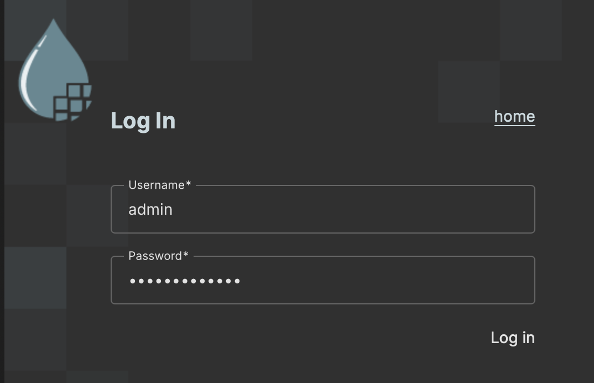
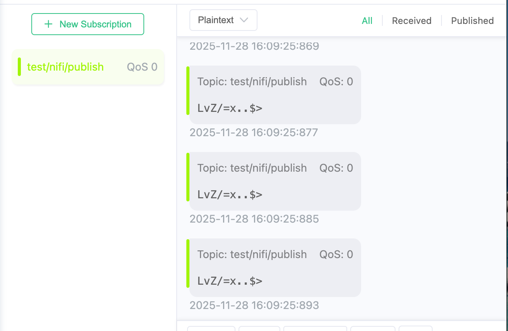

# Integrate with Apache NiFi

Apache NiFi is a visual data flow management tool designed for the reliable, efficient transfer, transformation, and processing of data between different systems. It supports features such as real-time data flow, drag-and-drop process design, data provenance, and security controls.

This page explains how to connect Apache NiFi to EMQX and perform basic data flow processing tasks.

## Prerequisites

Before connecting Apache NiFi to EMQX, make sure the following preparations are complete:

- EMQX is installed and running. See [Installation](../deploy/install.md) for details.
- Install JDK
- Deploy Apache NiFi

### Install JDK

For deploying Apache NiFi 2.6.0, you need to install JDK 21 (or a later version) to run Apache NiFi properly.

#### Debian / Ubuntu

```bash
sudo apt update
sudo apt install openjdk-21-jdk
java -version
```

#### CentOS 8+ / Fedora 8+ / RHEL

```bash
sudo dnf install temurin-21-jdk
java -version
```

#### Arch Linux / Manjaro

```bash
sudo pacman -S jdk-openjdk
```

### Deploy Apache NiFi

#### Download and Start Apache NiFi

1. Download the package from the [Apache official website](https://nifi.apache.org/download/) and unzip it. For example, deploying Apache NiFi 2.6.0:

   ```bash
   # Download Apache NiFi 2.6.0 from apache.org
   wget https://dlcdn.apache.org/nifi/2.6.0/nifi-2.6.0-bin.zip

   # Unzip the file
   unzip nifi-2.6.0-bin.zip

   # Delete the zip file after extraction
   rm nifi-2.6.0-bin.zip
   ```

2. Navigate to the `bin` directory, configure the username and password, and start Apache NiFi.

   ```bash
   cd nifi-2.6.0/bin
   
   # Set your username and password, password must be at least 12 characters
   ./nifi.sh set-single-user-credentials <YOUR_USERNAME> <YOUR_PASSWORD>
   
   # Start NiFi service in the background
   ./nifi.sh start
   
   # To run NiFi in the foreground, use the following command
   # ./nifi.sh run
   ```

#### Access Apache NiFi

Apache NiFi 2.x by default uses HTTPS for access, and its built-in certificate only supports local access.

- If you deploy Apache NiFi on your local machine, you can access it by visiting `https://localhost:8443/nifi` in your browser.
- If it's deployed on a remote server, this tutorial provides three methods to resolve access errors.

##### Method 1: Enable HTTP Access (Development Only)

1. Modify the configuration file to access via HTTP (only for development environments; HTTPS is recommended for production environments).

   ```bash
   # Navigate to the configuration directory
   cd ~/nifi-2.6.0/conf
   # Open nifi.properties with your preferred text editor, e.g., Vim
   vim nifi.properties
   ```

2. Look for and modify the following keywords:

   - `nifi.remote.input.secure=false`
   - `nifi.web.http.host=192.168.31.9` (adjust based on your actual situation)
   - `nifi.web.http.port=8080`
   - `nifi.web.https.host=`
   - `nifi.web.https.port=`

3. Restart the Apache NiFi deployment and access it via `http://<serverIP>:8080/nifi` in your browser.

##### Method 2: Configure HTTPS Certificates for Remote Access

Follow [Stack Overflow: Apache NIFI 2+ HTTP ERROR 400 Invalid SNI](https://stackoverflow.com/questions/78985347/apache-nifi-2-http-error-400-invalid-sni) to configure certificates and internal network access.

##### Method 3: Access via SSH Tunnel (Temporary Debugging)

1. Open your terminal and enter the following command:

   ```bash
   ssh -L 8443:localhost:8443 <your-username>@<your-server-IP>
   ```

2. After successful verification, open your browser and access `https://localhost:8443/nifi`.

When you see the login screen, your Apache NiFi deployment is complete. Log in with the username and password you configured.



## Connect Apache NiFi to EMQX

In Apache NiFi, you can use various processors to communicate with EMQX over MQTT. Common processors include:

- **PublishMQTT**: Used to send data flows to EMQX.
- **ConsumeMQTT**: Used to receive data flows from EMQX.

### Prerequisites

Before configuring Apache NiFi, ensure that the required credentials and permissions are set up in EMQX:

- Create a client credential in the EMQX Dashboard under **Access Control** -> **Authentication** for Apache NiFi to connect.
- If authorization is enabled, grant the appropriate publish and subscribe permissions to this client in **Access Control** -> **Authorization**.

### Example Data Flow

The following example demonstrates a simple log data processing flow in Apache NiFi:

- **GenerateFlowFile** generates simulated log data and sends it to the **PublishMQTT** processor.
- **PublishMQTT** publishes the log data to EMQX.
- **ConsumeMQTT** subscribes to the same topic and receives the log data from EMQX.
- **LogAttribute** records attributes from the data flow to the local NiFi log for verification.


### Configure MQTT Processors

Both **PublishMQTT** and **ConsumeMQTT** require MQTT connection settings. The key configuration items are described below.

#### 1. Broker URI

The Broker URI must follow this format:

```
<protocol: 'tcp' | 'ssl' | 'ws' | 'wss'>://<broker-address>:<port>
```

Example:

```
ssl://your-emqx-host:8883
```

For production environments, SSL or WSS is strongly recommended to ensure encrypted communication. When using encrypted protocols, you must configure an **SSL Context Service** in NiFi.

##### Configure SSL Context Service

1. Obtain the CA certificate from your EMQX deployment. If you are using a self-signed certificate, export the CA cert from your EMQX TLS configuration.

2. Upload the certificate file to the server where Apache NiFi is deployed.

3. Run the following command to import the certificate into a Java truststore:

   ```bash
   keytool -importcert \
   -alias myca \
   -file <your-ca-cert>.crt \
   -keystore truststore.jks \
   -storepass <ReplaceWithYourStorepass>
   ```

4. Place the generated `truststore.jks` in a directory accessible by Apache NiFi.

5. Click the `...` next to **SSL Context Service**, select **Create new service**, choose `StandardRestrictedSSLContextService`, then click **Add**.

6. Click the `...` next to **SSL Context Service** and select **Go to service**.

7. Select the newly created service and click **Edit**.

8. Set the **Truststore Filename** to the path where `truststore.jks` is stored, set **Truststore Password** to your storepass, and set **Truststore Type** to `JKS`.

9. Exit, then enable the service by clicking the `...` and selecting **Enable**.

Once enabled, the SSL Context Service can be reused by other processors without additional configuration.

#### 2. MQTT Specification Version

Select the MQTT protocol version based on your requirements. MQTT v5.0 is recommended for new deployments.

#### 3. Authentication

Set the **Username** and **Password** to the credentials created in EMQX.

#### 4. Other Settings

Configure any additional required or optional fields as needed for your use case.

### Start the Data Flow

After completing the configuration:

1. Click the **Verify (✅)** button in each processor to validate the settings.
2. Change the processor state from **Stopped** to **Start**.
3. Start all processors in the flow.

Once all processors are running, the Apache NiFi data processing pipeline is fully configured and operational.

## Verify MQTT Data Flow Between Apache NiFi and EMQX

After completing the configuration, verify the data flow using an MQTT client. We recommend using [MQTTX](https://mqttx.app) for debugging.

1. **Verify PublishMQTT output.**

   Use MQTTX to subscribe to the topic configured in the **PublishMQTT** processor. You should see simulated log messages continuously published by **GenerateFlowFile**.

   

2. **Verify ConsumeMQTT input.**

   Using MQTTX, manually publish log messages to the topic configured in the **ConsumeMQTT** processor. You should observe the output count of **ConsumeMQTT** increasing as messages are received.

   

3. **Verify NiFi logs.**

   Check the Apache NiFi application log (by default located at `logs/nifi-app.log`). You should see entries generated by **LogAttribute** for:

   - The simulated logs produced by **GenerateFlowFile**.
   - The logs manually published via MQTTX.
   
   

If all steps behave as expected, the Apache NiFi–EMQX integration is functioning correctly.

## Next Steps

After completing the basic setup, you can flexibly configure the flow structure based on your business needs. More demo examples in different languages can be found on [GitHub](https://github.com/emqx/MQTT-Client-Examples).

## References

- [Getting Started with MQTT in Apache NiFi](https://medium.com/cloudera-inc/getting-started-with-mqtt-in-apache-nifi-64e8cde1de91)
