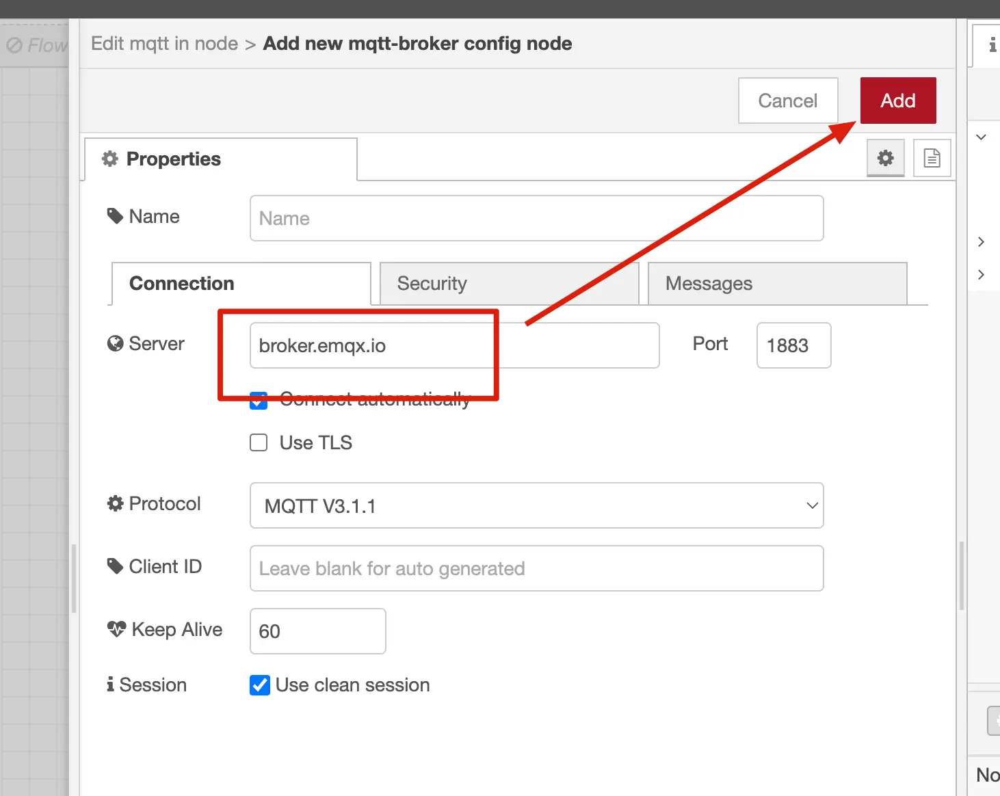
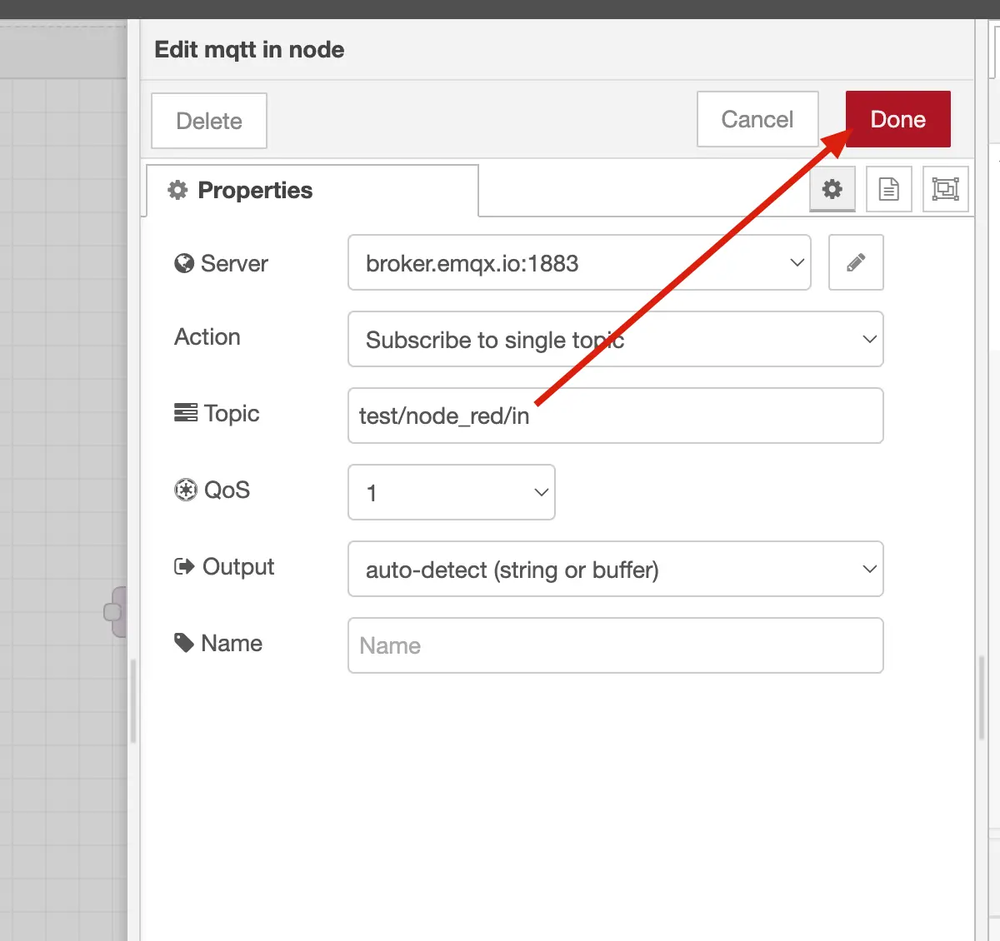
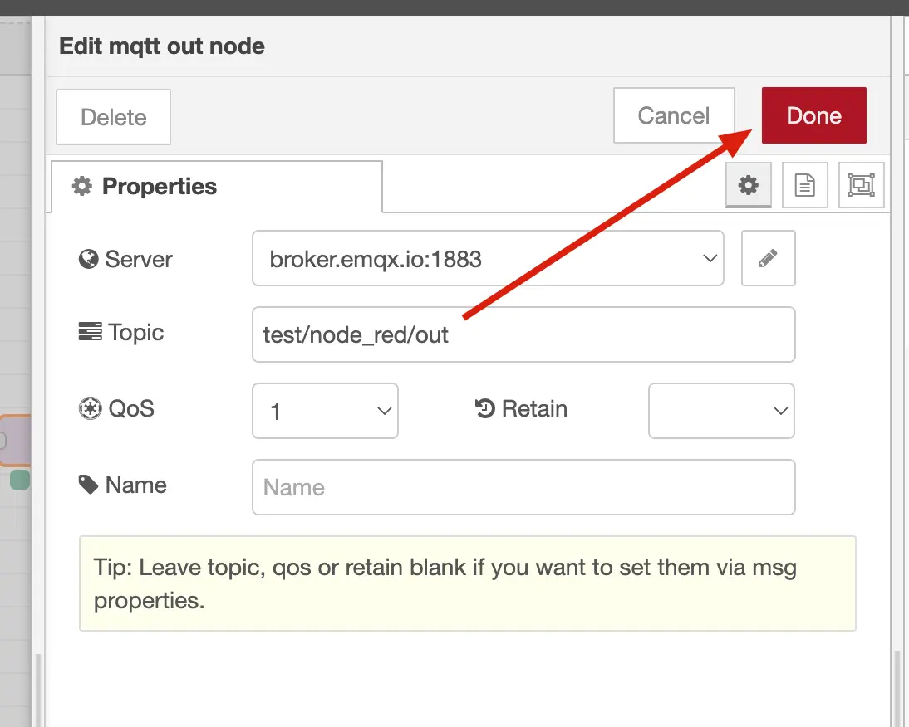
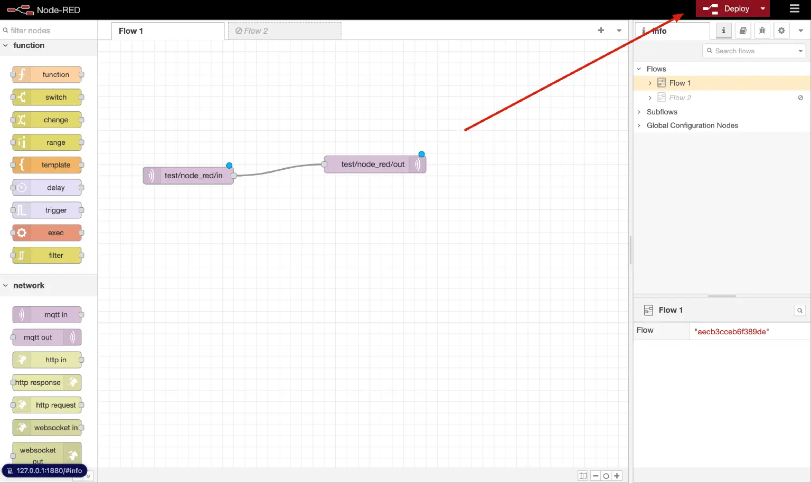
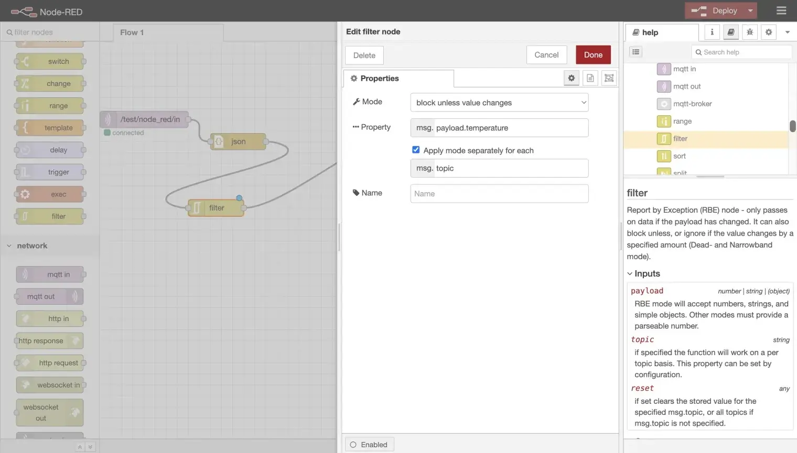

# Use Node-RED with EMQX

[Node-RED](https://nodered.org/) is a flow-based programming tool that provides a browser-based editor for wiring together hardware devices, APIs, and online services. It uses a visual, node-based interface where you connect pre-built nodes to create data flows. Node-RED supports MQTT natively through its built-in `mqtt-in` (subscribe) and `mqtt-out` (publish) nodes, making it a popular choice for processing IoT data from EMQX.

This page explains how to install Node-RED, connect it to EMQX, and build a data processing pipeline that parses, filters, and transforms MQTT messages.

## Prerequisites

- Node.js 18 LTS or 20 LTS (for NPM installation)
- An EMQX deployment, or use the EMQX public broker for testing
- [MQTTX](https://mqttx.app/) or another MQTT client for sending test messages

## Install Node-RED

**Via NPM:**

```bash
npm install -g --unsafe-perm node-red
```

Then start Node-RED:

```bash
node-red
```

**Via Docker:**

```bash
docker run -it -p 1880:1880 --name mynodered nodered/node-red
```

After startup, open your browser and navigate to `http://127.0.0.1:1880` to access the Node-RED editor.


> For more installation options including Raspberry Pi and cloud deployment, see the [Node-RED documentation](https://nodered.org/docs/getting-started/).

## MQTT Broker Setup

You need an MQTT broker for Node-RED to connect to. This guide uses EMQX, which supports MQTT 3.1, 3.1.1, and 5.0.

### EMQX Public Broker (Testing)

For quick testing without deploying your own broker, you can use the EMQX public broker.

| Parameter       | Value            |
| --------------- | ---------------- |
| Broker Address  | `broker.emqx.io` |
| TCP Port        | `1883`           |
| SSL/TLS Port    | `8883`           |
| WebSocket Port  | `8083`           |
| Secure WebSocket Port | `8084`     |

The public broker is intended for testing and demonstration purposes only.

### EMQX Enterprise Deployment

For production scenarios, connect Node-RED to your own EMQX Enterprise deployment using the broker address, ports, and authentication credentials defined in your environment.

Typical configurations include:

- Custom broker hostname or IP address
- Username/password authentication or mutual TLS
- Access control rules (ACLs) applied to topics

Refer to your EMQX Enterprise listener and authentication configuration when setting up Node-RED broker connections.

> In addition to self-managed EMQX Enterprise deployments, you can also connect Node-RED to the fully managed MQTT service [EMQX Cloud](https://docs.emqx.com/en/cloud/latest/overview.html) (Serverless or Dedicated). Use the broker address, ports, and credentials provided by EMQX Cloud.

## Build a Basic MQTT Flow

The following steps create a minimal flow that subscribes to one topic and forwards received messages to another topic.

### Step 1: Add an MQTT Subscribe Node

1. In the Node-RED editor, drag an **mqtt-in** node from the left palette onto the canvas.

2. Double-click the node to open its properties.

3. Click the pencil icon next to the **Server** field to create a new broker connection.

4. Enter `broker.emqx.io` as the **Server** address and click **Add**.

   

5. Set the **Topic** to `test/node_red/in`.

6. Set the **QoS** level as needed, then click **Done**.

   

### Step 2: Add an MQTT Publish Node

1. Drag an **mqtt-out** node onto the canvas.

2. Double-click the node to open its properties.

3. Select the broker configured in Step 1 from the **Server** dropdown.

4. Set the **Topic** to `test/node_red/out`.

5. Configure **QoS** and **Retain** as needed, then click **Done**.

   

### Step 3: Connect and Deploy

1. Draw a wire from the output port of the **mqtt-in** node to the input port of the **mqtt-out** node.
2. Click the **Deploy** button in the top-right corner.
3. Verify that both nodes show a green **connected** status indicator.

You now have a flow that forwards all messages received on `test/node_red/in` to `test/node_red/out`.



## Build an Advanced Data Processing Pipeline

Node-RED's real power comes from chaining multiple nodes to filter and transform data before republishing. The following example builds a pipeline that:

1. Receives JSON-formatted sensor data via MQTT.
2. Parses the raw payload into a JavaScript object.
3. Filters out duplicate temperature readings.
4. Formats the result and republishes it.

The complete flow is: **mqtt-in** → **json** → **rbe** → **template** → **mqtt-out**

### Step 1: Add a JSON Node

1. Drag a **json** node from the palette onto the canvas.
2. Double-click to configure it and set **Action** to **Always Convert to JavaScript Object**.
3. Click **Done**.
4. Connect the output of **mqtt-in** to the input of the **json** node.

This ensures the incoming payload is parsed into a JavaScript object so downstream nodes can access individual fields such as `msg.payload.temperature`.


### Step 2: Add a Filter Node

1. Drag an **rbe** (report by exception) node onto the canvas.
2. Double-click to configure it:
   - Set **Mode** to **block unless value changes**.
   - Set **Property** to `msg.payload.temperature`.
3. Click **Done**.
4. Connect the output of the **json** node to the input of the **rbe** node.

The filter node blocks messages when the `temperature` field has not changed since the previous message, reducing unnecessary traffic from repeated identical readings.



### Step 3: Add a Template Node

1. Drag a **template** node onto the canvas.

2. Double-click to configure it and enter your desired output format using Mustache syntax, for example:

   ```
   {"temperature": {{payload.temperature}}, "humidity": {{payload.humidity}}}
   ```

3. Click **Done**.

4. Connect the output of the **rbe** node to the input of the **template** node.


### Step 4: Connect the Output Node and Deploy

1. Connect the output of the **template** node to the input of the **mqtt-out** node.
2. Click **Deploy**.
3. Verify that all nodes show a green **connected** status.

> You can omit the **template** node if you want to republish the filtered data without reformatting. In that case, connect **rbe** directly to **mqtt-out**.


## Test the Flow

Use MQTTX or any MQTT client to test the pipeline:

1. Subscribe to `test/node_red/out` to observe the processed output.

2. Publish a test message to `test/node_red/in` with a JSON payload, for example:

   ```json
   {"temperature": 25, "humidity": 60}
   ```

3. Confirm that the message appears on the output topic.

4. Publish the same message again. The **rbe** filter should suppress this duplicate and no output should appear.

5. Publish with a changed temperature value:

   ```json
   {"temperature": 26, "humidity": 60}
   ```

6. Confirm that this message passes through the filter and appears on the output topic.


## Troubleshooting

### Node Shows "disconnected" Status

**Description**

- The **mqtt-in** or **mqtt-out** node shows a red **disconnected** indicator after deployment.

**Possible causes**

- Incorrect broker address or port
- Network firewall blocking port `1883` or `8883`
- Broker is not running

**Solution**

- Double-click the node, click the pencil icon next to **Server**, and verify the broker address and port.
- Test basic connectivity to the broker from your machine using another MQTT client such as MQTTX.
- If using TLS, ensure the correct port (`8883`) and CA certificate are configured.

### Messages Not Received on the Input Topic

**Description**

- The **mqtt-in** node is connected but no messages arrive.

**Possible causes**

- Topic name mismatch between publisher and subscriber
- QoS level incompatibility
- ACL rules on the broker blocking the subscription

**Solution**

- Verify that the publisher is sending to the exact topic configured in the **mqtt-in** node (`test/node_red/in`).
- Use the Node-RED debug node to inspect messages at each stage of the flow.
- Check the broker's authentication and ACL configuration.

### Filter Node Blocks All Messages

**Description**

- No messages appear on the output topic even when the temperature value changes.

**Possible causes**

- The **rbe** node property path is incorrect
- The JSON node is not parsing the payload before the filter

**Solution**

- Verify that the **json** node is placed before the **rbe** node and is set to **Always Convert to JavaScript Object**.
- Confirm the **rbe** node property is set to `msg.payload.temperature` (not `payload.temperature`).
- Add a **debug** node after the **json** node to inspect `msg.payload` and confirm the structure.

### Authentication Failed

**Description**

- Node shows **disconnected** immediately after deployment and broker logs show authentication errors.

**Possible causes**

- Missing or incorrect username and password in the broker configuration
- ACL restrictions on the topic

**Solution**

- Double-click the node, open the broker configuration, and enter the correct username and password under the **Security** tab.
- Verify authentication settings in EMQX.

## More Information

For a detailed walkthrough with additional background and examples, see the blog post: [Using Node-RED to Process MQTT Data](https://www.emqx.com/en/blog/using-node-red-to-process-mqtt-data).
