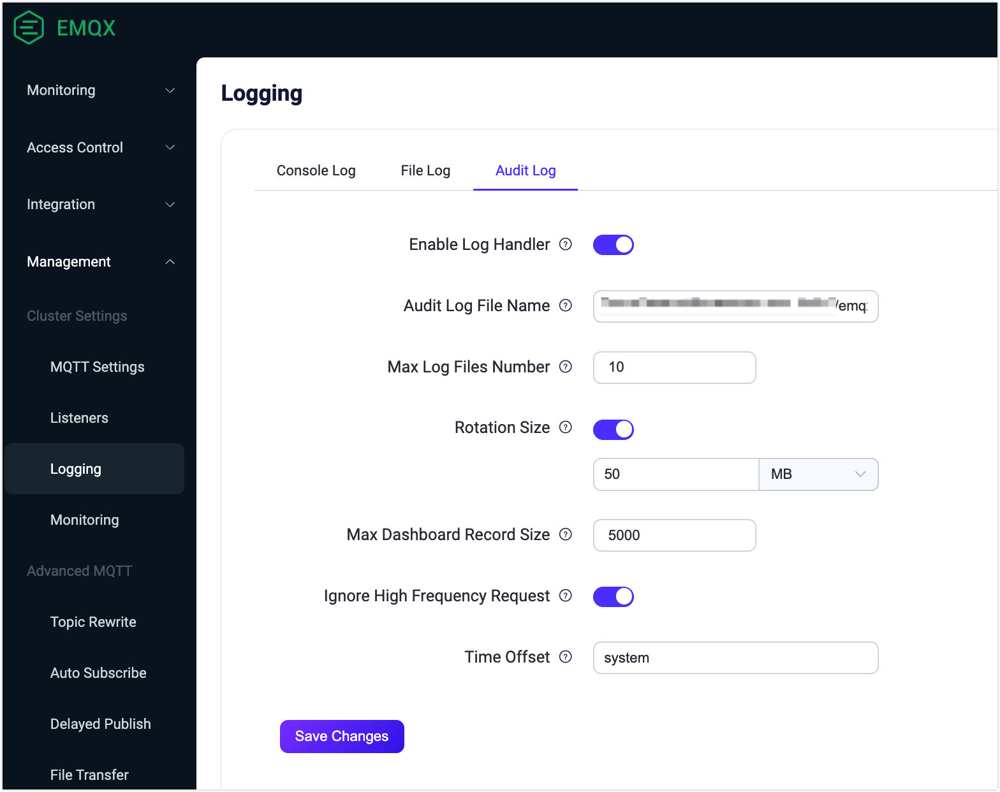
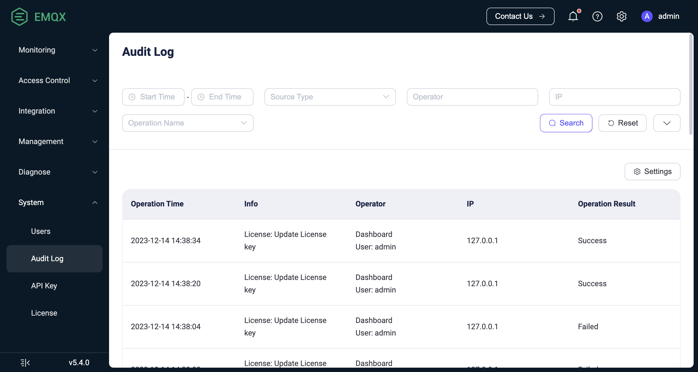

# Audit Log

The Audit Log feature allows you to track important operation changes in your EMQX cluster in real-time. Through the Audit Log, enterprise users can easily see who performed which critical operations, how they did it, and when they did it. It is a critical tool for enterprise users to comply with regulatory requirements and ensure data security auditing during their operations.

EMQX Audit Log supports recording change-related operations from the [Dashboard](../dashboard/introduction.md), [REST API](../admin/api.md) and [CLI](../admin/cli.md), such as Dashboard user logins and modifications to clients, access controls, and data integrations. However, read-only operations such as metrics retrieval and client list queries are not recorded. 

EMQX offers a Dashboard view and integration with log systems to help enterprises manage audit logs. Through these methods EMQX provides flexible and comprehensive support for Audit Logs, allowing enterprise users to choose the most suitable way to manage and view audit logs according to their needs.

## Enable Audit Log

You can enable the Audit Log feature and adjust the configuration parameters through both the Dashboard and configuration file.

### Enable Audit Log via Dashboard

You can enable the audit log and modify the configuration parameters in the Dashboard by navigating to **Management** -> **Logging** -> **Audit Log**.



You can configure the following options for Audit Log:

- **Enable Log Handler**: Enable or disable the audit log processing process. It is enabled by default.
- **Audit Log File Name**: Specify the path and name of the audit log file. The default value is `${EMQX_LOG_DIR}/audit.log`, where `${EMQX_LOG_DIR}` is a variable and defaults to `./log`, meaning it is ultimately be saved in `./log/audit.log.1`.
- **Maximum Log Files Number**: The maximum number of rotated log files. The default value is `10`.
- **Rotation Size**: Set the size of log files, and when the specified size is reached, log files will be rotated. If disabled, log files will grow indefinitely. You can enter the desired value in the text box and select the unit from the dropdown list, with options such as `MB`, `GB`, and `KB`. The default value is `50MB`.
- **Max Dashboard Record Size**: This setting determines the maximum number of records stored in the database, which can be accessed and retrieved through the Dashboard and the `/audit` API. The default value is `5000`.
- **Ignore High Frequency Request**: This option controls whether to ignore high-frequency requests to prevent flooding the audit log with entries, such as requests related to publish/subscribe and kicking out clients. It is enabled by default.
- **Time Offset**: Define the format of timestamps in the log. such as "-02:00" or "+00:00". By default, it is set to `system`.

### Enable Audit Log via Configuration File

You can also enable the audit log and modify the configuration options under `log.audit` in the `emqx.conf` file, as shown in the example below.

```bash
log.audit {
  enable = true
  path = "./log/audit.log"
  rotation_count = 10
  rotation_size = 50MB
  time_offset = system
}
```

## View Audit Log on Dashboard

Once the Audit Log is enabled, you can view the content of the audit logs on the Dashboard under **System** -> **Audit Log**.



### Search Filter

You can filter and search through log operations, with supported search keywords including:

- **Start Time** - **End Time**: The time range when the operation occurred.
- **Source Type**: The method used to perform the operation, with options including `Dashboard`, `REST API`, `CLI`, and `Erlang Console`. Here, the `Erlang Console` refers to the Erlang Shell console, typically used during on-site technical support provided by EMQ.
- **Operator**: The Dashboard username or the key name used for calling the REST API. This is only valid when the operation method is Dashboard or REST API.
- **IP**: The source IP of the Dashboard user or the client that called the REST API. This is only displayed when the operation method is Dashboard or REST API.
- **Operation Name**: Choose from the dropdown list of operation names supported by the audit logs.
- **Operation Result**: Choose from the dropdown list between `Success` or `Failure`.

### List Explanation

Below is an explanation for each column in the displayed audit log list:

- **Operation Time**: The time when the operation took place.
- **Info**:
  - For Dashboard or REST API, this column shows the operation name.
  - For CLI and Console, this column records the executed command.
- **Operator**: Includes the operation method and the corresponding operator. For CLI and Console operations, the operator is the name of the EMQX node where the command was executed.
- **IP**: The source IP of the Dashboard user or the client that called the REST API. This is only displayed when the operation method is Dashboard or REST API.
- **Operation Result**: `Success` or `Failure`. Failure includes scenarios such as form validation failure or inability to delete resources. This is only displayed for Dashboard or REST API methods; CLI and Console cannot record the operation result.

## View Audit Log via Log File

When the Audit Log is enabled in EMQX, change-related operations are saved in log format in the `./log/audit.log.1` file. It is easy for enterprise users to perform an in-depth analysis of audit records and integrate the results into existing log management systems, meeting compliance and data security requirements.

::: warning Notice

Audit logs for command-line operations may contain sensitive information, so take caution when sending them to a log collector. It is advisable to filter log content or use encrypted transmission methods to prevent unauthorized information leakage.

:::

The fields included in the Audit Log vary depending on the source of the operation records.

### Operation Records from Dashboard or REST API

Audit logs that record Dashboard or REST API operations include information about the operating user, the operated object, and the operation result. The log message format example is as follows:

```bash
{"time":1702604675872987,"level":"info","source_ip":"127.0.0.1","operation_type":"mqtt","operation_result":"success","http_status_code":204,"http_method":"delete","operation_id":"/mqtt/retainer/message/:topic","duration_ms":4,"auth_type":"jwt_token","query_string":{},"from":"dashboard","source":"admin","node":"emqx@127.0.0.1","http_request":{"method":"delete","headers":{"user-agent":"Mozilla/5.0 (Macintosh; Intel Mac OS X 10_15_7) AppleWebKit/537.36 (KHTML, like Gecko) Chrome/119.0.0.0 Safari/537.36","sec-fetch-site":"same-origin","sec-fetch-mode":"cors","sec-fetch-dest":"empty","sec-ch-ua-platform":"\"macOS\"","sec-ch-ua-mobile":"?0","sec-ch-ua":"\"Google Chrome\";v=\"119\", \"Chromium\";v=\"119\", \"Not?A_Brand\";v=\"24\"","referer":"http://localhost:18083/","origin":"http://localhost:18083","host":"localhost:18083","connection":"keep-alive","authorization":"******","accept-language":"zh-CN,zh;q=0.9,zh-TW;q=0.8,en;q=0.7","accept-encoding":"gzip, deflate, br","accept":"*/*"},"body":{},"bindings":{"topic":"$SYS/brokers/emqx@127.0.0.1/version"}}}
```

The following table shows the fields contained in the above log message samples.

| Field Name       | Type    | Description                                                  |
| ---------------- | ------- | ------------------------------------------------------------ |
| time             | Integer | Timestamp representing the time of the log record, in microseconds. |
| level            | String  | Log level.                                                   |
| source_ip        | String  | Source IP address of the operation.                          |
| operation_type   | String  | The functional module of the operation, corresponding to the Tag in the REST API. |
| operation_result | String  | Operation result, "success", "failure" indicate success or failure of the operation respectively. |
| http_status_code | String  | HTTP response status code.                                   |
| http_method      | String  | HTTP request method.                                         |
| duration_ms      | Integer | Operation execution time, in milliseconds.                   |
| auth_type        | String  | Authentication type, indicating the method or mechanism used for authentication, fixed as `jwt_token` (Dashboard) or `api_key` (REST API). |
| query_string     | Object  | URL query parameters in the HTTP request.                    |
| from             | String  | Request source, `dashboard`, `rest_api` indicating from Dashboard, REST API respectively. When the value is `cli`, `erlang_console`, it indicates operations from CLI or Erlang Shell, and this log structure is not applicable. |
| source           | String  | The Dashboard username or API key name that performed the operation. |
| node             | String  | Node name, indicating the node or server where the operation was executed. |
| method           | String  | HTTP request method, `post`, `put`, `delete` correspond to create, update, delete operations. |
| operate_id       | String  | The REST API path of the request, please refer to [REST API](https://chat.openai.com/admin/api.md). |

### Operation Records from CLI or Erlang Console

Audit logs that record operations from CLI or Erlang Console operatios include the executed command, called parameters, and other information. The log message format examples are as follows:

```bash
{"time":1695866030977555,"level":"info","msg":"from_cli","from": "cli","node":"emqx@127.0.0.1","duration_ms":0,"cmd":"retainer","args":["clean", "t/1"]}
```

The following table shows the fields contained in the above log message samples.

| Field Name  | Type    | Description                                                  |
| ----------- | ------- | ------------------------------------------------------------ |
| time        | Integer | Timestamp indicating the time of the log record in microseconds. |
| level       | String  | Log level.                                                   |
| msg         | String  | Operation description.                                       |
| from        | String  | Request source, `cli`, `erlang_console` indicating from CLI, Erlang Shell respectively. When the value is `dashboard `, `rest_api`, it indicates operations from Dashboard or REST API, and this log structure is not applicable. |
| node        | String  | Node name indicating the node or server where the operation was executed. |
| duration_ms | Integer | Execution time of the operation in milliseconds.             |
| cmd         | String  | Specific command operation executed, for supported commands, please refer to [CLI](../admin/cli.md). |
| args        | Array   | Additional parameters attached to the command, multiple parameters are separated by arrays. |
