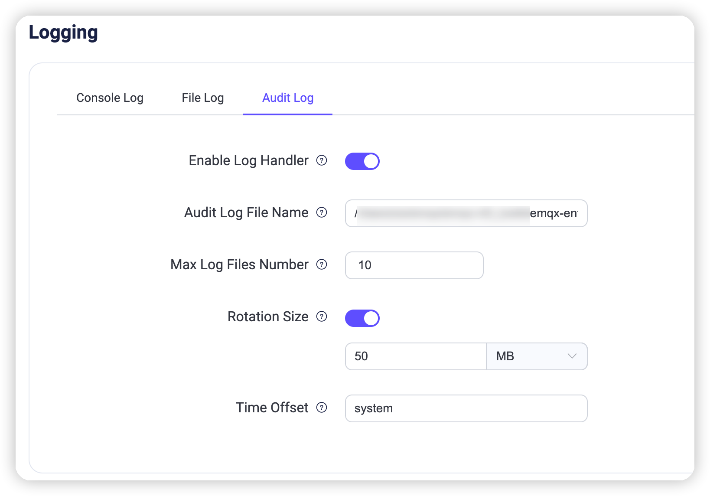

# Audit Log

The Audit Log feature allows you to track important operation changes in your EMQX cluster in real-time. It is a critical tool for enterprise users to comply with regulatory requirements and ensure data security. EMQX Audit Log supports recording change-related operations from the [Dashboard](../dashboard/introduction.md), [REST API](../admin/api.md) and [CLI](../admin/cli.md), such as Dashboard user logins and modifications to clients, access controls, and data integrations. However, read-only operations such as metrics retrieval and client list queries are not recorded. Through the Audit Log, enterprise users can easily see who performed which critical operations, how they did it, and when they did it, ensuring compliance and security auditing during their operations.

::: warning

Audit logs for command-line operations may contain sensitive information, so take caution when sending them to a log collector. It is advisable to filter log content or use encrypted transmission methods to prevent unauthorized information leakage.

:::

## View Log File

When the Audit Log is enabled in EMQX, change-related operations are saved in log format in the `./log/audit.log.1` file. It is easy for enterprise users to perform an in-depth analysis of audit records and integrate the results into existing log management systems, meeting compliance and data security requirements. 

In future versions, EMQX will also support direct viewing in the Dashboard or querying and obtaining Audit Logs via the REST API, making it convenient to check operation records. Through these methods, EMQX provides flexible and comprehensive support for Audit Logs, allowing enterprise users to choose the most suitable way to manage and view audit logs according to their needs.

## Configure Audit Log

You can enable the Audit Log feature and adjust the configuration parameters through both the configuration file and the Dashboard.

### Configure Settings via Configuration File

You can enable the audit log and modify the configuration options under `log.audit` in the `emqx.conf` file, as shown in the example below.

```bash
log.audit {
  enable = true
  level = info
  path = "./log/audit.log"
  rotation_count = 10
  rotation_size = 50MB
  time_offset = system
}
```

### Configure Settings via the Dashboard

You can also enable the audit log and modify the configuration parameters through the Dashboard by navigating to **Management** -> **Logging** -> **Audit Log**.



Audit log configuration options:

- **Enable Log Handler**: Toggle the switch to enable or disable the audit log processing process. It is enabled by default.
- **Audit Log File Name**: Specify the path and name of the audit log file. The default value is `${EMQX_LOG_DIR}/audit.log`, where `${EMQX_LOG_DIR}` is a variable and defaults to `./log`, meaning it is ultimately be saved in `./log/audit.log.1`.
- **Maximum Log Files Number**: The maximum number of rotated log files. The default value is `10`.
- **Rotation Size**: Set the size of log files, and when the specified size is reached, log files will be rotated. If disabled, log files will grow indefinitely. You can enter the desired value in the text box and select the unit from the dropdown list, with options such as `MB`, `GB`, and `KB`. The default value is `50MB`.
- **Log Level**: Choose the log level to use from the dropdown list. Options include `debug`, `info`, `notice`, `warning`, `error`, `critical`, `alert`, and `emergency`. The default value is `info`.
- **Time Offset**: Define the format of timestamps in the log. By default, it is set to `system`.

## Log Formats

The fields included in the Audit Log vary depending on the source of the operation records.

### Operation Records from Dashboard or REST API

Audit logs that record Dashboard or REST API operations include information about the operating user, the operated object, and the operation result. The log message format example is as follows:

```bash
{"time":1695865935099311,"level":"info","msg":"from_api","username":"admin","query_string":{},"operate_id":"/mqtt/retainer/message/:topic","node":"emqx@127.0.0.1","method":"delete","headers":{"user-agent":"Mozilla/5.0 (Macintosh; Intel Mac OS X 10_15_7) AppleWebKit/537.36 (KHTML, like Gecko) Chrome/116.0.0.0 Safari/537.36","sec-fetch-site":"same-origin","sec-fetch-mode":"cors","sec-fetch-dest":"empty","sec-ch-ua-platform":"\"macOS\"","sec-ch-ua-mobile":"?0","sec-ch-ua":"\"Chromium\";v=\"116\", \"Not)A;Brand\";v=\"24\", \"Google Chrome\";v=\"116\"","referer":"http://localhost:18083/","origin":"http://localhost:18083","host":"localhost:18083","connection":"keep-alive","authorization":"******","accept-language":"zh-CN,zh;q=0.9,zh-TW;q=0.8,en;q=0.7","accept-encoding":"gzip, deflate, br","accept":"*/*"},"from":"dashboard","duration_ms":1,"code":204,"body":{},"bindings":{"topic":"t/1"},"auth_type":"jwt_token"
```

The following table shows the fields contained in the above log message samples.

| Field Name   | Type    | Description                                                  |
| ------------ | ------- | ------------------------------------------------------------ |
| time         | Integer | Timestamp indicating the time of the log record in microseconds. |
| level        | String  | Log level.                                                   |
| msg          | String  | Operation description.                                       |
| from         | String  | Request source, where `dashboard`, `rest`, `cli` and `erlang_shell` indicate operations from the Dashboard, REST API, CLI, and Erlang Shell respectively. |
| node         | String  | Node name indicating the node or server where the operation was executed. |
| username     | String  | User performing the operation, available when `from_api` is the source. |
| method       | String  | HTTP request method, with `post`, `put`, and `delete` corresponding to create, update, and delete operations. |
| operate_id   | String  | REST API path of the request, please refer to [REST API](../admin/api.md). |
| bindings     | Object  | Specific request object information corresponding to placeholders in `operate_id`. |
| auth_type    | String  | Authentication type, representing the method or mechanism used for authentication, fixed as `jwt_token`. |
| query_string | Object  | URL query parameters in the HTTP request.                    |
| code         | Integer | HTTP response code, indicating the result status of the operation. |
| headers      | Object  | HTTP request header information, including client identification and request source. |
| duration_ms  | Integer | Execution time of the operation in milliseconds.             |
| body         | Object  | HTTP request body containing detailed information about the operation. |

### Operation Records from CLI

Audit logs that record operations from CLI operatios include the executed command, called parameters, and other information. The log message format examples are as follows:

```bash
{"time":1695866030977555,"level":"info","msg":"from_cli","from": "cli","node":"emqx@127.0.0.1","duration_ms":0,"cmd":"retainer","args":["clean", "t/1"]}
```

The following table shows the fields contained in the above log message samples.

| Field Name  | Type    | Description                                                  |
| ----------- | ------- | ------------------------------------------------------------ |
| time        | Integer | Timestamp indicating the time of the log record in microseconds. |
| level       | String  | Log level.                                                   |
| msg         | String  | Operation description.                                       |
| from        | String  | Request source, where `dashboard` and `cli` indicate operations from the Dashboard and CLI, respectively. |
| node        | String  | Node name indicating the node or server where the operation was executed. |
| duration_ms | Integer | Execution time of the operation in milliseconds.             |
| cmd         | String  | Specific command operation executed, for supported commands, please refer to [CLI](../admin/cli.md). |
| args        | Array   | Additional parameters attached to the command, multiple parameters are separated by arrays. |

