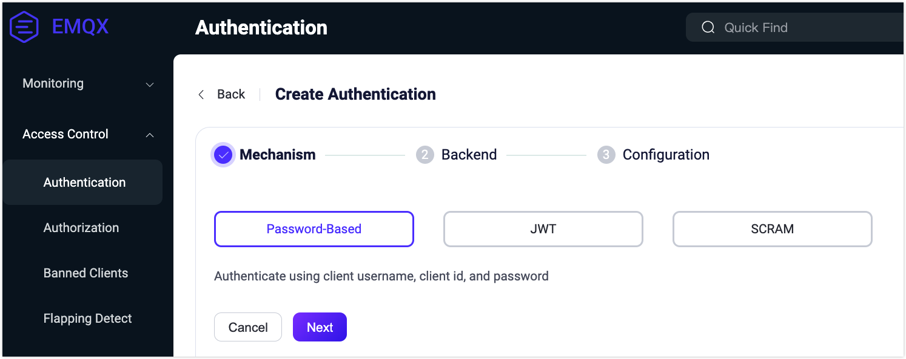
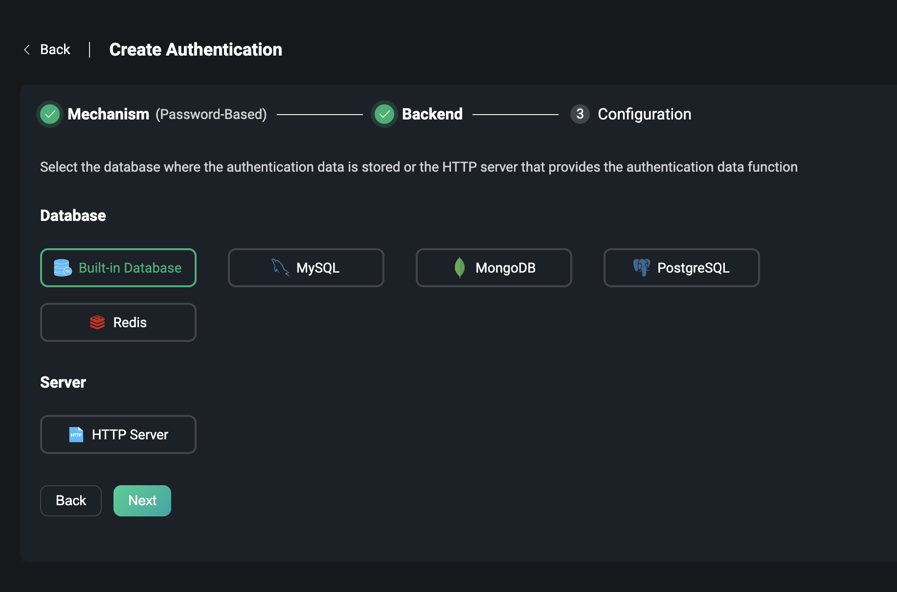
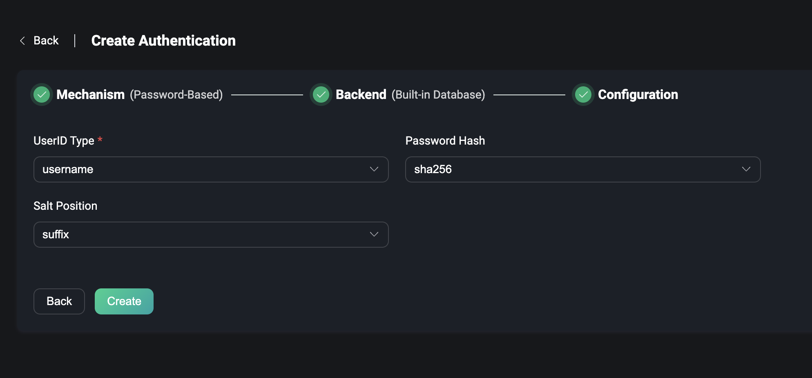
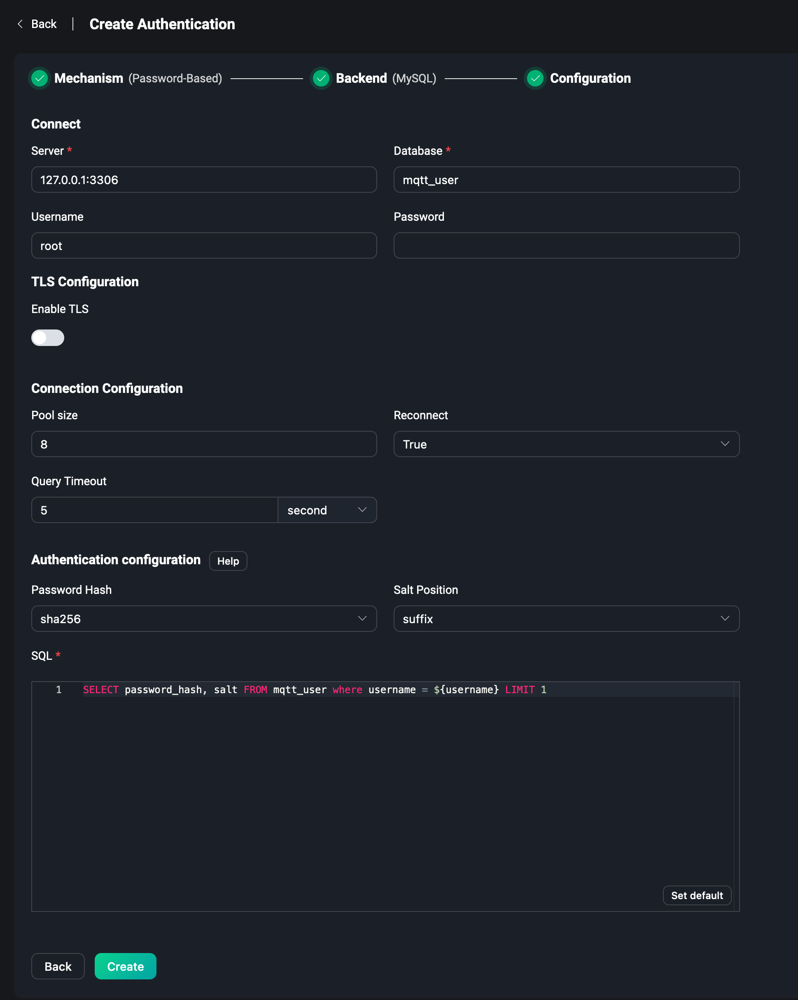
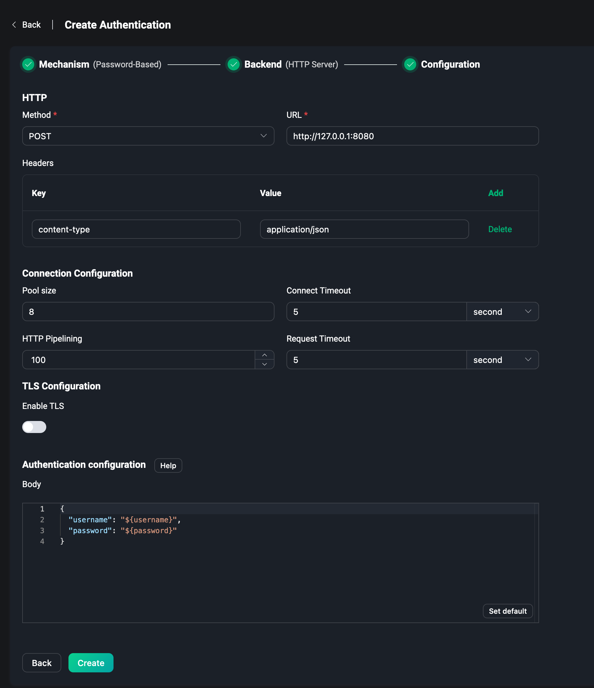
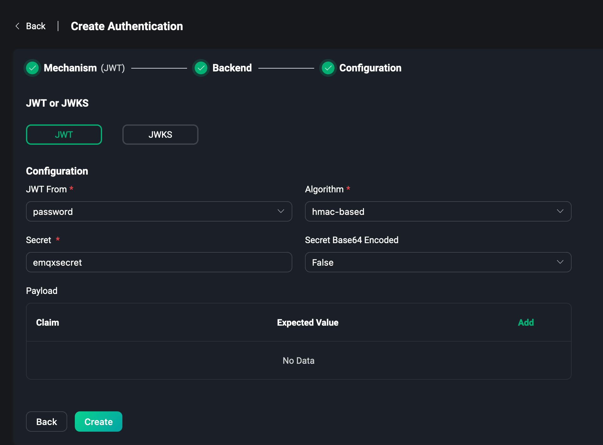
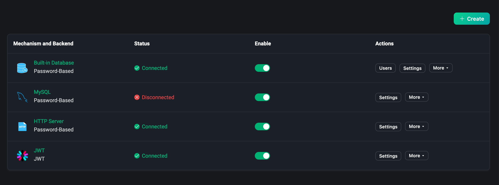
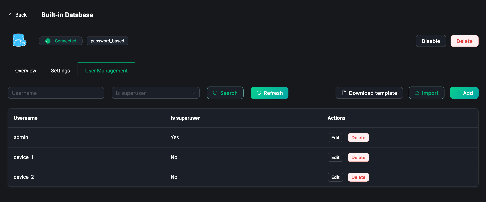
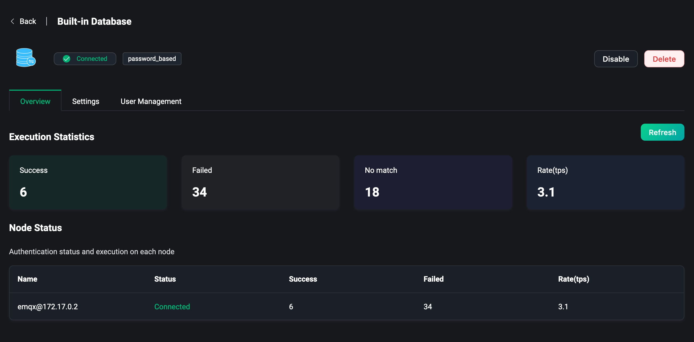
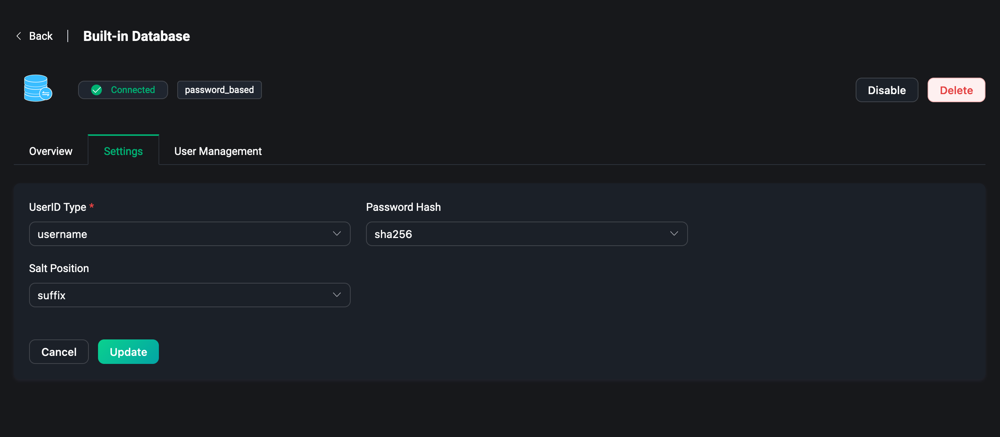

# Authentication

EMQX Dashboard provides out-of-the-box authentication and authorization management, users can quickly configure the client mechanism through the user interface only, without writing code or manually editing the configuration file, you can interface with various data sources and authentication services to achieve various levels and scenarios of security configuration, with higher development efficiency to obtain a more secure security.

Under the Access Control menu on the left, users can access the Authentication page, where they can manage the created authenticators.

:::tip
When authentication is enabled, the device or MQTT client needs to carry authentication data in order to successfully connect to EMQX.
:::

## Create

Click the `Create` button to go to the page of creating authentication. To create an authentication, you need to select a mechanism and then select a backend to store or obtain authentication data (except JWT authentication). The data can be obtained from these backend, including databases or HTTP server, and finally configure the connection.

### Mechanism

EMQX provides three mechanisms, including:

1. Password-Based, using the client ID or username and password.
2. JWT, where the client can carry a JWT Token in the username or password.
3. SCRAM, enhanced authentication in MQTT 5.0, which enables two-way authentication between client and server.

### Backend

#### Password-Based

When the `Password-Based` is selected, the user can choose either the database that stores the data or the HTTP server that provides the data, which contains two types of databases.

- The built-in database of EMQX, i.e., the `Built-in Database`.
- External database, which supports selecting and connecting to some mainstream databases, including: `MySQL`, `PostgreSQL`, `MongoDB`, `Redis`, etc.

You can also directly use HTTP services that can provide authentication data, i.e., the `HTTP Server`.

#### JWT

If JWT is selected, there will be no need to select a backend.

#### SCRAM

The enhanced authentication feature in MQTT 5.0, if selected, currently only provides the ability to use the `Built-in Database`, which uses EMQX's built-in database (Mnesia) to store data.

Enhanced authentication enables two-way authentication of the client and server, where the server can verify that the connected client is the real client and the client can verify that the connected server is the real server, thus providing higher security.

For more details about MQTT 5.0 Enhanced Authentication, please visit [SCRAM Authentication](../access-control/authn/scram.md).

### Configuration

The final step in creating authentication is to configure the selected backend. Each backend has some connection and usage configuration that needs to be configured by the user.

#### Built-in Database

For example, if you use the `Built-in Database`, you need to choose whether to use the Username or the Client ID, seting the encryption method of the password, etc. If you use the enhanced authentication of MQTT 5.0 and use the built-in database, you only need to configure the encryption method.

For more details about Built-in Database, please visit [Password Authentication Using Built-in Database](../access-control/authn/mnesia.md).

#### External Database

If you use an external database, you need to configure the server address of the database, the database name, username and password, the authentication configuration, and the SQL statements or other query statements on how to get data from the database. Take MySQL as an example.

For more details about MySQL or other external databases, please visit [Password Authentication Using MySQL](../access-control/authn/mysql.md) or see Using other databases.

#### HTTP Server

To use HTTP Server, you need to configure the request method of the HTTP service, POST or GET. The request URL, note that the URL needs to fill in the protocol is http or https. Then there is the configuration of the HTTP request Headers. The authentication information is entered into the `Body` field, e.g. `username` and `password` are filled in the JSON data.

For more details about HTTP Server, please visit [Password Authentication Using HTTP](../access-control/authn/http.md).

#### JWT & JWKS

To use JWT, you can configure JWT directly without selecting a backend, and set whether the Token required for JWT comes from `username` or `password` of the client. This way the client only needs to enter the Token into the corresponding field when connecting, and JWT authentication can be performed. Then set `Secret` or `Public Key` depending on the encryption method, set `Secret` to Base64 encoding or not, and finally enter the information that needs to be verified in `Payload` to complete the configuration of JWT authentication.

You can get the latest JWKS from the `JWKS Endpoint` periodically, which is essentially a set of public keys that will be used to verify any JWT issued by the authorization server and signed using RSA or ECDSA algorithms, and configure the refresh interval (in seconds) for the JWKS. Finally, configure the `Payload` entry to complete the JWKS configuration.

For more details about JWT, please visit [JWT Authentication](../access-control/authn/jwt.md).

After completing the configuration, just click `Create`. Note: It is not available to reselect a backend that has been used for authentication.

## List

After the successful creation of the authenticator, you can manage in the authentication list.

In the list we can see the backend and mechanism of the item, the backend status, for example, if the external database is not deployed successfully and connected, you can see that the backend status is currently disconnected. If you hover over this field, you can see the status of all nodes in the EMQX cluster that are connected to the backend. Click the Enabled switch to quickly turn the authenticator on and off.

Each column of the certification list can be dragged by the mouse to adjust the order, or through the actions bar to adjust the order of the list, the order has some importance for the certification list, because the EMQX will allow any client to connect until the user has created an authenticator. The authenticator will authenticate the client according to the authentication information provided by it, and the client can connect successfully only if the authentication is passed.

In the action bar you can also click to settings or delete the authenticator, etc.

:::warning
Disabled authentication will not authenticate any client, all clients can connect to EMQX. Please be careful.
:::

## Users

For users using the built-in database, click `Users` to get to the user management page, where you can manage authentication information, such as adding or deleting users, or you can download a template, fill in the template with relevant authentication information, and click `Import` to create authentication data in bulk.

## Overview

Click on backend and mechanism in the list page to go to the Authenticator overview page. This page provides some metrics of the authenticators in the EMQX cluster, such as the number of successes and failures of authentication, the number of mismatches and the rate of authentication currently being connected.

You can monitor the metrics data under each node from the list at the bottom of the page.

## Settings

Click `Settings` in the list page to modify the authentication configuration.

In the settings page, you can modify the current authenticator configuration, such as when some connection information of the external database changes, when you need to modify the `UserID Type` of the built-in database as username or client ID, or modify the encryption method of the password, etc.

:::warning
When using the built-in database, updating the password `Password Hash` or `Salt Position` will cause the added authentication data to be unavailable, please be careful.
:::

For more details about Authentication, please visit [Authentication Introduction](../access-control/authn/authn.md).
