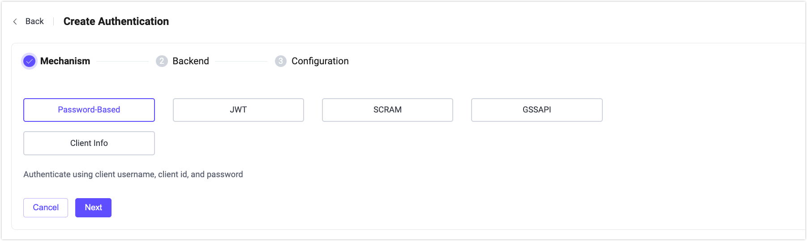
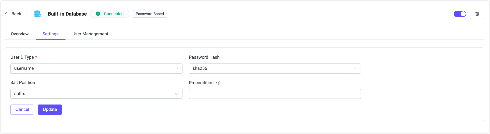

# Authentication

EMQX Dashboard provides out-of-the-box authentication and user management capabilities. Users can quickly configure client authentication mechanisms through the user interface without writing code or manually editing configuration files. This allows integration with various data sources and authentication services to achieve secure configurations across different levels and scenarios, ensuring higher development efficiency with enhanced security guarantees. On the **Authentication** page, you can quickly create and manage various authentication resources.

:::tip
After configuring authentication backends, you must set up corresponding authentication information for devices or MQTT clients to securely connect to EMQX.
:::

## Create Authentication

Click the **Create** button to go to the **Create Authentication** page. To create an authentication, you need to select a mechanism and then select a backend to store or obtain authentication data (except JWT authentication). The data can be obtained from these backends, including databases or HTTP servers. Finally, you need to configure the connection information to connect to the backends.

### Mechanism

You can select from the following mechanisms provided by EMQX:

- **Password-Based**: Authenticates clients using a username or client ID with a password, validated against a database or HTTP backend.
- **JWT**: Authenticates clients using a JSON Web Token provided in the username or password field. The token is verified using a secret, public key, or JWKS, without requiring a backend.
- **SCRAM**: An MQTT 5.0 enhanced authentication mechanism that provides mutual client–server authentication without transmitting plaintext passwords.
- **GSSAPI**: An MQTT 5.0 enhanced authentication mechanism that integrates with Kerberos for secure, ticket-based authentication.
- **Client Info**: Authenticates clients based on connection metadata such as client ID, username, IP address, or TLS certificate information.

### Backend

In this step, you can select a backend based on the mechanism selected in the last step.

::: tip

A backend that has been used for authentication cannot be reselected.

:::

For a comprehensive introduction to backends, refer to [EMQX Authenticators](../access-control/authn/authn.md#emqx-authenticator).

#### Password-Based

When Password-Based is selected, you can choose one of the following backends:

- **Built-in Database**: Uses EMQX’s built-in database to store usernames, client IDs, and hashed passwords.
- **External Database**: Stores authentication data in an external data source. EMQX supports multiple mainstream databases, including `MySQL`, `PostgreSQL`, `MongoDB`, and `Redis`.
- **HTTP Server**: Retrieves authentication results from an external HTTP service. EMQX sends client credentials to the configured HTTP endpoint and authenticates the client based on the service response.

#### JWT

When JWT is selected, no backend is required. All authentication logic is handled by validating the token itself using the configured secret, public key, or JWKS.

#### SCRAM

When SCRAM is selected, the following backends are supported:

- **Built-in Database**: Stores SCRAM credentials (such as salted password verifiers) in EMQX’s built-in database.
- **HTTP Server**: Retrieves SCRAM authentication data from an external HTTP service, allowing SCRAM credentials to be managed outside of EMQX.

SCRAM provides mutual authentication between the client and server, ensuring both parties are authenticated and preventing credential leakage.

For more details, see:

- [SCRAM Authentication](../access-control/authn/scram.md)
- [REST API-Based SCRAM Authentication](../access-control/authn/scram_restapi.md)

#### GSSAPI

When GSSAPI is selected, the backend is:

- **Kerberos**: EMQX integrates with a Kerberos Key Distribution Center (KDC) to authenticate clients using Kerberos tickets. This backend enables centralized identity management and strong security guarantees through Kerberos-based authentication.

For more details, see [MQTT 5.0 Enhanced Authentication – Kerberos](../access-control/authn/kerberos.md).

#### Client Info

When Client Info is selected, no external backend is required. Authentication is performed by evaluating client connection information against configured rules. This mechanism is typically used for lightweight access control, network-based trust, or as a complementary authentication layer.

For more details, see [Client Info Authentication](../access-control/authn/cinfo.md).

### Configuration

The final step is to configure the selected backend. Each backend has some connection and usage configuration that needs to be configured by the user. After completing the configuration, just click **Create**. 

For detailed configuration instructions, see the document for each [EMQX authenticator](../access-control/authn/authn.md#emqx-authenticator).

## Authenticator List

After successfully creating an authenticator, you can view and manage it in the authenticator list.

In the list, you can see the backend and mechanism of each authenticator, and the status of the backend. For example, if the external database deployment fails to connect, the status will indicate `Disconnected`. Hovering over this field provides further details on the connection status of all nodes in the EMQX cluster linked to this data source. You can quickly enable or disable the authentication configuration by toggling the **Enable** switch.

Each entry in the authenticator list can be reordered by dragging with the mouse or by adjusting the sequence in the **Actions** column. The order in the authenticator list is significant because EMQX supports multiple authenticators that operate sequentially in the authentication chain. If the current authenticator fails to retrieve matching authentication information, the process continues with the next authenticator in the chain.

In the **Actions** column, you can also click to configure or delete an authenticator.

:::tip Note
Disabled authentication will not authenticate any client, which means all clients can connect to EMQX. Please proceed with caution.
:::

## User Management

For authenticators that use the Built-in Database, you can manage user credentials in the **User Management** tab.

You can access this page in either of the following ways:

- On the **Authenticator List** page, click **Users** in the **Actions** column for the **Built-in Database** authenticator.
- Click **Built-in Database** to open its details page, then switch to the **User Management** tab.

On the **User Management** page, you can create, edit, and delete users, assign superuser privileges, and bulk import users by downloading a template, filling in the required fields, and clicking **Import Users**.

When adding a user, you can optionally select a Namespace to associate the user with a specific scope.

## Overview

The **Overview** tab of the Built-in Database displays authentication metrics across the EMQX cluster, including the number of successful and failed authentications, unmatched attempts, and the current authentication rate.

At the bottom of the page, you can view per-node statistics to monitor authentication status and performance on each EMQX node.

## Settings

Click **Settings** on the authenticator list page to update the authentication configuration.

On the **Settings** page, you can modify the parameters of the selected authenticator, such as external database connection settings, the **UserID Type** used by the Built-in Database (username or client ID), and the password hashing algorithm.

::: tip

For the Built-in Database, changing the **Password Hash** or **Salt Position** will invalidate existing user credentials. Proceed with caution.

:::

## More Information

For more details about authentication, refer to [Authentication](../access-control/authn/authn.md).
