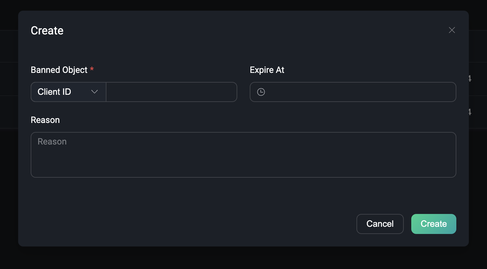
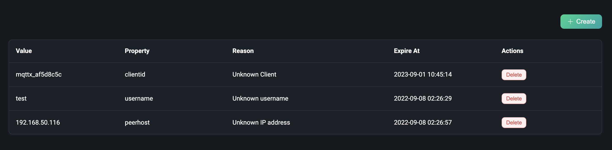

# Blacklist

In addition to authentication and authorization, EMQX also provides blacklisting capabilities to directly deny connections to malicious or aggressive clients. Blacklisting is suitable for blocking a small number of client connections.

Under the Access Control menu on the left, users can access the Blacklist page, where they can create and manage blacklists.

## Create

Clicking the `Create` button in the upper right corner opens a pop-up box for creating a blacklist. You can set the banned object, choose whether the banned property is by client ID, username or IP address, enter the corresponding banned value, set an expiration date and enter the reason for creating the blacklist. Note: Expiration time and reason are non-required fields.

## List

After successful creation, we can view the created item in the Blacklist list. The list contains the banned values and banned property of the blacklist, the reason and the expiration time. The blacklist can be deleted directly from the action bar.

