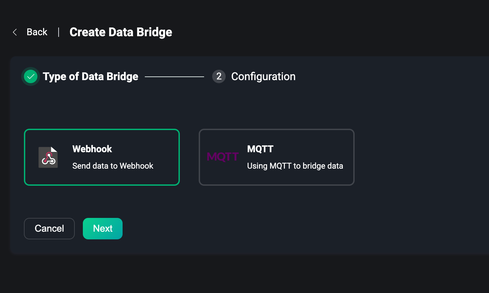

# Data Bridge

As one of the most important capabilities EMQX provides for building IoT data infrastructure, data integration helps users to process and distribute all business data quickly without writing additional code. Data integration capability consists of data bridging and rules. Users can use data bridging or MQTT topics to access data, use rules to process data, and then send data to external applications through data bridging. For more details, please visit [Introduction to Data Integration](../data-integration/introduction.md).

Data Bridges allows users to send messages from EMQX to an external data system or pull data from an external data system and send it to an EMQX topic in real-time. The EMQX Dashboard provides the ability to visually create data bridges by simply configuring the relevant resources on the page. For more details, please visit [Introduction to Data Bridges](../data-integration/data-bridges.md).

Under the Data Integration menu on the left, users can access the Data Bridge page, where they can quickly create and manage the created data bridges.

## Create

Click the `Create` button in the upper right corner of the page to go to the Create Data Bridge page. To create a bridge you need to select a data bridge type and then complete the configuration of that type.

Current data bridging types include:

- Webhook, which uses a Webhook to forward data to an HTTP service.
- MQTT Source, which uses an MQTT broker as a data source to fetch external MQTT data.
- MQTT Sink, which forwards MQTT data to an external MQTT broker.

### Webhook

Using Webhook is actually sending the data received and processed by EMQX to an HTTP service, and then processing and integrating the business data according to the pre-defined HTTP service.

The same user needs a pre-built HTTP service, we need to configure the HTTP URL, select a request method POST, GET, PUT or DELETE, configure the request header and fill in the request body with the data to be sent using the template syntax.

For more details about how to use of Webhook data bridge, please visit [Webhook](../data-integration/data-bridge-webhook.md)

### MQTT source

Use MQTT Source to fetch data from an external MQTT broker. Users can use it to bridge data from an external MQTT broker to EMQX for data processing.

On the MQTT Source configuration page, the user needs to configure the connection information of the external MQTT broker from which the data will be fetched, including the broker host, username password and MQTT protocol version, etc. The final key is the need to enter a remote topic, indicating that the data will be fetched from the topic specified in the external MQTT broker and that EMQX will be able to fetch data under that broker when a message is sent to that topic for that MQTT broker. Note: The topic supports the use of topic wildcards.

### MQTT Sink

Using MQTT Sink, the data received and processed by EMQX can be sent to an external MQTT broker.

On the MQTT Sink configuration page, the user also needs to configure the connection information for the external MQTT broker that will fetch the data, including the broker host, username and password, and MQTT protocol version. Finally, you also need to enter a remote topic to send the data to the external MQTT broker, so that the remote MQTT broker can get the processed data sent by EMQX through the remote topic.

MQTT Source and MQTT Sink are suitable for forwarding data between multiple MQTT brokers, and once configured, both can be tested for connectivity to resources by first clicking `Test the connection`.

For more details about how to using MQTT data bridges, please visit [MQTT Bridge](../data-integration/data-bridge-mqtt.md)

:::tip
Note: Each data bridge requires a custom name to be entered to identify and distinguish the current data bridge
:::

Once created, you can return to the data bridge list or use the data bridge directly to create a rule.

## List

In the data bridge list, we can view the name of the data bridge that has been successfully created, the status of the resources configured in the bridge, connected or disconnected, and switch to enable or disable the data bridge, in the action bar you can quickly delete the data bridge, click `Create Rule`, you can use the data bridge to quickly create a rule, that is, after entering the create rule page, automatically add the data bridge.

## Overview

On the data bridge list page, click on the data bridge `name` to go to the data bridge overview page, where you can view the statistics of the data bridge. This includes the number of successes, failures, current rates, etc. Click the `Refresh` button in the upper right corner to see the latest statistics in real-time, and click `Reset statistics` to reset the data to 0 and re-observe the changes in the data.

The node status at the bottom of the page allows you to view the metrics data under each node from the list.

## Settings

In the data bridge list page, click `Settings` in the action bar to enter the data bridge settings page, which is the same as the parameter configuration page at creation. When the resources of the data bridge change, you can go to the settings page to make changes, or you need to modify the topic of the MQTT bridge, etc. Each time the settings are updated, the resources within the bridge will be reconnected. Note: that the name of the data bridge cannot be modified.

