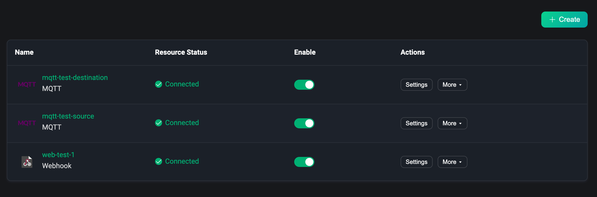
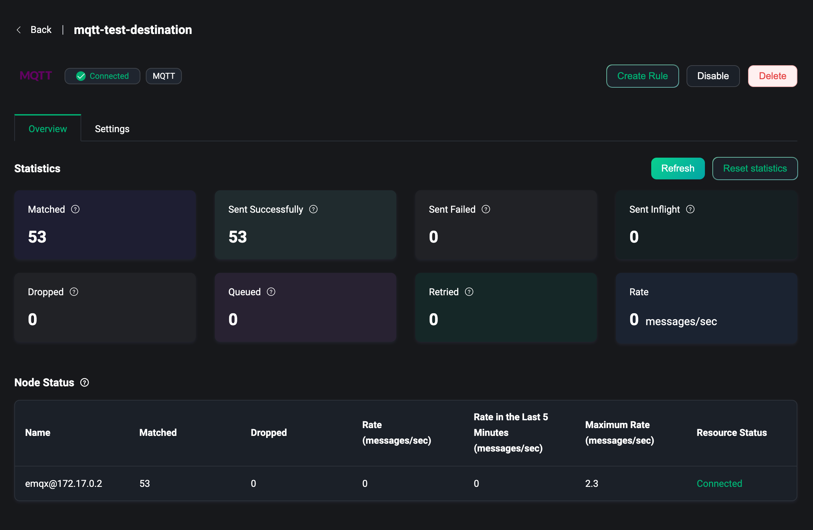
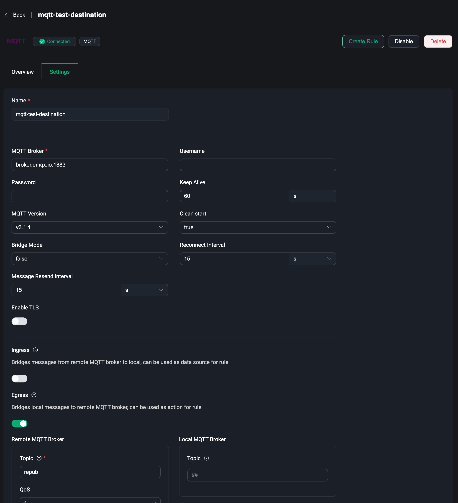

# Data Bridge

As one of the most important capabilities EMQX provides for building IoT data infrastructure, data integration helps users to process and distribute all business data quickly without writing additional code. Data integration capability consists of data bridging and rules. Users can use data bridging or MQTT topics to access data, use rules to process data, and then send data to external applications through data bridging. For more details, please visit [Rule Engine](../data-integration/rules.md).

Data Bridges allows users to send messages from EMQX to an external data system or pull data from an external data system and send it to an EMQX topic in real-time. The EMQX Dashboard provides the ability to visually create data bridges by simply configuring the relevant resources on the page. For more details, please visit [Introduction to Data Bridges](../data-integration/data-bridges.md).

Under the Data Integration menu on the left, users can access the Data Bridge page, where they can quickly create and manage the created data bridges.

## Create

Click the `Create` button in the upper right corner of the page to go to the Create Data Bridge page. To create a bridge you need to select a data bridge type and then complete the configuration of that type.

Current data bridging types include:

- Webhook, which uses a Webhook to forward data to an HTTP service.
- MQTT, which uses an MQTT broker as a data source to fetch external MQTT messages, or publish EMQX messages to an external MQTT broker.

### Webhook

Using Webhook is actually sending the data received and processed by EMQX to an HTTP service, and then processing and integrating the business data according to the pre-defined HTTP service.

The same user needs a pre-built HTTP service, we need to configure the HTTP URL, select a request method POST, GET, PUT or DELETE, configure the request header and fill in the request body with the data to be sent using the template syntax.

For more details about how to use of Webhook data bridge, please visit [Webhook](../data-integration/data-bridge-webhook.md)

## MQTT

For using MQTT data bridge, users can publish EMQX messages to an external MQTT broker or pull data from an external MQTT broker and publish it to an EMQX topic.

In MQTT data bridge, users first need to configure the connection information of the MQTT broker, including the broker endpoint, port, username, password, etc.

Then, users can configure the ingress or egress of the MQTT broker as needed. The ingress configuration is manually turned on if the service is to be used as a data source. If it is a destination, the egress configuration is manually turned on. For example, if the ingress is configured, it means that the data is pulled from the external MQTT broker and published to a topic on EMQX. If the egress is configured, the EMQX MQTT message is published to the external MQTT broker.

Note: when creating, at least one ingress or egress needs to be configured, or both can be configured.

### Ingress

When ingress config is enabled, the MQTT data bridge can be used as a data source. Users need to configure a remote MQTT broker topic and QoS level. The remote MQTT broker is the MQTT broker configured in the connection information. When users send messages to the topic of the remote broker, EMQX can receive the message. Users can use the data bridge in the **SQL statement of the rule** to receive and process the received message data.

In addition to the remote MQTT broker, there is also a local MQTT broker configuration, EMQX. Users can configure the topic, QoS, retain flag, and message payload template of the service (all of which support template syntax). If the user configures the local MQTT broker topic, the user does not need to use the rule. After connecting to EMQX and subscribing to the local topic, the user can receive messages from the remote broker.

### Egress

When the egress config is enabled, the MQTT data bridge can be used as a destination. Users need to configure a remote MQTT broker topic and QoS level and retain flag and message payload template (all of which support template syntax). The remote MQTT broker is the MQTT broker configured in the connection information. When users use the rule to receive and process the message data, they only need to add the data bridge to the **action list of the rule**, and EMQX can send the processed message data to the remote MQTT broker.

In addition to the remote MQTT broker, there is also a local MQTT broker configuration, EMQX. Users can configure the topic of the service. If the user configures the local MQTT broker topic, the user does not need to use the rule. After connecting to EMQX and sending messages to the local topic, the user can also send messages to the remote broker.

The local MQTT broker is optional regardless of the ingress configuration or egress configuration. Users need to determine whether they need it according to business needs. For scenarios that require rules to process complex data, users do not need to configure the local MQTT broker and can directly use the data bridge in the rule. Otherwise, users can now subscribe to or send messages to the topic of the local MQTT broker to complete the reception of messages from the remote service or sending message data to the remote service.

Before creating, whether you choose the type of data bridge, you can click the "Test" button next to the create button to test whether the current configuration resources are available.

After creating the data bridge, you can use the data bridge to create a rule, or you can go to the rule list page to create a rule.

For more details about how to use MQTT data bridge, please visit [MQTT Bridge](../data-integration/data-bridge-mqtt.md)

:::tip
Note: Each data bridge must enter a name, which users can use to customize the identification and distinguish the function of the current data bridge
:::

## List

In the data bridge list, we can view the name of the data bridge that has been successfully created, the status of the resources configured in the bridge, connected or disconnected, and switch to enable or disable the data bridge, in the action bar you can quickly delete the data bridge, click `Create Rule`, you can use the data bridge to quickly create a rule, that is, after entering the create rule page, automatically add the data bridge.

## Overview

On the data bridge list page, click on the data bridge `name` to go to the data bridge overview page, where you can view the statistics of the data bridge. This includes the number of successes, failures, current rates, etc. Click the `Refresh` button in the upper right corner to see the latest statistics in real-time, and click `Reset statistics` to reset the data to 0 and re-observe the changes in the data.

The node status at the bottom of the page allows you to view the metrics data under each node from the list.

## Settings

In the data bridge list page, click `Settings` in the action bar to enter the data bridge settings page, which is the same as the parameter configuration page at creation. When the resources of the data bridge change, you can go to the settings page to make changes, or you need to modify the topic of the MQTT bridge, etc. Each time the settings are updated, the resources within the bridge will be reconnected. Note: that the name of the data bridge cannot be modified.

