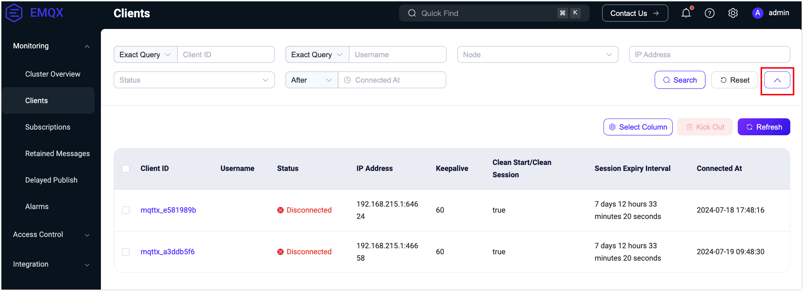
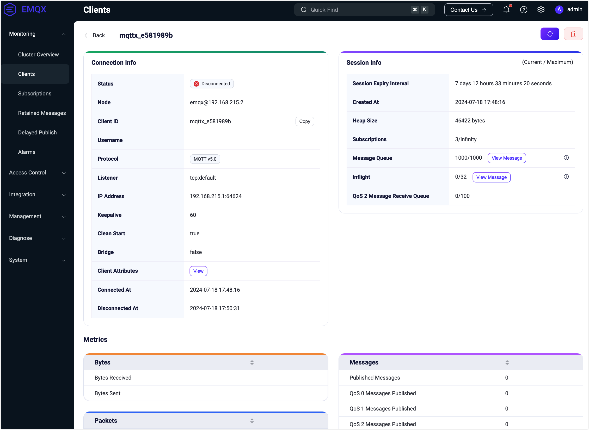

# Clients

You can use [MQTTX](https://mqttx.app) as a client to connect to EMQX for publishing and subscribing. Alternatively, you can quickly implement client connections to EMQX using [client libraries provided in various languages](../../connect-emqx/introduction.md). On the **Clients** page, you can view details and metric statistics of clients currently connected to the server or sessions that have not expired.

## Client List

In the client list, users can view basic information about currently connected clients, including:

- Client ID and username set when connecting to EMQX
- Current connection status
- Client's IP address
- Heartbeat duration set for the connection and maximum idle time
- Information about connection sessions, including whether the session is cleared and the session expiration interval
- The time when the client connected to EMQX

The client's IP address data is concatenated from the client's IP address and the port used by the client when connecting to EMQX.

The top filter condition fields by default display only client ID, username, and node. You can use client ID and username for fuzzy searching to filter the connection list. Clicking the right arrow button next to the search bar displays all available filter condition fields. You can also select the node to which the connection belongs, connection status, or connection time range to filter the list or enter the client's IP to filter by target IP address.

At the top of the list, the **Select Column** button allows you to choose which columns to display. Clicking the **Refresh** button resets all filter conditions and reloads the connection list. You can also select a client and click **Kick Out** to manually disconnect that client.

## Client Details

Selecting a connection from the client list and clicking on the client ID takes you to the details page of that client connection, where you can view connection metric statistics. At the top of the page, you can manually refresh the connection information and manually clear the session.

In addition to the connection's basic information already displayed on the list page, this page provides more detailed information for users to view, such as the protocol version used by the connection, whether sessions are cleared after ending the connection, and for disconnected connections, the time of the last disconnection. On the right side of the **Connection Information**, it displays **Session Information** for the connection, including session expiration interval, session creation time, process stack, number of subscriptions, message queue length, flight window length, and QoS2 message receive queue length.

Below the connection information, statistics metrics for current connections are displayed based on traffic transmission, messages, and packet counts, which users can view as needed.

At the bottom of the page, it shows the topics currently subscribed by the connection. Users can click the **Add Subscription** button for simple subscription operations or click **Unsubscribe** in the subscription list to cancel the subscription to a specific topic.

