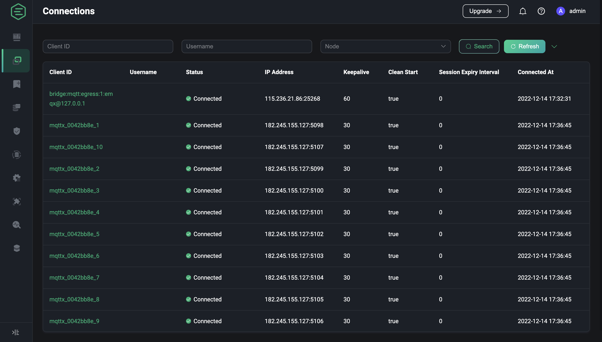

# Connections

Users can view clients currently connecting to the broker or session which has not expired and can view detailed information and metrics for a client. You can use [MQTTX](https://mqttx.app/) as a client to connect to EMQX for publishing subscriptions. You can also quickly implement a client connection to EMQX using the [client libraries available in each language](https://www.emqx.io/docs/en/v5.0/development/client.html).

## Connection List

In the connection list, users can view the list of connections that are currently connected to the EMQX or the session has not expired and the basic information of the connection. The list will show the ID and username set by each client when connecting to EMQX, the current connection status, the IP address of the client, the heartbeat time set for the connection which is the maximum idle time of the connection and which time the client connected to EMQX; the IP address data of the client consists of the IP address of the client and the port of the client used by the client when connecting to EMQX, and the client can be kicked out from the list.

By default only the client ID, username and node filters are displayed on the page, click on the arrow button to the right of the search bar to display all the fields available for filtering; you can perform a fuzzy search using the client ID and username to filter the list of connections, select the node to which the connection belongs, the connection status or the time range of the connection to filter the list, or enter the exact IP of the connected client to filter the clients with the target IP address, click on the Refresh button to reset all the filter fields and reload the list of connections.

## Connection Details

On the connection list page, select a connection and click on the client ID to access the connection details page for that connection.

On the connection details page, in addition to the basic connection information already displayed on the list page, more detailed information is provided for the user to view, such as the protocol version used for the connection, whether the session is cleared after ending the connection, etc. In the case of a connection with a disconnected status, the time of the last disconnection is also displayed; the left side of the connection information shows the session information for the connection, including the session expiry interval, session creation time, process stack, number of subscriptions, heap size, inflight and QoS 2 message receive queue.

Below the connection information, the statistics of the current connection are displayed according to three categories: traffic sent and received, messages and number of messages, which can be viewed by the user as required.

The bottom of the details page shows the topics to which the connection is currently subscribed. Users can click on the Add Subscription button to perform a simpler subscription operation, or click on the Unsubscribe button in the subscription list to cancel a topic to which they are currently subscribed.

