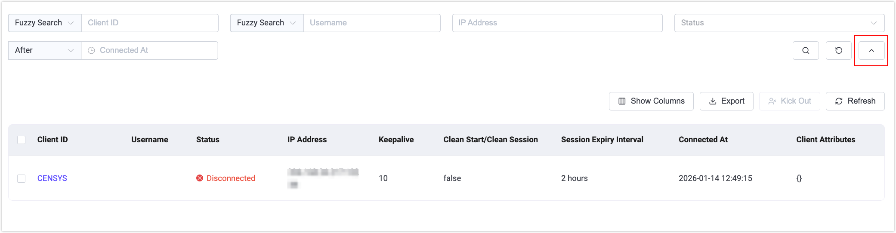

# Clients

You can use [MQTTX](https://mqttx.app) as a client to connect to EMQX for publishing and subscribing. Alternatively, you can quickly implement client connections to EMQX using [client libraries provided in various languages](../../connect-emqx/introduction.md). On the **Clients** page, you can view details and metric statistics of clients currently connected to the server or sessions that have not expired.

## Client List

In the client list, users can view basic information about currently connected clients, including:

- Client ID and username set when connecting to EMQX
- Current connection status
- Client's IP address
- Heartbeat duration set for the connection and maximum idle time
- Information about connection sessions, including whether the session is cleared and the session expiration interval
- The time when the client connected to EMQX

The client's IP address data is concatenated from the client's IP address and the port used by the client when connecting to EMQX.

The top filter condition fields by default display only client ID, username, and IP address. You can use the client ID and username for fuzzy searching to filter the connection list. Clicking the right arrow button next to the search bar displays all available filter condition fields. You can also select the connection status or connection time range to filter the list, or enter the client's IP to filter by target IP address.

At the top of the list, the **Select Column** button allows you to choose which columns to display. Clicking the **Refresh** button resets all filter conditions and reloads the connection list. You can also select a client and click **Kick Out** to manually disconnect that client.

## Client Details

Click a client ID in the client list to open the client details page. This page provides detailed connection information, session data, and runtime metrics for the selected client. You can manually refresh the data or clear the client session using the actions at the top of the page.

In addition to the basic fields shown in the client list, the **Information** tab includes extended connection details such as the MQTT protocol version, clean session settings, and (for disconnected clients) the last disconnection time. The **Session Info** panel shows session-related data, including the session expiry interval, creation time, heap size, subscription count, message queue usage, inflight window size, and QoS 2 receive queue length.

The **Metrics** tab displays runtime statistics for the client connection, including bytes and packets sent and received, as well as message counts by QoS level and dropped message statistics.

The **Subscriptions** tab lists all topics currently subscribed to by the client. You can add new subscriptions using **New Subscription** or remove existing ones by clicking **Unsubscribe** for a specific topic.

