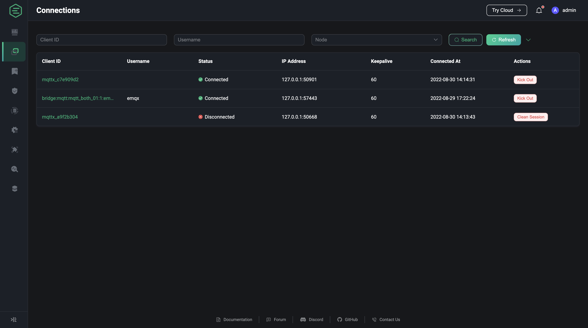
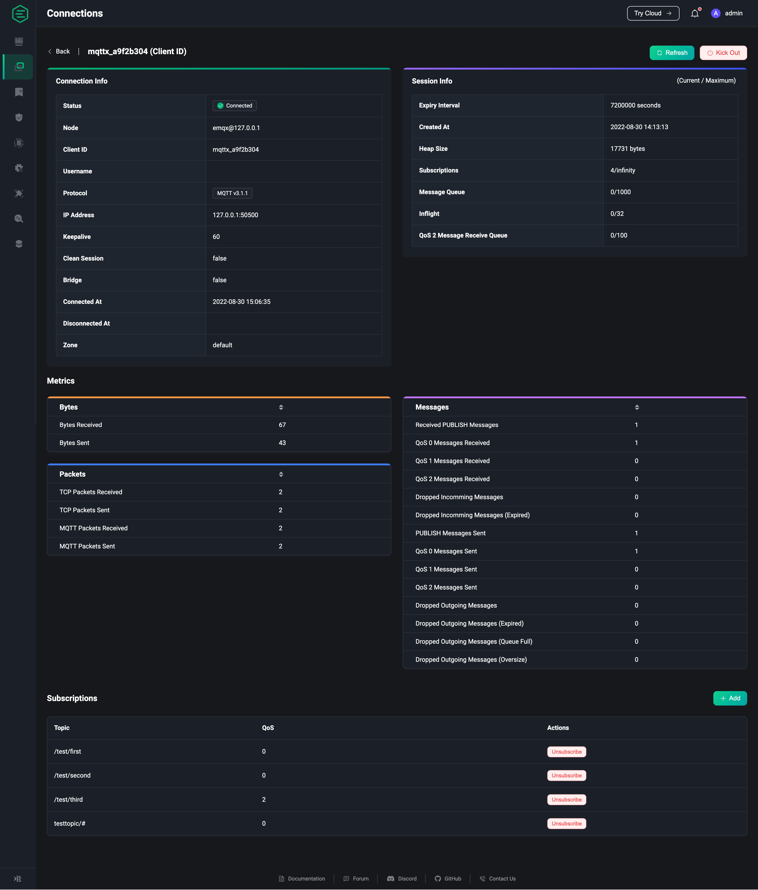

# Connections

Users can view clients currently connecting to the broker or session which has not expired and can view detailed information and metrics for a client.

## Connection List

On the list page, users can view the list of clients currently connecting to the broker and the basic information of the clients; they can filter the client list according to client ID, user name, node, IP address, status and connection time; they can also kick out the clients in the list.

## Connection Details

On the connection list page, select a client and click on the client ID to enter the connection details page for that connection.
On the connection details page, in addition to the basic connection information already displayed on the list page, more detailed information is provided for the user to view, such as the protocol version used and the session information for this client; below the client information, you can view the metrics of the current connection regarding the number of traffic sent and received, messages and messages. At the bottom of the page you can view the subscriptions of the current connection, you can add a subscription to this client or cancel a current subscription.

