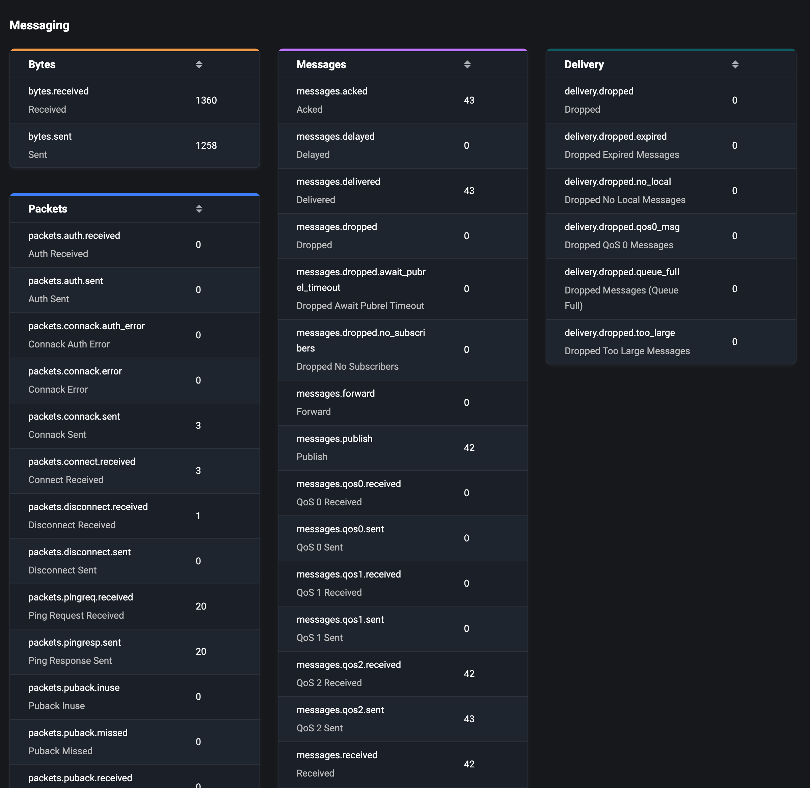

# Dashboard

Once you have successfully logged in, you will be able to access the EMQX Dashboard home page, which contains three tabs.

- Overview: Monitor the overview of data in the whole cluster
- Nodes: View the list of nodes and node information in the cluster
- Metrics: Monitor all data metrics within the cluster or individual nodes

## Overview

This page provides an overview of the data for the entire EMQX cluster in operation, including the following information.

### Connections and Subscriptions

As an MQTT broker, the number of connections and topics subscribed to EMQX is one of the most important metrics to observe. The connections is the number of MQTT clients or real devices currently connected to EMQX, the number of subscriptions is the total number of topics currently subscribed to in each client, and topics is the unique subscriptions.

In the tab on the top right of the overview page, we can quickly see the number of connections, subscriptions and topics in the cluster. The statistics in the card will be updated in real time when a connection or a subscription topic is updated.

::: tip
Subscriptions are differentiated by client, while topics are unique subscriptions and the same topic may be included in different clients.
:::

In addition to providing real-time statistics, the bottom of the page also provides a visual chart that allows you to view historical and current changes in the number of connections and subscriptions by time (the time format: YYYY/MM/DD HH:mm), which allows you to monitor the trend of the number of connections and subscriptions within the entire EMQX cluster more clearly and intuitively.

### Message Rate

Messages are the key data in EMQX. Messages are the content of data that is currently being transmitted by all MQTT clients or real devices connected to EMQX. Clients or devices send or receive messages through topics as a way to complete data communication between them.

The card in the upper left corner of this overview page provides a clearer and easier way to monitor the rate changes in the current volume of messages incoming and outgoing in the system (message rate is measured in how many messages per second) by visualizing the rate spectrum with real-time rate values.

### Messages

The number of messages is the statistics of the number of data transferred between clients or devices, and on the page includes the incomming, outgoing and dropped messages.

In the chart at the bottom of the page, you can see a visual chart of the number of messages, and view the historical and current number of messages by time change (the time format: YYYY/MM/DD HH:mm), which allows users to better monitor dynamically the real-time changes of all messages within the current EMQX cluster.

::: tip
In the above, all charts over time are available in the top left corner: statistics for the last 1 hour, last 6 hours, last 12 hours, last 1 day, last 3 days and last 7 days
:::

### Node Data

You can monitor the whole EMQX cluster by the card in the middle of the overview page, including the topology diagram to visualize the association and distribution of all nodes in the cluster.

Click on a single node in the topology diagram to view the basic information and operation status of the current node, including the node name and role, the number of connections, subscriptions and topics, the current EMQX version (click on the version number to view the change logs of the version, so as to quickly understand the content updates of the current version), and you can also view the CPU load and memory usage of the OS where the node is deployed (memory can only be showed in nodes deployed to Linux).

::: tip
When the green node in the topology diagram turns gray, it means that the node is currently stopped
:::

## Nodes

EMQX, the most scalable MQTT broker for IoT, cluster deployment is supported, and each EMQX in a cluster is a node.

### Nodes List

We can access the node page by clicking the `Nodes` tab at the top.

The Nodes page provides a list of all the nodes in the current EMQX cluster, where we can simply view the node name, running status, uptime, version, Erlang process usage, memory usage and CPU load of each node.

Click the `Refresh` button in the upper right corner to see the latest data of the current node list in real time.

### Node Detail

In the nodes list, we only support to view some basic information of the node, if you want to view more detailed of the node, you can click `Node Name` to access the node details page. We can view more complete node information in the Node Info and Node Statistics cards.

In the Node Info card, we also support viewing basic information such as node name, role, running status, uptime, version, CPU load, Erlang process usage, system memory, etc. You can also view file descriptors limit, the system path and log path of the node (Show the log path requires the file log handler to be enabled).

In the node statistics card, we can see some statistics of the current node, including: Connections, Topics, Retained, Sessions, Subscriptions, Shared Subscriptions.

The values of the node data statistics are divided into two parts, split by a slash. The data on the left is the real-time data display, and the data on the right is the high watermark, i.e. the maximum value that the current data has reached.

## Metrics

In the metrics page, users can monitor all the data metrics generated during the use of EMQX cluster or a node, including packets, messages statistics and traffic sending and receiving statistics, etc. Based on these metrics, you can learn about the current service status.

Click the `Metrics` tab at the top to enter the metrics page, where we can select whether it is a cluster or a node in the upper right corner and click the `Refresh` button to monitor the metrics data updates in real time.

### Connections, Session and Access

The metrics data covers four areas: bytes, packets, messages and events. We can monitor the event-related metrics data in the top three cards, containing statistics on the number of connections, sessions and access (authentication & authorization), etc.

### Messaging

The four cards below provide statistics on the data generated during message transmission, such as statistics on traffic sent and received (in bytes), statistics on the number of packets, the number of messages and the number of messages delivered.

For more details and content of metrics, please visit [Metrics](../observability/metrics-and-stats.md) page.
