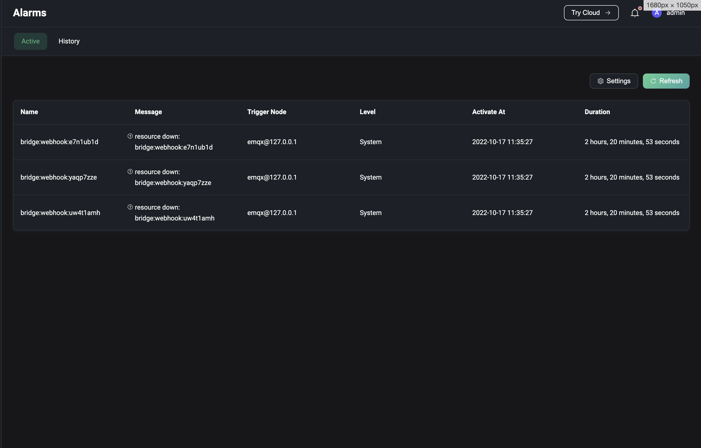
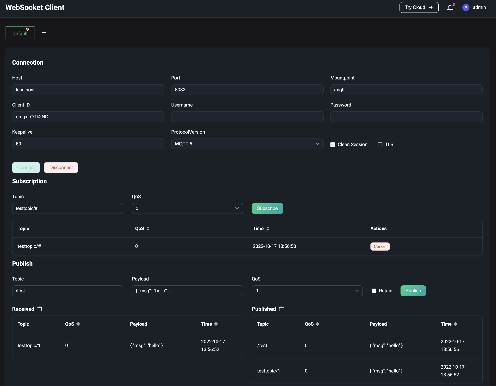
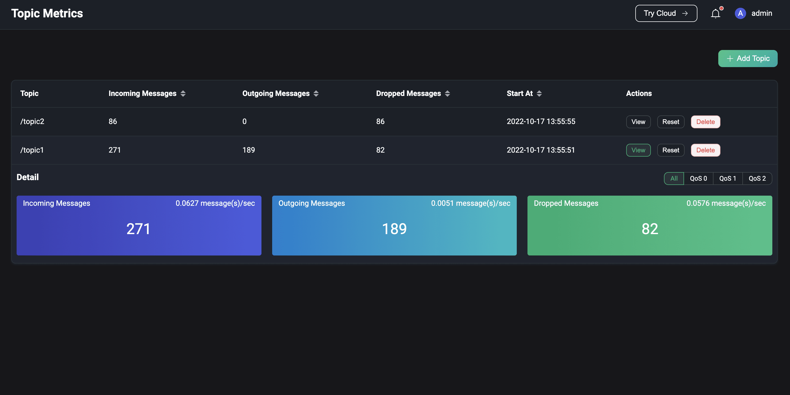
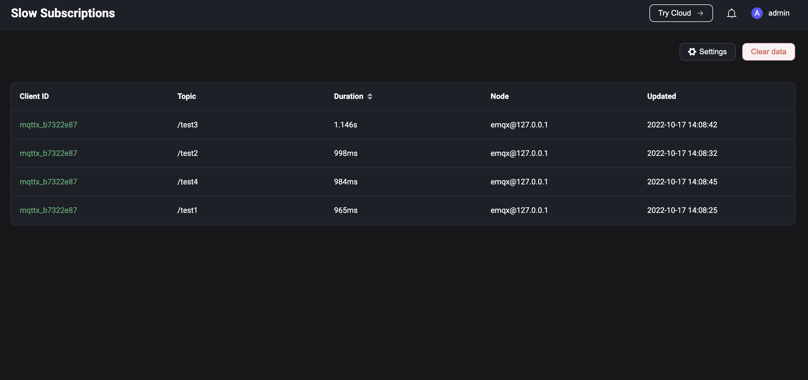
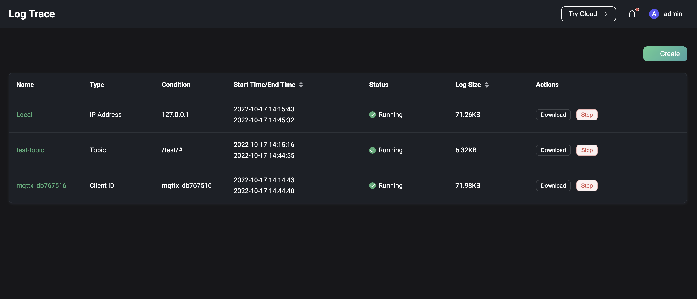
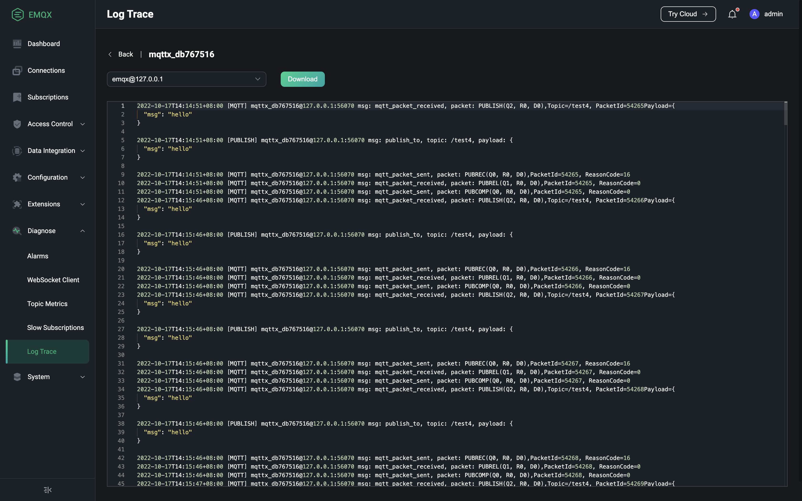

# Diagnose

The Diagnose module provides some debugging tools to help users debug and locate errors and issues in usage.

- **Alarms**: View current and historical alarms for the system.
- **WebSocket Client**: Use the WebSocket client on the page for quick connection, publish subscription debugging.
- **Topic Monitoring**: Monitor and view message incoming, outgoing and dropped data based on topics.
- **Slow Subscriptions**: Enable slow subscription statistics to view subscriptions on the page that consume more than a set threshold of time for the entire flow of message transmission based on client ID.
- **Log Trace**: Real-time filtering of logs for a specific client, Topic or IP, which can be viewed or downloaded on the page.

## Alarms

Click on Alerts under the Diagnose menu on the left to go to the Alerts page. The alarms page allows you to view the server's current alarms and historical alarms (inactivated alarms). The alarm information includes the alarm name, the content of the alarm message, the node that triggered the alarm, the alarm level, the activate time the alarm and the duration of the alarm.

On the current alarms page, you can click on the `Refresh` button in the top right corner to refresh the list and see if any new alarms have occurred. If the default value of the current alarm trigger threshold or alarm monitoring interval does not meet the actual needs of you, you can click the `Settings` button in the top right corner to jump to the [Monitoring](./configuration.md#monitoring) page for setting. On the Alarm History page, you can clear the alarm history by clicking on the `Clear History Alarms` button in the top right corner.

Information on currently supported alarms and more details can be found in [alarms](../observability/alarms.md).

## WebSocket Client

Click on WebSocket Client under the Diagnose menu on the left to go to the WebSocket Client page. The WebSocket Client page provides a simple but effective MQTT testing tool that includes connect, subscribe and publish functionality for quick debugging of the client's connect, publish and subscribe functionality, as well as the ability to view your own sent and received message data. Multiple WebSocket connections can be added by clicking the `+` button at the top of the page; the connection status and sent and received data for all connections will be cleared when the page is refreshed.

## Topic Metrics

Click on Topic Monitoring under the Diagnose menu on the left to go to the Topic Metrics page. In Topic Monitoring, you can click the `Create` button in the top right corner of the page, enter the topic you want to monitor and click `Add` to create a new topic metric statistic. Once created successfully, you can view the number and rate of message incoming, outgoing and dropped for that topic by topic, as well as view the data for each QoS for the above metrics in the details. Click on the `Reset` button to reset the existing statistics for a topic. The monitoring list can be displayed by clicking on a statistical indicator in the header of the table to sort it in order or in reverse order, as required.

> For overall performance reasons, only topic names are currently supported for topic statistics, i.e. topic filters with + or # wildcards, e.g. a/+ etc. are not supported.

## Slow Subscriptions

Click on Slow Subscriptions under the Diagnose menu on the left to go to the Slow Subscriptions page. To use slow subscription statistics, you need to enable this feature after setting up the base settings for slow subscriptions. A description of the individual configuration items can be found in [slow subscriptions](../observability/slow-subscribers-statistics.md#configure-and-enable-slow-subscriptions). When enabled, messages whose time consumption for the full flow of message delivery exceeds the configured `time delay threshold` will participate in the statistics. By default, the statistics list shows the subscriber and subject information in descending order of latency. Clicking on the `Client ID` will redirect you to the subscriber's connection details page, where you can view the connection information to investigate the cause of the slow subscription.

## Log Trace

Click on Log Tracking under the Diagnose menu on the left to go to the Log Trace page. If you need to filter logs in real time for a specific client, Topic or IP for debugging and troubleshooting purposes, you can use the Log Trace feature. Click on the `Create` button in the top right corner of the page and select the object you want to trace, where the client ID and IP need to be entered exactly and the Topic supports wildcard matching in addition to exact matching. You can also manually stop a trace in progress in the list; stopped traces can be deleted from the list.

You can see all current traces in the list and view or download the logs of a particular trace. In a clustered environment, clicking the `Download` button in the list downloads the logs of the node corresponding to the Dashboard; clicking the `View` button allows you to select a node for viewing and downloading the logs.

