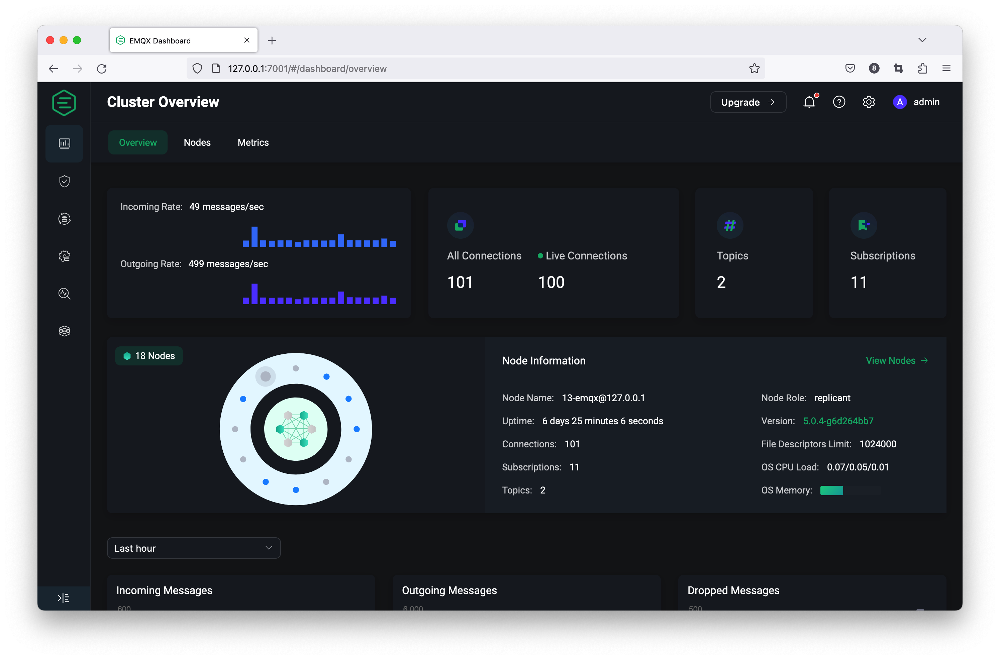

# EMQX Dashboard Introduction

EMQX provides a built-in Dashboard management console for users to monitor and manage EMQX or EMQX clusters and configure the required features via web pages. The new Dashboard comes with a fresh new design for the dashboard, it provides the most easy-to-use MQTT broker management UI. it provides the most easy-to-use MQTT broker management UI.

## Main Features

### Monitor and manage data in EMQX clusters

It supports viewing the number of connections, subscription topics, messages sent and received, and incoming and outgoing rates of the running EMQX cluster, including node list and information and some metrics data, as well as viewing and managing some client connection and subscription data.

### Access control (authentication and authorization) management

Supports visualization to add and configure authentication and authorization mechanisms in EMQX.

### Data Integration

Low-code data processing and integration using a powerful SQL-based Rule Engine and Data Bridge or the visualization capabilities of the Flow Editor to help extract, filter, enrich, transform and store MQTT data in real-time.

### Online config update

Supports online modification and update of configuration including MQTT, logs, listeners, etc., with immediate effect after successful update.

### Gateway/Extension management

Support for custom plug-in integration, Extend EMQX connectivity protocols through built-in gateway management and configuration or use Hooks to modify or extend system functionality by intercepting function calls, message passing and event passing between modules.

### More powerful diagnosis tools

In addition to debugging through online MQTT over WebSocket client connections and publishing subscriptions, we also support diagnosing and finding issues using things like slow subscriptions and online logs tracing and alarms.

## Running

EMQX Dashboard is a web application that listens to port `18083` by default. After installing EMQX successfully, you can access and use EMQX Dashboard by opening <http://localhost:18083/> (replace localhost with the actual IP address if deployed on a non-local machine) through your browser.

::: tip
EMQX can still be used normally without Dashboard enabled, Dashboard just provides the option for users to use it visually.
:::

### First Login

For users who have installed EMQX for the first time, you can use the default username `admin` and default password `public` to login web page after opening the Dashboard in your browser.

After logging in for the first time, the system will automatically detect that you are logging in with the default username and password, and will force you to change the default password, which is good for the security of accessing Dashboard, note that the changed password cannot be the same as the original password, and it is not recommended to use `public` as the login password again.

## Configure Dashboard

Dashboard listens to the HTTP by default, the default port number is 18083, users can enable HTTPS or change the listener port, for more information on how to configure and modify the use of Dashboard, please refer to the [configuration document](../admin/cfg.md#dashboard).
