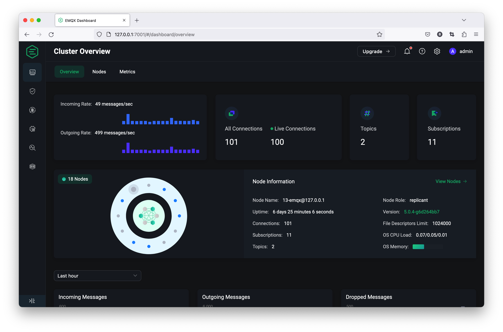

# EMQX Dashboard

EMQX provides a built-in Dashboard management console for users to monitor and manage EMQX clusters and configure the required features via web pages. The new Dashboard comes with a fresh new design and provides the most easy-to-use MQTT broker management UI. 

The new UI / UX design of EMQX Dashboard optimizes the display and content of key data and metrics, enhancing the visual experience while providing more comprehensive, powerful and easy-to-use built-in features, such as authentication and permission management for connection, subscription and publishing, support for data integration transformation using data bridging and with the rules engine, etc. Quick and easy access using the browser provides users with the convenience of using EMQX for more IoT business development.



## Main Features

### Monitor and manage data in EMQX clusters

It supports viewing the number of connections, subscription topics, messages sent and received, and incoming and outgoing rates of the running EMQX cluster, including node list and information and some metrics data, as well as viewing and managing some client connection and subscription data.

### Access control (authentication and authorization) management

Supports visualization to add and configure authentication and authorization mechanisms in EMQX.

### Data integration

Low-code data processing and integration using a powerful SQL-based Rule Engine and Data Bridge or the visualization capabilities of the Flow Editor to help extract, filter, enrich, transform and store MQTT data in real-time.

### Online config update

Supports online modification and update of configuration including MQTT, logs, listeners, etc., with immediate effect after successful update.

### Gateway/Extension management

Support for custom plug-in integration, Extend EMQX connectivity protocols through built-in gateway management and configuration or use Hooks to modify or extend system functionality by intercepting function calls, message passing and event passing between modules.

### More powerful diagnosis tools

In addition to debugging through online MQTT over WebSocket client connections and publishing subscriptions, we also support diagnosing and finding issues using things like slow subscriptions and online logs tracing and alarms.

## Launch Dashboard

EMQX Dashboard is a web application that listens to port `18083` by default. After installing EMQX successfully, you can access and use EMQX Dashboard by opening <http://localhost:18083/> (replace localhost with the actual IP address if deployed on a non-local machine) through your browser.

::: tip
EMQX can still be used normally without Dashboard enabled, Dashboard just provides the option for users to use it visually.
:::

### First Login

For users who have installed EMQX for the first time, you can use the default username `admin` and default password `public` to login web page after opening the Dashboard in your browser.

After logging in for the first time, the system will automatically detect that you are logging in with the default username and password, and will force you to change the default password, which is good for the security of accessing Dashboard, note that the changed password cannot be the same as the original password, and it is not recommended to use `public` as the login password again.

### Token-Based Login via URL

Starting from EMQX 5.6.0, the Dashboard supports a token-based login method that allows users to log in directly by embedding authentication information in the URL.

This feature is particularly useful for seamless redirection and integration scenarios where a user should be logged in automatically without entering credentials manually.

#### How To Use This Login Method

1. Call the `/login` API to obtain the login token and related information.

   ```
   curl -X POST "http://127.0.0.1:18083/api/v5/login" \
     -H 'accept: application/json' \
     -H 'Content-Type: application/json' \
     -d '{"username": "admin","password": "public"}'
   {"license":{"edition":"ee"},"role":"administrator","token":"xxx.yyy.zzz","version":"5.6.1"}
   ```

2. Combine the data into a JSON structure. Manually add the username used during login (not included in the `/login` response).

   ```json
   {
     "license": {
       "edition": "ee"
     },
     "role": "administrator",
     "token": "xxx.jwt.token",
     "version": "5.6.1-g0fef19f8",
     "username": "admin"
   }
   ```

3. Convert the JSON string to Base64. Below is an example on how to get base64-encoded authentication string in one call:

   ```
   curl -s -X POST "http://127.0.0.1:18083/api/v5/login" \
     -H 'accept: application/json' \
     -H 'Content-Type: application/json' \
     -d '{"username": "admin","password": "public"}' | jq '.username = "admin"' | base64
   ```

4. Embed the encoded string in the `login_meta` query parameter of the Dashboard URL.

#### Example URL

For versions **before 5.6.0**:

```bash
http://localhost:18083?login_meta=BASE64_ENCODED_STRING
```

Redirects to the default cluster overview page.

For **version 5.6.0 and later**, you can also specify a target page:

```bash
http://localhost:18083/#/dashboard/overview?login_meta=BASE64_ENCODED_STRING
```

This method provides a smooth, pre-authenticated user experience for accessing the EMQX Dashboard. Make sure to handle the token securely and ensure it has appropriate expiration and scope limits.

## Reset password

You can reset your Dashboard login password via the `admins` command. For details, see [CLI - admins](../admin/cli.md#admins).

```bash
./bin/emqx ctl admins passwd <Username> <Password>
```

## Configure Dashboard

Dashboard listens to the HTTP by default, the default port number is 18083, users can enable HTTPS or change the listener port, for more information on how to configure and modify the use of Dashboard, please refer to the [configuration document](../configuration/configuration-manual.html#dashboard).
