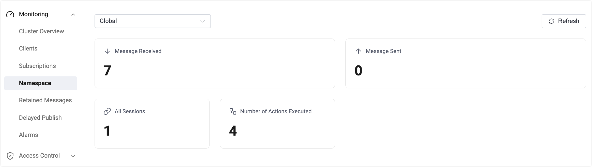

# Namespace

The Namespace monitoring page provides visibility into namespace-related metrics in EMQX, including message traffic and rule action execution. It helps users understand overall system load as well as workload distribution at the namespace level.

This page is primarily intended for runtime monitoring and usage analysis in multi-tenant environments.

## Namespace Selection

A namespace selection dropdown is available at the top of the page to define the scope of the displayed metrics.

- In the current version, only the **Global** view is available, which shows aggregated metrics across all namespaces.
- When distinguishable namespaces are available in the system, this dropdown will allow you to select a specific namespace and view its corresponding metrics.

## Metrics

The table below describes the metrics displayed on the Namespace monitoring page.

| Metric Name                | Description                                                  |
| -------------------------- | ------------------------------------------------------------ |
| Messages Received          | The total number of messages received by EMQX and currently aggregated across all namespaces. |
| Messages Sent              | The total number of messages successfully delivered by EMQX to clients and currently aggregated across all namespaces. |
| All Sessions               | The total number of MQTT sessions currently active in the system. |
| Number of Actions Executed | The total number of actions successfully executed by rules or Flows. |

## Usage Notes

- The Namespace monitoring page is read-only and does not provide configuration or management capabilities.
- All metrics are cumulative values and continue to increase from the time the node or cluster is started.
- This page is intended for observing runtime status and analyzing usage patterns in multi-tenant scenarios.