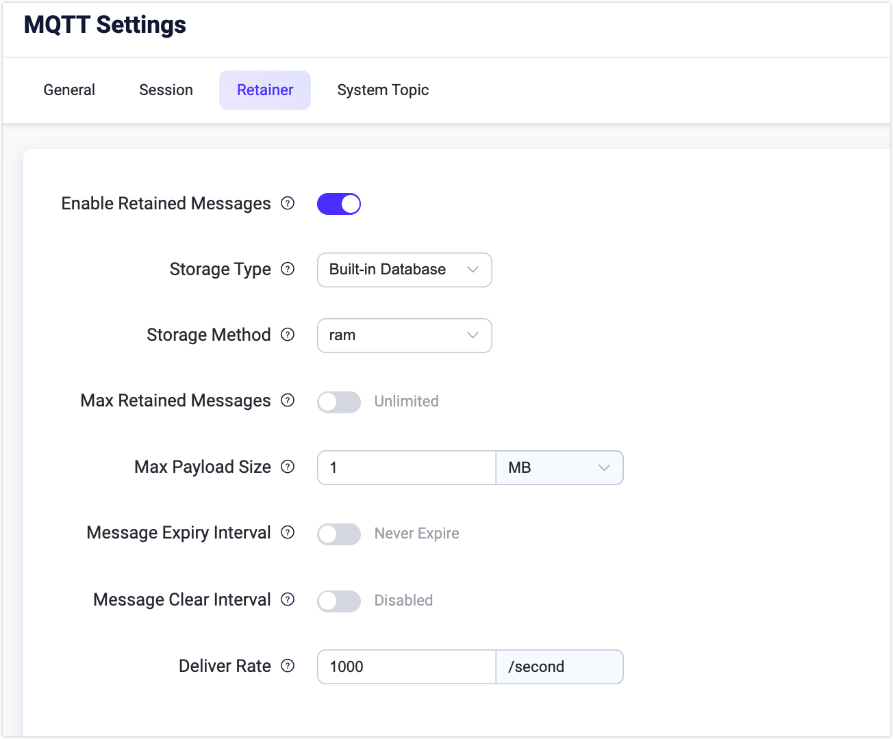

# Retained Messages

You can view all retained messages in the EMQX on Retained Messages page by clicking **Monitoring** -> **Retained Messages** from the left navigation menu.

When a user publishes a retained message, EMQX will save this message in the system. The user can view this message on the Retained Messages page. When the user subscribes to the topic of this retained message, EMQX will publish this message to the topic, and users can receive this message immediately.

The retained message is never expired by default unless the user manually deletes this message.

## Retained Messages List

The Retained Messages list includes the topic, QoS, client ID, and time when the retained message was published. In the list, you can click the **Show Payload** and **Delete** buttons to view the Payload of the retained message and delete a retained message. Click the **Refresh** button in the upper right corner of the list to refresh the current retained message list, and click the **Settings** button to jump to the retained message settings page.

Three types of system topics are saved as retained messages by default. If it is a cluster environment, it will keep different system topics' retained messages according to other node names. They are:

- $SYS/brokers/+/sysdescr - The system description of the current EMQX node
- $SYS/brokers/+/version - The version number of the current EMQX node
- $SYS/brokers - The number and name of all nodes of the current EMQX

### Delete Retained Message

In most cases, you can delete retained messages in the client by publishing an empty message to the topic of the retained message. In addition, you can also delete retained messages in EMQX Dashboard. Click the **Delete** button on the Retained Messages list page to delete a retained message. You can also set the expiration time of the retained message on the Retained Messages configuration page. When the retained message expires, EMQX will automatically delete this retained message.

### View Payload

If you want to view the Payload of the retained message, you can click the **Show Payload** in **Actions** column of the retained message item.

On the pop-up window, you can click the **Copy** button at the lower right corner to copy the payload. You can also select the payload display format from the drop-down list at the lower left corner have more intuitive display for some special payload formats, such as JSON or Hex format.

## Retainer Settings

By clicking the **Settings** button in the upper right corner of the **Retained Messages** page, you will be redirected to the **Retainer** tab on the **Management** -> **MQTT Settings** page where you can enable or disable the retained messages feature and also configure the settings for retained messages.

::: tip

If you disable the retained messages feature by clicking the toggle switch, an **Enable** button will be displayed on the Retained Messages page. By clicking the button, you will be redirected to the **Retainer** tab.

:::

Below are detailed descriptions of each field.

| Configuration item      | Type     | Optional value    | Default value | Description                                                  |
| ----------------------- | -------- | ----------------- | ------------- | ------------------------------------------------------------ |
| Storage Type            | -        | Built-in Database | -             | -                                                            |
| Storage Method          | Enum     | `ram`, `disc`     | `ram`         | `ram`: Only stored in memory;  `disc`: Stored in memory and hard disk. |
| Max Retained Messages   | Integer  | ≥ 0               | 0 (Unlimited) | 0: Unlimit.  When you set a limit on the maximum number of retained messages, EMQX replaces existing messages once the limit is reached. However, you cannot store retained messages for new topics beyond the limit. |
| Max Payload Size        | Bytesize |                   | 1MB           | Retain the maximum payload value of the message. If the payload value exceeds the maximum value, the EMQX will treat the retained reserved message as a normal message. |
| Message Expire Interval | Duration |                   | Never Expire  | The expiration time of the retained message, and 0 means never expire. If the message expiration interval is set in the PUBLISH packet, the message expiration interval in the PUBLISH packet shall prevail. |
| Message Clear Interval  | Duration |                   | Disabled      | Interval to clean up expired messages.                       |
| Deliver Rate            | Integer  | ≥ 0               | 1000          | The maximum rate of delivering retain messages.              |
