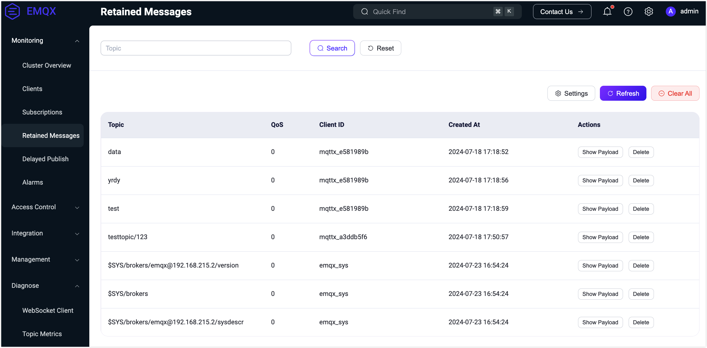
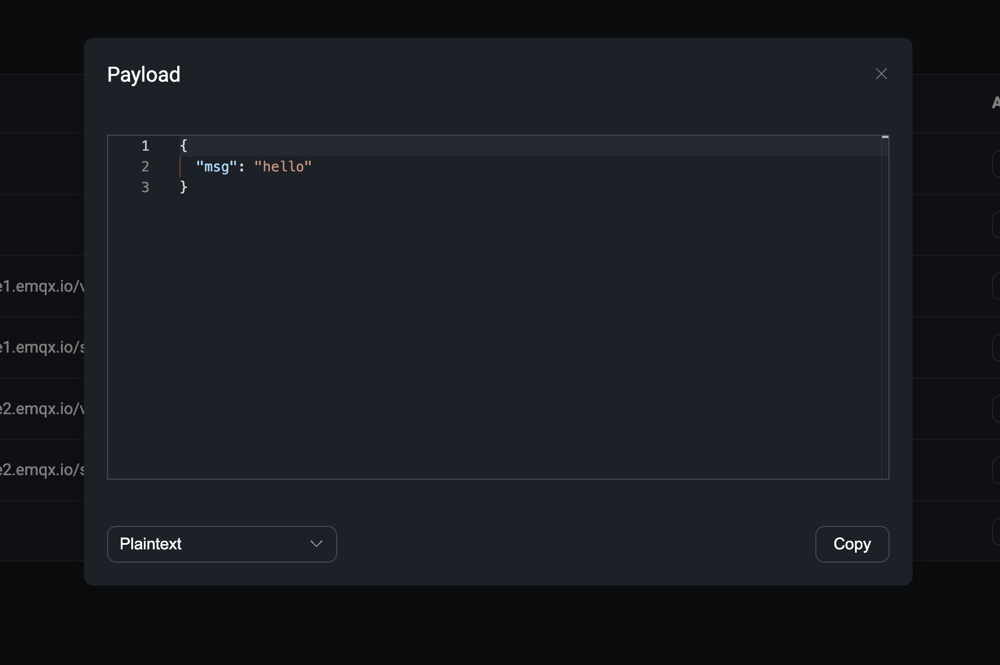

# Retained Messages

Click the **Retained Messages** menu on the left to go to the **Retained Messages** list page. It lists all retained messages in the EMQX.

When a user publishes a retained message, EMQX will save this message in the system. The user can view this message on the Retained Messages list page. When the user subscribes to the topic of this retained message, EMQX will publish this message to the topic, and users can receive this message immediately by subscribing to the topic.

The default expiration time of the retained message is never expired unless the user manually deletes this message.

## Retained Messages List

The user can view all retained messages in the system on the **Retained Messages** list page. The list includes the topic of the retained message, the QoS of the retained message, the time when the retained message was published, and the client ID of the retained message. In the list, the user can click the **Show Payload** and **Delete** buttons to view the Payload of the retained message and delete a retained message. Click the **Refresh** button in the upper right corner of the list to refresh the current retained message list, and click the **Settings** button to jump to the retained message settings page.

The default will save three types of system topics retained messages. If it is a cluster environment, it will keep different system topics' retained messages according to other node names. They are:

- $SYS/brokers/+/sysdescr - The system description of the current EMQX node
- $SYS/brokers/+/version - The version number of the current EMQX node
- $SYS/brokers - The number and name of all nodes of the current EMQX

### Delete Retained Message

In most cases, users can delete retained messages in the client by publishing an empty message to the topic of the retained message. In addition, users can also delete retained messages in EMQX Dashboard. Click the **Delete** button on the Retained Messages list page to delete a retained message. Users can also set the expiration time of the retained message on the Retained Messages configuration page. When the retained message expires, EMQX will automatically delete this retained message.

## View Payload

On the Retained Messages list page, the user can only view the retained message's topic, time, and client ID. If the user wants to view the Payload of the retained message, the user can click the **Show Payload** button on the Retained Messages list page to view the Payload of the retained message.

Click the **Show Payload** button on the Retained Messages list page to view the Payload of the retained message. The user can also click the **Copy** button in the pop-up window to copy the retained message's Payload quickly. Click the lower left corner to format the Payload output. This is more intuitive for some special Payload formats, such as JSON or Hex format.

## Settings

Click the **Settings** button in the upper right corner of the **Retained Messages** list page to quickly jump to **Configuration** -> **MQTT** -> **Retainer** tab to modify the configuration of the retained message. On the **Retainer** tab, you can view the current configuration information of the retained message, including the maximum number of retained messages and the expiration time of the retained message. For details, please visit [Retainer](./configuration.md#Retainer).

:::tip
When the retained message feature is disabled, EMQ X Dashboard will display the **Enable** button on the retained message list page and prompt that the retained message feature has been disabled. You can click to jump to the configuration page to open it.
:::
