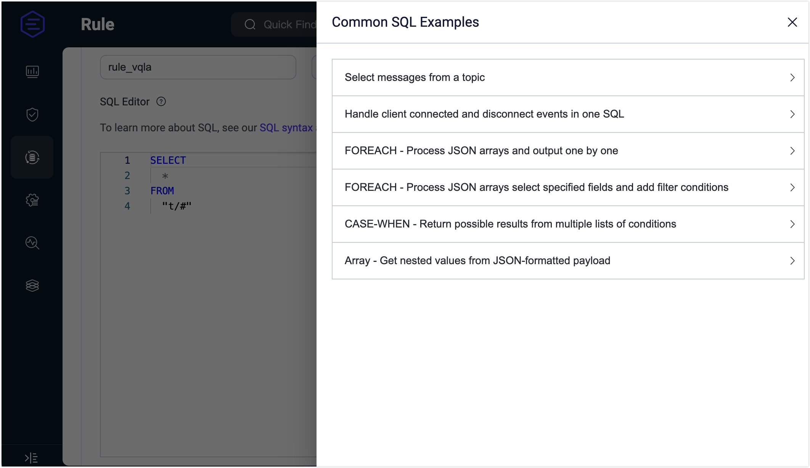
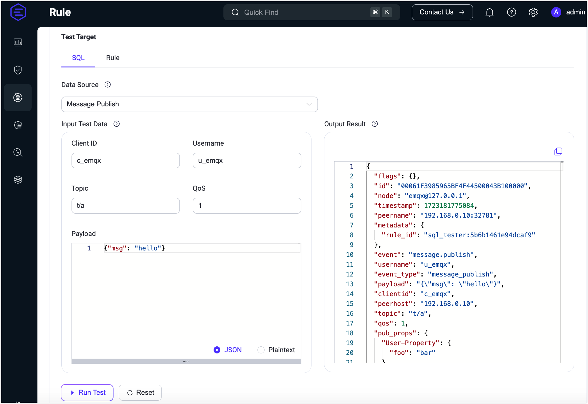
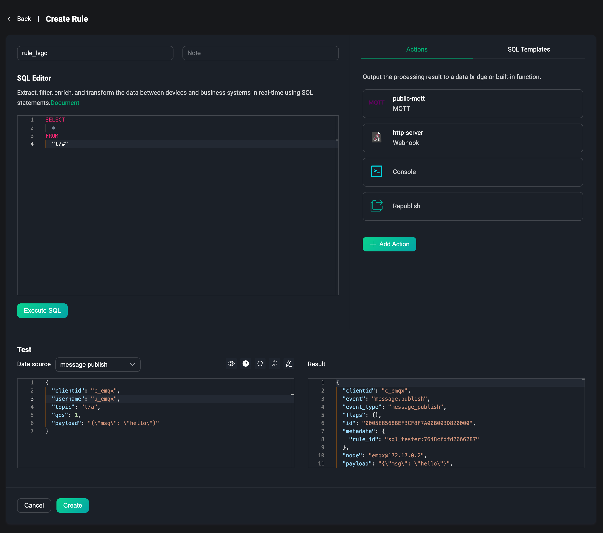
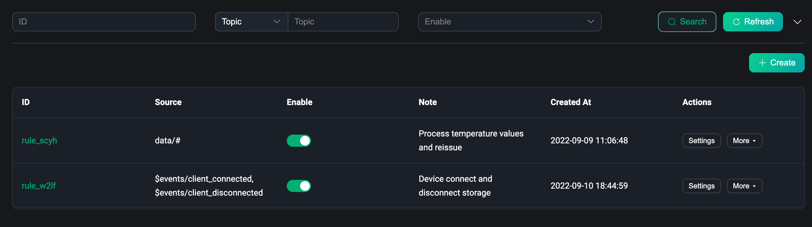
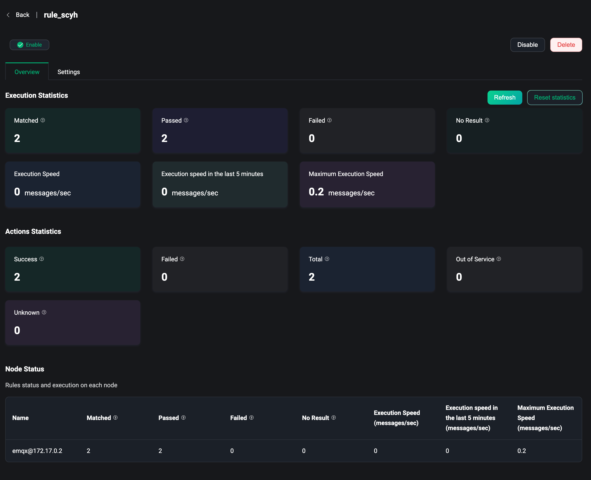
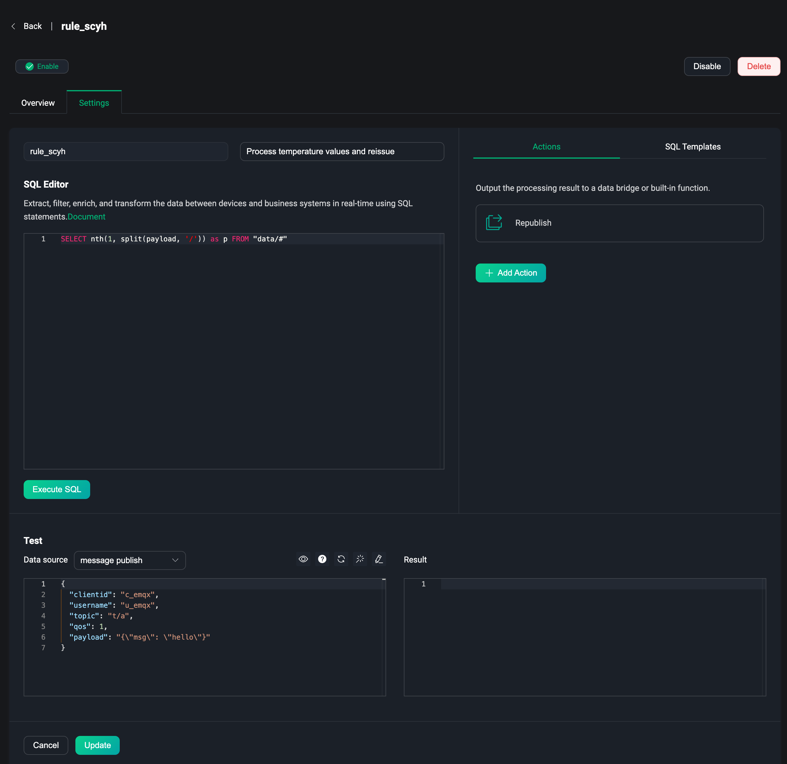

# Rules

EMQX provides a powerful and efficient built-in data processing feature, the Rule Engine. Get data through topics, events, or data bridges, use simple standard SQL statements to extract, filter, enrich, and transform business data in real time, and finally distribute or integrate data to external systems through actions triggered by rules, including built-in actions and data bridges. You can also republish processed data to MQTT clients or devices. For more information, please refer to [Rules Introduction](../data-integration/rules.md).

The rule is a part of the powerful data integration capability of EMQX, which provides a clear and flexible business integration solution with the use of data bridging, simplifying the business development process, improving user usability, and reducing the coupling between business systems and EMQX. For more information, please refer to [Rule Engine](../data-integration/rules.md).

Under the Data Integration menu on the left side, users can access the Rules page. Users can create and manage the rules created on this page.

## Create

To create a Rule, click `Create` on the upper right corner of the Rules page. You can also create a Rule quickly by using an existing data bridge on the Data Bridge page. 
<!-- You can check out the [Get Started with Rules](../data-integration/rule-get-started.md) to quickly create and use a rule. -->

### SQL Editor

On the Create Rule page, we can see an SQL editor. Rules are based on SQL statements to query, filter, transform, and enrich data in real time between clients or between business systems. The top two input boxes are Rule ID and note. After entering the creation page, a random Rule ID will be generated to identify the current rule, or you can manually enter the rule identifier you want to enter. You can enter some rule descriptions in the note to distinguish the use scenarios of each rule.

The right side provides a selection of SQL templates, which can be used to quickly create rules. Currently, 6 SQL templates are provided, which are:

1. Select messages from a specified topic
2. Process client connection and disconnection events at the same time
3. FOREACH process JSON array and output one by one
4. FOREACH process JSON array to select specified fields and add filter conditions
5. CASE-WHEN returns possible results from multiple condition lists
6. Array processing - get nested values from JSON format payload

The default SQL statement is `SELECT * FROM "t/#"`, which means that when the client publish a message to the topic `t/#`, we will take out all the data under the current event. The `SELECT` keyword can get all the fields in the message, for example, if you want to get the current message's `Payload`, it can be modified to `SELECT payload from "t/#"`. The data can be processed and transformed using [built-in functions](../data-integration/rule-sql-builtin-functions.md). The `FROM` keyword followed by data source. that is, the event topic, the lower rule debug part can view all the optional data source events, using the `WHERE` keyword, you can add conditional judgment, for more detailed SQL syntax usage, please refer to [SQL syntax and examples](./../data-integration/rule-sql-syntax.md).

### Debug

When the SQL statement is completed, you can select the event or data source that triggers the rule in the Debug area at the bottom of the page, enter the simulated test data, and click the `Execute SQL` button under the SQL editor to see the execution output data in the result box at the bottom of the page.

You can test the output data of the rule through the Debug every time you change the SQL statement to ensure the correctness of the rule. Note: If the `412` error code prompt appears when executing SQL, it may be due to the mismatch with the test data, and when the data source does not match the SQL statement, the corresponding event or data source will be prompted to be selected. Updated data source events will automatically update the test data to the corresponding data.

After the data source is selected, you can view the corresponding SQL statement and documentation on the right button. You can also reset the test data, format the JSON data, and switch the test data to the form mode. In the form mode, you can directly enter the corresponding field values to simulate the data.

The simulated data source is the same as the real scenario, including some MQTT events. For the message part, we can select different message events to simulate data, including:

- Message publish (mqtt topic)
- Message delivered ($events/message_delivered)
- Message acked ($events/message_acked)
- Message dropped ($events/message_dropped)

For other events, we can select different client and session events to simulate data, including:

- Client connected ($events/client_connected)
- Client disconnected ($events/client_disconnected)
- Client connack ($events/client_connack)
- Client check authorization complete ($events/client_check_authz_complete)
- Subscribed ($events/session_subscribed)
- Unsubscribed ($events/session_unsubscribed)

There is also a way to use data bridges as data sources, using the `$bridges/*` topic to represent the message or event of the data bridge:

- Data Bridge ($bridge/\<type>:\<name>)

The corresponding data source needs to be consistent with the SQL statement in the editor. When you need to use some message events or data bridges to get data, you need to fill in the corresponding event topic (the content in the brackets) into the SQL statement after the `FROM` keyword, and rules support the use of multiple events. For more details about data source and event explanations, please refer to [SQL Data Source and Fields](../data-integration/rule-sql-events-and-fields.md).

### Actions

After completing the editing of the SQL statement and the rule debugging, we can get output data that meets our requirements. At this time, we can select the action that needs to be executed after the rule is triggered in the `Actions` tab on the right side of the page. Click the `Add Action` button, and we can choose two built-in actions or use data bridging to continue to process the output data of the rule. The two built-in actions include:

1. Console Output, which can print the resulting output to the console, can be used for debugging in the real scene;
2. Republish, which can republish the output data of the rule processing to the specified topic again.

Using data bridging to forwarding data requires selecting an existing data bridge or creating a new data bridge on the current page. After adding a data bridge to the rule action, the output data of the rule will be forwarded to the corresponding external system resource using the data bridge. The configuration of the data bridge can be referred to [Data Bridge](./bridge.md).

For more details about rule actions, please refer to [Actions](../data-integration/rules.md#actions).

## List

When a rule is created, you can view the basic information of the rule in the rule list, including the rule ID, the source of the rule access data (such as events, topics, and data bridges), the rule notes, enabled status, and creation time. The rules can be set, deleted, enabled, disabled, and other operations. You can also duplicate a rule and modify it in the action bar to improve the reuse of rules.

The top of the list contains a search bar, we can use rule ID, topic, enabled status, and note to query rules with multiple conditions, which helps users quickly find rules that meet the conditions and view and set them. Note: Rule ID and note support fuzzy query, topic supports wildcard search.

## Overview

On the rule list page, click the rule ID to quickly enter the rule overview page. The rule overview page contains the basic data statistics of the rule, including the execution statistics of the rule and the execution statistics of the action under the current rule. For example, the number of matched, passed, and failed, the execution rate of the rule, successful and failed executions of the action, etc. Click the `Refresh` button in the upper right corner to view the real-time running data statistics of the current rule.

## Settings

Clicking the `Settings` button in the action bar will enter the rule settings page. The rule settings page contains the basic information of the rule, and the settings page can modify and debug the rule. The settings page is the same as the creation page. For example, you need to modify the execution action under the current rule, modify the rule notes, and re-edit the SQL statement.

