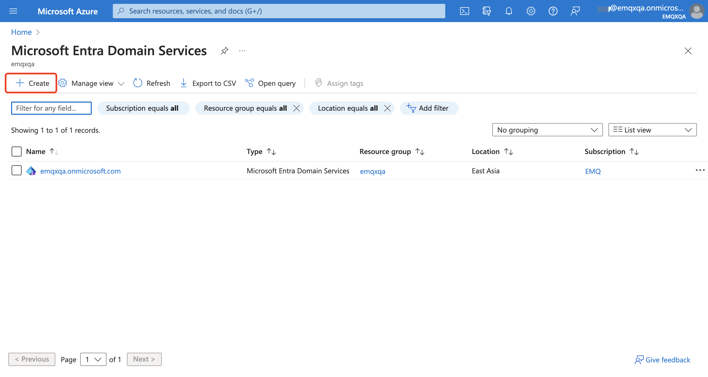
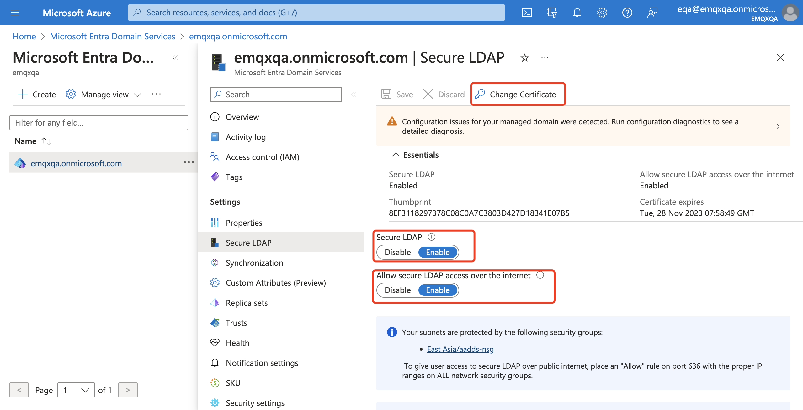
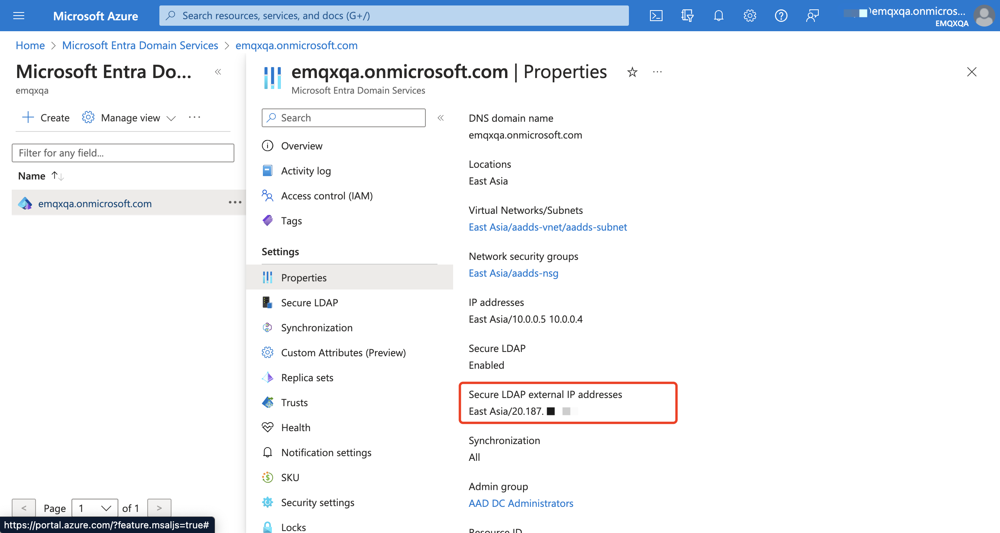
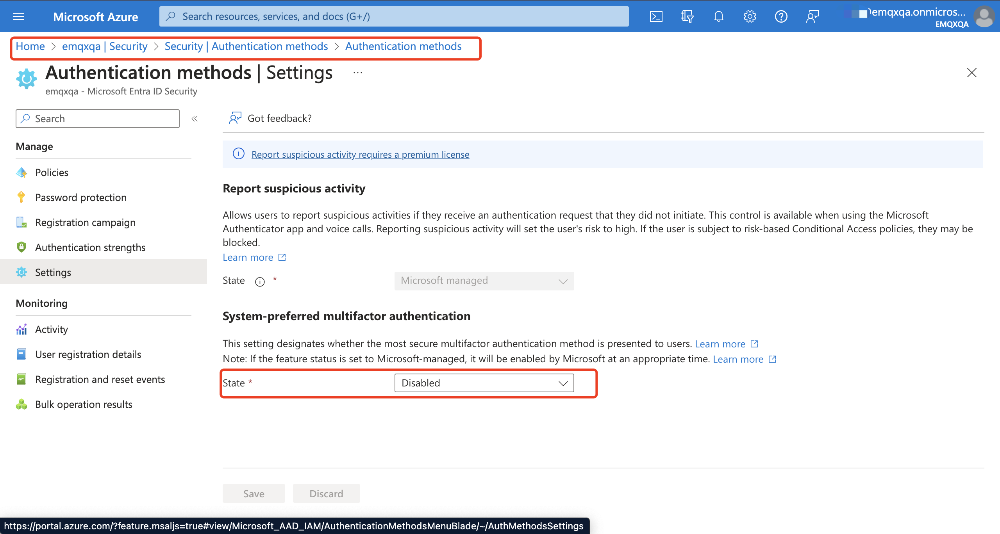
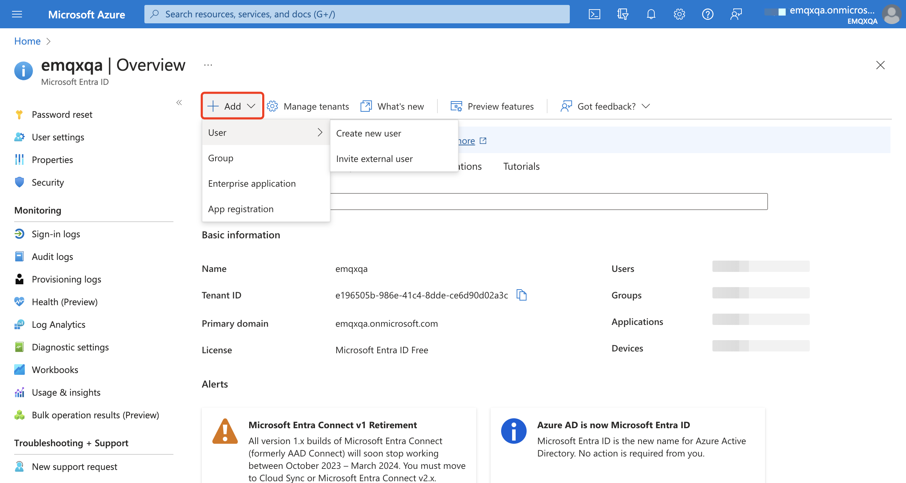
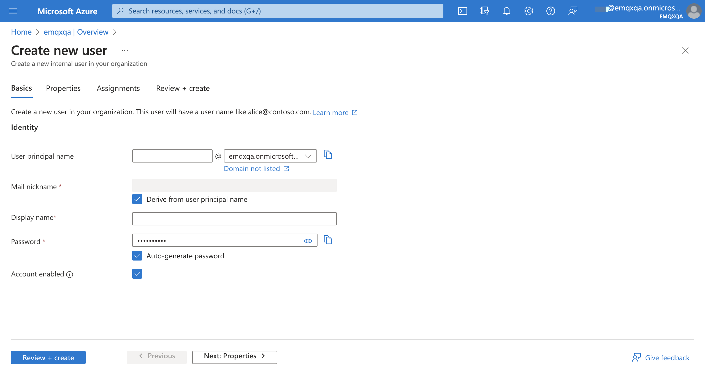
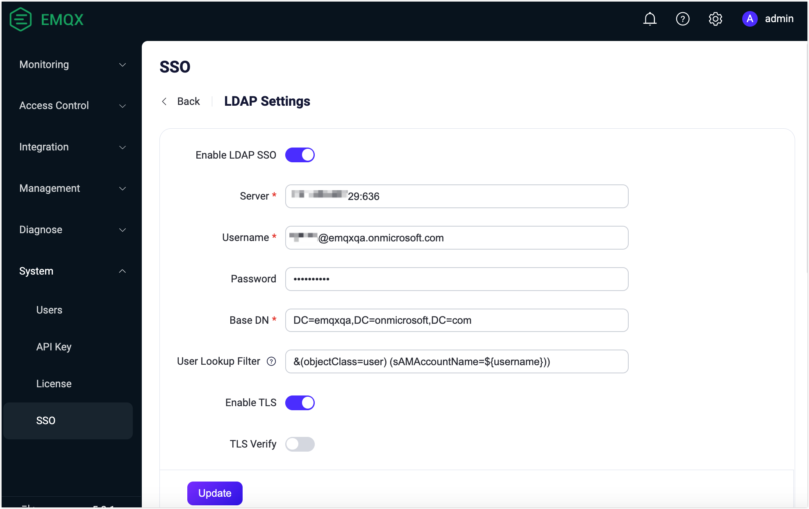
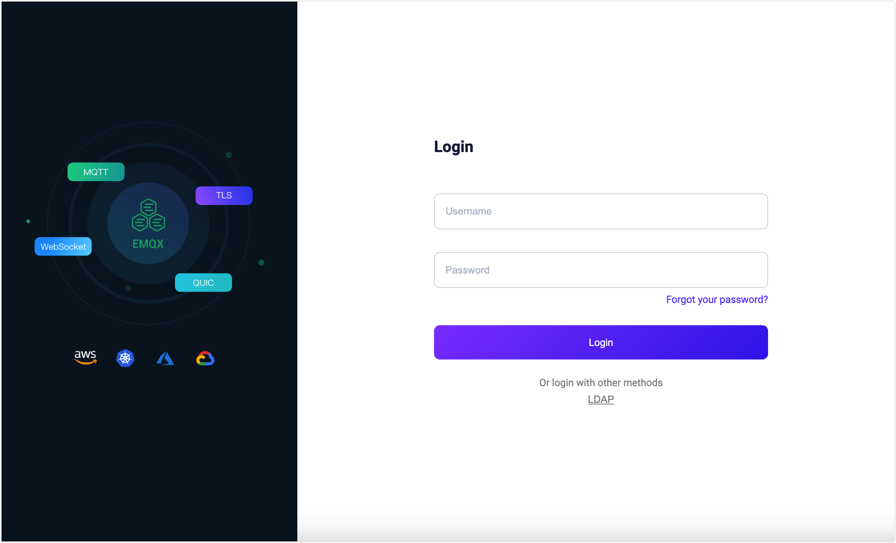
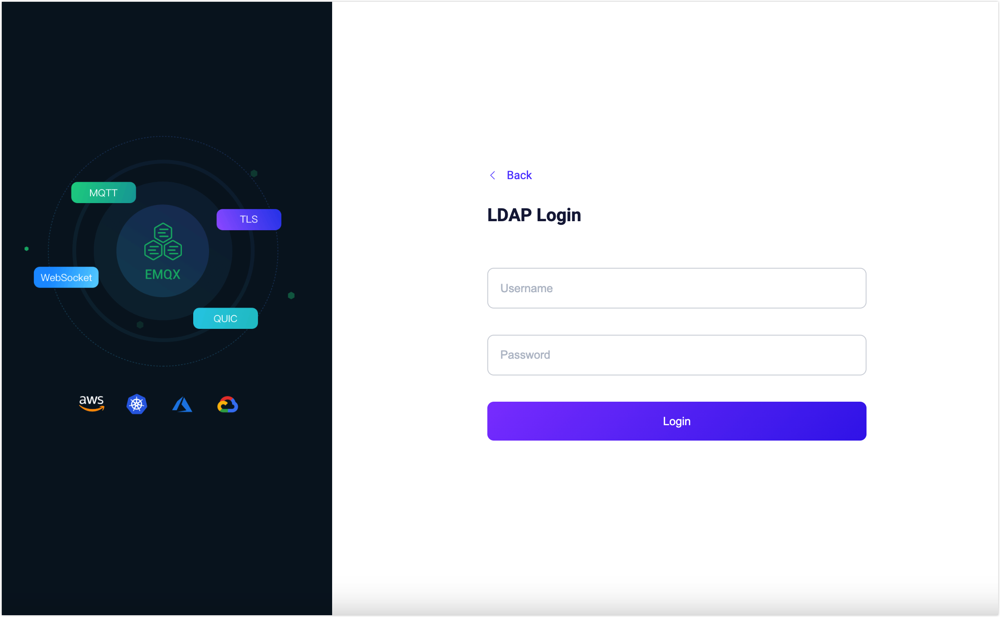

# Configure OpenLDAP and Microsoft Entra ID SSO

This page explains configuring and using Single Sign-On (SSO) based on the Lightweight Directory Access Protocol (LDAP).

EMQX implements the LDAP-based SSO by integrating the directory services that support the LDAPv3 protocol with the EMQX Dashboard. The currently supported directory service providers are:

- [OpenLDAP](https://www.openldap.org/)
- [Microsoft Entra ID（previous Azure AD）](https://azure.microsoft.com/en-in/products/active-directory)

::: tip Prerequisite

Be familiar with the basic concepts of [Single Sign-On (SSO)](./sso.md).

:::

## Configure OpenLDAP SSO

This section guides you on how to enable and configure the OpenLDAP SSO in the EMQX Dashboard.

1. Go to Dashboard, and click **System Settings** -> **Single Sign-On** from the left navigation menu.

2. Select the **LDAP** option and click the **Enable** button.

3. On the **LDAP Settings** page, enter the configuration information.

   | Option             | Description                                                  |
   | ------------------ | ------------------------------------------------------------ |
   | Server             | The address of the OpenLDAP server, for example, `localhost:389`. |
   | Username           | The Bind DN to access the OpenLDAP server.                   |
   | Password           | The user password to access the OpenLDAP server.             |
   | Base DN            | The name of the base object entry (or possibly the root) of the OpenLDAP directory, the starting point for performing user searches. |
   | User Lookup Filter | The filter in OpenLDAP that matches users. In the LDAP user query condition, the system will automatically replace `${username}` with the actual input username for user matching. For standard LDAP, the default filter is `(&(objectClass=person)(uid=${username}))`. This variable replacement mechanism allows you to construct query filters flexibly based on different user attributes for username queries and matching. For more information on the condition format, see [LDAP Filters](https://ldap.com/ldap-filters/). |
   | Enable TLS         | The option for enabling a TLS secure transmission for OpenLDAP access. If enabled, certificate configuration is required. You can refer to [TLS for External Resource Access](../network/overview.md#tls-for-external-resource-access) for details on how to enable TLS. |

4. Click the **Update** button to save the configuration.

Now the OpenLDAP SSO is enabled and you can refer to [Log in and User Management](#login-and-user-management) to learn how to log in to the Dashboard using the LDAP option. 

## Configure Microsoft Entra ID SSO

This section guides you on how to enable and configure the Microsoft Entra ID SSO in the EMQX Dashboard.

### Configure Microsoft Entra ID Instance

Before you configure the Microsoft Extra ID SSO in the Dashboard, you need to follow the instructions in this section to get the basic LDAP server information by configuring the Microsoft Entry ID instance.

1. Sign in to [Azure Portal](https://portal.azure.com). Create Microsoft Entra Domain Service by following the instructions in [this tutorial](https://learn.microsoft.com/en-us/entra/identity/domain-services/tutorial-create-instance).

   

2. Enable a secure LDAP connection. In the created Microsoft Entra Domain Service, click **Secure LDAP** from the **Settings** menu on the left. 

   - Enable **Secure LDAP** and **Allow secure LDAP access over the internet** toggle switches. 
   - Change the certificate and configure the network security group according to the instructions on the page to ensure that EMQX can access the Microsoft Entra Domain Service instance.

   

3. In your domain service, click **Setting** ->**Properties** to get the **Secure LDAP external IP addresses**. Save it as the actual IP address of the LDAP server to which EMQX connects.

   

4. Create a new Entra ID tenant by following the instructions in [this document](https://learn.microsoft.com/en-in/entra/fundamentals/create-new-tenant).

5. To configure SSO with Microsoft Entra ID in EMQX, you need to disable multifactor authentication. In the Entra ID instance, go to the **Security** -> **Authentication Methods** -> **Settings** page, and disable **System-preferred multifactor authentication**.

   

6. In the Entra ID instance, go to the **Overview** page, and click **Add** -> **Users** -> **Create User** to add users. You need to add at least 2 users: one for connecting to Entra ID, and another for EMQX Dashboard login. After adding users, they must log in at least once in Microsoft Entra ID and change the default password before they can use SSO to log in to the Dashboard.

   

   

### Configure Microsoft Entra ID SSO in Dashboard

1. Go to Dashboard, and click **System Settings** -> **Single Sign-On** from the left navigation menu.

2. Select the **LDAP** option and click the **Enable** button.

3. On the **LDAP Settings** page, enter the basic information of the LDAP server. 
   - **Service**: Enter `ip:port`, where IP is the secure LDAP external IP address of Microsoft Entra ID, and the port is for encrypted LDAP `636`.

   - **Username**, **Password**: Enter the user created in Entra ID for connecting to Entra ID and their password.

   - **Base DN**: Fill in according to the domain name of the Microsoft Entra Domain Service, for example, `emqxqa.onmicrosoft.com` should be filled as `DC=emqxqa,DC=onmicrosoft,DC=com`. You can add other attributes to restrict users to a specific department or group.

   - **User Query Condition**: For Microsoft Entra ID, the default filter is `(&(objectClass=user)(sAMAccountName=${username}))`, which means logging in using the account name (email). You can replace `sAMAccountName` with `mail` to use the email address for login.

   - Here, you are using IP address + secure LDAP direct access, so you need to click **Enable TLS** and disable **Verify Server Certificate**.

     

4. Click the **Update** button to save the configuration. 

Now the Microsoft Entra ID SSO is enabled and you can refer to [Log in and User Management](#login-and-user-management) to learn how to log in to the Dashboard using the LDAP option. 

## Login and User Management

After enabling LDAP-based SSO, the EMQX Dashboard will display the LDAP SSO option on the login page. Click the **LDAP** button, enter the LDAP credentials assigned to the user (e.g., username and password), and click the **Login** button.

After successfully authenticating with LDAP, EMQX will automatically add a Dashboard user, which you can manage in [Users](./system.md#users), such as assigning roles and permissions.

## Logout

Users can click their username in the top navigation bar of the Dashboard and then click the **Logout** button in the dropdown menu to log out.
