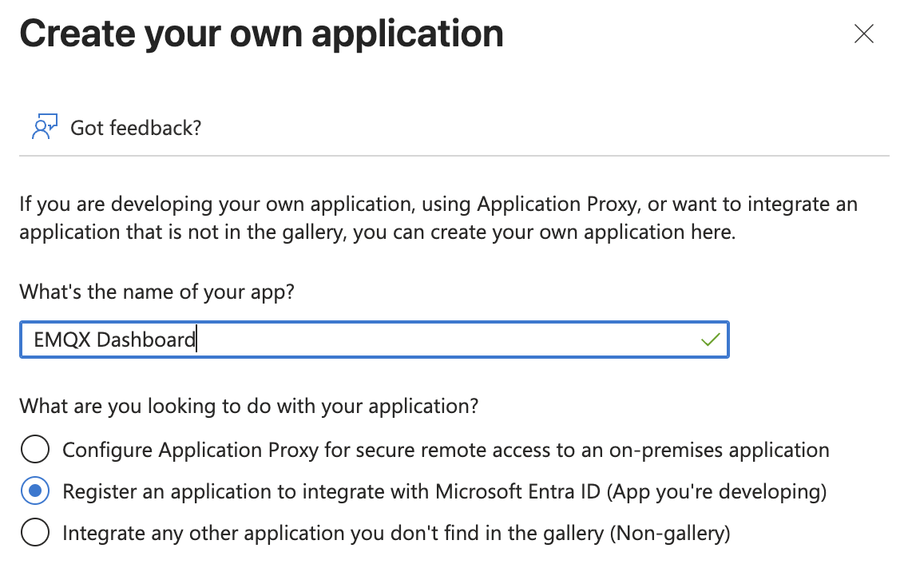

# Configure OIDC-Based SSO

This page explains how to configure and use Single Sign-On (SSO) based on the OpenID Connect (OIDC) protocol.

::: tip Prerequisite

Be familiar with the basic concepts of [Single Sign-On (SSO)](./sso.md).

:::

## Supported OIDC provider

The EMQX Dashboard can integrate with identity services that support the OIDC protocol to enable OIDC-based SSO, such as:

- [Microsoft Entra ID](https://www.microsoft.com/en-us/security/business/identity-access/microsoft-entra-id)
- [Okta](https://www.okta.com/)

## Configure SSO by Integrating with Microsoft Entra ID

This section guides you on how to use Microsoft Entra ID as an Identity Provider (IdP) and configure SSO. You need to complete configurations on both the Microsoft and EMQX Dashboard sides.

### Step 1: Enable OIDC in the EMQX Dashboard

1. In the EMQX Dashboard, navigate to **System** -> **SSO**.
2. Click the **Enable** button on the **OIDC** card.

### Step 2: Register an Application to Integrate with Microsoft Entra ID

1. Log in to the [MS Azure Portal](https://portal.azure.com/) as an administrator.

2. Go to **Microsoft Entra ID** -> **Enterprise Applications** -> **New Application** and click **Create your own application**.

   

3. Enter the application name, for example, `EMQX Dashboard`, select **Register an application to integrate with Microsoft Entra ID (App you're developing)**, and click **Create**.

   

4. On the **Register an application** page, select which account types you want to be supported, and configure **Redirect URL** using the information provided by the EMQX Dashboard in **Step 1**:

   - **Redirect URL**: Select `Web` and enter the **Sign-in Redirect URI** provided in the Dashboard, such as `http://localhost:18083/api/v5/sso/oidc/callback`.

5. Go to **Certificates and Secrets** -> **Client secrets** tab, click **New client secret**, enter a description, select an expiration period, and click **Add**. Copy the generated secret value, as you will need it in **Step 3**.

### Step 3: Complete the EMQX Dashboard Configuration

1. On the configuration page, enter the following information:
   - **Provider**: Leave `Generic`.

   - **Issuer URL**: This corresponds to **OpenID Connect metadata document**, which you can find in the **Endpoints** tab of application overview page in **Step 2**, but without `/.well-known/openid-configuration` part because EMQX adds this automatically, e.g.`https://login.microsoftonline.com/<tenant_id>/v2.0`, where `<tenant_id>` is your Directory (tenant) ID.

   - **Client ID**: This corresponds to **Application (client) ID** found on the application overview page in **Step 2**.

     

   - **Client Secret**: Use the secret value generated in **Step 2**.

   - **Dashboard Address**: Enter the base URL where users can access the Dashboard, such as `http://localhost:18083`. This address will be automatically combined to generate the **SSO Address** and **Metadata Address** for configuration on the IdP side.

     

2. Click **Update** to finish the configuration.

## Configure SSO by Integrating with Okta

This section guides you on how to use Okta as an Identity Provider (IdP) and configure SSO. You need to complete configurations on both the Okta and EMQX Dashboard sides.

### Step 1: Enable OIDC in the EMQX Dashboard

1. In the EMQX Dashboard, navigate to **System** -> **SSO**.
2. Click the **Enable** button on the **OIDC** card.

### Step 2: Add an OIDC Application to Okta's Application Catalog

1. Log in to Okta as an administrator and go to the **Okta Admin Console**.

2. Go to the **Applications** -> **Applications** page, click the **Create App integration** button, and select `OIDC - OpenID Connect` as the sign-in method in the pop-up dialog.

3. Select the `Web Application` as the **Application type** and click **Next**.

4. On the **General Settings** tab, enter your application name, for example, `EMQX Dashboard`. Click **Next**.

5. On the **LOGIN** tab, configure the settings using the information provided by the EMQX Dashboard:

   - **Sign-in redirect URIs**: Enter the **Sign-in Redirect URI** provided in the Dashboard (on **OIDC Settings** page), such as `http://localhost:18083/api/v5/sso/oidc/callback`.
   - Additional settings are optional and can be configured according to your specific requirements.

6. Review the settings and click **Save**.

For more detailed instructions, refer to the [Okta documentation](https://help.okta.com/en-us/content/topics/apps/apps_app_integration_wizard_oidc.htm).

### Step 3: Complete the EMQX Dashboard Configuration

1. On the **OIDC Settings** page, enter the following information:
   - **Force MFA**: Optionally enable this to require all users from this backend to complete TOTP verification at login. Disabled by default. For details, see [Forced MFA for SSO Users](../multi-factor-authn/multi-factor-authentication.md#forced-mfa-for-sso-users).
   - **Provider**: Choose `Okta` or select `Generic` for other providers.
   - **Issuer URL**: This is the URL of your Okta authorization server, e.g., `https://example-org.okta.com`.
   - **Client ID**: Copy it from the application created in **Step 2**.
   - **Client Secret**: Copy it from the application created in **Step 2**.
   - **Dashboard Address**: Enter the base URL where users can access the Dashboard, such as `http://localhost:18083`. This address will be automatically combined to generate the **SSO Address** and **Metadata Address** for configuration on the IdP side.
2. Click **Update** to finish the configuration.

## Advanced Settings

The **Advanced Settings** section allows you to fine-tune how EMQX retrieves user information from the OIDC provider and manages authentication behavior.

| Field name                           | Description                                                  | Default value                                       |
| ------------------------------------ | ------------------------------------------------------------ | --------------------------------------------------- |
| **Scopes**                           | The OIDC scopes requested during authentication. These scopes determine which user information the IdP returns. At minimum, the `openid` scope is required for OIDC authentication. | `openid`                                            |
| **Name Variable**                    | A template used to map OIDC user attributes to the EMQX Dashboard username. The template can reference claims returned by the IdP. | `${sub}`                                            |
| **Name Variable Source**             | Specifies the source from which the user information is extracted to construct the Dashboard username. Available options: **User Info Endpoint**: Uses the user information returned from the `/userinfo` endpoint. **ID Token**: Uses the claims contained in the ID token returned during authentication. | `User Info Endpoint`                                |
| **Role Source**             | Specifies the source from which the user information is extracted to construct the Dashboard user's role. Available options: **User Info Endpoint**: Uses the user information returned from the `/userinfo` endpoint. **ID Token**: Uses the claims contained in the ID token returned during authentication. | `User Info Endpoint`                                |
| **Role Expression**                    | A [`jq`](https://jqlang.org/manual/) expression used to map OIDC user attributes to the EMQX Dashboard user role. The program can reference claims returned by the IdP. The expression must return exactly one string, representing a valid role. Supported roles are:   `"viewer"`   `"administrator"`  If the result is anything else, the user will not be created. If this field is not set, EMQX creates the user with the viewer role, or keeps the existing role if the user already exists. | Not set                                      |
| **Namespace Source**             | Specifies the source from which the user information is extracted to construct the Dashboard user's multi-tenancy namespace. Available options: **User Info Endpoint**: Uses the user information returned from the `/userinfo` endpoint. **ID Token**: Uses the claims contained in the ID token returned during authentication. | `User Info Endpoint`                                |
| **Namespace Expression**                    | A [jq](https://jqlang.org/manual/) expression used to map OIDC user attributes to the EMQX Dashboard user namespace. The expression can reference claims returned by the IdP and must return exactly one value: either a string naming an existing namespace or null for the global namespace. Any other result prevents the user from being created. If this field is not set, EMQX places the user in the global namespace or keeps the existing namespace if the user already exists. | Not set                                       |
| **Session Expiry**                   | The duration (in seconds) for which the Dashboard session remains valid after the user logs in via OIDC. | `30` seconds                                        |
| **Enable PKCE**                      | Enables Proof Key for Code Exchange (PKCE) to enhance security for the authorization code flow. | Disabled                                            |
| **Preferred Authentication Methods** | Defines the client authentication methods used when communicating with the token endpoint. Multiple methods can be configured and will be attempted in order. | `client_secret_post`, `client_secret_basic`, `none` |
| **Fallback Methods**                 | Specifies the fallback signing algorithms used to verify ID Tokens when the provider metadata does not explicitly define them. | `RS256`                                             |
| **JSON Web Key (JWK)**               | Optional static JSON Web Key configuration used to verify token signatures if the IdP does not provide a JWKS endpoint. | `None`                                              |

## Login and User Management

After enabling OIDC SSO, the EMQX Dashboard will display the SSO option on the login page. Click the **OIDC** button to go to the OIDC provider preset login page, where you can enter the credentials assigned to the user for login.

After successful authentication, EMQX will automatically add a Dashboard user, which you can manage in [Users](./system.md#users), such as assigning roles and permissions. To require OIDC users to complete a TOTP second factor at login, see [Forced MFA for SSO Users](../multi-factor-authn/multi-factor-authentication.md#forced-mfa-for-sso-users).

## Logout

Users can click their username in the top navigation bar of the Dashboard and then click the **Logout** button in the dropdown menu to log out. Please note that this only logs you out of the Dashboard.
