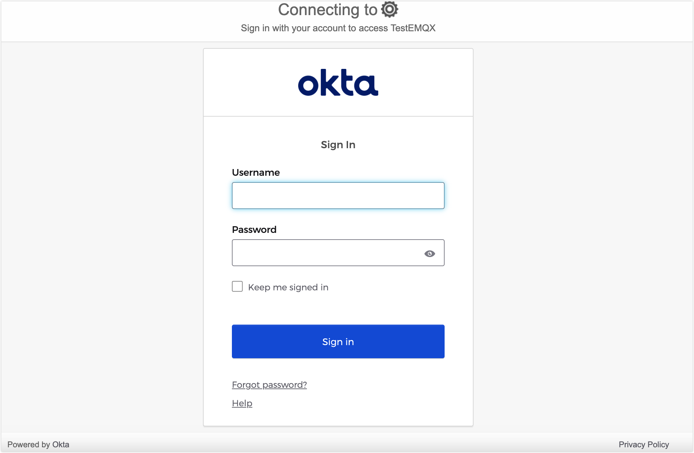

# Configure OIDC-Based SSO

This page explains how to configure and use Single Sign-On (SSO) based on the OpenID Connect(OIDC) protocol.

::: Prerequisite

Be familiar with the basic concepts of [Single Sign-On (SSO)](./sso.md).

:::

## Supported OIDC provider

The EMQX Dashboard can integrate with identity services that support the OIDC protocol to enable OIDC-based single sign-on, such as:

- [Okta](https://www.okta.com/)

## Configure SSO by Integrating with Okta 

This section guides you on how to use Okta as an Identity Provider (IdP) and configure SSO. You need to complete configurations on both the Okta and EMQX Dashboard sides.

### Step 1: Add a OIDC Application in Okta's Application Catalog

1. Log in to Okta as an administrator and go to the **Okta Admin Console**.

2. Go to the **Applications -> Applications** page, click the **Create App integration** button, and select `OIDC - OpenID Connect` as the sign-in method in the pop-up dialog.

3. Select the `Web Application` as the `Application tyee` and then click **Next**.

4. On the **General Settings** tab, enter your application name, for example, `EMQX Dashboard`. Click **Next**.

5. On the **LOGIN** tab, configure the information provided in Dashboard in Step 2:

   - **Sign-in redirect URIs**: Enter the **Sign-in Redirect URI** provided in Dashboard, for example, `http://localhost:18083/api/v5/sso/oidc/callback`.

   Since this URI depends on **Step 2**, you can also re-edit it after you complete **Step 2**.
  
   Other information is optional and can be configured based on your actual requirements.

6. Review the settings and click **Save**.

For more details, you can take a look at the [Okta document](https://help.okta.com/en-us/content/topics/apps/apps_app_integration_wizard_oidc.htm).

### Step 2: Enable OIDC in EMQX Dashboard

1. Go to **System** -> **SSO** in the Dashboard.
2. Select the **OIDC** option and click the **Enable** button.
3. On the configuration page, enter the following information:
   - **Provider**: Select `Okta` or `Generic` for others
   - **Issuer URL**: this is the address of your authorization server in Okta, for example: `https://example-org.okta.com`
   - **Client ID**: Copy it from the application created in `step 1`
   - **Client Secret**: Copy it from the application created in `step 1`
   - **Dashboard Address**: Ensure users can access the actual access address of the Dashboard, without specifying a specific path. For example, `http://localhost:18083`. This address will be automatically concatenated to generate the **SSO Address** and **Metadata Address** for IdP-side configuration.

## Login and User Management

After enabling OIDC Single Sign-On, the EMQX Dashboard will display the Single Sign-On option on the login page. Click the **OIDC** button to go to the OIDC provider preset login page, where you can enter the credentials assigned to the user for login.

After successful authentication, EMQX will automatically add a Dashboard user, which you can manage in [Users](./system.md#users), such as assigning roles and permissions.

## Logout

Users can click their username in the top navigation bar of the Dashboard and then click the **Logout** button in the dropdown menu to log out. Please note that this only logs you out of the Dashboard.
