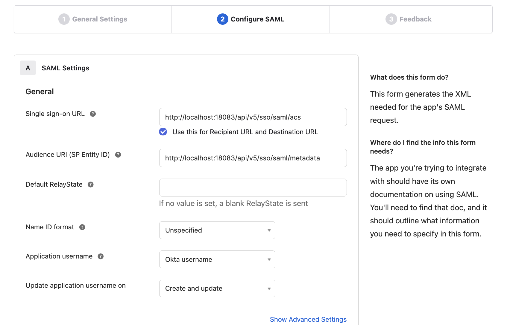
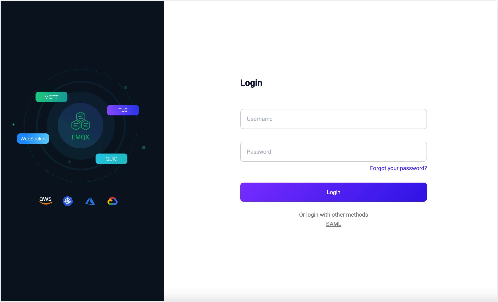
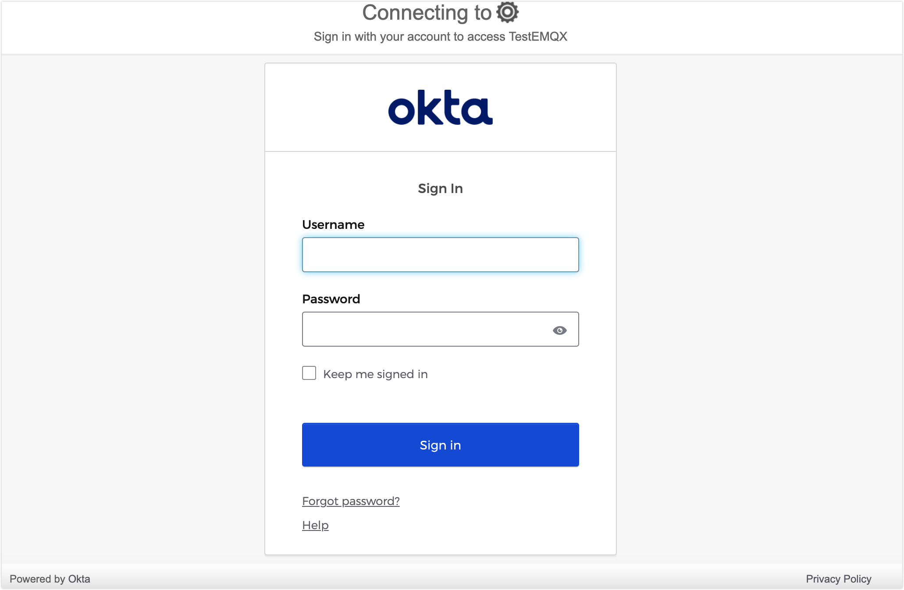

# Configure SAML-Based SSO

This page explains how to configure and use Single Sign-On (SSO) based on the Security Assertion Markup Language (SAML) 2.0 standard protocol.

::: Prerequisite

Be familiar with the basic concepts of [Single Sign-On (SSO)](./sso.md).

:::

## Supported SAML Services

The EMQX Dashboard can integrate with identity services that support the SAML 2.0 protocol to enable SAML-based single sign-on, such as:

- [Okta](https://www.okta.com/)
- [OneLogin](https://www.onelogin.com/)

Other identity providers are in the process of integration and will be supported in future versions.

## Configure SSO by Integrating with Okta 

This section guides you on how to use Okta as an Identity Provider (IdP) and configure SSO. You need to complete configurations on both the Okta and EMQX Dashboard sides.

### Step 1: Enable Okta in EMQX Dashboard

1. Go to **System** -> **SSO** in the Dashboard.
2. Select the **SAML 2.0** option and click the **Enable** button.
3. On the configuration page, enter the following information:
   - **Dashboard Address**: Ensure users can access the actual access address of the Dashboard, without specifying a specific path. For example, `http://localhost:18083`. This address will be automatically concatenated to generate the **SSO Address** and **Metadata Address** for IdP-side configuration.
   - **SAML Metadata URL**: Leave it temporarily blank and wait for Step 2 configuration.
### Step 2: Add a SAML 2.0 Application in Okta's Application Catalog

1. Log in to Okta as an administrator and go to the **Okta Admin Console**.

2. Go to the **Applications -> Applications** page, click the **Create App integration** button, and select `SAML 2.0` as the sign-in method in the pop-up dialog, then click **Next**.

3. On the **General Settings** tab, enter your application name, for example, `EMQX Dashboard`. Click **Next**.

4. On the **Configure SAML** tab, configure the information provided in Dashboard in Step 1:

   - **Single sign-on URL**: Enter the **SSO Address** provided in Dashboard, for example, `http://localhost:18083/api/v5/sso/saml/acs`.
   - **Audience URI (SP Entity ID)**: Enter the **Metadata Address** provided in Dashboard, for example, `http://localhost:18083/api/v5/sso/saml/metadata`.

   Other information is optional and can be configured based on your actual requirements.

5. Review the settings and click **Next**.

6. On the **Feedback** tab, select **I'm an Okta customer adding an internal app**, fill in other information as needed, and click **Finish** to complete the application creation.

### Step 3: Complete Configuration and Assign Users and Groups in Okta

1. In Okta, go to the **Sign On** tab and copy the **Metadata URL**.
2. In the Dashboard, paste the copied **Metadata URL** into the **SAML Metadata URL** in Step 1 and click **Update**.
3. In the **Okta > Assignments** tab, you can now assign users and groups to the EMQX Dashboard application. Only users assigned here can log in to this application.

## Login and User Management

After enabling SAML Single Sign-On, the EMQX Dashboard will display the Single Sign-On option on the login page. Click the **SAML** button to go to the IdP preset login page, where you can enter the credentials assigned to the user for login.

After successful SAML authentication, EMQX will automatically add a Dashboard user, which you can manage in [Users](./system.md#users), such as assigning roles and permissions.

## Logout

Users can click their username in the top navigation bar of the Dashboard and then click the **Logout** button in the dropdown menu to log out. Please note that this only logs you out of the Dashboard, and SAML does not currently support Single Sign-Out.
