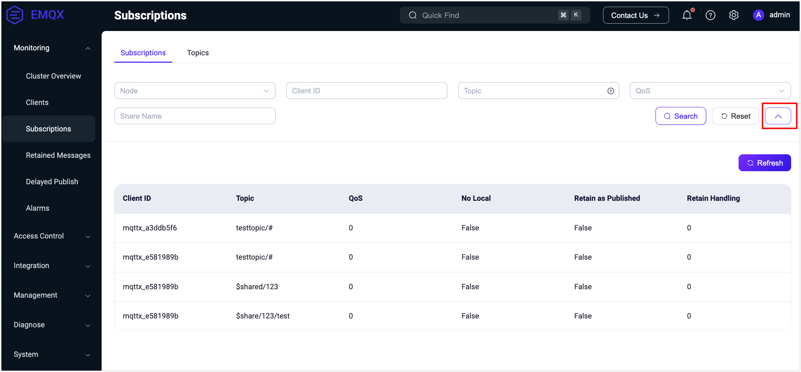
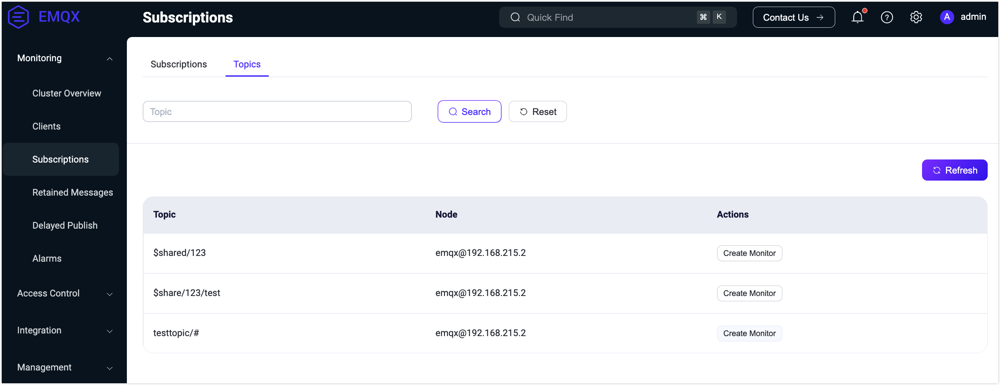

# Subscription Management

This page describes how to view client subscriptions and topics connected to EMQX in the EMQX Dashboard.

## Subscriptions

The Subscriptions page displays all topics subscribed by connections, mapped by client ID and topic. It provides basic information about each subscription, including client ID, topic, and QoS. Additionally, the list includes new subscription features supported in MQTT v5:

- **No Local**: In MQTT v3.1.1, if you subscribe to a topic where you also publish messages, you will receive all your own messages. In MQTT v5, setting this option to `1` prevents the server from forwarding your own published messages back to you.
- **Retain as Published**: This option specifies whether the server should retain the RETAIN flag when forwarding messages to the client. Note that this does not affect the RETAIN flag in retained messages. Therefore, when Retain As Publish is set to `0`, the client relies solely on the RETAIN flag in the message to determine if it is a normal published message or a retained message.
- **Retain Handling**: This option specifies when the server should send retained messages to the client upon subscription:
  - Retain Handling equals 0: The server sends retained messages as soon as the client subscribes successfully.
  - Retain Handling equals 1: The server sends retained messages only if this subscription did not exist before.
  - Retain Handling equals 2: The server does not send retained messages to the client, regardless of the subscription status.

The top search bar by default displays 3 filter fields: Node, Client ID, and Topic. Node is a dropdown selection box that allows filtering subscriptions by clients connected to specific nodes. You can use Client ID and Topic for fuzzy searching in the subscription list. Clicking the right arrow button next to the search bar also displays QoS and Shared Name filter input boxes, supporting precise matching for [Shared Name](../../messaging/mqtt-shared-subscription.md).

## Topics

The Topics page displays all topics subscribed by connections across various nodes, handling deduplication for the same topic subscribed by different connections within the same node. Users can perform fuzzy searches to filter the list based on topics.

> Note: The Subscription List is client-specific, whereas the Topics List shows all currently subscribed topics. The same topic may be subscribed to by different clients.

Clicking **Create Monitor** in the **Actions** column redirects to the **Diagnose** -> **Topic Metrics** page. Here, you can create [Topic Metrics](../observability/topic-metrics.md) to track message counts, rates, and other metrics for a specific topic.

