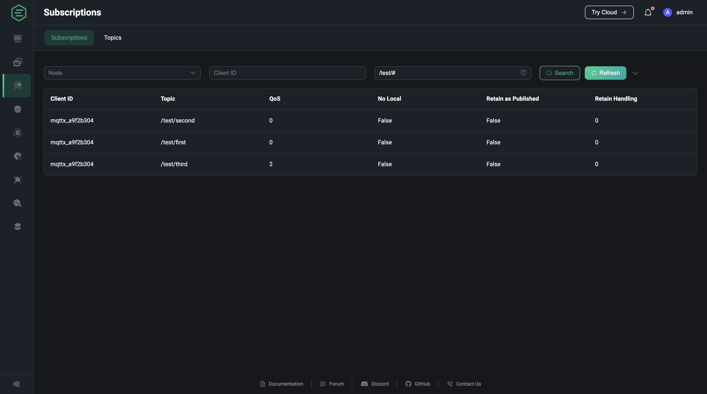

# Subscriptions

The subscriptions page shows the topics and basic information about subscriptions for all connections based on the client ID - topic mapping. In addition to the client ID, topic and QoS, the list also provides information about the new subscription features supported by MQTT v5

- `No Local`: In the MQTT v3.1.1, if you subscribe to the topic published by yourself, you will receive all messages that you published. However, in the MQTT v5, if you set this option as 1 when subscribing, the server will not forward the message you published to you.
- `Retain as Published`: This option is used to specify whether the server retains the RETAIN mark when forwarding messages to the client, and this option does not affect the RETAIN mark in the retained message. Therefore, when the option Retain As Publish is set to 0, the client will directly distinguish whether this is a normal forwarded message or a retained message according to the RETAIN mark in the message, instead of judging whether this message is the first received after subscribing(the forwarded message may be sent before the retained message, which depends on the specific implementation of different brokers).
- `Retain Handling`: This option is used to specify whether the server forwards the retained message to the client when establishing a subscription.
  
  - Retain Handling is equal to 0, as long as the client successfully subscribes, the server will send the retained message.
  - Retain Handling is equal to 1, if the client successfully subscribes and this subscription does not exist previously, the server sends the retained message. After all, sometimes the client re-initiate the subscription just to change the QoS, but it does not mean that it wants to receive the reserved messages again.
  - Retain Handling is equal to 2, even if the client successfully subscribes, the server does not send the retained message.

By default, the search field displays three filtered search fields: Node, Client ID and Topic, where Node is a drop-down selection box that allows you to check the subscriptions of the connection of the node you need to view or do a fuzzy search of the subscription list using Client ID and Topic; clicking the arrow button on the right side of the search field will also display the QoS and Shared Name filter input boxes, [Shared Name](../../advanced/shared-subscriptions.md#shared-subscriptions-in-group) is supported as an exact match.

