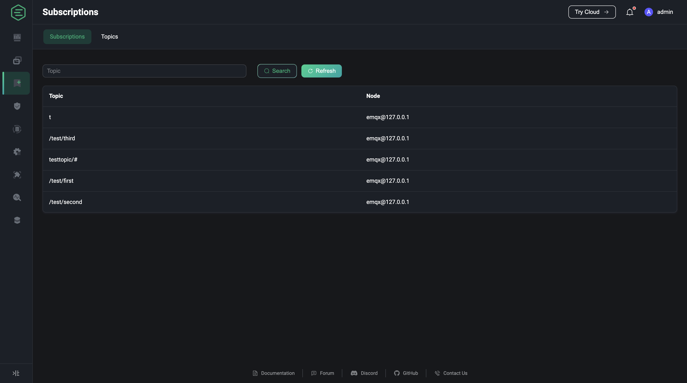

# Topics

The list of topics page shows the topics subscribed to by all connections in each node according to the topic-node mapping relationship, if different connections in the same node subscribe to the same topic, the list will be de-duplicated; users can filter the list with a fuzzy search based on the topic.

> Note: Subscription lists are differentiated by client, while topics are all currently subscribed topics, and the same topics may be included in different clients.

