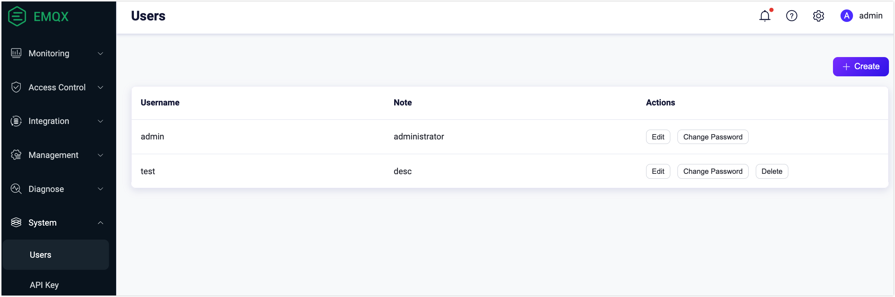
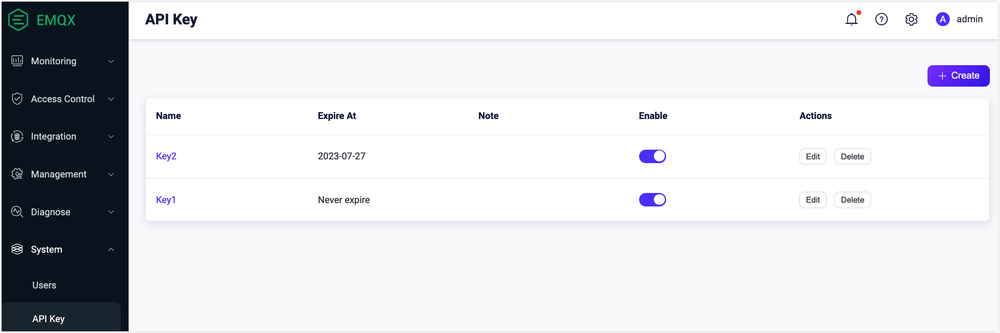
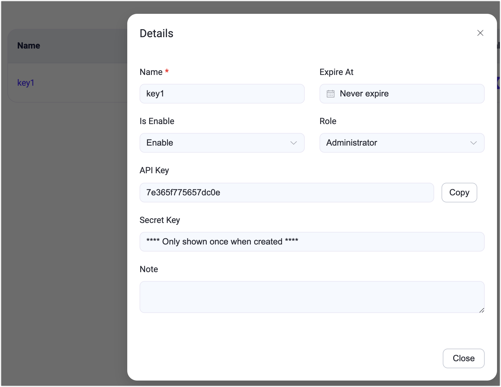
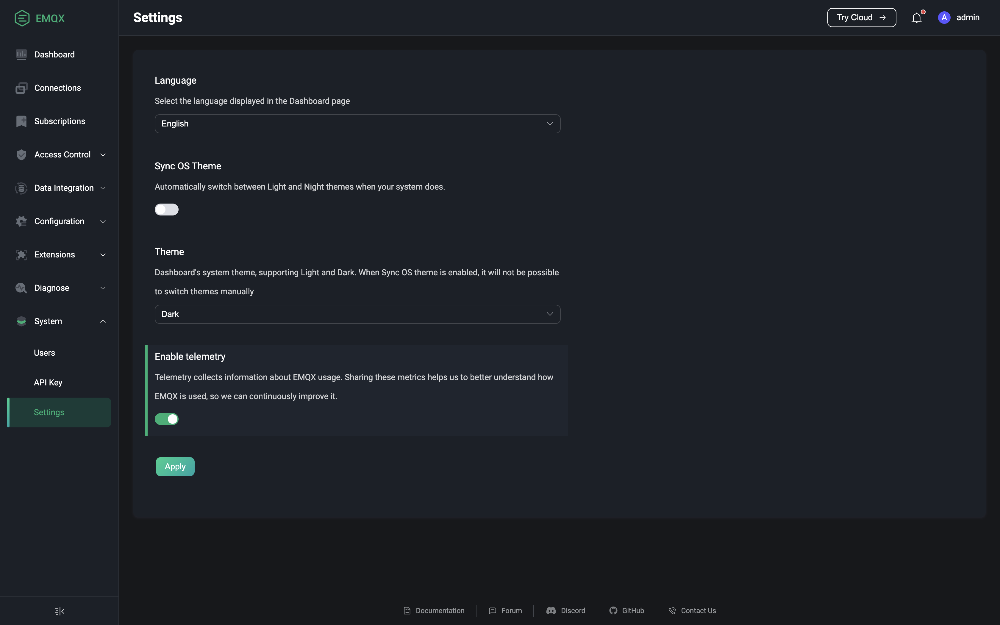

# System

To add or remove user accounts that can be used to log in to Dashboard, to obtain API keys that can be used to authenticate to create script calls to the HTTP API, and to modify the theme and language of Dashboard, you can use the System module to do so.

## Users

Clicking on Users under the System menu on the left will take you to the Users page. The user page displays a list of all current users who can log in to Dashboard, including users created using [CLI](../admin/cli.md). Click on the `Create` button in the top right corner of the page to open the Create User pop-up box, fill in the user information and click on the `Create` button to submit the data. Users that are successfully submitted will be added to the list of users. Users that are successfully added can have their passwords changed or their notes changed on the page; users that are no longer required can be deleted on the page.

> All users have admin rights to delete other users, but you cannot delete the currently logged in user on the Dashboard.

## API Keys

Click on API Keys under the System menu on the left to go to the API Keys page. If you need an API key to create some scripts to call the [HTTP API](../admin/api.md), you can create and obtain one from this page. Click the `Create` button on the top right corner of the page to open the Create API key pop-up box, fill in the API key related data, if the `Expire At` is not filled in the API key will never expire, click `OK` to submit the data, the API Key and Secret Key of the API key created will be provided on the page after successful submission, **where the Secret Key will not be shown later**. The user needs to save the API Key and Secret Key to a safe place immediately; when finished saving the data, click the `Close` button to close the pop-up box.

Click on the API key name to view the key details; click on the `Edit` button to reset the expiration time, enable status and notes of the API key, and extend the availability of the API key here if it has expired. If an API key is no longer needed, you can delete it by clicking the `Remove` button on the right side of the API key.

## Settings

The Settings page can be accessed by clicking on the System menu on the left or under the username drop-down menu in the top right corner of the page. You can change the language and theme color of the Dashboard on the settings page, the theme color can be selected if you want to synchronize the OS theme, if this is enabled, the Dashboard theme will be automatically synchronize with the user's OS theme and cannot be selected manually. If telemetry is enabled, users will share usage information with EMQX to help the EMQX development team understand how users are using EMQX and to continuously improve the product.

