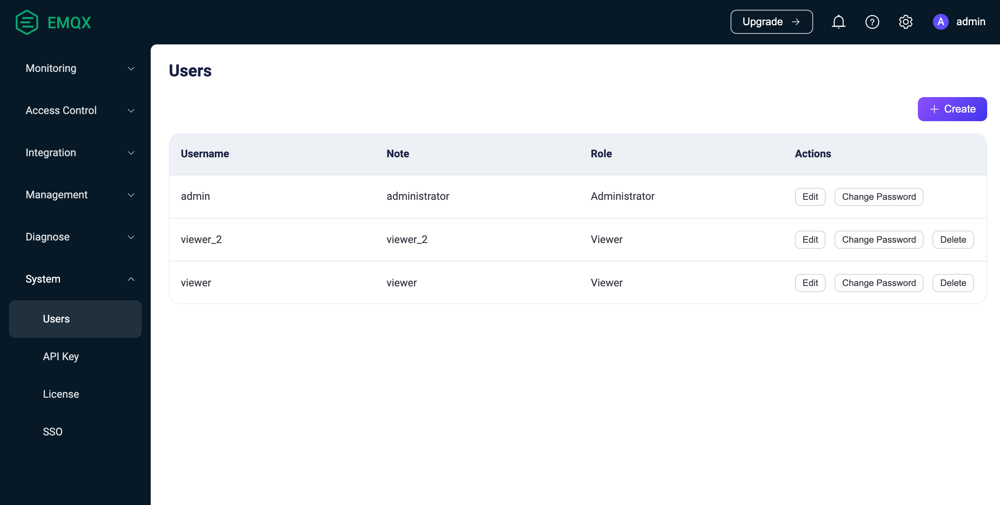
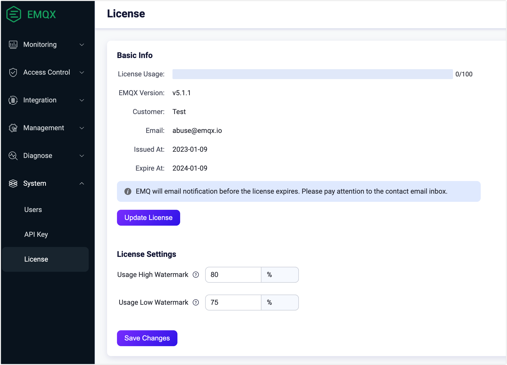
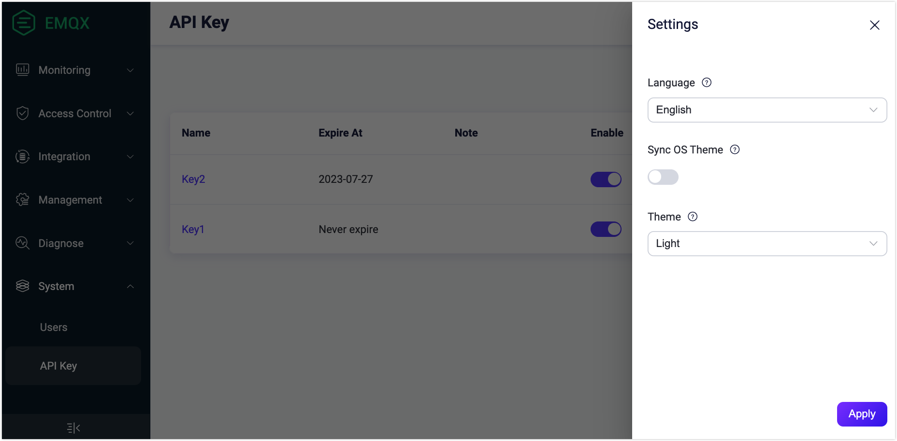

# System

The EMQX Dashboard's **System** menu includes submenus for **Users**, **API Key**, **License**, and **SSO**. Each of these submenus allows you to efficiently manage and configure user accounts, API keys, license settings, and single sign-on (SSO) configurations on their respective pages.

::: tip

The License and SSO features are only available in the EMQX Enterprise edition.

:::

## Users

The **Users** page provides an overview of all active Dashboard users, including those generated via the [CLI](../admin/cli.md).

To add new users, click the + Create button in the page's top-right corner. A pop-up dialog will appear, prompting you to input the necessary user details. Once entered, click the **Create** button to generate the user account. You can easily access these options through the Actions column for further user management, such as editing users, updating passwords, or deleting users' information.

> The EMQX Open Source edition does not provide role-based access control (RBAC). All users have administrator permissions and can delete other users, but they cannot delete the currently logged-in user from the Dashboard.
>
> For security reasons, starting with EMQX 5.0.0, Dashboard users cannot be used for REST API authentication.

Starting from EMQX 5.3, the Dashboard introduces the Role-Based Access Control (RBAC) feature for EMQX Enterprise users.

RBAC allows you to assign permissions to users based on their roles within the organization. This feature simplifies authorization management, enhances security by restricting access, and improves organizational compliance, making it an essential access control mechanism for the Dashboard.

Currently, either of the following two predefined roles can be set for a user. You can select the role from the **Role** dropdown when you create users.
+ Administrator

    Administrators have full access to manage all EMQX features and resources, including client management, system configuration, API key, and user management.

+ Viewer

    Viewers can access all EMQX data and configurations, corresponding to all `GET` requests in the REST API. However, they do not have the rights to create, modify, or delete any data.

## API Key

On the API Keys page, you can generate an API key and secret key for accessing the [HTTP API](../admin/api.md) by following the steps below.

1. Click the **+ Create** button on the top right corner of the page to bring up the Create API Key pop-up dialog. 

2. On the Create API Key dialog, configure in the detailed information for the API key. 

   - The API key will never expire if the Expire At box is left empty.
   - Select a role for API key (optional), applicable only in the Enterprise edition. For more information about roles, see [Roles and Permissions](../admin/api.md#roles-and-permissions).

3. Click the **Confirm** button, and the API key and secret Key are created and displayed in the **Created Successfully** dialog. 

   ::: warning Notice

   You need to save the API Key and Secret Key in a safe place because the secret key will not be shown again.

   :::

    Click the **Close** button to close the dialog.

You can view the details of the API key by clicking the name in the **Name** column. You click the **Edit** button in the **Actions** column to reset the expiration time, change the status, and edit the note of the API key. If an API key is no longer needed, you can delete it by clicking the **Delete** button.

## License

::: tip

This section applies to the EMQX Enterprise only.

:::

Click on **License** under the **System** menu on the left to access the License page. On this page, you can view the basic information of your current License, including the License connection quota usage, EMQX version, customer, and issue information. Click **Update License** to upload your License Key. In the **License Settings** section, you can set the high and low watermark limits for the license connection quota usage.

## Settings

The Settings can be accessed by clicking the setting icon on the top right corner of the page. You can change the language and theme color of the Dashboard, the theme color can be selected if you want to synchronize the OS theme, if this is enabled, the Dashboard theme will be automatically synchronized with the user's OS theme and cannot be selected manually. 

For EMQX Open Source users, you can enable the telemetry to share usage information with EMQX to help the EMQX development team understand how users are using EMQX for continuous improvement.

## SSO

::: tip

The Single Sign-On (SSO) is an EMQX Enterprise feature.

:::

The SSO page provides settings for the administrators to configure the SSO feature for user login management. For more information about the SSO feature, see [Single Sign-On (SSO)](./sso.md).

