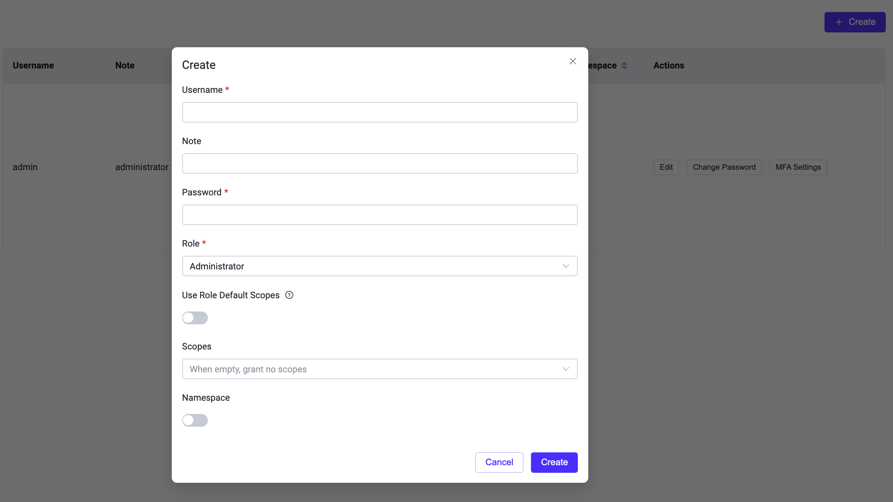

# System

The **System** menu in the EMQX Dashboard provides access to system management options such as user and role management, audit logs, API keys, licensing, SSO, data backup and restore, and general settings.

## Users

The **Users** page provides an overview of all active Dashboard users, including those generated via the [CLI](../admin/cli.md).

To add new users, click the **+ Create** button in the page's top-right corner. A pop-up dialog will appear, prompting you to input the necessary user details. Once entered, click the **Create** button to generate the user account. You can easily access these options through the Actions column for further user management, such as editing users, updating passwords, or deleting users' information.

> For security reasons, starting with EMQX 5.0.0, Dashboard users cannot be used for REST API authentication.

Starting from EMQX 5.3, the Dashboard introduces the Role-Based Access Control (RBAC) feature for EMQX Enterprise users.

RBAC allows you to assign permissions to users based on their roles within the organization. This feature simplifies authorization management, enhances security by restricting access, and improves organizational compliance, making it an essential access control mechanism for the Dashboard.

Currently, either of the following two predefined roles can be set for a user. You can select the role from the **Role** dropdown when you create users.
+ **Administrator**

    Administrators have full access to manage all EMQX features and resources, including client management, system configuration, API key, and user management.

+ **Viewer**

    Viewers can access all EMQX data and configurations, corresponding to all `GET` requests in the REST API. However, they do not have the right to create, modify, or delete any data.

### Login User Scopes

Starting from EMQX 5.10, you can assign scopes to Dashboard login users to further restrict which parts of the API they can access within their role. In addition to the [10 API-key scopes](../admin/api.md#built-in-scopes), Dashboard users have four additional scopes that apply only to browser sessions:

| Scope | Required role | Purpose |
| --- | --- | --- |
| `user_management` | Administrator | Manage Dashboard users (create / update / delete). |
| `sso_management` | Administrator | Manage SSO backends and SSO user records. |
| `api_key_management` | Administrator | Manage API keys. |
| `mfa_management` | Any | Manage own MFA; administrators can manage other users' MFA. |

Three of these scopes (`user_management`, `sso_management`, and `api_key_management`) require the Administrator role and cannot be assigned to Viewers. The exception is `mfa_management`: Viewers can hold it, but it only allows them to manage MFA on their own account. It does not grant access to other users' MFA settings. This is useful when you want Viewer accounts to be able to re-enroll or recover their own authenticator without gaining any additional privileges.

When you create or edit a user, the **Scopes** field is optional. If you leave it empty, the user receives a default scope set derived from their role:

- **Administrator**: All scopes, including the four login-only ones above.
- **Viewer**: All generic API-key scopes; `mfa_management` is only granted if you explicitly assign it.

#### Role Changes and Scope Compatibility

When you change a user's role, EMQX checks whether the user's current scopes are compatible with the new role. If they are not, the request is rejected with HTTP 400. To resolve this, include a `scopes` list in the same request that is valid for the new role.

For example, if you demote an Administrator to Viewer and that user holds `user_management`, `sso_management`, or `api_key_management`, the request will be rejected because those scopes require the Administrator role. Include a `scopes` list containing only Viewer-compatible scopes to complete the change. (`mfa_management` is not admin-only and does not cause this rejection.)

### Default Administrator Protection

The `dashboard.default_username` account (created with the password configured in `dashboard.default_password`) is a break-glass account. To make sure the system can always be recovered when other administrators are misconfigured or have lost access, the default user is protected from accidental lockout:

- It **cannot be deleted** from the Dashboard or REST API. The Delete button is disabled.
- Its role **cannot be changed** away from `administrator`.
- Its scope set **cannot be customized**; it always retains the full administrator scope.
- Its description and password **can** be edited normally.

Other administrators are unaffected and can be deleted as long as at least one administrator remains in the system.

### Self-Service Boundaries

Every Dashboard user is allowed to perform two self-service actions regardless of their scopes:

- Change their own password.
- Enroll or re-enroll their own TOTP / MFA. Disabling MFA is also allowed, unless an administrator has explicitly required MFA for the user's account. In that case, the `mfa_management` scope is needed to disable it.

All other profile updates (description, role, scopes assigned by an administrator) require the appropriate scope on the acting user and are not bypassed, even when the target is the acting user.

## Audit Logs

The **Audit Logs** page allows administrators to configure audit logging for monitoring critical operational changes within the EMQX cluster in real time.

For a detailed overview of the Audit Log feature, see [Audit Log](../dashboard/audit-log.md).

## API Keys

The **API Keys** page allows you to create and manage API keys for accessing the [HTTP API](../admin/api.md). For instructions on creating and managing API keys, including role and scope assignment, see [Create API Keys](../admin/api.md#create-api-keys).

## License

Click on **License** under the **System** menu on the left to access the License page. On this page, you can view the basic information of your current License, including the License connection quota usage, EMQX version, customer, and issue information. 

Click **Update License** to upload your License Key. In the **License Settings** section, you can set the high and low watermark limits for the license connection quota usage. For more information about the license, see [Work with EMQX Enterprise License](../deploy/license.md).

## SSO

The **SSO** page provides settings for the administrators to configure the SSO feature for user login management. For more information about the SSO feature, see [Single Sign-On (SSO)](./sso.md).

## Backup & Restore

The **Backup & Restore** page provides settings for backing up your operating data and configuration files. You can perform data import and export operations on this page. For details of the Backup and Restore function, see [Backup and Restore](../operations/backup-restore.md).

## Settings

To access the settings, click the gear icon in the upper-right corner of the Dashboard.

In the **Settings** menu, you can customize the Dashboard's language and theme:

- **Language**: Choose your preferred display language.
- **Theme**: Select between light and dark themes, or enable automatic synchronization with your operating system's theme. When sync is enabled, the theme will follow your OS settings, and manual selection will be disabled.

Additionally, the Settings menu includes a toggle to enable or disable the [AI SQL Generator](../data-integration/rule-get-started.md#sql-generator) feature on the **Rules** page.

