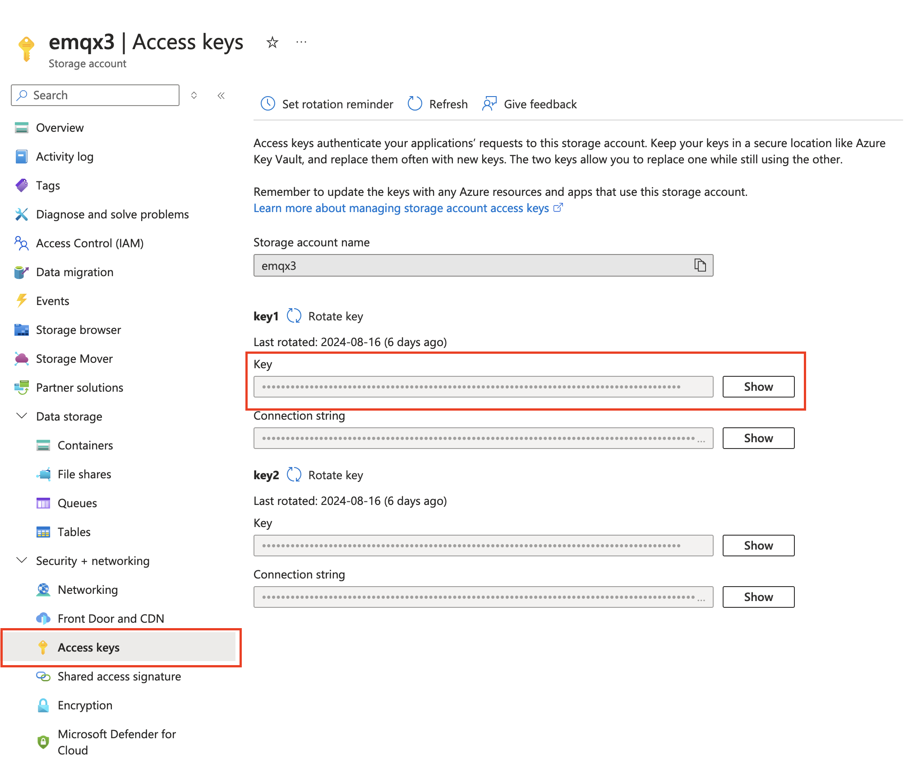

# Ingest MQTT Data into Azure Blob Storage
::: tip

The Azure Blob Storage data integration is an EMQX Enterprise edition feature.

:::

[Azure Blob Storage](https://azure.microsoft.com/en-us/products/storage/blobs/) is Microsoft's object storage solution for the cloud. Blob Storage is optimized for storing massive amounts of unstructured data. Unstructured data is data that doesn't adhere to a particular data model or definition, such as text or binary data. EMQX is capable of efficiently storing MQTT messages into Blob Storage containers, enabling flexible Internet of Things (IoT) data storage functionalities.

This page provides a detailed introduction to the data integration between EMQX and Azure Blob Storage, and offers practical guidance on the rule and Sink creation.

## How It Works

Azure Blob Storage data integration in EMQX is a ready-to-use feature that can be easily configured for complex business development. In a typical IoT application, EMQX acts as the IoT platform responsible for device connectivity and message transmission, while Azure Blob Storage serves as the data storage platform, handling message data storage.


EMQX utilizes rules engines and Sinks to forward device events and data to Azure Blob Storage. Applications can read data from Azure Blob Storage for further data applications. The specific workflow is as follows:

1. **Device Connection to EMQX**: IoT devices trigger an online event upon successfully connecting via the MQTT protocol. The event includes device ID, source IP address, and other property information.
2. **Device Message Publishing and Receiving**: Devices publish telemetry and status data through specific topics. EMQX receives the messages and compares them within the rules engine.
3. **Rules Engine Processing Messages**: The built-in rules engine processes messages and events from specific sources based on topic matching. It matches corresponding rules and processes messages and events, such as data format transformation, filtering specific information, or enriching messages with context information.
4. **Writing to Azure Blob Storage**: The rule triggers an action to write the message to Storage Container. Using the Azure Blob Storage Sink, users can extract data from processing results and send it to Blob Storage. Messages can be stored in text or binary format, or multiple lines of structured data can be aggregated into a single CSV file, depending on the message content and the Sink configuration.

After events and message data are written to Storage Container, you can connect to Azure Blob Storage to read the data for flexible application development, such as:

- Data archiving: Store device messages as objects in Azure Blob Storage for long-term preservation to meet compliance requirements or business needs.
- Data analysis: Import data from Storage Container into analytics services like Snowflake for predictive maintenance, device efficiency evaluation, and other data analysis services.

## Features and Advantages

Using Azure Blob Storage data integration in EMQX can bring the following features and advantages to your business:

- **Message Transformation**: Messages can undergo extensive processing and transformation in EMQX rules before being written to Azure Blob Storage, facilitating subsequent storage and use.
- **Flexible Data Operations**: With the Azure Blob Storage Sink, specific fields of data can be conveniently written into Azure Blob Storage containers, supporting the dynamic setting of containers and object keys for flexible data storage.
- **Integrated Business Processes**: The Azure Blob Storage Sink allows device data to be combined with the rich ecosystem applications of Azure Blob Storage, enabling more business scenarios like data analysis and archiving.
- **Low-Cost Long-Term Storage**: Compared to databases, Azure Blob Storage offers a highly available, reliable, and cost-effective object storage service, suitable for long-term storage needs.

These features enable you to build efficient, reliable, and scalable IoT applications and benefit from business decisions and optimizations.

## Before You Start

This section introduces the preparations required before creating an Azure Blob Storage Sink in EMQX.

### Prerequisites

- Understanding of [rules](./rules.md).
- Understanding of [data integration](./data-bridges.md).

### Create a container in Azure Storage

1. To access Azure Storage, you'll need an Azure subscription. If you don't already have a subscription, create a [free account](https://azure.microsoft.com/free/) before you begin.

2. All access to Azure Storage takes place through a storage account. For this quickstart, create a storage account using the [Azure portal](https://portal.azure.com/), Azure PowerShell, or Azure CLI. For help creating a storage account, see [Create a storage account](https://learn.microsoft.com/en-us/azure/storage/common/storage-account-create).

3. To create a container in the Azure portal, navigate to your new storage account in the Azure portal. In the left menu for the storage account, scroll to the Data storage section, then select Containers. Select the + Container button, use `iot-data` as a name for your new container, and select Create to create the container.


4. Navigate to Security+Networking -> Access keys in the storage account, and copy the **Key**. You will need this key to configure the Sink in EMQX.



## Create a Connector

Before adding the Azure Blob Storage Sink, you need to create the corresponding connector.

1. Go to the Dashboard **Integration** -> **Connector** page.
2. Click the **Create** button in the top right corner.
3. Select **Azure Blob Storage** as the connector type and click next.
4. Enter the connector name, a combination of upper and lowercase letters and numbers. Here, enter `my-azure`.
5. Enter the connection information.
   - **Account Name**: Your Storage Account name
   - **Account Key**: Your Storage Account key from previous step
6. Before clicking **Create**, you can click **Test Connectivity** to test if the connector can connect to the Azure Storage.
7. Click the **Create** button at the bottom to complete the connector creation.

You have now completed the connector creation and will proceed to create a rule and Sink for specifying the data to be written into the Azure Storage service.

## Create a Rule with Azure Blob Storage Sink

This section demonstrates how to create a rule in EMQX to process messages from the source MQTT topic `t/#` and write the processed results to the `iot-data` container in Azure Storage through the configured Sink.

1. Go to the Dashboard **Integration** -> **Rules** page.

2. Click the **Create** button in the top right corner.

3. Enter the rule ID `my_rule`, and input the following rule SQL in the SQL editor:

   ```sql
   SELECT
     *
   FROM
       "t/#"
   ```

   ::: tip

   If you are new to SQL, you can click **SQL Examples** and **Enable Debug** to learn and test the rule SQL results.

   :::

4. Add an action, select `Azure Blob Storage` from the **Action Type** dropdown list, keep the action dropdown as the default `create action` option, or choose a previously created Azure Blob Storage action from the action dropdown. Here, create a new Sink and add it to the rule.

5. Enter the Sink's name and description.

6. Select the `my-azure` connector created earlier from the connector dropdown. You can also click the create button next to the dropdown to quickly create a new connector in the pop-up box. The required configuration parameters can be found in [Create a Connector](#create-a-connector).

7. Set the **Container** by entering `iot-data`.

8. Set the **Blob** by entering `iot-data-blob`.

9. Select the **Upload Method**. The differences between the two methods are as follows:

   - **Direct Upload**: Each time the rule is triggered, data is uploaded directly to Azure Storage according to the preset object key and content. This method is suitable for storing binary or large text data. However, it may generate a large number of files.
   - **Aggregated Upload**: This method packages the results of multiple rule triggers into a single file (such as a CSV file) and uploads it to Azure Storage, making it suitable for storing structured data. It can reduce the number of files and improve write efficiency.

   The configuration parameters differ for each method. Please configure according to the selected method:

   :::: tabs type

   ::: tab Direct Upload

   Direct Upload requires configuring the following fields:

   - **Blob Name**: Defines the object's location to be uploaded to the container. It supports placeholders in the format of `${var}` and can use `/` to specify storage directories. It's also necessary to set the object's suffix for management and differentiation. Here, enter `msgs/${clientid}_${timestamp}.json`, where `${clientid}` is the client ID and `${timestamp}` is the timestamp of the message. This ensures that each device's messages are written to different objects.
   - **Object Content**: By default, this is in JSON text format containing all fields. It supports placeholders in the format of `${var}`. Here, enter `${payload}` to use the message body as the object content. The storage format of the object depends on the format of the message body, supporting compressed files, images, or other binary formats.

   :::

   ::: tab Aggregate Upload

   Aggregate Upload requires configuring the following parameters:

   - **Blob Name**: Used to specify the storage path of the object. The following variables can be used:

     - **`${action}`**: Action name (required).
     - **`${node}`**: Name of the EMQX node performing the upload (required).
     - **`${datetime.{format}}`**: Start date and time of the aggregation, with the format specified by the `{format}` string (required):
       - **`${datetime.rfc3339utc}`**: RFC3339 date and time in UTC format.
       - **`${datetime.rfc3339}`**: RFC3339 date and time in local time zone format.
       - **`${datetime.unix}`**: Unix timestamp.
     - **`${datetime_until.{format}}`**: End date and time of the aggregation, with format options as above.
     - **`${sequence}`**: Sequence number for aggregated uploads within the same time interval (required).

     Note that if all placeholders marked as required are not used in the template, these placeholders will be automatically added to the Blob Name as path suffixes to avoid duplication. All other placeholders are considered invalid.

   - **Aggregation Type**: Currently, only CSV is supported. Data will be written to Azure Storage in comma-separated CSV format.

   - **Column Order**: Adjust the order of rule result columns through a dropdown selection. The generated CSV file will first be sorted by the selected columns, with unselected columns sorted alphabetically following the selected columns.

   - **Max Records**: When the maximum number of records is reached, the aggregation of a single file will be completed and uploaded, resetting the time interval.

   - **Time Interval**: When the time interval is reached, even if the maximum number of records has not been reached, the aggregation of a single file will be completed and uploaded, resetting the maximum number of records.

   ::: 

   ::::

10. Set the **Object Content**. By default, it is a JSON text format containing all fields. It supports `${var}` format placeholders. Here, enter `${payload}` to indicate using the message body as the object content. In this case, the object's storage format depends on the message body's format, supporting compressed packages, images, or other binary formats.

11. Expand **Advanced Settings** and configure the advanced setting options as needed (optional). For more details, refer to [Advanced Settings](#advanced-settings).

12. Use the default values for the remaining settings. Click the **Create** button to complete the Sink creation. After successful creation, the page will return to the rule creation, and the new Sink will be added to the rule actions.

13. Back on the rule creation page, click the **Create** button to complete the entire rule creation process.

You have now successfully created the rule. You can see the newly created rule on the **Rules** page and the new Azure Blob Storage Sink on the **Actions (Sink)** tab.

You can also click **Integration** -> **Flow Designer** to view the topology. The topology visually shows how messages under the topic `t/#` are written into Azure Storage container after being parsed by the rule `my_rule`.

## Test the Rule

This section shows how to test the rule configured with the direct upload method.

Use MQTTX to publish a message to the topic `t/1`:

```bash
mqttx pub -i emqx_c -t t/1 -m '{ "msg": "Hello Azure" }'
```

After sending a few messages, access the Azure Portal to view the uploaded objects in the `iot-data` container.

Login to the [Azure portal](https://portal.azure.com/), navigate to the storage account, and open the `iot-data` container. You should see the uploaded objects in the container.

## Advanced Settings

This section delves into the advanced configuration options available for the Azure Blob Storage Sink. In the Dashboard, when configuring the Sink, you can expand **Advanced Settings** to adjust the following parameters based on your specific needs.

| Field Name                | Description                                                  | Default Value  |
| ------------------------- | ------------------------------------------------------------ | -------------- |
| **Buffer Pool Size**      | Specifies the number of buffer worker processes, which are allocated to manage the data flow between EMQX and Azure Storage. These workers temporarily store and process data before sending it to the target service, crucial for optimizing performance and ensuring smooth data transmission. | `16`           |
| **Request TTL**           | The "Request TTL" (Time To Live) configuration setting specifies the maximum duration, in seconds, that a request is considered valid once it enters the buffer. This timer starts ticking from the moment the request is buffered. If the request stays in the buffer for a period exceeding this TTL setting or if it is sent but does not receive a timely response or acknowledgment from Azure Storage, the request is deemed to have expired. |                |
| **Health Check Interval** | Specifies the time interval (in seconds) for the Sink to perform automatic health checks on its connection with Azure Storage. | `15`           |
| **Max Buffer Queue Size** | Specifies the maximum number of bytes that can be buffered by each buffer worker process in the Azure Blob Storage Sink. The buffer workers temporarily store data before sending it to Azure Storage, acting as intermediaries to handle the data stream more efficiently. Adjust this value based on system performance and data transmission requirements. | `256`          |
| **Query Mode**            | Allows you to choose between `synchronous` or `asynchronous` request modes to optimize message transmission according to different requirements. In asynchronous mode, writing to Azure Storage does not block the MQTT message publishing process. However, this may lead to clients receiving messages before they arrive at Azure Storage. | `Asynchronous` |
| **Batch Size**            | Specifies the maximum size of data batches transmitted from EMQX to Azure Storage in a single transfer operation. By adjusting the size, you can fine-tune the efficiency and performance of data transfer between EMQX and Azure Storage.<br />If the "Batch Size" is set to "1," data records are sent individually, without being grouped into batches. | `1`                   |
| **Inflight  Window**     | "In-flight queue requests" refer to requests that have been initiated but have not yet received a response or acknowledgment. This setting controls the maximum number of in-flight queue requests that can exist simultaneously during Sink communication with Azure Storage. <br/>When **Request Mode** is set to `asynchronous`, the "Request In-flight Queue Window" parameter becomes particularly important. If strict sequential processing of messages from the same MQTT client is crucial, then this value should be set to `1`. | `100`          |
