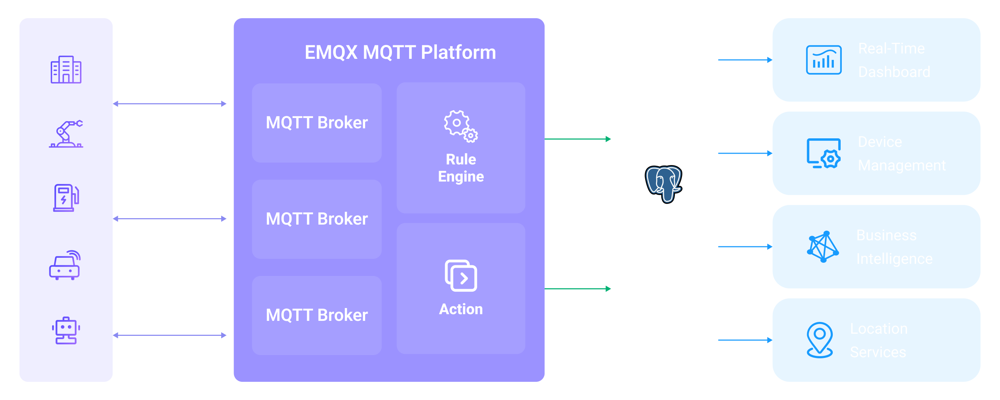

# Ingest MQTT Data into CockroachDB

[CockroachDB Cloud](https://www.cockroachlabs.com/product/cloud/) is a fully managed, Postgres-compatible database built for global, cloud-native applications requiring unmatched resilience, scalability, and SQL-compatibility. EMQX integrates smoothly with CockroachDB to capture and store MQTT data from IoT devices in real time. Together, they enable fast, reliable ingestion across global deployments, ensure consistent data with Raft-based replication, and support low-latency reads for both operations and analytics.

This page provides a comprehensive guide to configuring EMQX rules and setting up CockroachDB Sinks for streamlined real-time integration with CockroachDB.

## How It Works

CockroachDB data integration in EMQX is a built-in feature that ingests MQTT-based IoT data streams directly into CockroachDB’s distributed, PostgreSQL-compatible database. With EMQX's built-in [rule engine](./rules.md), you can ingest data directly into CockroachDB for globally consistent storage and real-time querying, without writing complex custom code.

CockroachDB’s shared-nothing, distributed architecture automatically replicates data across multiple nodes and regions, using Raft-based consensus to maintain strong consistency even during failures. This ensures that IoT data remains safe, synchronized, and available at all times.

The diagram below illustrates a typical architecture of data integration between EMQX and CockroachDB:

<!-- To be updated-->



Ingesting MQTT data into CockroachDB works as follows:

1. **IoT devices connect to EMQX**: After IoT devices are successfully connected through the MQTT protocol, online events will be triggered. The events include information such as device ID, source IP address, and other attributes.
2. **Message publication and reception**: The devices publish telemetry and status data to specific topics. When EMQX receives these messages, it initiates the matching process within its rules engine.
3. **Rule Engine Processing Messages**: EMQX’s rules engine processes events and messages by matching them to defined rules based on topics or message content. Processing can include data transformation (e.g., JSON to SQL-ready format), filtering, and data enrichment with contextual information before database insertion.
4. **Write to CockroachDB**: The matched rule triggers SQL execution against CockroachDB. Using SQL templates, users can map processed data fields to CockroachDB tables and columns. CockroachDB’s distributed SQL execution and vectorized query engine ensure high-throughput writes while enabling low-latency analytical queries. Data can also be geo-partitioned for optimal performance in multi-region deployments.

After the event and message data are written to CockroachDB, you can:

- Connect CockroachDB to tools like Grafana to generate dashboards and charts showing live IoT metrics.
- Integrate with device management platforms or AI/ML models to track health, detect anomalies, and trigger alerts.
- Use CockroachDB’s distributed query engine to perform aggregations, joins, and time-series analysis on live IoT data while continuing to process new telemetry in parallel.

## Features and Benefits

The data integration with CockroachDB can bring the following features and advantages to your business:

- **Flexible Event Handling**: Using the EMQX rules engine, CockroachDB can store and process device lifecycle events (connect, disconnect, status changes) with low latency. When paired with CockroachDB’s distributed execution and automatic rebalancing, event data remains highly available and can be analyzed in real time to detect failures, anomalies, or trends.
- **Message Transformation**: Messages can undergo extensive processing and transformation through EMQX rules before being written to CockroachDB, making stored data analytics-ready from the start. This preprocessing reduces query complexity and optimizes downstream usage.
- **Flexible Data Operations with SQL Templates**: Through EMQX’s SQL template mapping, structured IoT data can be inserted or updated in CockroachDB tables and columns. With PostgreSQL compatibility, CockroachDB supports standard SQL, JSONB storage, and indexing. Queries benefit from its vectorized execution engine for faster analytics and follower reads for low-latency, region-local access.
- **Integration of Business Processes**: CockroachDB’s PostgreSQL compatibility allows integration with ERP, CRM, GIS, and other business systems. Combined with EMQX, you can enable event-driven automation and cross-system orchestration without building complex ETL pipelines.
- **Advanced Geospatial Capabilities**: Through PostgreSQL extensions like PostGIS, CockroachDB supports geospatial data storage, indexing, and querying. This enables geofencing, location-based alerts, route tracking, and real-time asset monitoring when paired with EMQX’s reliable IoT data ingestion.
- **Built-in Metrics and Monitoring**: EMQX provides runtime metrics for each CockroachDB sink (message counts, success/failure rates, throughput), while CockroachDB offers built-in observability tools and integrates with Prometheus and Grafana for detailed performance and health monitoring.

## Before You Start

This section describes the preparations you need to complete before you start to create the CockroachDB Database sinks, including how to set up the CockroachDB server and create data tables.

### Prerequisites

- Knowledge about EMQX data integration [rules](./rules.md)
- Knowledge about [Data Integration](./data-bridges.md)

### Set up CockroachDB

See the [official CockroachDB documentation](https://www.cockroachlabs.com/docs/stable/install-cockroachdb-linux.html) on how to setup your CockroachDB database.  After it's set up, [create the `emqx_data` database](https://www.cockroachlabs.com/docs/v25.3/schema-design-database.html) and the tables below.

Use the following SQL statements to create data table `t_mqtt_msg` in PostgreSQL database for storing the client ID, topic, payload, and creating time of every message.

```sql
CREATE TABLE t_mqtt_msg (
  id SERIAL primary key,
  msgid character varying(64),
  sender character varying(64),
  topic character varying(255),
  qos integer,
  retain integer,
  payload text,
  arrived timestamp without time zone
);
```

Use the following SQL statements to create data table `emqx_client_events` in PostgreSQL database for storing the client ID, event type, and creating time of every event.

```sql
CREATE TABLE emqx_client_events (
  id SERIAL primary key,
  clientid VARCHAR(255),
  event VARCHAR(255),
  created_at TIMESTAMP DEFAULT CURRENT_TIMESTAMP
);
```

## Create a Connector

Before add CockroachDB Sink, you need to create the CockroachDB connector. It assumes that you run both EMQX and CockroachDB on the local machine. If you have CockroachDB and EMQX running remotely, adjust the settings accordingly.

1. Go to EMQX Dashboard, and click **Integration** -> **Connector**.
2. Click **Create** on the top right corner of the page.
3. In the **Create Connector** page, click to select `CockroachDB`, and then click **Next**.
4. Enter a name for the sink. The name should be a combination of upper/lower case letters and numbers, for example, `my_cockroachdb`.
5. Enter the connection information:

   - **Server Host**: Enter ``, or the actual hostname if the CockroachDB server is running remotely.
   - **Database Name**: Enter `emqx_data`.
   - **Username**: Enter ``.
   - **Password**: Enter ``.
   - **Enable TLS**: If you want to establish an encrypted connection, click the toggle switch. For more information about TLS connection, see [TLS for External Resource Access](../network/overview.md/#tls-for-external-resource-access).
6. Advanced settings (optional):  For details, see [Features of Sink](./data-bridges.md#features-of-sink).
7. Before clicking **Create**, you can click **Test Connectivity** to test if the connector can connect to the CockroachDB server.
8. Click the **Create** button at the bottom to complete the creation of the connector. In the pop-up dialog, you can click **Back to Connector List** or click **Create Rule** to continue creating rules with Sinks to specify the data to be forwarded to CockroachDB and record client events. For detailed steps, see [Create a Rule with CockroachDB Sink for Message Storage](#create-a-rule-with-postgresql-sink-for-message-storage) and [Create a Rule with CockroachDB Sink for Events Recording](#create-a-rule-with-postgresql-for-events-recording).

## Create a Rule with CockroachDB Sink for Message Storage

This section demonstrates how to create a rule in the Dashboard for processing messages from the source MQTT topic `t/#`, and saving the processed data to the CockroachDB table `t_mqtt_msg` via the configured Sink.

1. Go to the Dashboard **Integration** -> **Rules** page.

2. Click **Create** in the upper right corner of the page.

3. Enter the rule ID `my_rule` and enter the rule in the SQL editor. Here we choose to store MQTT messages with `t/#` topic to CockroachDB, make sure that the fields selected by the rule (in the SELECT section) contain all the variables used in the SQL template, here the rule SQL is as follows:

   ```sql
   SELECT
   *
   FROM
   "t/#"
   ```

   ::: tip

   If you are a beginner user, click **SQL Examples** and **Enable Test** to learn and test the SQL rule.

   :::

4. Click the + **Add Action** button to define an action to be triggered by the rule. With this action, EMQX sends the data processed by the rule to CockroachDB.

5. Select CockroachDB from the **Type of Action** drop-down, leave the **Action** drop-down at the default `Create Action` option, or you can select a previously created CockroachDB action from the Action drop-down box. This example will create a brand new Sink and add it to the rule.

6. Enter the name and description of the Sink in the form below.

7. From the **Connector** dropdown box, select the `my_cockroachdb` created before. You can also create a new Connector by clicking the button next to the dropdown box. For the configuration parameters, see [Create a Connector](#create-a-connector).

8. Configure the **SQL Template**. Use the SQL statements below to insert data.

   Note: This is a [preprocessed SQL](./data-bridges.md#prepared-statement), so the fields should not be enclosed in quotation marks, and do not write a semicolon at the end of the statements.

   ```sql
   INSERT INTO t_mqtt_msg(msgid, sender, topic, qos, payload, arrived) VALUES(
     ${id},
     ${clientid},
     ${topic},
     ${qos},
     ${payload},
     TO_TIMESTAMP((${timestamp} :: bigint)/1000)
   )
   ```

9. **Fallback Actions (Optional)**: If you want to improve reliability in case of message delivery failure, you can define one or more fallback actions. These actions will be triggered if the primary Sink fails to process a message. See [Fallback Actions](./data-bridges.md#fallback-actions) for more details.

10. **Advanced settings (optional)**: For details, see [Features of Sink](./data-bridges.md#features-of-sink).

11. Before clicking **Create**, you can click **Test Connectivity** to test that the Sink can be connected to the CockroachDB server.

12. Click the **Create** button to complete the Sink configuration. A new Sink will be added to the **Action Outputs.**

13. Back on the **Create Rule** page, verify the configured information. Click the **Save** button to generate the rule.

Now that you have successfully created the rule, you can click **Integration** -> **Rules** page to see the newly created rule and also see the newly created CockroachDB Sink in the **Action (Sink)** tab.

You can also click **Integration** -> **Flow Designer** to see the topology, through which you can visualize that the messages under topic `t/#` are being written to CockroachDB after being parsed by the rule `my_rule`.

## Create a Rule with CockroachDB for Events Recording

This section demonstrates how to create a rule for recording the clients' online/offline status and storing the events data to the CockroachDB table `emqx_client_events` via a configured Sink.

The steps are similar to those in [Create a Rule with CockroachDB Sink for Message Storage](#create-a-rule-with-cockroachdb-sink-for-message-storage) except for the SQL template and SQL rules.

The SQL rule statement for online/offline status recording is as follows.

```sql
SELECT
  *
FROM
  "$events/client_connected", "$events/client_disconnected"
```

The SQL template for events recording is as follows.

Note: This is a [preprocessed SQL](./data-bridges.md#prepared-statement), so the fields should not be enclosed in quotation marks, and do not write a semicolon at the end of the statements.

```sql
INSERT INTO emqx_client_events(clientid, event, created_at) VALUES (
  ${clientid},
  ${event},
  TO_TIMESTAMP((${timestamp} :: bigint)/1000)
)
```

## Test the Rules

Use MQTTX to send a message to topic `t/1` to trigger an online/offline event.

```bash
mqttx pub -i emqx_c -t t/1 -m '{ "msg": "hello CockroachDB" }'
```

Check the running status of the two sinks. For the message storage Sink, there should be 1 new incoming and 1 new outgoing message. For the events recording Sink, there 2 events records.

Check whether the data is written into the `t_mqtt_msg` data table.

```bash
emqx_data=# select * from t_mqtt_msg;
 id |              msgid               | sender | topic | qos | retain |            payload
        |       arrived
----+----------------------------------+--------+-------+-----+--------+-------------------------------+---------------------
  1 | 0005F298A0F0AEE2F443000012DC0002 | emqx_c | t/1   |   0 |        | { "msg": "hello CockroachDB" } | 2023-01-19 07:10:32
(1 row)

```

Check whether the data is written into the `emqx_client_events` table.

```bash
emqx_data=# select * from emqx_client_events;
 id | clientid |        event        |     created_at
----+----------+---------------------+---------------------
  3 | emqx_c   | client.connected    | 2023-01-19 07:10:32
  4 | emqx_c   | client.disconnected | 2023-01-19 07:10:32
(2 rows)

```
