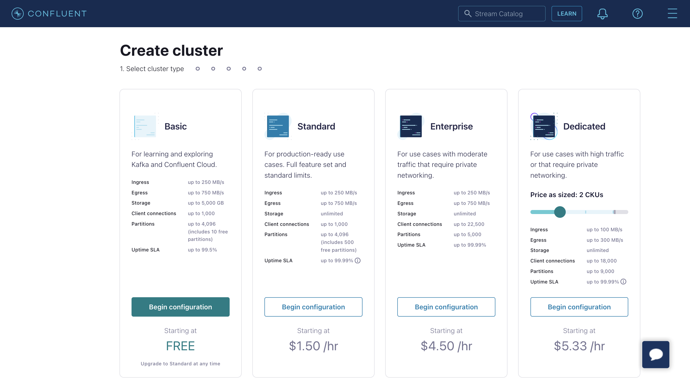
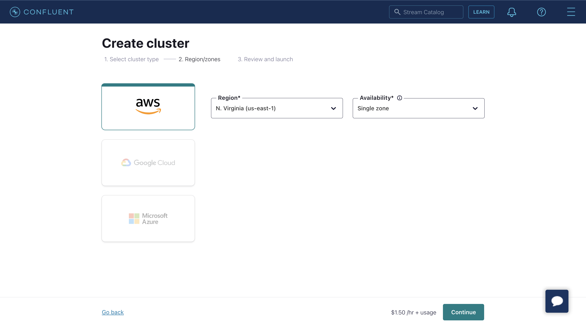

# Stream MQTT Data into Confluent

::: tip

The Confluent data integration is an EMQX Enterprise edition feature.

:::

[Confluent Cloud](https://www.confluent.io/), based on Apache Kafka, is a resilient, scalable, and fully managed streaming data service. EMQX supports data integration with Confluent through its rule engine and Sink, enabling easy streaming of MQTT data into Confluent for real-time processing, storage, and analysis.


This page primarily introduces the features and benefits of Confluent integration and guides you on configuring Confluent Cloud and creating a Confluent Producer Sink in EMQX.

## How It Works

Confluent data integration is a ready-to-use feature of EMQX, bridging MQTT-based IoT data with Confluent's robust data processing capabilities. Using the built-in [rule engine](./rules.md) component, the integration simplifies the data flow and processing between the two platforms, eliminating the need for complex coding.

The diagram below shows a typical architecture of EMQX and Confluent data integration in automotive IoT.


Data flow into or out of Confluent involves Confluent Sink (sending messages to Confluent) and Confluent Source (receiving messages from Confluent). If you create a Confluent Sink, its workflow is as follows:

1. **Message Publishing and Receiving**: IoT devices connected to vehicles successfully connect to EMQX via the MQTT protocol and periodically publish messages containing status data. When EMQX receives these messages, it initiates the matching process within its rule engine.
2. **Message Data Processing**: These MQTT messages can be processed according to topic matching rules through the collaborative work of the built-in rule engine and messaging server. When messages arrive and pass through the rule engine, it evaluates the predefined processing rules for that message. If any rule specifies payload transformations, these transformations are applied, such as data format conversion, filtering specific information, or enriching the payload with additional context.
3. **Bridging to Confluent**: The rules defined in the rule engine trigger the action to forward messages to Confluent. Using the Confluent Sink feature, MQTT topics are mapped to predefined Kafka topics in Confluent, and all processed messages and data are written into these topics.

Once vehicle data is input into Confluent, you can flexibly access and utilize this data:

- Your services can integrate directly with Confluent, consuming real-time data streams from specific topics for customized business processing.
- Utilize Kafka Streams for stream processing, and perform real-time monitoring by aggregating and correlating vehicle statuses in memory.
- By using the Confluent Stream Designer component, you can choose various connectors to output data to external systems, such as MySQL, ElasticSearch, for storage.

## Features and Benefits

Data integration with Confluent brings the following features and benefits to your business:

- **Reliability of Large-Scale Message Transmission**: Both EMQX and Confluent Cloud use highly reliable cluster mechanisms to establish stable and reliable message transmission channels, ensuring zero loss of messages from large-scale IoT devices. Both can horizontally scale by adding nodes and dynamically adjust resources to handle sudden large-scale messages, ensuring message transmission availability.
- **Powerful Data Processing Capabilities**: EMQX's local rule engine and Confluent Cloud both provide reliable streaming data processing capabilities, acting at different stages from IoT data from device to application. They offer real-time data filtering, format conversion, aggregation analysis, etc., based on the scenario, enabling more complex IoT message processing workflows and meeting the needs of data analysis applications.
- **Strong Integration Capabilities**: Through various Connectors provided by Confluent Cloud, EMQX can easily integrate with other databases, data warehouses, data stream processing systems, etc., building a complete IoT data workflow for agile data analysis applications.
- **High Throughput Processing Capability**: Supporting both synchronous and asynchronous write modes, you can differentiate data writing strategies between real-time priority and performance priority, and flexibly balance latency and throughput in different scenarios.
- **Effective Topic Mapping**: Through bridge configuration, numerous IoT business topics can be mapped to Kafka topics. EMQX supports mapping MQTT user properties to Kafka Headers and adopts various flexible topic mapping methods, including one-to-one, one-to-many, many-to-many, and also supports MQTT topic filters (wildcards).

These features enhance integration capabilities and flexibility, helping you establish an effective and robust IoT platform architecture. Your growing IoT data can be transmitted over stable network connections and further effectively stored and managed.

## Before You Start

This section describes the preparatory work needed to configure Confluent data integration on the EMQX Dashboard.

### Prerequisites

- Understand the [Rule Engine](./rules.md)
- Understand [Sink](./data-bridges.md)

### Configure Confluent Cloud

Before creating Confluent data integration, you must create a Confluent cluster in the Confluent Cloud console and use the Confluent Cloud CLI to create topics and API keys.

#### Create a Cluster

1. Log in to the Confluent Cloud console and create a cluster. Select a Standard cluster as an example, then click **Begin configuration**.



2. Select Region/zones. Ensure the deployment region matches the region of Confluent Cloud. Then click **Continue**.



3. Enter your cluster name, then click **Launch cluster**.


#### Create Topics and API Keys Using Confluent Cloud CLI

Now, with your cluster running in Confluent Cloud, you can obtain the **Bootstrap server** URL from the **Cluster Overview** -> **Cluster Settings** page.


You can manage your cluster using the Confluent Cloud CLI. Below are the basic commands for using the Confluent Cloud CLI.

##### Install Confluent Cloud CLI

```bash
curl -sL --http1.1 https://cnfl.io/cli | sh -s -- -b /usr/local/bin
```

If you've already installed it, you can update it using the following command:

```bash
confluent update
```

##### Log into Your Account

```bash
confluent login --save
```

##### Select an Environment

```bash
# list env
confluent environment list
# use env
confluent environment use <environment_id>
```

##### Select a Cluster

```bash
# list kafka cluster
confluent kafka cluster list
# use kafka
confluent kafka cluster use <kafka_cluster_id>
```

##### Use API Key and Secret

If you wish to use an existing API key, add it to the CLI with the following command:

```bash
confluent api-key store --resource <kafka_cluster_id>
Key: <API_KEY>
Secret: <API_SECRET>
```

If you don't have an API key and Secret, you can create them with the following command:

```bash
$ confluent api-key create --resource <kafka_cluster_id>

It may take a couple of minutes for the API key to be ready.
Save the API key and secret. The secret is not retrievable later.
+------------+------------------------------------------------------------------+
| API Key    | YZ6R7YO6Q2WK35X7                                                 |
| API Secret | ****************************************                         |
+------------+------------------------------------------------------------------+
```

After adding them to the CLI, you can use the API key and Secret by executing the following command:

```bash
confluent api-key use <API_Key> --resource <kafka_cluster_id>
```

##### Create a Topic

You can create a topic named `testtopic-in` with the following command:

```bash
confluent kafka topic create testtopic-in
```

You can check the list of topics with the following command:

```bash
confluent kafka topic list
```

##### Produce Messages to a Topic

You can create a producer using the following command. After starting the producer, type a message and press Enter. The message will be produced to the respective topic.

```bash
confluent kafka topic produce testtopic-in
```

##### Consume Messages from a Topic

You can create a consumer using the following command. It will output all messages in the respective topic.

```bash
confluent kafka topic consume -b testtopic-in
```

## Create a Connector

Before adding a Confluent Sink action, you need to create a Confluent producer connector to establish a connection between EMQX and Confluent Cloud.

1. Go to the EMQX Dashboard and click **Integration** -> **Connectors**.
2. Click **Create** in the top right corner of the page, select **Confluent Producer** on the connector selection page, and click **Next**.
3. Enter a name and description, such as `my-confluent`. The name is used to associate the Confluent Sink with the connector and must be unique within the cluster.
4. Configure the parameters required to connect to Confluent Cloud:
   - **Bootstrap Hosts**: Corresponds to the Endpoints information on the Confluent cluster settings page.
   - **Username** and **Password**: Enter the API key and Secret you created earlier with the Confluent Cloud CLI.
   - Leave other options as default or configure them according to your business needs.
5. Click the **Create** button to complete the creation of the connector.

Once created, the connector will automatically connect to Confluent Cloud. Next, you need to create a rule based on this connector to forward data to the Confluent cluster configured in the connector.

## Create a Rule with Confluent Sink

This section demonstrates how to create a rule in EMQX to process messages from the MQTT topic `t/#` and send the processed results to Confluent's `testtopic-in` topic using the configured Confluent Sink.

1. Enter the EMQX Dashboard and click **Integration** -> **Rules**.

2. Click **Create** in the top right corner.

3. Enter a rule ID, such as `my_rule`.

4. If you want to forward MQTT messages from topic `t/#` to Confluent, enter the following statement in the **SQL Editor**.

   Note: If you want to specify your own SQL syntax, ensure that the `SELECT` section contains all the fields required by the Sink.

   ```sql
   SELECT
     *
   FROM
     "t/#"
   ```

   Note: If you are a beginner, you can click **SQL Example** and **Enable Test** to learn and test SQL rules.

5. Click the + **Add Action** button to define the action to be triggered by the rule. From the **Type of Action** dropdown list, select `Confluent Producer`, keep the **Action** dropdown box to the default `Create Action` option, or choose a previously created Confluent Producer action from the **Action** dropdown box. This demonstration creates a new rule and adds it to the rule.

6. Enter the name and description of the Sink in the corresponding text boxes below.

7. In the **Connector** dropdown box, select the `my-confluent` connector you just created. You can also click the button next to the dropdown box to quickly create a new connector in the pop-up box, with the required configuration parameters referring to [Create a Connector](#create-a-connector).

8. Configure the data sending method for the Sink, including:

   - **Kafka Topic**: Enter `testtopic-in`. Starting from EMQX v5.7.2, this field also supports dynamic topics configuration. Refer to [Configure Kafka Dynamic Topics](./data-integration-kafka.md#configure-kafka-dynamic-topics) for details. 
   - **Kafka Headers**: Enter metadata or context information related to Kafka messages (optional). The value of the placeholder must be an object. You can choose the encoding type for the header value from the **Kafka Header Value Encod Type** dropdown list. You can also add more key-value pairs by clicking **Add**.
   - **Message Key**: The key of the Kafka message. Enter a string here, which can be a pure string or a string containing placeholders (${var}).
   - **Message Value**: The value of the Kafka message. Enter a string here, which can be a pure string or a string containing placeholders (${var}).
   - **Partition Strategy**: Select how the producer distributes messages to Kafka partitions.
   - **Compression**: Specify whether to use compression algorithms to compress/decompress records in Kafka messages.

9. Advanced Settings (Optional): Refer to [Advanced Configuration](#advanced-configuration).

10. Click the **Create** button to complete the creation of the Sink. Once created, the page will return to **Create Rule**, and the new Sink will be added to the rule actions.

11. Click the **Create** button to complete the entire rule creation.

Now you have successfully created the rule, and you can see the newly created rule on the **Integration** -> **Rules** page, as well as the newly created Confluent Producer Sink on the **Actions(Sink)** tab.

You can also click **Integration** -> **Flow Designer** to view the topology. Through the topology, you can intuitively see that messages under topic `t/#` are sent and saved to Confluent after being parsed by rule `my_rule`.

## Test the Confluent Producer Rule

To test whether the Confluent Producer rule works as you expect, you can use [MQTTX](https://mqttx.app/en) to simulate a client publishing MQTT messages to EMQX.

1. Use MQTTX to send a message to topic `t/1`:

   ```bash
   mqttx pub -i emqx_c -t t/1 -m '{ "msg": "Hello Confluent" }'
   ```

2. On the **Actions(Sink)** page, click on the name of the Sink to view statistical information. Check the sink's running status; there should be one new incoming message and one new outgoing message.

3. Use the following Confluent command to check if the message has been written to the `testtopic-in` topic:

   ```bash
   confluent kafka topic consume -b testtopic-in
   ```

## Advanced Configuration

This section describes some advanced configuration options that can optimize the performance of your connectors and Sink/Source and customize operations according to your specific scenario. When creating the corresponding object, you can expand **Advanced Settings** and configure the following settings according to your business needs.

### Connector Configuration

| Fields                            | Descriptions                                                 | Recommended Values |
| --------------------------------- | ------------------------------------------------------------ | ------------------ |
| Connect Timeout                   | The maximum time to wait for TCP connection establishment, which includes the authentication time if enabled. | `5` second         |
| Start Timeout                     | Determines the maximum time interval, in seconds, that the Connector will wait for an auto-started resource to reach a healthy state before responding to resource creation requests. This setting helps ensure that the Sink does not proceed with operations until it verifies that the connected resource, such as a Confluent cluster, is fully operational and ready to handle data transactions. | `5` second         |
| Health Check Interval             | The time interval for checking the running status of the Connector. | `15` second        |
| Min Metadata Refresh Interval     | The minimum time interval the client must wait before refreshing Kafka broker and topic metadata. Setting this value too small may increase the load on the Kafka server unnecessarily. | `3` second         |
| Metadata Request Timeout          | The maximum duration to wait when the bridge requests metadata from Kafka. | `5` second         |
| Socket Send / Receive Buffer Size | Manages the size of socket buffers to optimize network transmission performance. | `1 ` MB            |
| No Delay                          | Choose whether to have the system kernel send the TCP socket immediately or with a delay. Turning on the toggle switch enables "No Delay", allowing the system kernel to send immediately. Otherwise, there might be some delay when the content to be sent is minimal (default 40 milliseconds). | `Enabled`          |
| TCP Keepalive                     | This configuration enables TCP keepalive mechanism for Kafka bridge connections to maintain ongoing connection validity, preventing connection disruptions caused by extended periods of inactivity. The value should be provided as a comma-separated list of three numbers in the format `Idle, Interval, Probes`:<br />Idle: This represents the number of seconds a connection must remain idle before the server initiates keep-alive probes. The default value on Linux is 7200 seconds.<br />Interval: The interval specifies the number of seconds between each TCP keep-alive probe. On Linux, the default is 75 seconds.<br />Probes: This parameter defines the maximum number of TCP keep-alive probes to send before considering the connection as closed if there's no response from the other end. The default on Linux is 9 probes.<br />For example, if you set the value to '240,30,5,' it means that TCP keepalive probes will be sent after 240 seconds of idle time, with subsequent probes sent every 30 seconds. If there are no responses for 5 consecutive probe attempts, the connection will be marked as closed. | `none`             |

### Confluent Producer Sink Configuration

| Fields                           | Descriptions                                                 | Recommended Values |
| -------------------------------- | ------------------------------------------------------------ | ------------------ |
| Health Check Interval            | The time interval for checking the running status of the Sink. | `15` second        |
| Max Batch Bytes                  | The maximum size, in bytes, for collecting messages within a Kafka batch. Typically, Kafka brokers have a default batch size limit of 1 MB. However, EMQX's default value is intentionally set slightly lower than 1 MB to account for Kafka message encoding overheads, particularly when individual messages are very small. If a single message exceeds this limit, it will still be sent as a separate batch. | `896` KB           |
| Required Acks                    | Required acknowledgments for the Kafka partition leader to await from its followers before sending an acknowledgment back to the Confluent Producer Sink: <br />`all_isr`: Requires acknowledgment from all in-sync replicas.<br />`leader_only`: Requires acknowledgment only from the partition leader.<br />`none`: No acknowledgment from Kafka is needed. | `all_isr`          |
| Partition Count Refresh Interval | The time interval at which the Kafka producer detects an increased number of partitions. Once Kafka's partition count is augmented, EMQX will incorporate these newly discovered partitions into its message dispatching process, based on the specified `partition_strategy`. | `60` second        |
| Max Inflight                     | The maximum number of batches allowed for Kafka producer (per-partition) to send before receiving acknowledgment from Kafka. Greater value typically means better throughput. However, there can be a risk of message reordering when this value is greater than 1.<br />This option controls the number of unacknowledged messages in transit, effectively balancing the load to prevent overburdening the system. | `10` second        |
| Query Mode (Producer)            | Allows you to choose asynchronous or synchronous query modes to optimize message transmission based on different requirements. In asynchronous mode, writing to Kafka does not block the MQTT message publish process. However, this might result in clients receiving messages ahead of their arrival in Kafka. | `Async`            |
| Synchronous Query Timeout        | In synchronous query mode, establishes a maximum wait time for confirmation. This ensures timely message transmission completion to avoid prolonged waits.<br />It applies only when the bridge query mode is configured to `Sync`. | `5` second         |
| Buffer Mode                      | Defines whether messages are stored in a buffer before being sent. Memory buffering can increase transmission speeds.<br />`memory`: Messages are buffered in memory. They will be lost in the event of an EMQX node restart.<br />`disk`: Messages are buffered on disk, ensuring they can survive an EMQX node restart.<br />`hybrid`: Messages are initially buffered in memory. When they reach a certain limit (refer to the `segment_bytes` configuration for more details), they are gradually offloaded to disk. Similar to the memory mode, messages will be lost if the EMQX node restarts. | `memory`           |
| Per-partition Buffer Limit       | Maximum allowed buffer size, in bytes, for each Kafka partition. When this limit is reached, older messages will be discarded to make room for new ones by reclaiming buffer space. <br />This option helps to balance memory usage and performance. | `2` GB             |
| Segment File Bytes               | This setting is applicable when the buffer mode is configured as `disk` or `hybrid`. It controls the size of segmented files used to store messages, influencing the optimization level of disk storage. | `100` MB           |
| Memory Overload Protection       | This setting applies when the buffer mode is configured as `memory`. EMQX will automatically discard older buffered messages when it encounters high memory pressure. It helps prevent system instability due to excessive memory usage, ensuring system reliability. <br />**Note**: The threshold for high memory usage is defined in the configuration parameter `sysmon.os.sysmem_high_watermark`. This configuration is effective only on Linux systems. | Disabled           |

### <!-- Confluent Consumer Source Configuration -->

## Additional Information

EMQX provides a wealth of learning resources on data integration with Confluent/Kafka. Check out the following links for more information:

**Blogs:**

- [Building Connected Vehicle Streaming Data Pipelines with MQTT and Kafka](https://www.emqx.com/en/blog/building-connected-vehicle-streaming-data-pipelines-with-mqtt-and-kafka)
- [MQTT and Kafka | IoT Messaging and Stream Data Integration Practice](https://www.emqx.com/en/blog/mqtt-and-kafka)
- [MQTT Performance Benchmark Testing: EMQX-Kafka Integration](https://www.emqx.com/en/blog/mqtt-performance-benchmark-testing-emqx-kafka-integration)

**Benchmark Reports:**

- [EMQX Enterprise Performance Benchmark Testing: Kafka Integration](https://www.emqx.com/en/resources/emqx-enterprise-performance-benchmark-testing-kafka-integration)
