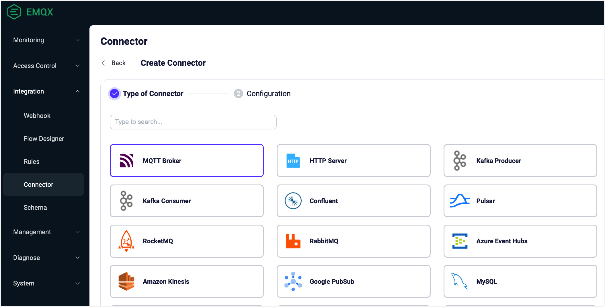
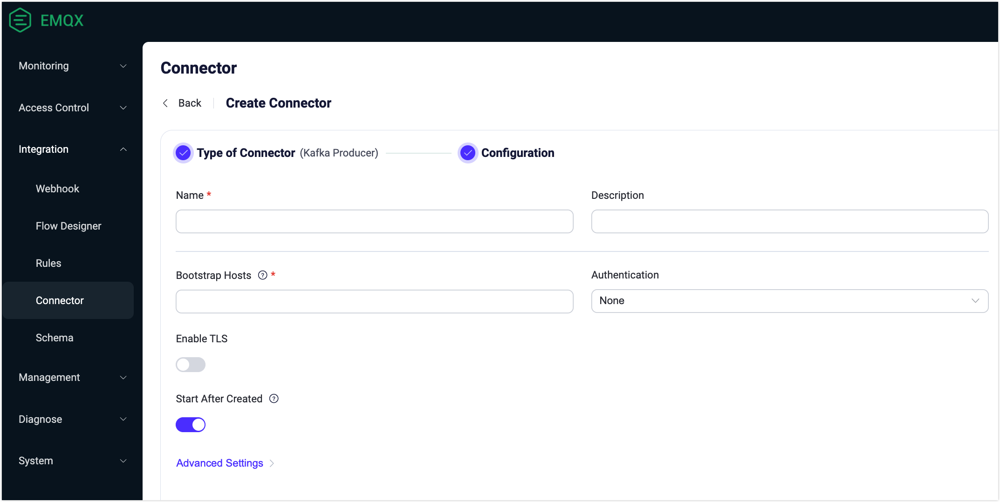
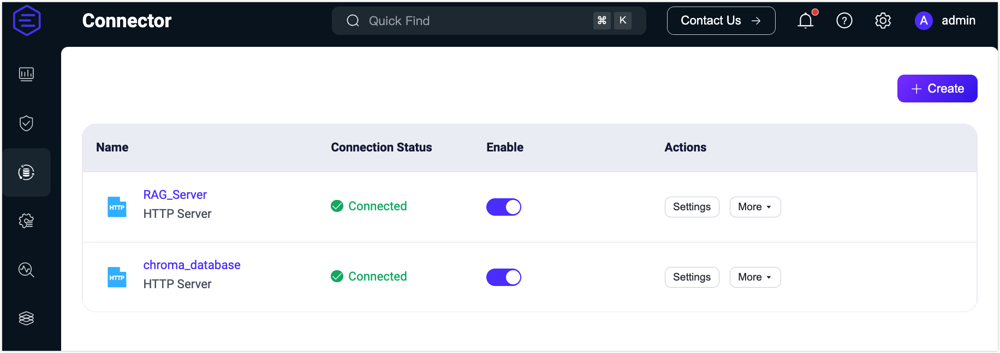

# Connector

The EMQX connector is a key concept in data integration, serving as the underlying connection channel for Sink/Source, used to connect to external data systems. 

## Basic Concepts

The connector focuses solely on connecting to external data systems. Users can create different connectors for various external data systems, and a single connector can provide connections for multiple Sinks/Sources.

Taking MySQL Sink as an example, the relationship between the connector, rules, and Sink is illustrated in the following diagram:

### Features and Advantages

When creating Sinks/Sources, users can choose an existing connector, without worrying about the details of the underlying connection. The benefits of this design are:

- Separating connection configuration from data processing and mapping configuration, making the design of data processing flows more modular and flexible.
- The creation and configuration of connectors do not affect the design of data processing flows. If connection information needs to be changed, it can be modified in the connector, which helps simplify configuration and maintenance.
- For some external data systems that need to connect to multiple Sinks/Sources, this can be achieved by creating a single connector, avoiding repetitive configuration work.

## Create a Connector

When you create a data integration, you must create a connector for the Sink/Source for the integration to work. You can create and manage connectors via the Dashboard. One connector can be reused for different Sink/Source.

:::tip 

You can also create a connector during the process of creating a Sink/Source, which will automatically enter the connector creation process. 

:::

1. On the Dashboard, click **Integration** -> **Connectors** in the left navigation menu.

2. Click the **Create** button in the top right corner of the page to enter the connector creation process.

3. On the connector type selection page, select the required connector and click **Next** to fill in the connection parameters. Supported connectors can be referenced [here](./data-bridges.md#supported-integrations).

   :::tip 

   In the EMQX Open Source edition, only HTTP and MQTT connectors are supported. 

   :::

   

4. On the connector configuration information page, fill in the basic information of the connector, including the connector name, description, and connection parameters. The content here refers to the connector parameter section in the usage documentation of each Sink/Source and is not repeated here.

   

## View and Manage Connectors

After a connector is created, you can view its basic information on the Connector page. You can also enable or disable it, and manage it, such as editing the settings, creating rules, duplicating the connector, or deleting it through the **Actions** column of the connector list. 

If the connector is used by a Sink/Source, updating the connector configuration will cause the Sink/Source to reload, which may cause data processing interruptions. It is recommended to update during off-peak business hours.

A connector that is in use cannot be deleted. To delete a connector, first delete the Sink/Source using the connector.

## Connection Status

You can view the running status of connectors on the Dashboard for troubleshooting and monitoring.

Connectors have the following statuses:

- **Connecting**: The initial state before any health check is performed, where the connector is still trying to connect to the external data system.
- **Connected**: The connector has successfully connected to the external data system. In this state, if a health check fails, the bridge may switch to a "connecting" or "disconnected" state, depending on the severity of the failure.
- **Disconnected**: The connector has failed the health check and is in an unhealthy state. Depending on its configuration, it may periodically attempt to automatically reconnect.
- **Inconsistent**: The connector status is inconsistent across cluster nodes. For example, the connector is in the connected state on some nodes and in the disconnected state on others.

## Considerations - Connection Pool

Some connectors offer the concept of a connection pool, a set of reusable connection objects. Through the connection pool, users do not need to recreate connections for each request, helping to reduce resource consumption and improve connection efficiency and concurrency.

The size of the connection pool refers to the size on each EMQX node, and EMQX creates a separate connection pool on each node. Given that EMQX is typically deployed in a cluster, this may lead to the actual number of connections exceeding the limits of the external data system.

For example, in an EMQX cluster with 3 nodes, if the connection pool size of the connector is set to 8, then EMQX will create 3 x 8 = 24 connections.
