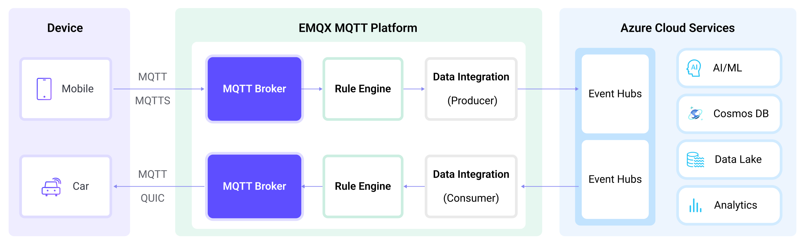

# Stream MQTT Data into Azure Event Hubs


:::tip
EMQX Enterprise Edition features. EMQX Enterprise Edition provides comprehensive coverage of key business scenarios, rich data integration, product-level reliability, and 24/7 global technical support. Experience the benefits of this [enterprise-ready MQTT messaging platform](https://www.emqx.com/en/try?product=enterprise) today.
:::


[Azure Event Hubs](https://azure.microsoft.com/en-us/products/event-hubs) is a real-time managed event streaming platform for data ingestion. EMQX's integration with Azure Event Hub offers users dependable data transport and processing capabilities in high-throughput situations. Azure Event Hubs can serve as a data channel between EMQX and Azure's rich cloud service applications, integrating IoT data into Azure Blob Storage, Azure Stream Analytics, and various applications and services deployed on Azure virtual machines. Currently, EMQX supports Azure Event Hub integration through SASL/PLAIN authentication and endpoints compatible with the Apache Kafka protocol.

This page provides a comprehensive introduction to the data integration between EMQX and Azure Event Hubs with practical instructions on creating and validating the rule and Sink.

## How It Works

Azure Event Hubs data integration is an out-of-the-box feature of EMQX designed to help users seamlessly integrate MQTT data streams with Azure Event Hubs and leverage its rich services and capabilities for IoT application development.



EMQX forwards MQTT data to Azure Event Hubs through the rule engine and Sink. The complete process is as follows:

1. **IoT Devices Publish Messages**: Devices publish telemetry and status data through specific topics, triggering the rule engine.
2. **Rule Engine Processes Messages**: Using the built-in rule engine, MQTT messages from specific sources are processed based on topic matching. The rule engine matches corresponding rules and processes messages, such as converting data formats, filtering specific information, or enriching messages with contextual information.
3. **Bridging to Azure Event Hubs**: The rule triggers the action of forwarding messages to Azure Event Hubs, allowing easy configuration of data properties, ordering keys, and mapping of MQTT topics to Azure Event Hubs headers. This provides richer context information and order assurance for data integration, enabling flexible IoT data processing.

After MQTT message data is written to Azure Event Hubs, you can perform flexible application development, such as:

- Real-time Data Processing and Analysis: Utilize powerful Azure Event Hubs data processing and analysis tools and its own streaming capabilities to perform real-time processing and analysis of message data, obtaining valuable insights and decision support.
- Event-Driven Functionality: Trigger Azure event handling to achieve dynamic and flexible function triggering and processing.
- Data Storage and Sharing: Transmit message data to Azure Event Hubs storage services for secure storage and management of large volumes of data. This allows you to share and analyze this data with other Azure services to meet various business needs.

## Features and Benefits

The data integration between EMQX and Azure Event Hubs can bring the following functions and advantages to your business:

- **High-Performance Massive Message Throughput**: EMQX supports connections with a massive number of MQTT clients, with millions of messages per second continuously ingested into Azure Event Hubs. This enables extremely low message transmission and storage latency, and message volume control can be achieved by configuring retention time on Azure Event Hubs.
- **Flexible Data Mapping**: Through the configured Azure Event Hubs, flexible mapping can be achieved between MQTT topics and Azure Event Hubs event centers. It also supports mapping MQTT user properties to Azure Event Hubs headers, providing richer context information and order assurance for data integration.
- **Elastic Scaling Support**: Both EMQX and Azure Event Hubs support elastic scaling and can expand according to the application specifications, easily scaling IoT data sizes from several MBs to several TBs.
- **Rich Ecosystem**: By adopting the standard MQTT protocol with the support for various mainstream IoT transmission protocols, EMQX can achieve the connection with various IoT devices. Combined with the support of Azure Event Hubs in Azure Functions, various programming language SDKs, and the Kafka ecosystem, it facilitates seamless IoT data access and processing from devices to the cloud.

These functionalities enhance integration capabilities and flexibility, helping users quickly implement the connection of massive IoT device data with Azure. They enable users to more conveniently harness the data analysis and intelligence capabilities brought by cloud computing, building powerful data-driven applications.

## Before You Start

This section describes the preparations you need to complete before you start to create the Azure Event Hub data integration in the EMQX Dashboard.

### Prerequisites

- Knowledge about EMQX data integration [rules](./rules.md)
- Knowledge about [Data Integration](./data-bridges.md)

### Set Up Azure Event Hub

To use Azure Event Hub data integration, a Namespace and Event Hub must be set up in the Azure account.  The following links to the official documentation provide details on how to do the setup.

- [Quickstart: Create an event hub using Azure portal](https://learn.microsoft.com/en-us/azure/event-hubs/event-hubs-create)
- [Quickstart: Stream data with Azure Event Hubs and Apache Kafka](https://learn.microsoft.com/en-us/azure/event-hubs/event-hubs-quickstart-kafka-enabled-event-hubs?tabs=connection-string)
  - Follow the "Connection String" instructions, as that's what EMQX uses for connecting.
- [Get an Event Hubs connection string](https://learn.microsoft.com/en-us/azure/event-hubs/event-hubs-get-connection-string)
- [What is Azure Event Hubs for Apache Kafka](https://learn.microsoft.com/en-us/azure/event-hubs/azure-event-hubs-kafka-overview)

## Create a Connector

To create the Azure Event Hubs data integration, you need to create a Connector to connect the Azure Event Hubs Sink to the Azure Event Hubs.

1. Go to the EMQX Dashboard and click on **Integrations** -> **Connectors**.
2. Click **Create** in the top right corner of the page.
3. On the **Create Connector** page, select **Azure Event Hubs** as the Connector type then click **Next**.
4. Enter the name and description of the Connector. The name should be a combination of uppercase and lowercase letters and numbers, for example, `my-azure-event-hubs`.
5. Configure the connection details.
   - **Bootstrap Host**: Enter the hostname of your namespace. The default port is `9093`. Set other fields as per your actual setup.
   - **Connection String**: Enter the connection string for your namespace, which can be found in the "Connection string - primary key" of the namespace's Shared access policies. For more details, see [Get an Event Hubs connection string](https://learn.microsoft.com/en-us/azure/event-hubs/event-hubs-get-connection-string).
   - **Enable TLS**: TLS is enabled by default when connecting to Azure Event Hub. For detailed TLS connection options, see [TLS for External Resource Access](../network/overview.md#enable-tls-encryption-for-accessing-external-resources).
6. Click the **Create** button at the bottom to complete the Connector creation. 

Now, Azure Event Hubs should be listed in the connector list (**Integrations** -> **Connectors**) with a **Connection Status** of **Connected**. Next, you need to create a rule and a Sink to specify the data to be streamed into the Azure Event Hubs.

## Create a Rule for Azure Event Hubs Sink 

This section demonstrates how to create a rule with an Azure Event Hubs Sink added to the rule.

1. Go to EMQX Dashboard, and click **Integration** -> **Rules**.

2. Click **Create** on the top right corner of the page.

3. Enter, for example, `my_rule` as the rule ID.

4. Enter the following statement in the **SQL Editor** if you want to save the MQTT messages under topic `t/#` to Azure Event Hubs.

   Note: If you want to specify your own SQL syntax, make sure that you have included all fields required by the Sink in the `SELECT` part.

   ```sql
   SELECT
     *
   FROM
     "t/#"
   ```

5. Click the **+ Add Action** button to define an action that will be triggered by the rule. Select `Azure Event Hubs` from the **Type of Action** dropdown list so that EMQX will send the data processed by the rule to Azure Event Hubs. 

   Keep the **Action** dropdown box with the value `Create Action`. Or, you also can select an Azure Event Hubs action previously created. In this demonstration, you create a new Sink and add it to the rule.

6. Enter the name and description for the Sink in the **Name** and **Description** text boxes.

7. Select the `my-azure-event-hubs` you just created from the **Connector** dropdown box. You can also create a new Connector by clicking the button next to the dropdown box. For the configuration parameters, see [Create a Connector](#create-connector).

8. Configure the Sink information.
   - **Event Hub Name**: Enter the name of the Event Hub to be used. Note: Variables are not supported here.
   - **Azure Event Hub Headers**: Enter a placeholder to be used as headers that will be added to the messages when being published to Azure Event Hub.
   - **Azure Event Hub Header value encode mode**: Select the value encode mode for the header; optional values are `none` or `json`.
   - **Extra Azure Event Hub headers**: You can click **Add** to provide more key-value pairs for Azure Event Hubs headers.
   - **Message Key**: Event hub message key. Insert a string here, either a plain string or a string containing placeholders (${var}).
   - **Message Value**: Event hub message value. Insert a string here, either a plain string or a string containing placeholders (${var}).
   - **Patrition Strategy**: Specify how the producer dispatches messages to Azure Event Hubs partitions.
     - `random`: Randomly pick a partition for each message.
     - `key_dispatch`: Hash Azure Event Hubs message key to a partition number.
   - **Partitions Limit**: Limits the maximum number of partitions to which a producer can send messages. It is disabled by default, which means the producer can send messages to all partitions.
   
9. Advanced settings (optional):  Choose whether to use **sync** or **async** query mode as needed. For details, see [Features of Sink](./data-bridges.md#features-of-sink).

10. Click the **Create** button to complete the Sink configuration. Back on the **Create Rule** page, you will see the new Sink appear under the **Action Outputs** tab.

11. On the **Create Rule** page, verify the configured information and click the **Create** button to generate the rule. The rule you created is shown in the rule list.

Now you have successfully created the rule and you can see the new rule appear on the **Rule** page. Click the **Actions(Sink)** tab, you see the new Azure Event Hubs Sink. 

You can also click **Integration** -> **Flow Designer** to view the topology. You can see that the messages under topic `t/#`  are sent and saved to Azure Event Hubs after parsing by the rule `my_rule`. 

## Test the Rule

To test if the Azure Event Hubs data integration works as you expected, you can use the [MQTTX](https://mqttx.app/) to simulate a client to publish MQTT messages to EMQX.

1. Use MQTTX to send messages to topic  `t/1`:

```bash
   mqttx pub -i emqx_c -t t/1 -m '{ "msg": "Hello Azure Event Hub" }'
```

2. Click the name of the rule on the **Rule** page to view the statistics. Check the running status of the Sink and there should be 1 new outgoing message.

3. Check whether messages are written into the configured Event Hub using any Kafka-compatible consumer. For more information about using the Kafka CLI, see [Use the Kafka CLI to Send and Receive Messages to/from Azure Event Hubs for Apache Kafka Ecosystem](https://github.com/Azure/azure-event-hubs-for-kafka/tree/master/quickstart/kafka-cli).
