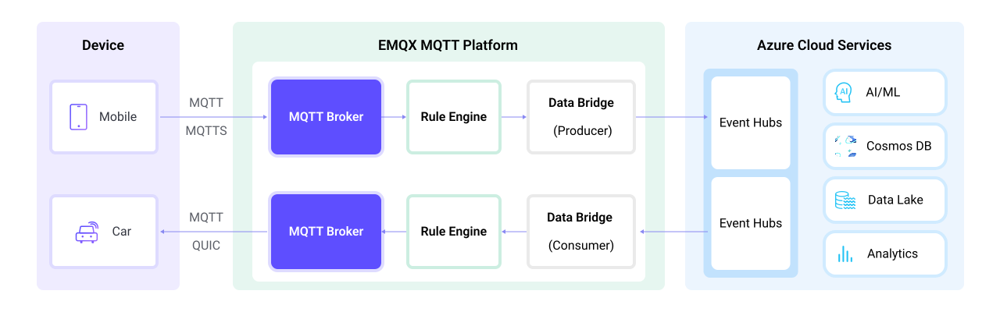

# Stream MQTT Data into Azure Event Hubs


:::tip
EMQX Enterprise Edition features. EMQX Enterprise Edition provides comprehensive coverage of key business scenarios, rich data integration, product-level reliability, and 24/7 global technical support. Experience the benefits of this [enterprise-ready MQTT messaging platform](https://www.emqx.com/en/try?product=enterprise) today.
:::


[Azure Event Hubs](https://azure.microsoft.com/en-us/products/event-hubs) is a real-time managed event streaming platform for data ingestion. EMQX's integration with Azure Event Hub offers users dependable data transport and processing capabilities in high-throughput situations.  EMQX currently supports Azure Event Hub integration via its Apache Kafka endpoint that is compatible with the Kafka protocol, using SASL/PLAIN authentication.

This page provides a comprehensive introduction to the data integration between EMQX and Azure Event Hubs with practical instructions on creating and validating the data integration.

## How It Works

Azure Event Hubs data bridge is an out-of-the-box feature of EMQX designed to help users seamlessly integrate MQTT data streams with Azure Event Hubs and leverage its rich services and capabilities for IoT application development.



EMQX forwards MQTT data to Azure Event Hubs through the rule engine and data bridge. The complete process is as follows:

1. **IoT Devices Publish Messages**: Devices publish telemetry and status data through specific topics, triggering the rule engine.
2. **Rule Engine Processes Messages**: Using the built-in rule engine, MQTT messages from specific sources are processed based on topic matching. The rule engine matches corresponding rules and processes messages, such as converting data formats, filtering specific information, or enriching messages with contextual information.
3. **Bridging to Azure Event Hubs**: The rule triggers the action of forwarding messages to Azure Event Hubs, allowing easy configuration of data properties, ordering keys, and mapping of MQTT topics to Azure Event Hubs headers. This provides richer context information and order assurance for data integration, enabling flexible IoT data processing.

After MQTT message data is written to Azure Event Hubs, you can perform flexible application development, such as:

- Real-time Data Processing and Analysis: Utilize powerful Azure Event Hubs data processing and analysis tools and its own streaming capabilities to perform real-time processing and analysis of message data, obtaining valuable insights and decision support.
- Event-Driven Functionality: Trigger Azure event handling to achieve dynamic and flexible function triggering and processing.
- Data Storage and Sharing: Transmit message data to Azure Event Hubs storage services for secure storage and management of large volumes of data. This allows you to share and analyze this data with other Azure services to meet various business needs.

## Features and Benefits


## Before You Start

This section describes the preparations you need to complete before you start to create the Azure Event Hub data bridge in the EMQX Dashboard.

### Prerequisites

- Knowledge about EMQX data integration [rules](./rules.md)
- Knowledge about [data bridge](./data-bridges.md)

### Set Up Azure Event Hub

In order to use Azure Event Hub data integration, a Namespace and Event Hub must be set up in the Azure account.  The following links to the official documentation provide details on how to do the setup.

- [Quickstart: Create an event hub using Azure portal](https://learn.microsoft.com/en-us/azure/event-hubs/event-hubs-create)
- [Quickstart: Stream data with Azure Event Hubs and Apache Kafka](https://learn.microsoft.com/en-us/azure/event-hubs/event-hubs-quickstart-kafka-enabled-event-hubs?tabs=connection-string)
  - Follow the "Connection String" instructions, as that's what EMQX uses for connecting.
- [Get an Event Hubs connection string](https://learn.microsoft.com/en-us/azure/event-hubs/event-hubs-get-connection-string)
- [What is Azure Event Hubs for Apache Kafka](https://learn.microsoft.com/en-us/azure/event-hubs/azure-event-hubs-kafka-overview)

## Create Azure Event Hubs Data Bridge

This section demonstrates how to create Azure Event Hubs producer data bridge via Dashboard.

1. Go to EMQX Dashboard, and click **Integration** -> **Data Bridge**.
2. Click **Create** on the top right corner of the page.
3. In the **Create Data Bridge** page, click to select **Azure Event Hubs**, and then click **Next**.
4. Enter a name for the data bridge. The name should be a combination of upper/lower case letters and numbers.
3. Configure the connection information.

   - **Bootstrap Hosts**: Enter the Host Name for your Namespace.  The default port is `9093`.  For the other fields set as the actual condition.
   - **Connection String**: Enter the Connection String for the Namespace.  It can be found in the "connection string-primary key" of a Namespace shared access policy. For more information, see [Get an Event Hubs connection string](https://learn.microsoft.com/en-us/azure/event-hubs/event-hubs-get-connection-string).
   - **Enable TLS**: TLS is enabled by default for connecting to Azure Event Hub. For more information on TLS connection options, see [TLS for External Resource Access](../network/overview.md#tls-for-external-resource-access).
   - Leave other fields by default or specify the value as your business needs.

6. Configure the data bridge information.
   - **Event Hub Name**: Enter the name of the Event Hub to be used. Note: Variables are not supported here.
   - **Azure Event Hub Headers**: Enter a placeholder to be used as headers that will be added to the messages when being published to Azure Event Hub.
   - **Azure Event Hub Header value encode mode**: Select the value encode mode for the header; optional values are `none` or `json`.
   - **Extra Azure Event Hub headers**: You can click **Add** to provide more key-value pairs for Azure Event Hub headers.
   - **Message Key**: Event hub message key. Insert a string here, either a plain string or a string containing placeholders (${var}).
   - **Message Value**: Event hub message value. Insert a string here, either a plain string or a string containing placeholders (${var}).
   - **Message Timestamp**: Specify the type of timestamp to be used.

7. Advanced settings (optional): Set the **Max Batch Bytes**, **Required Acks**, and **Partition Strategy** as your business needs.

8. Before clicking **Create**, you can click **Test Connection** to test that the bridge can connect to the Azure Event Hub server.

9. Click **Create**, you'll be offered the option of creating an associated rule.

   For the Azure Event Hub producer data bridge, click **Create Rule** to create an associated rule. For detailed operating steps, see [Create Rule for Azure Event Hub Producer Data Bridge](#create-rule-for-azure-event-hub-producer-data-bridge).

   ::: tip

   Creating a rule allows Azure Event Hub messages matching the rule to be further transformed and filtered if needed, and then forwarded to other rule actions, like different bridges. Refer to the [Rules](./rules.md) for more information on creating rules.

   :::

Now the Azure Event Hub data bridge should appear in the data bridge list (**Integration** -> **Data Bridge**) with **Resource Status** as **Connected**.

## Create Rule for Azure Event Hubs Producer Data Bridge

1. Go to EMQX Dashboard, and click **Integration** -> **Rules**.

2. Click **Create** on the top right corner of the page.

3. Input, for example, `my_rule` as the rule ID.

4.  Input the following statement in the **SQL Editor** if you want to save the MQTT messages under topic `t/#` to Azure Event Hub.

   Note: If you want to specify your own SQL syntax, make sure that you have included all fields required by the data bridge in the `SELECT` part.

```sql
SELECT
  *
FROM
  "t/#"
```

5. Click the **Add Action** button, select **Forwarding with Data Bridge** from the dropdown list and then select the data bridge you just created under **Data bridge**. Then click the **Add** button.

6. Click **Create** at the page bottom to finish the creation.

Now you have successfully created the data bridge to Azure Event Hub producer data bridge. You can click **Integration** -> **Flows** to view the topology. It can be seen that the messages under topic `t/#`  are sent and saved to Azure Event Hub after parsing by rule  `my_rule`.

## Test Data Bridge and Rule

To test if the Kafka producer data bridge and rule work as you expected, you can use the [MQTTX](https://mqttx.app/) to simulate a client to publish MQTT messages to EMQX.

1. Use MQTTX to send messages to topic  `t/1`:

```bash
   mqttx pub -i emqx_c -t t/1 -m '{ "msg": "Hello Azure Event Hub" }'
```

2. Click the name of the data bridge on the **Data Bridge** page to view the statistics. Check the running status of the data bridge and there should be one new outgoing message.

3. Check whether messages are written into the configured Event Hub using any Kafka-compatible consumer. For more information about using the Kafka CLI, see [Use the Kafka CLI to Send and Receive Messages to/from Azure Event Hubs for Apache Kafka Ecosystem](https://github.com/Azure/azure-event-hubs-for-kafka/tree/master/quickstart/kafka-cli).
