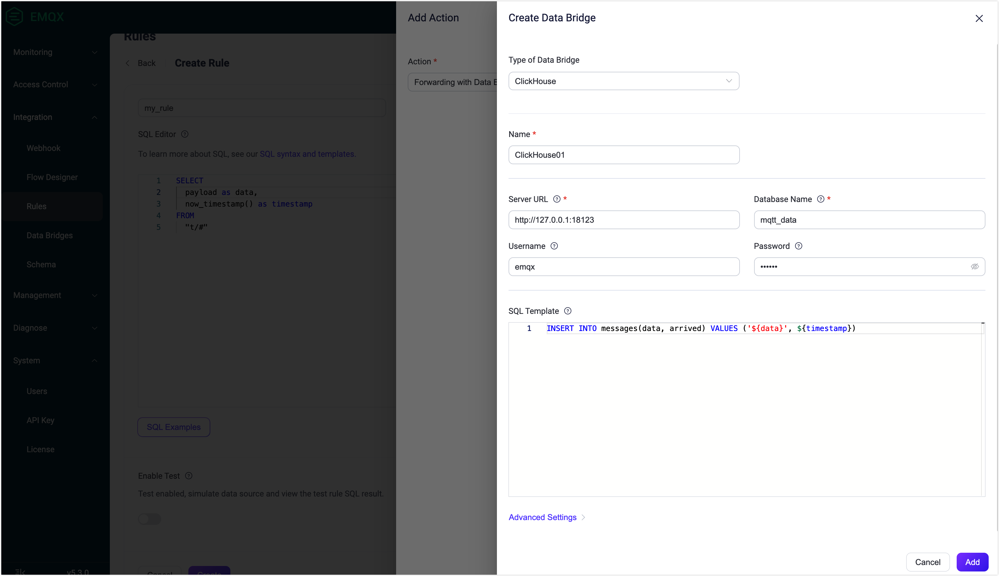

# Ingest MQTT Data into ClickHouse 


:::tip
The ClickHouse bridge is an EMQX Enterprise Edition feature. EMQX Enterprise Edition provides comprehensive coverage of key business scenarios, rich data integration, product-level reliability, and 24/7 global technical support. Experience the benefits of this [enterprise-ready MQTT messaging platform](https://www.emqx.com/en/try?product=enterprise) today.
:::


ClickHouse is a high-performance distributed database management system designed for processing large-scale data. It features excellent query performance, a flexible data model, and scalable distributed architecture, making it suitable for various data analytics scenarios.

EMQX supports integration with [ClickHouse](https://clickhouse.com/) so you can save messages and events data to ClickHouse. 

## How It Works

## Features and Benefits


## Before You Start

This section introduces how to use the ClickHouse bridge with a practical tutorial, covering topics like how to create a ClickHouse server, how to set up a bridge, and how to set up a rule for forwarding data to the bridge and testing that it all works. 

This tutorial assumes that you run both EMQX and ClickHouse on the local machine. If you have ClickHouse and EMQX running remotely, please adjust the settings accordingly.

### Prerequisites

- Knowledge about EMQX data integration [rules](./rules.md)

- Knowledge about [data bridges](./data-bridges.md)

- Basic knowledge of UNIX terminal and commands 

### Start a ClickHouse Server

This section introduces how to start a ClickHouse server using [Docker](https://www.docker.com/). 

1. Create a file called `init.sql` using the following initialization SQL statements. This file helps to initialize the database when the container starts up.

   ```bash
   cat >init.sql <<SQL_INIT
   CREATE DATABASE IF NOT EXISTS mqtt_data;
   CREATE TABLE IF NOT EXISTS mqtt_data.messages (
       data String,
       arrived UnixTimestamp
   ) ENGINE = MergeTree();
   SQL_INIT
   ```
   
1. Start a ClickHouse server using the following command. The command defines the database name, port number, user name, and password. It will also mount the `init.sql` file in the current directory to the docker directory.

   ```bash
   docker run \
   --rm \
   -e CLICKHOUSE_DB=mqtt_data \
   -e CLICKHOUSE_USER=emqx \
   -e CLICKHOUSE_DEFAULT_ACCESS_MANAGEMENT=1 \
   -e CLICKHOUSE_PASSWORD=public \
   -p 18123:8123 \
   -p 19000:9000 \
   --ulimit nofile=262144:262144 \
   -v ./init.sql:/docker-entrypoint-initdb.d/init.sql \
   clickhouse/clickhouse-server
   ```

You can find more information about running ClickHouse in docker [on dockerhub](https://hub.docker.com/r/clickhouse/clickhouse-server).

## Create Rule and ClickHouse Databridge

This section demonstrates how to create a rule in EMQX to process messages from the source MQTT topic `t/#`  and send the processed results through a configured data bridge to ClickHouse. 

1. Go to EMQX Dashboard, and click **Integration** -> **Rules**.

2. Click **Create** on the top right corner of the page.

3. Input, for example, `my_rule` as the rule ID.

4. Input the following statement in the SQL editor, which will forward the MQTT messages matching the topic pattern `t/#`. 

   ```sql
   SELECT 
     payload as data,
     now_timestamp() as timestamp
   FROM
     "t/#"
   ```

   Note: If you are a beginner user, click **SQL Examples** and **Enable Test** to learn and test the SQL rule. 

5. Click the + **Add Action** button to define an action that will be triggered by the rule. Select **Forwarding with Data Bridge** from the dropdown list. With this action, EMQX sends the data processed by the rule to ClickHouse.

6. Click the **+** icon next to the **Data bridge** drop-down box to create a data bridge.

7. Select **ClickHouse** from the **Type of Data Bridge** drop-down list. 

8. Enter a name for the data bridge. The name should be a combination of upper/lower case letters and numbers.

9. Enter the connection information for connecting to the ClickHouse database:

   - **Server URL**: Enter `http://127.0.0.1:18123`, or the actual URL if the ClickHouse server is running remotely.
   - **Database Name**: Enter `mqtt_data`.
   - **Username**: Enter `emqx`.
   - **Password**: Enter `public`.

10. Enter the following statement in the **SQL Template**. 

    ::: tip

    You can use [Rule Engine](./rules.md) to ensure that strings in the specified SQL statement are escaped so the SQL statement is not vulnerable to SQL injection attacks.

    :::

    ```sql
    INSERT INTO messages(data, arrived) VALUES ('${data}', ${timestamp})
    ```

    The `${data}` and `${timestamp}` are placeholders for the data and timestamp of the message coming from the rule you configured before. The placeholders will be replaced by the actual data before the message is sent to the ClickHouse server.

2. Advanced settings (optional): See [Advanced Configurations](#advanced-configurations).

12. Click the **Add** button to complete the data bridge configuration. You will be redirected back to the **Add Action** page. Select the ClickHouse Data Bridge you just created from the **Data bridge** drop-down list. Click the **Add** button at the bottom to include this action in the rule.

    

13. Back on the **Create Rule** page, verify the configured information. Click the **Create** button to generate the rule.

Now a rule to forward data to ClickHouse via a ClickHouse data bridge is created. You can click **Integration** -> **Flows** to view the topology. It can be seen that the messages under topic `t/#`  are sent and saved to ClickHouse. 

## Test Rule and Data Bridge

You can use the built-in WebSocket client in the EMQX dashboard to test our rule and bridge.

Click **Diagnose** -> **WebSocket Client** in the left navigation menu of the Dashboard to access the WebSocket Client. Follow the steps below to set up a WebSocket client and send a message to the topic `t/test`:

1. Fill in the connection information for the current EMQX instance. If you are running EMQX locally, you can use the default values unless you have changed EMQX's default configuration (for example, you might have configured authentication which may require you to type in a username and password). 

2. Click **Connect** to connect the client to the EMQX instance.

3. Scroll down to the publish area and type in the following:
   * **Topic**: `t/test`
   * **Payload**: `Hello World Clickhouse from EMQX`
   * **QoS**: 2
   
4. Click **Publish** to send the message. An entry should have been inserted in the table `messages` in the database `mqtt_data` in the ClickHouse server. You can check this by running the following command from a terminal:

   ```bash
   curl -u emqx:public -X POST -d "SELECT * FROM mqtt_data.messages" http://localhost:18123
   ```

5. If everything is working correctly the command above should print something like this (obviously, the timestamp will be different):

   ```
   Hello World Clickhouse from EMQX        1679932005
   ```

## Advanced Configurations

This section delves deeper into the advanced configuration options available for the EMQX ClickHouse data bridge. When configuring the data bridge, navigate to **Advanced Settings** to tailor the following parameters to meet your specific needs.

| **Fields**                | **Descriptions**                                             | **Recommended Value** |
| ------------------------- | ------------------------------------------------------------ | --------------------- |
| **Batch Value Separator** | In this example, you can keep the default value ",". This setting only needs to be changed if you enable [batching](./data-bridges.md) for the bridge and if you specify an alternative format with [ClickHouse's FORMAT syntax](https://clickhouse.com/docs/en/sql-reference/statements/insert-into). |                       |
| **Connection Pool Size**  |                                                              |                       |
| **Clickhouse Timeout**    |                                                              |                       |
| **Start Timeout**         |                                                              |                       |
| **Buffer Pool Size**      |                                                              |                       |
| **Request TTL**           |                                                              |                       |
| **Health Check Interval** |                                                              | auto                  |
| **Max Buffer Queue Size** |                                                              |                       |
| **Query Mode**            |                                                              |                       |
| **Inflight Window**       |                                                              |                       |

## More Information
