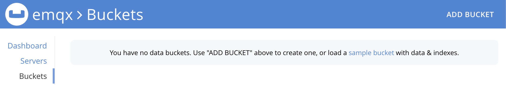

# Ingest MQTT Data into Couchbase

::: tip

The Couchbase data integration is an EMQX Enterprise edition feature.

:::

[Couchbase](https://couchbase.com/) is a multipurpose, distributed database that fuses the strengths of relational databases such as SQL and ACID transactions with JSON’s versatility, with a foundation that is extremely fast and scalable. It’s used across industries for things like user profiles, dynamic product catalogs, GenAI apps, vector search, high-speed caching, and much more.

## How It Works

Couchbase data integration is an out-of-the-box feature in EMQX designed to combine the MQTT's real-time data capturing and transmission capabilities with Couchbase's powerful data processing functionality. With a built-in [rule engine](https://docs.emqx.com/en/emqx/latest/data-integration/rules.html) component, the integration simplifies the process of ingesting data from EMQX to Couchbase for storage and analysis, eliminating the need for complex coding.

The diagram below illustrates a typical architecture of data integration between EMQX and Couchbase.


Ingesting MQTT data into Couchbase works as follows:

1. **Message publication and reception**: Industrial IoT devices establish successful connections to EMQX through the MQTT protocol and publish real-time MQTT data from machines, sensors, and product lines based on their operational states, readings, or triggered events to EMQX. When EMQX receives these messages, it initiates the matching process within its rules engine.  
3. **Message data processing:** When a message arrives, it passes through the rule engine and is then processed by the rule defined in EMQX. The rules, based on predefined criteria, determine which messages need to be routed to ClickHouse. If any rules specify payload transformations, those transformations are applied, such as converting data formats, filtering out specific information, or enriching the payload with additional context.
4. **Data ingestion into Couchbase**: Once the rule engine identifies a message for Couchbase storage, it triggers an action of forwarding the messages to Couchbase. Processed data will be seamlessly written into the dataset of the Couchbase database.
5. **Data Storage and Utilization**: With the data now stored in Couchbase, businesses can harness its querying power for various use cases. For instance, in logistics and supply chain management fields, data from IoT devices such as GPS trackers, temperature sensors, and inventory management systems can be monitored and analyzed for real-time tracking, route optimization, demand forecasting, and efficient inventory management.

## Features and Benefits

The data integration with Couchbase offers a range of features and benefits tailored to ensure efficient data transmission, storage, and utilization:

- **Real-time Data Streaming**: EMQX is built for handling real-time data streams, ensuring efficient and reliable data transmission from source systems to Couchbase. It enables organizations to capture and analyze data in real-time, making it ideal for use cases requiring immediate insights and actions.
- **High Performance and Scalability**: EMQX's distributed architecture and Couchbase's columnar storage format enable seamless scalability as data volumes increase. This ensures consistent performance and responsiveness, even with large datasets.
- **Flexibility in Data Transformation:** EMQX provides a powerful SQL-based Rule Engine, allowing organizations to pre-process data before storing it in Couchbase. It supports various data transformation mechanisms, such as filtering, routing, aggregation, and enrichment, enabling organizations to shape the data according to their needs.
- **Easy Deployment and Management:** EMQX provides a user-friendly interface for configuring data sources, pre-processing data rules, and Couchbase storage settings. This simplifies the setup and ongoing management of the data integration process.
- **Advanced Analytics:** Couchbase's powerful SQL-based query language and support for complex analytical functions empower users to gain valuable insights from IoT data, enabling predictive analytics, anomaly detection, and more.

## Before You Start

This section describes the preparations you need to complete before you start to create the Couchbase data integration in EMQX Dashboard.

### Prerequisites

- Knowledge about EMQX data integration [rules](./rules.md)

- Knowledge about [data integration](./data-bridges.md)

- Basic knowledge of UNIX terminal and commands 

### Start a Couchbase Server

This section introduces how to start a Couchbase server using [Docker](https://www.docker.com/). 

1. Start a Couchbase server using the following command.

   ```bash
   docker run -t --name db -p 8091-8096:8091-8096 -p 11210-11211:11210-11211 couchbase/server:enterprise-7.2.0
   ```

When you run the command, Docker downloads and installs Couchbase Server. You should see the following message once Couchbase Server is started in a Docker virtual environment:

```
Starting Couchbase Server -- Web UI available at http://<ip>:8091
and logs available in /opt/couchbase/var/lib/couchbase/logs
```

2. Open Couchbase Web Console in your browser by visiting `http://localhost:8091`.


3. Click **Setup New Cluster** and provide a name for your cluster. For the purpose of getting started, set the full administrator credentials to `admin` and `password`.


4. Accept the Terms and Conditions and click **Finish with Defaults** to complete configuration with default values.

5. When you have finished entering your configuration details, click the **Save & Finish** button, at the lower right. This configures the server accordingly, and brings up the Couchbase Web Console Dashboard. Select **Buckets** in the navigation panel on the left side, and click the **Add Bucket** button.



7. Enter a name for the bucket, for example, `emqx`, and click **Create** to create the bucket.

You can find more information about running Couchbase in docker [on the official documentation page](https://docs.couchbase.com/server/current/getting-started/do-a-quick-install.html).

8. Create a primary index for the default collection:

    ```
    docker exec -t db /opt/couchbase/bin/cbq -u admin -p password -engine=http://127.0.0.1:8091/ -script "create primary index on default:emqx_data._default._default;"
    ```

## Create a Connector

This section demonstrates how to create a Connector to connect the Sink to the Couchbase server.

The following steps assume that you run both EMQX and Couchbase on the local machine. If you have Couchbase and EMQX running remotely, adjust the settings accordingly.

1. Enter the EMQX Dashboard and click **Integration** -> **Connectors**.
2. Click **Create** in the top right corner of the page.
3. On the **Create Connector** page, select **Couchbase** and then click **Next**.
4. In the **Configuration** step, configure the following information:
   - **Connector name**: Enter a name for the connector, which should be a combination of upper and lower-case letters and numbers, for example: `my_couchbase`.
   - **Server Host**: `127.0.0.1`
   - **Username**: `admin`
   - **Password**: `password`
5. Advanced settings (optional): See [Advanced Configurations](#advanced-configurations).
6. Before clicking **Create**, you can click **Test Connectivity** to test if the connector can connect to the Couchbase server.
7. Click the **Create** button at the bottom to complete the creation of the connector. In the pop-up dialog, you can click **Back to Connector List** or click **Create Rule** to continue creating rules and Sink to specify the data to be forwarded to Couchbase. For detailed steps, see [Create a Rule with Couchbase Sink](#create-a-rule-with-couchbase-sink).

## Create a Rule with Couchbase Sink

This section demonstrates how to create a rule in Dashboard for processing messages from the source MQTT topic `t/#`  and forwarding the processed results to Couchbase via a configured Sink. 

1. Go to EMQX Dashboard, and click **Integration** -> **Rules** from the left navigation menu.

2. Click **Create** on the top right corner of the page.

3. Enter the rule ID, for example, `my_rule`.

4. Leave the statement in the SQL editor, it will forward the MQTT messages matching the topic pattern `t/#`. 

   ```sql
   SELECT 
     *
   FROM
     "t/#"
   ```

5. Click the + **Add Action** button to define an action that will be triggered by the rule. With this action, EMQX sends the data processed by the rule to Couchbase. 

6. Select `Couchbase` from the **Type of Action** dropdown list. Keep the **Action** dropdown with the default `Create Action` value. You can also select a Couchbase Sink if you have created one. This demonstration will create a new Sink.

7. Enter a name for the Sink. The name should combine upper/lower case letters and numbers.

8. Select the `my_couchbase` just created from the **Connector** dropdown box. You can also create a new Connector by clicking the button next to the dropdown box. For the configuration parameters, see [Create a Connector](#create-a-connector).

9. Enter the following command in the SQL template:

    ```sql
    insert into emqx_data (key, value) values (${.id}, ${.payload})
    ```

    Here, `${.id}` and `${.payload}` represent the MQTT message id and payload, respectively. EMQX will replace them with the corresponding content before forwarding the message.

10. Advanced settings (optional): See [Advanced Configurations](#advanced-configurations).

11. Before clicking **Create**, you can click the **Test Connectivity** button to ensure that you can connect to the Couchbase server.

13. Click the **Create** button to complete the Sink configuration. Back on the **Create Rule** page, you will see the new Sink appear under the **Action Outputs** tab.

14. On the **Create Rule** page, verify the configured information and click the **Create** button to generate the rule. The rule you created is shown in the rule list and the **status** should be connected.


Now you have successfully created the rule and you can see the new rule appear on the **Rule** page. Click the **Actions(Sink)** tab, you see the new Couchbase Sink. 

You can also click **Integration** -> **Flow Designer** to view the topology. You can see that the messages under topic `t/#`  are sent and saved to Couchbase after parsing by the rule `my_rule`. 

## Test the Rule

You can use the built-in WebSocket client in the EMQX dashboard to test if the rule works as expected.

Click **Diagnose** -> **WebSocket Client** in the left navigation menu of the Dashboard to access the WebSocket Client. Follow the steps below to set up a WebSocket client and send a message to the topic `t/test`:

1. Fill in the connection information for the current EMQX instance. If you are running EMQX locally, you can use the default values unless you have changed EMQX's default configuration (for example, you might have configured authentication which may require you to type in a username and password). 

2. Click **Connect** to connect the client to the EMQX instance.

3. Scroll down to the publish area and type in the following:
   * **Topic**: `t/test`
   * **Payload**: `Hello World Couchbase from EMQX`
   * **QoS**: 2
   
4. Click **Publish** to send the message. An item should have been inserted in the `emqx_data` bucket in the Couchbase server. You can check this by running the following command from a terminal:

   ```bash
   docker exec -t db /opt/couchbase/bin/cbq -u admin -p password -engine=http://127.0.0.1:8091/ -script "SELECT * FROM emqx_data._default._default LIMIT 5;"
   ```

5. If everything is working correctly the command above should print something like this (`requestID` and metrics may vary):

    ```
    {
        "requestID": "88be238c-5b63-453d-ac16-c0368a5be2bc",
        "signature": {
            "*": "*"
        },
       "results": [
       {
           "_default": "Hello World Couchbase from EMQX"
       }
       ],
       "status": "success",
       "metrics": {
           "elapsedTime": "3.189125ms",
           "executionTime": "3.098709ms",
           "resultCount": 1,
           "resultSize": 61,
           "serviceLoad": 2
       }
   }
   ```

## Advanced Configurations

This section delves deeper into the advanced configuration options available for the EMQX Couchbase Connector. When configuring the Connector in the Dashboard, navigate to **Advanced Settings** to tailor the following parameters to meet your specific needs.

| **Fields**                | **Descriptions**                                             | **Recommended Value** |
| ------------------------- | ------------------------------------------------------------ | --------------------- |
| HTTP Pipelining           | Specifies the number of HTTP requests that can be sent to the server in a continuous sequence without waiting for individual responses. This option takes a positive integer value that represents the maximum number of HTTP requests that will be pipelined. <br />When set to `1`, it indicates a traditional request-response model where each HTTP request will be sent, and then the client will wait for a server response before sending the next request. Higher values enable more efficient use of network resources by allowing multiple requests to be sent in a batch, reducing the round-trip time. | `100`              |
| **Connection Pool Size**  | Specifies the number of concurrent connections that can be maintained in the connection pool when interfacing with the Couchbase service. This option helps in managing the application's scalability and performance by limiting or increasing the number of active connections between EMQX and Couchbase.<br/>**Note**: Setting an appropriate connection pool size depends on various factors such as system resources, network latency, and the specific workload of your application. Too large a pool size may lead to resource exhaustion, while too small a size may limit throughput.   | `8`                   |
| **Connect Timeout**       | Specifies the maximum amount of time, in seconds, that the Connector will wait while attempting to establish a connection with the Couchbase server.<br/>**Note**: A carefully chosen timeout setting is crucial for balancing system performance and resource utilization. It is advisable to test the system under various network conditions to find the optimal timeout value for your specific use case. | `15`                  |
| **Start Timeout**         | Determines the maximum time interval, in seconds, that the Connector will wait for an auto-started resource to reach a healthy state before responding to resource creation requests. This setting helps ensure that the Connector does not proceed with operations until it verifies that the connected resource—such as a database instance in Couchbase—is fully operational and ready to handle data transactions. | `5`                   |
| **Health Check Interval** | Specifies the time interval, in seconds, at which the Connector will perform automated health checks on the connection to Couchbase. | `15`                  |
