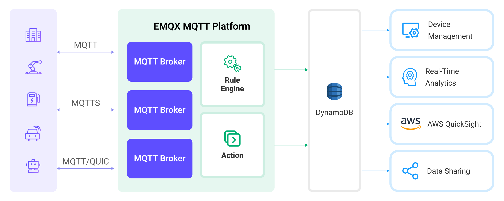

# Ingest MQTT Data into DynamoDB

::: tip

The DynamoDB data integration is an EMQX Enterprise edition feature.

:::

[DynamoDB](https://www.amazonaws.cn/en/dynamodb/) is a fully managed, high-performance, serverless key-value store database service on AWS. It is designed for applications that require fast, scalable, and reliable data storage. EMQX supports integration with DynamoDB, enabling you to save MQTT messages and client events to DynamoDB, facilitating the registration and management of IoT devices, as well as the long-term storage and real-time analysis of device data. Through the DynamoDB data integration, MQTT messages and client events can be stored in DynamoDB, and events can also trigger updates or deletions of data within DynamoDB, thereby enabling the recording of information such as device online status and connection history.

This page provides a comprehensive introduction to the data integration between EMQX and DynamoDB with practical instructions on creating and validating the data integration.

## How It Works

DynamoDB data integration is an out-of-the-box feature in EMQX that combines EMQX's device connectivity and message transmission capabilities with DynamoDB's powerful data storage capabilities. With a built-in [rule engine](./rules.md) component, the integration simplifies the process of ingesting data from EMQX to DynamoDB for storage and management, eliminating the need for complex coding. 

The diagram below illustrates a typical architecture of data integration between EMQX and DynamoDB:



Ingesting MQTT data into DynamoDB works as follows:

1. **Message publication and reception**: IoT devices, whether they are part of connected vehicles, IIoT systems, or energy management platforms, establish successful connections to EMQX through the MQTT protocol and publish MQTT messages to specific topics. When EMQX receives these messages, it initiates the matching process within its rules engine.
2. **Message data processing:** When a message arrives, it passes through the rule engine and is then processed by the rule defined in EMQX. The rules, based on predefined criteria, determine which messages need to be routed to DynamoDB. If any rules specify payload transformations, those transformations are applied, such as converting data formats, filtering out specific information, or enriching the payload with additional context.
3. **Data ingestion into DynamoDB**: Once the rule engine identifies a message for DynamoDB storage, it triggers an action of forwarding the messages to DynamoDB. Processed data will be seamlessly written into the collection of the DynamoDB database.
4. **Data storage and utilization**: With the data now stored in DynamoDB, businesses can harness its querying power for various use cases. For instance, in the realm of connected vehicles, this stored data can inform fleet management systems about vehicle health, optimize route planning based on real-time metrics, or track assets. Similarly, in IIoT settings, the data might be used to monitor machinery health, forecast maintenance, or optimize production schedules.

## Features and Benefits

The data integration with DynamoDB offers a range of features and benefits tailored to ensure efficient data transmission, storage, and utilization:

- **Real-time Data Streaming**: EMQX is built for handling real-time data streams, ensuring efficient and reliable data transmission from source systems to DynamoDB. It enables organizations to capture and analyze data in real-time, making it ideal for use cases requiring immediate insights and actions.
- **Flexibility in Data Transformation:** EMQX provides a powerful SQL-based Rule Engine, allowing organizations to pre-process data before storing it in DynamoDB. It supports various data transformation mechanisms, such as filtering, routing, aggregation, and enrichment, enabling organizations to shape the data according to their needs.
- **Flexible Data Model**: DynamoDB uses key-value and document data models, suitable for storing and managing structured device events and message data, allowing for easy storage of different MQTT message structures.
- **Powerful Scalability**: EMQX offers cluster scalability, capable of seamless horizontal scaling based on device connections and message volume; DynamoDB, requiring no server or infrastructure management, automatically handles underlying resource management and scaling. The combination of both provides high-performance and highly reliable data storage and scalability.

## Before You Start

This section describes the preparations you need to complete before you start to create a DynamoDB data integration, including how to install a DynamoDB server and create a data table.

### Prerequisites

- Knowledge about EMQX data integration [rules](./rules.md)
- Knowledge about [data integration](./data-bridges.md)

### Install DynamoDB Local Server and Create Table

1. Use the following command to run DynamoDB server locally:

   - Access Key ID: `root`
   - Secret Access Key: `public`
   - Region: `us-west-2`

   ```bash
   docker run -d -p 8000:8000 --name dynamodb-local \
     -e AWS_ACCESS_KEY_ID=root \
     -e AWS_SECRET_ACCESS_KEY=public \
     -e AWS_DEFAULT_REGION=us-west-2 \
     amazon/dynamodb-local:2.4.0
   ```

2. Prepare a table definition file, place it in the current directory, and name it `mqtt_msg.json`. The table definition is as follows:

   - Define `device_id` as the hash key (partition key).
   - Define `timestamp` as the range key (sort key).
   - Define an attribute named `device_id` of type string (S).
   - Define an attribute named `timestamp` of type number (N).

   ```json
   {
       "TableName": "mqtt_msg",
       "AttributeDefinitions": [
           {
               "AttributeName": "device_id",
               "AttributeType": "S"
           },
           {
               "AttributeName": "timestamp",
               "AttributeType": "N"
           }
       ],
       "KeySchema": [
           {
               "AttributeName": "device_id",
               "KeyType": "HASH"
           },
           {
               "AttributeName": "timestamp",
               "KeyType": "RANGE"
           }
       ],
       "ProvisionedThroughput": {
           "ReadCapacityUnits": 5,
           "WriteCapacityUnits": 5
       }
   }
   ```

3. Use Docker to run `aws-cli` command to create a new table using the file:

   ```bash
   docker run --rm -v $PWD:/dynamo_data \
       -e AWS_ACCESS_KEY_ID=root \
       -e AWS_SECRET_ACCESS_KEY=public \
       -e AWS_DEFAULT_REGION=us-west-2 \
       amazon/aws-cli:2.15.57 dynamodb create-table \
       --cli-input-json file:///dynamo_data/mqtt_msg.json \
       --endpoint-url http://host.docker.internal:8000
   ```

4. Use Docker to run `aws-cli` command to verify if the table creation was successful:

   ```bash
   docker run --rm \
       -e AWS_ACCESS_KEY_ID=root \
       -e AWS_SECRET_ACCESS_KEY=public \
       -e AWS_DEFAULT_REGION=us-west-2 \
       amazon/aws-cli:2.15.57 dynamodb list-tables \
       --endpoint-url http://host.docker.internal:8000
   ```

   The following JSON will be printed if the table was created successfully.

   ```json
   {
       "TableNames": [
           "mqtt_msg"
       ]
   }
   ```

## Create a Connector

This section demonstrates how to create a connector to connect the Sink to the DynamoDB server.

The following steps assume that you run both EMQX and DynamoDB on the local machine. If you have DynamoDB and EMQX running remotely, adjust the settings accordingly.

1. Enter the EMQX Dashboard and click **Integration** -> **Connectors**.
2. Click **Create** in the top right corner of the page.
3. On the **Create Connector** page, select **DynamoDB** and then click **Next**.
4. In the **Configuration** step, configure the following information:
   - **Connector name**: Enter a name for the connector, which should be a combination of upper and lower-case letters and numbers, for example: `my_dynamodb`.
   - **DynamoDB Region**: Enter `us-west-2`.
   - **DynamoDB Endpoint**: Enter `http://127.0.0.1:8000`, or the actual URL if the DynamoDB server is running remotely.
   - **AWS Access Key ID**: Enter `root`.
   - **AWS Secret Access Key**: Enter `public`.
5. Advanced settings (optional):  For details, see [Features of Sink](./data-bridges.md#features-of-sink).
6. Before clicking **Create**, you can click **Test Connectivity** to test if the connector can connect to the DynamoDB server.
7. Click the **Create** button at the bottom to complete the creation of the connector. In the pop-up dialog, you can click **Back to Connector List** or click **Create Rule** to continue creating rules with Sinks to specify the data to be forwarded to the DynamoDB and to record client events. For detailed steps, see [Create a Rule with DynamoDB Sink for Message Storage](#create-a-rule-with-dynamodb-sink-for-message-storage) and [Create a Rule with DynamoDB Sink for Events Recording](#create-a-rule-with-dynamodb-sink-for-events-recording).

## Create a Rule with DynamoDB Sink for Message Storage

This section demonstrates how to create a rule in the Dashboard for processing messages from the source MQTT topic `t/#`, and writing the processed data to the DynamoDB table `mqtt_msg` via a configured Sink. 

1. Go to EMQX Dashboard, and click **Integration** -> **Rules**.

2. Click **Create** on the top right corner of the page.

3. Enter `my_rule` as the rule ID. To create a rule for message storage, enter the following statement in the **SQL Editor**, which means the MQTT messages under topic `t/#`  will be saved to DynamoDB.

   Note: If you want to specify your own SQL syntax, make sure that you have included all fields required by the Sink in the `SELECT` part.

   ```sql
   SELECT 
     *
   FROM
     "t/#"
   ```

   ::: tip

   If you are a beginner user, click **SQL Examples** and **Enable Test** to learn and test the SQL rule. 

   :::

   If a placeholder variable is undefined in the SQL template, you can toggle the **Undefined Vars as Null** switch above the **SQL template** to define the rule engine behavior:

   - **Disabled** (default): The rule engine can insert the string `undefined` into the database.

   - **Enabled**: Allow the rule engine to insert `NULL` into the database when a variable is undefined.

     ::: tip

     If possible, this option should always be enabled; disabling the option is only used to ensure backward compatibility.

     :::

4. Click the + **Add Action** button to define an action that will be triggered by the rule. With this action, EMQX sends the data processed by the rule to DynamoDB.

5. Select `DynamoDB` from the **Type of Action** dropdown list. Keep the **Action** dropdown with the default `Create Action` value. You can also select a Sink if you have created one. This demonstration will create a new Sink.

6. Enter a name for the Sink. The name should be a combination of upper/lower case letters and numbers.

7. Select the `my_dynamodb` just created from the **Connector** dropdown box. You can also create a new Connector by clicking the button next to the dropdown box. For the configuration parameters, see [Create a Connector](#create-a-connector).

8. Confiture the following settings:

   - **Table**: Enter `mqtt_msg`, the name of the table previously created.

   - **Hash Key**: Enter `${clientid}` to use the client ID as the hash key.

   - **Range Key** (optional): Enter `${timestamp}` to use the message timestamp as the range key.

   - **Message Template**: Leave the template empty by default.

     ::: tip

     When this value is empty the whole message will be stored in the database. The actual value is JSON template data.

     :::

9. Advanced settings (optional):  Choose whether to use **sync** or **async** query mode as needed. For details, see [Features of Sink](./data-bridges.md#features-of-sink).

10. Before clicking **Create**, you can click **Test Connectivity** to test that the Sink can be connected to the server.

11. Click the **Create** button to complete the Sink configuration. A new Sink will be added to the **Action Outputs.**

12. Back on the **Create Rule** page, verify the configured information. Click the **Create** button to generate the rule. 

You have now successfully created the rule for forwarding data through the DynamoDB Sink. You can see the newly created rule on the **Integration** -> **Rules** page. Click the **Actions(Sink)** tab and you can see the new DynamoDB Sink.

You can also click **Integration** -> **Flow Designer** to view the topology and you can see that the messages under topic `t/#` are sent and saved to DynamoDB after parsing by rule `my_rule`.

## Create a Rule with DynamoDB Sink for Events Recording

This section demonstrates how to create a rule for recording the clients' online/offline status and writing the events data to the DynamoDB table `mqtt_msg` via a configured Sink.

::: tip

For convenience, the `mqtt_msg` topic will be reused to receive online/offline events.

:::

The rule and action creation steps are similar to those in [Create a Rule with DynamoDB Sink for Message Storage](#create-a-rule-with-dynamodb-sink-for-message-storage) except for the SQL rule syntax.

The SQL rule syntax for online/offline status recording is as follows:

```sql
SELECT
  str(event) + timestamp as id, *
FROM 
  "$events/client_connected", "$events/client_disconnected"
```

### Test the Rules

Use MQTT X to send a message to topic `t/1` to trigger an online/offline event. 

```bash
mqttx pub -i emqx_c -t t/1 -m '{ "msg": "hello DynamoDB" }'
```

Check the running status of the Sinks, there should be 1 new incoming and 1 new outgoing message and 2 event records.

Check whether the data is written into the `mqtt_msg`  data table. 

```bash
docker run --rm -e AWS_ACCESS_KEY_ID=root -e AWS_SECRET_ACCESS_KEY=public -e AWS_DEFAULT_REGION=us-west-2 amazon/aws-cli dynamodb scan --table-name=mqtt_msg --endpoint-url http://host.docker.internal:8000
```

The output will be:
```json
{
    "Items": [
        {
            "metadata": {
                "S": "{\"rule_id\":\"90d98f59\"}"
            },
            "peerhost": {
                "S": "127.0.0.1"
            },
            "clientid": {
                "S": "emqx_c"
            },
            "flags": {
                "S": "{\"retain\":false,\"dup\":false}"
            },
            "node": {
                "S": "emqx@127.0.0.1"
            },
            "qos": {
                "N": "0"
            },
            "payload": {
                "S": "{ \"msg\": \"hello DynamoDB\" }"
            },
            "pub_props": {
                "S": "{\"User-Property\":{}}"
            },
            "publish_received_at": {
                "N": "1678263363503"
            },
            "topic": {
                "S": "t/1"
            },
            "id": {
                "S": "0005F65F239F03FEF44300000BB40002"
            },
            "event": {
                "S": "message.publish"
            },
            "username": {
                "S": "undefined"
            },
            "timestamp": {
                "N": "1678263363503"
            }
        },
        {
            "conn_props": {
                "S": "{\"User-Property\":{},\"Request-Problem-Information\":1}"
            },
            "peername": {
                "S": "127.0.0.1:59582"
            },
            "metadata": {
                "S": "{\"rule_id\":\"703890a5\"}"
            },
            "clientid": {
                "S": "emqx_c"
            },
            "is_bridge": {
                "S": "false"
            },
            "keepalive": {
                "N": "30"
            },
            "proto_ver": {
                "N": "5"
            },
            "proto_name": {
                "S": "MQTT"
            },
            "connected_at": {
                "N": "1678263363499"
            },
            "receive_maximum": {
                "N": "32"
            },
            "sockname": {
                "S": "127.0.0.1:1883"
            },
            "mountpoint": {
                "S": "undefined"
            },
            "node": {
                "S": "emqx@127.0.0.1"
            },
            "id": {
                "S": "client.connected1678263363499"
            },
            "expiry_interval": {
                "N": "0"
            },
            "event": {
                "S": "client.connected"
            },
            "username": {
                "S": "undefined"
            },
            "timestamp": {
                "N": "1678263363499"
            },
            "clean_start": {
                "S": "true"
            }
        },
        {
            "reason": {
                "S": "normal"
            },
            "peername": {
                "S": "127.0.0.1:59582"
            },
            "metadata": {
                "S": "{\"rule_id\":\"703890a5\"}"
            },
            "clientid": {
                "S": "emqx_c"
            },
            "proto_ver": {
                "N": "5"
            },
            "proto_name": {
                "S": "MQTT"
            },
            "sockname": {
                "S": "127.0.0.1:1883"
            },
            "disconn_props": {
                "S": "{\"User-Property\":{}}"
            },
            "node": {
                "S": "emqx@127.0.0.1"
            },
            "id": {
                "S": "client.disconnected1678263363503"
            },
            "event": {
                "S": "client.disconnected"
            },
            "disconnected_at": {
                "N": "1678263363503"
            },
            "username": {
                "S": "undefined"
            },
            "timestamp": {
                "N": "1678263363503"
            }
        }
    ],
    "Count": 3,
    "ScannedCount": 3,
    "ConsumedCapacity": null
}
```


