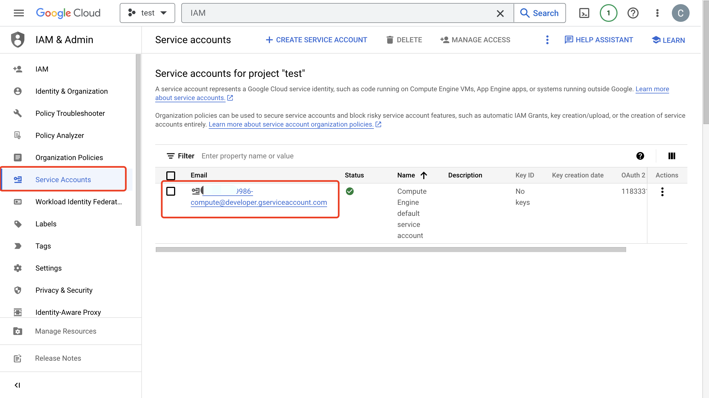
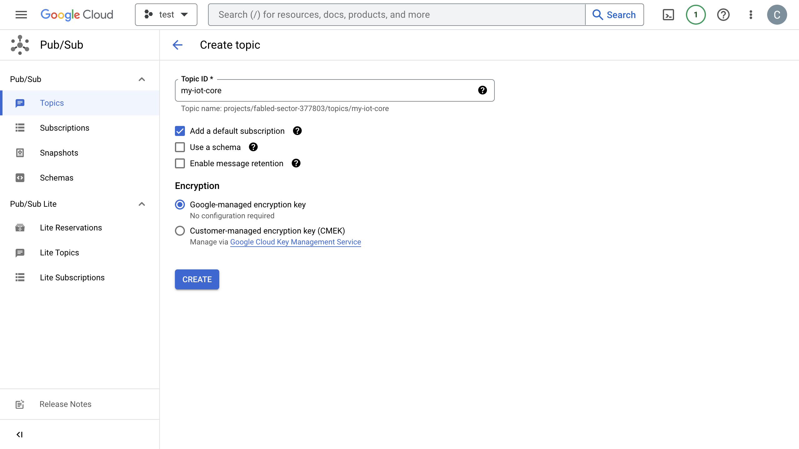
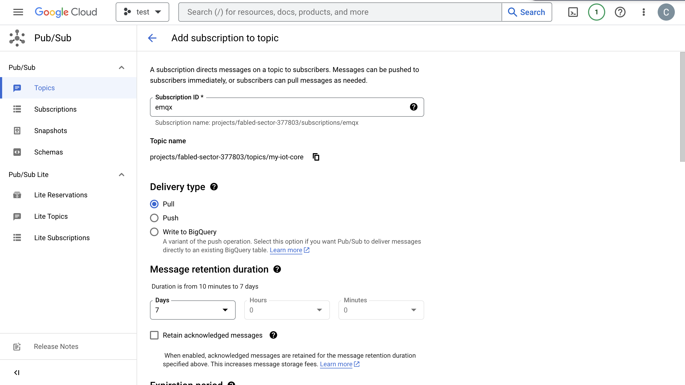
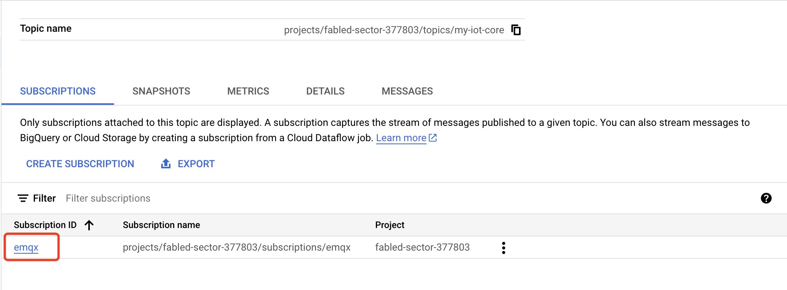
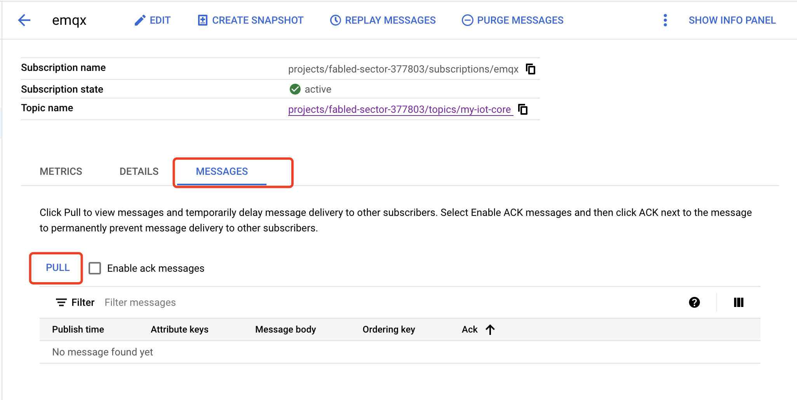
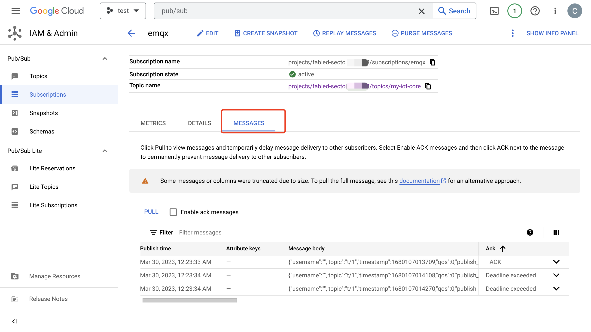

# Ingest Data into GCP Pub/Sub

EMQX supports seamless integration with [Google Cloud Pub/Sub](https://cloud.google.com/pubsub?hl=en-us) for real-time extraction, processing and analysis of MQTT data, and can also push and subscribe to various Google Cloud services such as Cloud Functions, App Engine, Cloud Run or Kubernetes Engine or Compute Engine. 

EMQX GCP Pub/Sub integration allows you to send MQTT messages and events to GCP Pub/Sub, which can help you flexibly choose services on Google Cloud and build IoT applications more easily.


:::tip
EMQX Enterprise Edition features. EMQX Enterprise Edition provides comprehensive coverage of key business scenarios, rich data integration, product-level reliability, and 24/7 global technical support. Experience the benefits of this [enterprise-ready MQTT messaging platform](https://www.emqx.com/en/try?product=enterprise) today.
:::


:::tip Prerequisites

- Knowledge about EMQX data integration [rules](./rules.md)
- Knowledge about [data bridge](./data-bridges.md)

:::

## Feature List

- [Connection pool](./data-bridges.md#connection-pool)
- [Async mode](./data-bridges.md#async-mode)
- [Batch mode](./data-bridges.md#batch-mode)
- [Buffer queue](./data-bridges.md#buffer-queue)

## Quick Start Tutorial

This section introduces how to configure the GCP Pub/Sub data bridge, including how to set up the GCP service, create data bridges and rules for forwarding data to GCP and test the data bridges and rules.

### Create Service Account Key in GCP

You need to create a service account and a service account key to use the GCP PubSub service. 

1. Create a [Service Account](https://developers.google.com/identity/protocols/oauth2/service-account#creatinganaccount) in your GCP account.  Ensure that the Service Account has permissions to at least publish messages to the topic of interest.

2. Click the email address for the service account you created. Click the **Key** tab. In the **Add key** drop-down list, select **Create new key** to create a Sercice Account key for that account and download it in JSON format.

   ::: tip

   Store the Service Account key securely for later use.

   :::

   

### Create and Manage Topic in GCP

Before configuring the GCP Pub/Sub Bridge on EMQX, you need to create a topic and be familiar with the basic management operation in GCP.

1. In the Google Cloud console, go to the **Pub/Sub** ->**Topics** page. For detailed instructions, see [Create and manage topics](https://cloud.google.com/pubsub/docs/create-topic).

   ::: tip

   The Service Account must have permissions to publish to that topic.

   :::

2. In the **Topic ID** field, enter an ID for your topic. Click **Create topic**.

   

3. Go to the **Subscriptions** page. Click the **Topic ID** in the list. Create a subscription to the topic. 

   - Select **Pull** in **Delivery type**.
   - Select `7` Days for **Message retention duration**.

   For detailed instructions, see [GCP Pub/Sub Subscription](https://cloud.google.com/pubsub/docs/subscriber).

   

4. Click **Subscription ID** -> **Messages** -> **Pull** can view the message sent to the topic.

   

   

### Create GCP Pub/Sub Bridge

1. Go to EMQX Dashboard, click **Data Integration** -> **Data Bridge**.

2. Click **Create** on the top right corner of the page.

3. In the **Create Data Bridge** page, click to select **Google PubSub**, and then click **Next**.

4. Input a name for the data bridge. The name should be a combination of upper/lower case letters and numbers.

5. In **GCP PubSub Topic** field, input the topic id you created in [Create and Manage Topic in GCP](#create-and-manage-topic-in-gcp). 

6. In the **Payload Template** field, leave it blank or define a template.

   -  If left blank, it will encode all visible inputs from the MQTT message using JSON format, such as clientid, topic, payload, etc.  
   - If use the defined template, placeholders of the form `${variable_name}` will be filled with the corresponding value from the MQTT context.  For example, `${topic}` will be replaced with `my/topic` if such is the MQTT message topic.

7. In the **GCP Service Account Credentials** field, upload the Service Account credentials in JSON format you exported in [Create Service Account Key in GCP](#create-service-account-key-in-gcp).

8. Advanced settings (optional):  Choose whether to use **sync** or **async** query mode as needed.

9. Before clicking **Create**, you can click **Test Connectivity** to test that the bridge can connect to the Redis server.

10. Click **Create** to finish the creation of the data bridge. 

    A confirmation dialog will appear and ask if you like to create a rule using this data bridge, you can click **Create Rule** to continue creating rules to specify the data to be saved into GCP PubSub. You can also create rules by following the steps in [Create Rules for GCP PubSub Data Bridge](#create-rules-for-GCP-PubSub-data-bridge).

### Create Rule for GCP PubSub Data Bridge

You can continue to create rules to specify the data to be saved into GCP PubSub.

1. Go to EMQX Dashboard, click **Data Integration** -> **Rules**.

2. Click **Create** on the top right corner of the page.

3. Input `my_rule` as the rule ID, and set the rules in the **SQL Editor**. Here we want to save the MQTT messages under topic `t/#`  to GCP PubSub, we can use the SQL syntax below. 

   Note: If you want to specify your own SQL syntax, make sure that you have included all fields required by the data bridge in the `SELECT` part.
   
   ```sql
   SELECT
     *
   FROM
     "t/#"
   ```

4. Click the **Add Action** button, select **Forwarding with Data Bridge** from the dropdown list and then select the data bridge you just created under **Data Bridge**. Then click the **Add** button.
4. Click **Create** at the page bottom to finish the creation.

Now a rule to forward data to GCP PubSub via a GCP PubSub bridge is created. You can click **Data Integration** -> **Flows** to view the topology. It can be seen that the messages under topic `t/#`  are sent and saved to GCP PubSub after parsing by rule  `my_rule`.

### Test the Data Bridge and Rule

You can use the WebSocket Client in EMQX Dashboard to test that all messages on the topic `t/#` will be forwarded to `my-iot-core` topic in GCP Pub/Sub. 

1. Go to the Dashboard, and click **Diagnose** -> **WebSocket Client**.

2. Create a new client connection. Send several messages on the topic `t/1`.

3. Click **Data Integration** -> **Flows** from the left navigation menu. You can see 4 recordings about **data_to_gcp_pubsub**, indicating data have been written into GCP Pub/Sub. <!--Need to check-->

4. Go to GCP **Pub/Sub** -> **Subscriptions**, click **MESSAGES** tab. You can see messages on topic `my-iot-core`.

   


