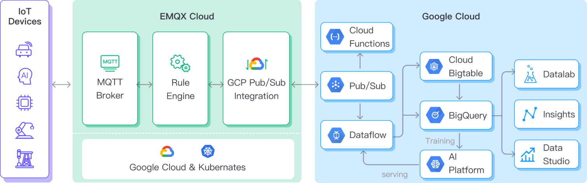

# Ingest MQTT Data into GCP Pub/Sub


:::tip
EMQX Enterprise Edition features. EMQX Enterprise Edition provides comprehensive coverage of key business scenarios, rich data integration, product-level reliability, and 24/7 global technical support. Experience the benefits of this [enterprise-ready MQTT messaging platform](https://www.emqx.com/en/try?product=enterprise) today.
:::


[Google Cloud Pub/Sub](https://cloud.google.com/pubsub?hl=en-us) is an asynchronous messaging service designed to achieve extremely high reliability and scalability. EMQX supports seamless integration with Google Cloud Pub/Sub for real-time extraction, processing, and analysis of MQTT data. It can push data to various Google Cloud services such as Cloud Functions, App Engine, Cloud Run, Kubernetes Engine, and Compute Engine. Alternatively, it can also distribute data from Google Cloud to MQTT, helping users rapidly build IoT applications on GCP.

This page provides a comprehensive introduction to the data integration between EMQX and GCP Pub/Sub with practical instructions on creating and validating the data integration.

## How It Works

GCP Pub/Sub data bridge is an out-of-the-box feature of EMQX designed to help users seamlessly integrate MQTT data streams with Google Cloud and leverage its rich services and capabilities for IoT application development.



EMQX forwards MQTT data to GCP Pub/Sub through the rule engine and data bridging. Taking the example of a GCP Pub/Sub producer role, the complete process is as follows:

1. **IoT Devices Publish Messages**: Devices publish telemetry and status data through specific topics, triggering the rule engine.
2. **Rule Engine Processes Messages**: Using the built-in rule engine, MQTT messages from specific sources are processed based on topic matching. The rule engine matches corresponding rules and processes messages, such as converting data formats, filtering specific information, or enriching messages with contextual information.
3. **Bridging to GCP Pub/Sub**: The rule triggers the action of forwarding messages to GCP Pub/Sub, allowing easy configuration of data properties, ordering keys, and mapping of MQTT topics to GCP Pub/Sub topics. This provides richer context information and order assurance for data integration, enabling flexible IoT data processing.

After MQTT message data is written to GCP Pub/Sub, you can perform flexible application development, such as:

- Real-time Data Processing and Analysis: Utilize powerful Google Cloud data processing and analysis tools like Dataflow, BigQuery, and Pub/Sub's own streaming capabilities to perform real-time processing and analysis of message data, obtaining valuable insights and decision support.
- Event-Driven Functionality: Trigger Google Cloud event handling, such as Cloud Functions and Cloud Run, to achieve dynamic and flexible function triggering and processing.
- Data Storage and Sharing: Transmit message data to Google Cloud storage services like Cloud Storage and Firestore for secure storage and management of large volumes of data. This allows you to share and analyze this data with other Google Cloud services to meet various business needs.

## Features and Benefits

The data integration with IoTDB offers a range of features and benefits:

- 
- 

## Before You Start

This section describes the preparations you need to complete before you start to create the GCP Pub/Sub data bridges.

### Prerequisites

- Knowledge about EMQX data integration [rules](./rules.md)
- Knowledge about [data bridge](./data-bridges.md)

### Create Service Account Key in GCP

You need to create a service account and a service account key to use the GCP PubSub service.

1. Create a [Service Account](https://developers.google.com/identity/protocols/oauth2/service-account#creatinganaccount) in your GCP account.  Ensure that the Service Account has permission to at least publish messages to the topic of interest.

2. Click the email address for the service account you created. Click the **Key** tab. In the **Add key** drop-down list, select **Create new key** to create a Service Account key for that account and download it in JSON format.

   ::: tip

   Store the Service Account key securely for later use.

   :::

   

### Create and Manage Topics in GCP

Before configuring the GCP Pub/Sub Bridge on EMQX, you need to create a topic and be familiar with the basic management operation in GCP.

1. In the Google Cloud console, go to the **Pub/Sub** ->**Topics** page. For detailed instructions, see [Create and manage topics](https://cloud.google.com/pubsub/docs/create-topic).

   ::: tip

   The Service Account must have permission to publish that topic.

   :::

2. In the **Topic ID** field, enter an ID for your topic. Click **Create topic**.

   

3. Go to the **Subscriptions** page. Click the **Topic ID** in the list. Create a subscription to the topic.

   - Select **Pull** in **Delivery type**.
   - Select `7` Days for **Message retention duration**.

   For detailed instructions, see [GCP Pub/Sub Subscription](https://cloud.google.com/pubsub/docs/subscriber).

   

4. Click **Subscription ID** -> **Messages** -> **Pull** can view the message sent to the topic.

   

   

## Create a GCP Pub/Sub Bridge

1. Go to EMQX Dashboard, click **Integration** -> **Data Bridge**.

2. Click **Create** on the top right corner of the page.

3. In the **Create Data Bridge** page, click to select **Google PubSub**, and then click **Next**.

4. In the **Name** field, enter a name for the data bridge. The name should be a combination of upper/lower case letters and numbers.

5. In the **Bridge Role** field, select `Producer` or `Consumer` from the drop-down list according to your business needs and complete the corresponding configurations. 

   :::: tabs type:card
   
   ::: tab Configure as Producer Role

   - **GCP PubSub Topic**: Enter the topic ID `my-iot-core` you created in [Create and Manage Topic in GCP](#create-and-manage-topic-in-gcp).
   - **GCP Service Account Credentials**: Upload the Service Account credentials in JSON format you exported in [Create Service Account Key in GCP](#create-service-account-key-in-gcp).
   - **Payload Template**: Leave it blank or define a template.
      - If left blank, it will encode all visible inputs from the MQTT message using JSON format, such as clientid, topic, payload, etc.
      - If using the defined template, placeholders of the form `${variable_name}` will be filled with the corresponding value from the MQTT context.  For example, `${topic}` will be replaced with `my/topic` if such is the MQTT message topic.
   - **Attributes Template** and **Ordering Key Template** (optional): Similarly, you can define templates for formatting the attributes and/or ordering key of the outgoing message. 
      - For **Attributes**, both keys and values may use placeholders of the form `${variable_name}`.  Such values will be extracted from the MQTT context.  If a key template resolves to an empty string, that key is omitted from the outgoing message to GCP PubSub.
      - For **Ordering Key**, placeholders of the form `${variable_name}` may be used.  If the resolved value is an empty string, the `orderingKey` field will not be set for the GCP PubSub outgoing message.
   - Advanced settings (optional):  Choose whether to use **sync** or **async** query mode as needed.

   :::

   ::: tab Configure as Consumer Role

   - In the **GCP Service Account Credentials** field, upload the Service Account credentials in JSON format you exported in [Create Service Account Key in GCP](#create-service-account-key-in-gcp).

   - The **Topic Mapping** field must contain at least one GCP PubSub-to-MQTT topic mapping. The **MQTT Payload Template** subfield specifies the MQTT payload that should be used, and has the following GCP PubSub message fields available for templating:

     | Field Name        | Description                                                    |
     |-------------------|----------------------------------------------------------------|
     | `attributes`      | (Optional) An object containing string key-value pairs, if any |
     | `message_id`      | The message ID assigned by GCP PubSub to this message          |
     | `ordering_key`    | (Optional) The message ordering key, if any                    |
     | `publishing_time` | Message timestamp as defined by GCP PubSub                     |
     | `topic`           | Originating GCP PubSub topic                                   |
     | `value`           | (Optional) The message payload, if present                     |

     The default value for **MQTT Payload Template** is `${.}`, which includes all available data encoded as a JSON object.  For example, choosing `${.}` as a template will produce the following for a GCP PubSub message containing all optional fields:

     ```json
     {
       "attributes": {"attribute_key": "attribute_value"},
       "message_id": "1679665968238",
       "ordering_key": "my-ordering-key",
       "topic": "my-pubsub-topic",
       "publishing_time": "2023-08-18T14:15:18.470Z",
       "value": "my payload"
     }
     ```

     Subfields from the GCP PubSub message may be accessed with dot notation. For example, `${.value}` will resolve to the GCP PubSub message value, and `${.attributes.h1}` will resolve to the value of the `h1` message attribute key if such a subfield exists.  Absent values will be replaced by empty strings.

     **Note**: Each GCP PubSub-to-MQTT topic mapping must contain a unique GCP PubSub topic name.  That is, the GCP PubSub topic must not be present in more than one mapping.

   - Leave other options as default.

   :::

   ::::

6. Before clicking **Create**, you can click **Test Connectivity** to test that the bridge can connect to the GCP PubSub server.

7. Click **Create** to finish the creation of the data bridge.

    A confirmation dialog will appear and ask if you like to create a rule using this data bridge, you can click **Create Rule** to continue creating rules to specify the data to be saved into GCP PubSub. You can also create rules by following the steps in [Create Rules for GCP PubSub Data Bridge](#create-rules-for-GCP-PubSub-data-bridge).

## Create a Rule for GCP PubSub Producer Data Bridge

You can continue to create rules to specify the data to be saved into GCP PubSub.

1. Go to EMQX Dashboard, click **Integration** -> **Rules**.

2. Click **Create** on the top right corner of the page.

3. Input `my_rule` as the rule ID.

3. Set the rules in the **SQL Editor**. Here we want to save the MQTT messages under topic `/devices/+/events`  to GCP PubSub, we can use the SQL syntax below.

   Note: If you want to specify your own SQL syntax, make sure that the `SELECT` part includes all fields required by the payload template in the data bridge.

   ```sql
   SELECT
     *
   FROM
     "/devices/+/events"
   ```

5. Click the **Add Action** button, select **Forwarding with Data Bridge** from the dropdown list, and then select the data bridge you just created under **Data Bridge**. Then click the **Add** button.

4. Click **Create** at the page bottom to finish the creation.

Now a rule to forward data to GCP PubSub via a GCP PubSub bridge is created. You can click **Integration** -> **Flows** to view the topology. It can be seen that the messages under topic `/devices/+/events` are sent and saved to GCP PubSub after parsing by rule `my_rule`.

## Test Data Bridge and Rule

1. Use MQTTX to send messages on the topic `/devices/+/events`.

   ```bash
   mqttx pub -i emqx_c -t /devices/+/events -m '{ "msg": "hello GCP PubSub" }'
   ```

2. Check the running status of the data bridge, there should be one new incoming and one new outgoing message.

3. Go to GCP **Pub/Sub** -> **Subscriptions**, click **MESSAGES** tab. You should see the message.
