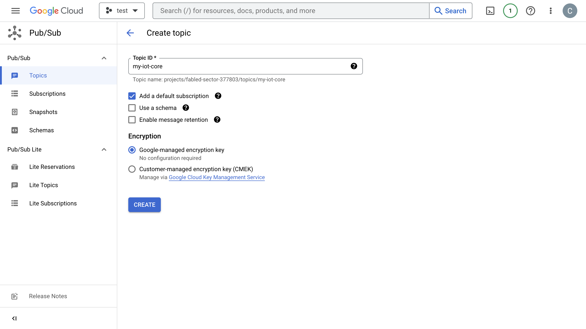
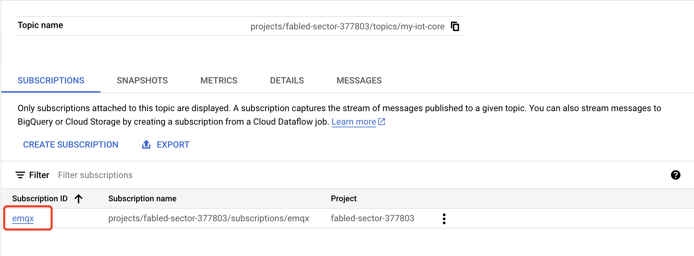

# Ingest MQTT Data into GCP Pub/Sub

[Google Cloud Pub/Sub](https://cloud.google.com/pubsub?hl=en-us) is an asynchronous messaging service designed to achieve extremely high reliability and scalability. EMQX supports seamless integration with Google Cloud Pub/Sub for real-time extraction, processing, and analysis of MQTT data. It can push data to various Google Cloud services such as Cloud Functions, App Engine, Cloud Run, Kubernetes Engine, and Compute Engine. Alternatively, it can also distribute data from Google Cloud to MQTT, helping users rapidly build IoT applications on GCP.

This page provides a comprehensive introduction to the data integration between EMQX and GCP Pub/Sub with practical instructions on creating and validating the data integration.

## How It Works

GCP Pub/Sub data integration is an out-of-the-box feature of EMQX designed to help users seamlessly integrate MQTT data streams with Google Cloud and leverage its rich services and capabilities for IoT application development.


EMQX forwards MQTT data to GCP Pub/Sub through the rule engine and Sink. Taking the example of a GCP Pub/Sub producer role, the complete process is as follows:

1. **IoT Devices Publish Messages**: Devices publish telemetry and status data through specific topics, triggering the rule engine.
2. **Rule Engine Processes Messages**: Using the built-in rule engine, MQTT messages from specific sources are processed based on topic matching. The rule engine matches corresponding rules and processes messages, such as converting data formats, filtering specific information, or enriching messages with contextual information.
3. **Bridging to GCP Pub/Sub**: The rule triggers the action of forwarding messages to GCP Pub/Sub, allowing easy configuration of data properties, ordering keys, and mapping of MQTT topics to GCP Pub/Sub topics. This provides richer context information and order assurance for data integration, enabling flexible IoT data processing.

After MQTT message data is written to GCP Pub/Sub, you can perform flexible application development, such as:

- Real-time Data Processing and Analysis: Utilize powerful Google Cloud data processing and analysis tools like Dataflow, BigQuery, and Pub/Sub's own streaming capabilities to perform real-time processing and analysis of message data, obtaining valuable insights and decision support.
- Event-Driven Functionality: Trigger Google Cloud event handling, such as Cloud Functions and Cloud Run, to achieve dynamic and flexible function triggering and processing.
- Data Storage and Sharing: Transmit message data to Google Cloud storage services like Cloud Storage and Firestore for secure storage and management of large volumes of data. This allows you to share and analyze this data with other Google Cloud services to meet various business needs.

## Features and Benefits

The data integration with GCP Pub/Sub offers a range of features and benefits:

- **Robust Messaging Service**: Both EMQX and GCP Pub/Sub possess high availability and scalability features, ensuring the reliable reception, delivery, and processing of large-scale message streams. They support IoT data sequencing, message quality assurance, and persistence, ensuring the dependable transmission and handling of messages.
- **Flexible Rules Engine**: With the built-in rules engine, specific source messages and events can be processed based on topic matching. Messages and events can be manipulated, such as data format conversion, filtering out specific information, or enriching messages with context information. Combining this with GCP Pub/Sub allows for further processing and analysis.
- **Rich Contextual Information**: Through the GCP Pub/Sub data integration, you can add richer contextual information to messages, mapping client attributes to Pub/Sub attributes, sorting keys, and more. This aids in performing more precise analysis and processing in subsequent application development and data handling.

In summary, integrating EMQX and GCP Pub/Sub enables highly reliable, scalable message delivery, along with extensive tools and services for data analysis and integration. This empowers you to build robust IoT applications and implement flexible business logic based on event-driven capabilities.

## Before You Start

This section describes the preparations you need to complete before you start to create the GCP Pub/Sub data integration.

### Prerequisites

- Knowledge about EMQX data integration [rules](./rules.md)
- Knowledge about [Data Integration](./data-bridges.md)

### Create Service Account Key in GCP

You need to create a service account and a service account key to use the GCP PubSub service.

1. Create a [Service Account](https://developers.google.com/identity/protocols/oauth2/service-account#creatinganaccount) in your GCP account.  Ensure that the Service Account has permission to inspect/read and publish messages to the topic of interest (e.g.: Pub/Sub Editor role).

2. Click the email address for the service account you created. Click the **Key** tab. In the **Add key** drop-down list, select **Create new key** to create a Service Account key for that account and download it in JSON format.

   ::: tip

   Store the Service Account key securely for later use.

   :::

   

### Create and Manage Topics in GCP

Before configuring the GCP Pub/Sub data integration on EMQX, you need to create a topic and be familiar with the basic management operation in GCP.

1. In the Google Cloud console, go to the **Pub/Sub** ->**Topics** page. For detailed instructions, see [Create and manage topics](https://cloud.google.com/pubsub/docs/create-topic).

   ::: tip

   The Service Account must have permission to publish that topic.

   :::

2. In the **Topic ID** field, enter an ID for your topic. Click **Create topic**.

   

3. Go to the **Subscriptions** page. Click the **Topic ID** in the list. Create a subscription to the topic.

   - Select **Pull** in **Delivery type**.
   - Select `7` Days for **Message retention duration**.

   For detailed instructions, see [GCP Pub/Sub Subscription](https://cloud.google.com/pubsub/docs/subscriber).

   

4. Click **Subscription ID** -> **Messages** -> **Pull** can view the message sent to the topic.

   

   

## Create a GCP Pub/Sub Producer Connector

Before adding a GCP Pub/Sub Producer Sink action, you need to create a GCP Pub/Sub Producer connector to establish a connection between EMQX and GCP Pub/Sub.

1. Go to the EMQX Dashboard and click **Integration** -> **Connector**.
2. Click **Create** in the top right corner of the page, select **Google PubSub Producer** on the connector selection page, and click **Next**.
3. Enter a name and description, such as `my-pubsubproducer`. The name is used to associate the GCP Pub/Sub Producer Sink with the connector and must be unique within the cluster.
4. In **GCP Service Account Credentials**, upload the Service Account credentials in JSON format you exported in [Create Service Account Key in GCP](#create-service-account-key-in-gcp).
5. Expand **Advanced Settings** to configure optional settings as needed. For details, see [Connector Advanced Settings](#connector-advanced-settings).
6. Before clicking **Create**, you can click **Test Connectivity** to test if the connector can connect to the GCP Pub/Sub server.
7. Click the **Create** button at the bottom to complete the creation of the connector. In the pop-up dialog, you can click **Back to Connector List** or click **Create Rule** to continue creating a rule with Sink to specify the data to be forwarded to GCP Pub/Sub. For detailed steps, see [Create a Rule with GCP Pub/Sub Producer Sink](#create-a-rule-with-gcp-pubsub-producer-sink).

## Create a Rule with GCP Pub/Sub Producer Sink

This section demonstrates how to create a rule to specify the data to be saved into GCP Pub/Sub.

1. Go to EMQX Dashboard, and click **Integration** -> **Rules**.

2. Click **Create** on the top right corner of the page.

3. Enter `my_rule` as the rule ID.

4. Set the rules in the **SQL Editor**. Here if you want to save the MQTT messages under topic `/devices/+/events`  to GCP PubSub, you can use the SQL syntax below.

   Note: If you want to specify your own SQL syntax, make sure that the `SELECT` part includes all fields required by the payload template in the Sink.

   ```sql
   SELECT
     *
   FROM
     "/devices/+/events"
   ```

   Note: If you are a beginner user, click **SQL Examples** and **Enable Test** to learn and test the SQL rule.

5. Click the **+ Add Action** button to define an action that will be triggered by the rule. Select `Google PubSub Producer` from the **Type of Action** dropdown list so that EMQX will send the data processed by the rule to GCP Pub/Sub.

6. Keep the **Action** dropdown box with the value `Create Action`. Or, you also can select a GCP Pub/Sub Producer Sink previously created. In this demonstration, you create a new Sink and add it to the rule.

7. In the **Name** field, enter a name for the Sink. The name should be a combination of upper/lower case letters and numbers.

8. Select the `my_pubsubprodcer` just created from the **Connector** dropdown box. You can also create a new Connector by clicking the button next to the dropdown box. For the configuration parameters, see [Create a Connector](#create-a-connector).

9. In **GCP PubSub Topic**, enter one of the following values:

   - A topic name, for example, `my-iot-core`, that you created in [Create and Manage Topics in GCP](#create-and-manage-topics-in-gcp). EMQX resolves the topic in the project associated with the configured service account.
   - A fully-qualified topic path in the format `projects/<project-id>/topics/<topic-name>`. Use this format to publish messages to a topic in a different GCP project. Grant the configured service account the required Pub/Sub permissions on the topic in that project.

10. Define a template in **Payload Template**, or leave it blank.

    - If left blank, it will encode all visible inputs from the MQTT message using JSON format, such as clientid, topic, payload, etc.
    - If using the defined template, placeholders of the form `${variable_name}` will be filled with the corresponding value from the MQTT context.  For example, `${topic}` will be replaced with `my/topic` if such is the MQTT message topic.

11. Define templates for formatting the attributes and/or ordering key of the outgoing message in **Attributes Template** and **Ordering Key Template** (optional).

    - For **Attributes**, both keys and values may use placeholders of the form `${variable_name}`.  Such values will be extracted from the MQTT context.  If a key template resolves to an empty string, that key is omitted from the outgoing message to GCP Pub/Sub.
    - For **Ordering Key**, placeholders of the form `${variable_name}` may be used.  If the resolved value is an empty string, the `orderingKey` field will not be set for the GCP Pub/Sub outgoing message.

12. **Fallback Actions (Optional)**: If you want to improve reliability in case of message delivery failure, you can define one or more fallback actions. These actions will be triggered if the primary Sink fails to process a message. See [Fallback Actions](./data-bridges.md#fallback-actions) for more details.

13. Expand **Advanced Settings** to configure optional settings as needed. For details, see [Advanced Settings](#advanced-settings).

14. Before clicking **Create**, you can click **Test Connectivity** to test that the Connector can connect to the GCP Pub/Sub server.

15. Click the **Create** button to complete the Sink configuration and you will see the new Sink appear under the **Action Outputs** tab.

16. Back on the **Create Rule** page, click **Create** to create the rule. 

You have now successfully created the rule. You can see the newly created rule on the **Integration** -> **Rules** page. Click the **Actions(Sink)** tab and you can see the new Google PubSub Producer Sink.

You can also click **Integration** -> **Flow Designer** to view the topology and you can see that the messages under topic `/devices/+/events` are sent and saved to GCP Pub/Sub after parsing by rule `my_rule`.

## Test the Producer Rule

1. Use MQTTX to send messages on the topic `/devices/+/events`.

   ```bash
   mqttx pub -i emqx_c -t /devices/+/events -m '{ "msg": "hello GCP PubSub" }'
   ```

2. Check the running status of the Sink, there should be one new incoming and one new outgoing message.

3. Go to GCP **Pub/Sub** -> **Subscriptions**, click **MESSAGES** tab. You should see the message.

## Create a GCP Pub/Sub Consumer Connector

Before adding a GCP Pub/Sub Consumer Source, you need to create a GCP Pub/Sub Consumer connector to establish a connection between EMQX and GCP Pub/Sub.

1. Go to the EMQX Dashboard and click **Integration** -> **Connector**.
2. Click **Create** in the top right corner of the page, select **Google PubSub Consumer** on the connector selection page, and click **Next**.
3. Enter a name and description, such as `my-pubsubconsumer`. The name is used to associate the GCP Pub/Sub Consumer Source with the connector and must be unique within the cluster.
4. In **GCP Service Account Credentials**, upload the Service Account credentials in JSON format you exported in [Create Service Account Key in GCP](#create-service-account-key-in-gcp).
5. Expand **Advanced Settings** to configure optional settings as needed. For details, see [Connector Advanced Settings](#connector-advanced-settings).
6. Before clicking **Create**, you can click **Test Connectivity** to test if the connector can connect to the GCP Pub/Sub server.
7. Click the **Create** button at the bottom to complete the creation of the connector. In the pop-up dialog, you can click **Back to Connector List** or click **Create Rule** to continue creating a rule with GCP Pub/Sub Consumer Source to consume the data from GCP Pub/Sub and forward the data to EMQX. For detailed steps, see [Create a Rule with GCP Pub/Sub Consumer Source](#create-a-rule-with-gcp-pubsub-consumer-source).

## Create a Rule with GCP Pub/Sub Consumer Source

This section demonstrates how to create a rule in EMQX for consuming the message from GCP Pub/Sub and forwarding the message to EMQX. You need to create and configure a Google PubSub Consumer source and add it to the rule as the data inputs. You also need to add a Republish action to the rule to forward the message from GCP Pub/Sub to EMQX.

1. Go to EMQX Dashboard, and click **Integration** -> **Rules**.

2. Click **Create** on the top right corner of the page.

3. Enter `my_rule_source` as the rule ID.

4. Under the **Data Inputs** tab on the right, delete the default Input `Messages`. Click **Add Input**.

5. From the **Input Type** dropdown, select `Google PubSub Consumer`.

6. Keep the default value `Create Source` for the **Source** dropdown. This demonstration will create a new Source and add it to the rule.

7. Enter the **Name** and **Description** (optional) for the Source. The name should combine upper/lower case letters and numbers, for example, `my-gcppubsub-source`.

8. Select the `my_pubsubconsumer` just created from the **Connector** dropdown box. You can also create a new Connector by clicking the button next to the dropdown box. For the configuration parameters, see [Create a Connector](#create-a-connector).

9. Configure the following information for the source for consuming the message from GCP Pub/Sub to EMQX:

   - **GCP PubSub Topic**: Enter a topic name, for example, `my-iot-core`, or a fully-qualified topic path in the format `projects/<project-id>/topics/<topic-name>`. A topic name is resolved in the project associated with the configured service account. To consume from a topic in a different GCP project, enter its fully-qualified path and grant the service account the required Pub/Sub permissions on that topic. The consumer subscription is still created in the service account's project; only the topic reference points to the other project.
   - **Maximum Messages to Pull**: Specify the maximum number of messages to retrieve from GCP PubSub in a single pull request. The actual number may be less than the specified value.

10. Expand **Advanced Settings** to configure optional settings as needed. For details, see [Advanced Settings](#advanced-settings).

11. Before clicking **Create**, you can click **Test Connectivity** to test if the connection to the GCP Pub/Sub server is successful.

12. Click **Create** to complete the source creation. The source is added to the rule under the **Data Inputs** tab and you can see that the rule in the **SQL Editor** is as follows:

    ```sql
    SELECT
      *
    FROM
      "$bridges/gcppubsub:my-gcppubsub-source"
    ```

    Note: If you are a beginner user, click **SQL Examples** and **Enable Test** to learn and test the SQL rule.

    From the `my-gcppubsub-source`, the rule SQL can access the GCP Pub/Sub message fields shown in the following GCP Pub/Sub-to-MQTT topic mapping table. You can adjust the rule SQL for data processing. In this example, you can use the default SQL.

    | Field Name        | Description                                                  |
    | ----------------- | ------------------------------------------------------------ |
    | `attributes`      | (Optional) An object containing string key-value pairs, if any |
    | `message_id`      | The message ID assigned by GCP Pub/Sub to this message       |
    | `ordering_key`    | (Optional) The message ordering key, if any                  |
    | `publishing_time` | Message timestamp as defined by GCP Pub/Sub                  |
    | `topic`           | Originating GCP Pub/Sub topic                                |
    | `value`           | (Optional) The message payload, if present                   |

    **Note**: Each GCP Pub/Sub-to-MQTT topic mapping must contain a unique GCP Pub/Sub topic name.  That is, the GCP Pub/Sub topic must not be present in more than one mapping.

Now you have now successfully created the GCP Pub/Sub Consumer Source, but the messages will not be published to EMQX directly. Next, continue with the steps in [Add Republish Action to the Rule](#add-republish-action-to-the-rule) to create a Republish action and add it to the rule.

### Add Republish Action to the Rule

This section demonstrates how to add a Republish action to the rule for forwarding the message consumed from the GCP Pub/Sub Consumer Source and publishing to the EMQX topic `t/1`.

1. Select the **Action Output** tab on the right side of the page, click the **Add Action** button, and select the `Republish` action from the **Type of Action** dropdown list.

2. Fill in the message republish configuration:

   - **Topic**: The topic to publish to MQTT, enter `t/1` here.

   - **QoS**: Select `0`, `1`, `2`, or `${qos}`, or enter a placeholder to set QoS from other fields. Selecting `${qos}` here means to follow the original message's QoS.

   - **Retain**: Select `true` or `false`. Determine whether to publish the message as a retained message, placeholders can also be entered to set the retain message flag from other fields. In this example, select `false`.

   - **Payload**: Set a template for generating the forwarded message payload. Leaving it blank means forwarding the rule output result. Enter `${.value}` to forward only the payload of the GCP Pub/Sub message.

     The default value for MQTT payload template is `${.}`, which includes all available data encoded as a JSON object.  For example, choosing `${.}` as a template will produce the following for a GCP Pub/Sub message containing all optional fields:

     ```json
     {
       "attributes": {"attribute_key": "attribute_value"},
       "message_id": "1679665968238",
       "ordering_key": "my-ordering-key",
       "topic": "my-pubsub-topic",
       "publishing_time": "2023-08-18T14:15:18.470Z",
       "value": "my payload"
     }
     ```

     Subfields from the GCP Pub/Sub message may be accessed with dot notation. For example, `${.value}` will resolve to the GCP Pub/Sub message value, and `${.attributes.h1}` will resolve to the value of the `h1` message attribute key if such a subfield exists.  Absent values will be replaced by empty strings.

   - **MQTT 5.0 Message Properties**: Disabled by default. For detailed settings, see [Add Republish Action](./rule-get-started.md#add-republish-action).

3. Click **Create** to complete the action creation. After successful creation, you will return to the create rule page, and the republish action will be added to the **Action Outputs** tab.

4. On the rule creation page, click the **Create** button to complete the entire rule creation.

Now that you have successfully created a rule, you can see the newly created rule on the **Rules** page. On the **Sources** tab, you can see the newly created GCP Pub/Sub Consumer Source.

You can also click **Integration** -> **Flow Designer** to view the topology. Through the topology, you can intuitively see that messages from the GCP Pub/Sub Consumer Source will be published to `t/1` through message republishing.

## Test the GCP Pub/Sub Consumer Rule

Follow these steps to verify that the GCP Pub/Sub Consumer Source consumes messages from GCP Pub/Sub and republishes them to the MQTT topic `t/1` in EMQX.

1. Use MQTTX CLI to subscribe to the MQTT topic `t/1` in EMQX:

   ```bash
   mqttx sub -t t/1 -v
   ```

2. In the Google Cloud console, go to **Pub/Sub** -> **Topics**, click the `my-iot-core` topic, and publish the following message:

   ```json
   {"msg":"hello GCP PubSub"}
   ```

3. Verify that MQTTX receives the following message on topic `t/1`:

   ```text
   topic: t/1
   payload: {"msg":"hello GCP PubSub"}
   ```

## Advanced Settings

This section describes the advanced settings for GCP Pub/Sub connectors, the Producer Sink, and the Consumer Source.

### Connector Advanced Settings

GCP Pub/Sub Producer and Consumer connectors use the same advanced settings.

| Field Name | Description | Default Value |
| --- | --- | --- |
| **HTTP Pipelining** | Maximum number of HTTP requests that can be sent without waiting for each response. Set to `1` to wait for a response before sending the next request. | `100` |
| **Connection Pool Size** | Number of connections maintained in the connection pool. | `8` |
| **Connect Timeout** | Maximum time to wait for an HTTP connection to be established. | `15` seconds |
| **Max Inactive** | Maximum time without activity before the HTTP client attempts to reconnect. | `10` seconds |
| **Max Retries** | Maximum number of retries after an error occurs while sending a request. | `2` |
| **Start Timeout** | Maximum time to wait for the connector to become healthy after it is created. | `5` seconds |
| **Health Check Interval** | Interval between connector health checks. | `15` seconds |
| **Health Check Timeout** | Maximum time for a health check to return a result. If the timeout expires, the connector is considered disconnected. | `60` seconds |

### Advanced Settings Shared by the Producer Sink and Consumer Source

The Producer Sink and Consumer Source share the following advanced settings. Their default **Health Check Interval** values differ.

| Field Name | Description | Producer Sink Default | Consumer Source Default |
| --- | --- | --- | --- |
| **Request TTL** | Maximum time from when a request enters the buffer until it receives a response or acknowledgment. The request expires if it remains buffered or receives no response or acknowledgment within this interval. | `45` seconds | `45` seconds |
| **Health Check Interval** | Interval between Sink or Source health checks. | `15` seconds | `30` seconds |
| **Health Check Interval Jitter** | Uniform random delay added to the health check interval so that Actions and Sources sharing a connector do not start health checks simultaneously. | `0` milliseconds | `0` milliseconds |
| **Health Check Timeout** | Maximum time for a health check to return a result. If the timeout expires, the Sink or Source is considered disconnected. | `60` seconds | `60` seconds |

### Advanced Settings Specific to the Producer Sink

The GCP Pub/Sub Producer Sink provides the following additional advanced settings.

| Field Name | Description | Default Value |
| --- | --- | --- |
| **Buffer Pool Size** | Number of buffer worker processes used to store and process data before sending it to GCP Pub/Sub. | `16` |
| **Dispatch Strategy** | Strategy for assigning requests without an explicit pick key to buffer workers. `Per Client ID` keeps requests from the same client on the same worker; `Random` distributes them across workers. | `Per Client ID` |
| **Max Buffer Queue Size** | Maximum amount of data that each buffer worker can hold. | `256` MB |
| **Batch Size** | Maximum number of requests in one batch. Set to `1` to disable batching. | `1` |
| **Query Mode** | Controls whether requests are sent synchronously or asynchronously. In `Async` mode, EMQX continues processing messages without waiting for a response from GCP Pub/Sub. | `Async` |
| **Inflight Window** | When **Query Mode** is `Async`, specifies the maximum number of requests that can be sent without receiving a response. Set to `1` when messages from the same MQTT client must be processed in strict order. | `100` |

### Advanced Settings Specific to the Consumer Source

The GCP Pub/Sub Consumer Source provides the following additional advanced setting.

| Field Name | Description | Default Value |
| --- | --- | --- |
| **Ack Deadline** | Approximate time GCP Pub/Sub waits for the Source to acknowledge a delivered message. After the deadline, GCP Pub/Sub may redeliver the message. The supported range is `10` to `600` seconds. | `60` seconds |
