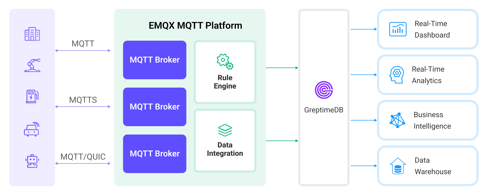

# Ingest MQTT Data into GreptimeDB

::: tip

The GreptimeDB data integration is an EMQX Enterprise edition feature.

:::

[GreptimeDB](https://github.com/GreptimeTeam/greptimedb) is an open-source time-series database with a special focus on scalability, analytical capabilities and efficiency. It's designed to work on the infrastructure of the cloud era, and users benefit from its elasticity and commodity storage. EMQX now supports connection to mainstream versions of GreptimeDB, GreptimeCloud or GreptimeDB Enterprise.

This page provides a comprehensive introduction to the data integration between EMQX and GreptimeDB with practical instructions on creating and validating the data integration.

## How It Works

GreptimeDB data integration is a built-in feature in EMQX that combines the real-time data capturing and transmission capabilities of EMQX with the data storage and analysis capabilities of GreptimeDB. With a built-in [rule engine](./rules.md) component, the integration simplifies the process of ingesting data from EMQX to GreptimeDB for storage and analysis, eliminating the need for complex coding. The workflow is as follows:

The diagram below illustrates a typical architecture of data integration between EMQX and GreptimeDB:



1. **Message publication and reception**: Industrial devices establish successful connections to EMQX through the MQTT protocol and regularly publish energy consumption data using the MQTT protocol. This data includes production line identifiers and energy consumption values. When EMQX receives these messages, it initiates the matching process within its rules engine.  
2. **Rule Engine Processes Messages**: The built-in rule engine processes messages from specific sources based on topic matching. When a message arrives, it passes through the rule engine, which matches it with corresponding rules and processes the message data. This can include transforming data formats, filtering specific information, or enriching messages with context information.
3. **Data ingestion into GreptimeDB**: Rules defined in the rule engine trigger operations to write messages to GreptimeDB. The GreptimeDB Sink provides Line Protocol templates that allow flexible definitions of the data format to write specific message fields to the corresponding tables and columns in GreptimeDB.

After energy consumption data is written to GreptimeDB, you can flexibly use SQL statements or Prometheus query language to analyze the data. For example:

- Connect to visualization tools such as Grafana to generate charts and display energy consumption data.
- Connect to application systems such as ERP for production analysis and production plan adjustments.
- Connect to business systems to perform real-time energy usage analysis, facilitating data-driven energy management.

## Features and Benefits

The data integration with GreptimeDB brings the following features and advantages to your business:

- **Ease of Use**: EMQX and GreptimeDB both offer a user-friendly experience in development. EMQX provides the standard MQTT protocol along with ready-to-use various authentication, authorization, and clustering features. GreptimeDB offers user-friendly designs like Time-Series Tables and schemaless architecture. The integration of both can accelerate the process of business integration and development.
- **Efficient Data Handling**: EMQX can handle a large number of IoT device connections and message throughput efficiently. GreptimeDB excels in data writing, storage, and querying, meeting the data processing needs of IoT scenarios without overwhelming the system.
- **Message Transformation**: Messages can undergo rich processing and transformation within EMQX rules before being written to GreptimeDB.
- **Efficient Storage and Scalability**: EMQX and GreptimeDB both have cluster scaling capabilities, allowing flexible horizontal scaling as your business grows to meet expanding demands.
- **Advanced Querying Capabilities**: GreptimeDB provides optimized functions, operators, and indexing techniques for efficient querying and analysis of timestamp data, enabling precise insights to be extracted from IoT time-series data.

## Before You Start

This section describes the preparations you need to complete before you start to create a GreptimeDB data integration, including how to install a GreptimeDB server.

### Prerequisites

- Knowledge about EMQX data integration [rules](./rules.md)
- Knowledge about [data integration](./data-bridges.md)

### Install GreptimeDB Server

1. [Install GreptimeDB](https://greptime.com/download) via Docker, and then run the docker image.

   ```bash
   # TO start the GreptimeDB docker image
   docker run -p 4000-4004:4000-4004 \
   -p 4242:4242 -v "$(pwd)/greptimedb:/tmp/greptimedb" \
   --name greptime --rm \
   greptime/greptimedb standalone start \
   --http-addr 0.0.0.0:4000 \
   --rpc-addr 0.0.0.0:4001 \
   --mysql-addr 0.0.0.0:4002 \
   --user-provider=static_user_provider:cmd:greptime_user=greptime_pwd
   ```

2. The `user-provider` parameter configures the GreptimeDB authentication. You can configure it by file. For more information, refer to the [documentation](https://docs.greptime.com/user-guide/clients/authentication#authentication).
3. With GreptimeDB running, visit [http://localhost:4000/dashboard](http://localhost:4000/dashboard) to use the GreptimeDB dashbaord. The username and password are `greptime_user` and `greptime_pwd`.

## Create a Connector

This section demonstrates how to create a Connector to connect the Sink to the GreptimeDB server.

The following steps assume that you run both EMQX and GreptimeDB on the local machine. If you have GreptimeDB and EMQX running remotely, adjust the settings accordingly.

1. Enter the EMQX Dashboard and click **Integration** -> **Connectors**.
2. Click **Create** in the top right corner of the page.
3. On the **Create Connector** page, select **GreptimeDB** and then click **Next**.
4. In the **Configuration** step, configure the following information:
   - Enter the connector name, which should be a combination of upper and lower case letters and numbers, for example: `my_greptimedb`.
   - **Server Host**: Enter `127.0.0.1:4001`. If you are creating a connection to GreptimeCloud, use 443 as the port by entering `{url}:443`.
   - **Database**: Enter `public`. If you are connecting to GreptimeCloud, enter the service name instead.
   - **Username** and **Password**: Enter `greptime_user` and `greptime_pwd`, which are set in the [Install GreptimeDB Server](#install-greptimedb-server). If you are connecting to GreptimeCloud, enter the service username and password.
5. Before clicking **Create**, you can click **Test Connectivity** to test if the connector can connect to the GreptimeDB server.
6. Click the **Create** button at the bottom to complete the creation of the connector. In the pop-up dialog, you can click **Back to Connector List** or click **Create Rule** to continue creating a rule with GreptimeDB Sink to specify the data to be forwarded to GreptimeDB. For detailed steps, see [Create a Rule with GreptimeDB Sink](#create-a-rule-with-greptimedb-sink).

## Create a Rule with GreptimeDB Sink

This section demonstrates how to create a rule in EMQX to process messages from the source MQTT topic `t/#`  and send the processed results through a configured Sink to GreptimeDB. 

1. Go to EMQX Dashboard, and click **Integration** -> **Rules**.

2. Click **Create** on the top right corner of the page.

3. Input `my_rule` as the rule ID, and set the rules in the **SQL Editor**. Here we want to save the MQTT messages under topic `t/#`  to GreptimeDB, we can use the SQL syntax below. 

   Note: If you want to specify your own SQL syntax, make sure that you have included all fields required by the Sink in the `SELECT` part.

   ```sql
   SELECT
     *
   FROM
     "t/#"
   ```

   ::: tip

   If you are a beginner user, click **SQL Examples** and **Enable Test** to learn and test the SQL rule.

   :::

4. Click the + **Add Action** button to define an action that will be triggered by the rule. With this action, EMQX sends the data processed by the rule to GreptimeDB.

5. Select `GreptimeDB` from the **Type of Action** dropdown list. Keep the **Action** dropdown with the default `Create Action` value. You can also select a Sink if you have created one. This demonstration will create a new Sink.

6. Enter a name for the Sink. The name should be a combination of upper/lower case letters and numbers.

7. From the **Connector** dropdown box, select the `my_greptimedb` created before. You can also create a new Connector by clicking the button next to the dropdown box. For the configuration parameters, see [Create a Connector](#create-a-connector).

8. Configure **Write Syntax**. Specify a text-based format that provides the measurement, tags, fields, and timestamp of a data point, and placeholder supported according to the [InfluxDB line protocol](https://docs.influxdata.com/influxdb/v2.3/reference/syntax/line-protocol/) syntax. GreptimeDB supports data formats compatible with InfluxDB. <!--Select the data format as **JSON** or **Line Protocol**,-->

   <!--For **JSON** format, define data parsing method, including **Measurement**, **Timestamp**, **Fields,** and **Tags**. Note: All key values can be variables and you can also follow the [InfluxDB line protocol](https://docs.influxdata.com/influxdb/v2.5/reference/syntax/line-protocol/) to set them.-->

   <!--For **Line Protocol** format, specify a text-based format that provides the measurement, tags, fields, and timestamp of a data point, and placeholder supported according to the [InfluxDB line protocol](https://docs.influxdata.com/influxdb/v2.3/reference/syntax/line-protocol/) syntax.-->

   ::: tip

   - To write a signed integer type value to GreptimeDB, add `i` as the type identifier after the placeholder, for example, `${payload.int}i`.
   - To write an unsigned integer type value to GreptimeDB, add `u` as the type identifier after the placeholder, for example, `${payload.int}u`. 

   :::

9. Specify the **Time Precision**: Select `millisecond` by default. 

10. Advanced settings (optional): Choose whether to use **sync** or **async** query mode, and whether to enable queue or batch. For details, see [Features of Sink](./data-bridges.md#features-of-sink).

11. Before clicking **Create**, you can click **Test Connectivity** to test that the Sink can be connected to the GreptimeDB server.

12. Click the **Create** button to complete the Sink configuration. A new Sink will be added to the **Action Outputs.**

13. Back on the **Create Rule** page, verify the configured information. Click the **Create** button to generate the rule. 

You have now successfully created the rule for forwarding data through the GreptimeDB Sink. You can see the newly created rule on the **Integration** -> **Rules** page. Click the **Actions(Sink)** tab and you can see the new GreptimeDB Sink.

You can also click **Integration** -> **Flow Designer** to view the topology and you can see that the messages under topic `t/#` are sent and saved to GreptimeDB after parsing by rule `my_rule`.

## Test the Rule

Use MQTTX  to send a message to topic  `t/1`  to trigger an online/offline event.

```bash
mqttx pub -i emqx_c -t t/1 -m '{ "msg": "hello GreptimeDB" }'
```

Check the running status of the Sink, there should be one new incoming and one new outgoing message.

In the GreptimeDB dashboard, you can confirm whether the message is written into the GreptimeDB via `SQL`.
