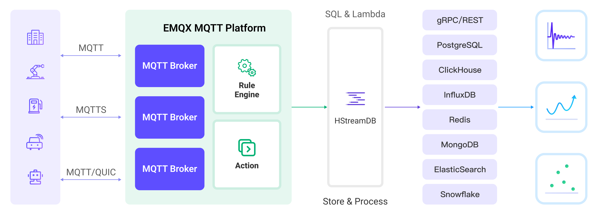

# Stream MQTT Data into HStreamDB


:::tip
EMQX Enterprise Edition features. EMQX Enterprise Edition provides comprehensive coverage of key business scenarios, rich data integration, product-level reliability, and 24/7 global technical support. Experience the benefits of this [enterprise-ready MQTT messaging platform](https://www.emqx.com/en/try?product=enterprise) today.
:::


[HStreamDB](https://hstream.io/) is an open-source streaming data platform that enables you to efficiently ingest, store, process, and distribute all real-time messages, events, and other data streams in one unified platform. Through EMQX's integration with HStreamDB, you can save MQTT messages and client events to HStreamDB, achieving large-scale IoT data collection, transmission, and storage, and enabling real-time processing, monitoring, and analysis of data streams using standard SQL and materialized views.

This page provides a comprehensive introduction to the data integration between EMQX and HStreamDB with practical instructions on creating and validating the data integration.



::: tip

HSreamDB data integration is only supported in EMQX 5.2.0 and above.

:::



## How It Works

HStreamDB data integration is an out-of-the-box feature of EMQX that combines EMQX's device connectivity and message transmission capabilities with HStreamDB's robust data storage and processing capabilities. With the built-in rule engine component, the data streaming and processing process is simplified between the two platforms.

The diagram below illustrates a typical architecture of data integration between EMQX and HStreamDB:



EMQX forwards MQTT data to HStreamDB through the rule engine and configured Sink, and the complete process is as follows:

1. **Message publication and reception**: IoT devices establish successful connections through the MQTT protocol and subsequently publish telemetry and status data to specific topics. When EMQX receives these messages, it initiates the matching process within its rules engine.
2. **Rule engine processes messages**: Using the built-in rule engine, MQTT messages from specific sources can be processed based on topic matching. The rule engine matches corresponding rules and processes messages, such as data format conversion, filtering specific information, or enriching messages with context information.
3. **Data streaming into HStreamDB**: Rule triggers the action of forwarding messages to HStreamDB where data can be easily configured to HStreamDB stream name, partition key and record, facilitating subsequent data processing and analysis.

After MQTT message data is written to Apache HStreamDB, you can engage in flexible application development, such as:

- Upon receiving specific MQTT messages, you can use HStreamDB's rule engine component to trigger corresponding actions or events, enabling cross-system and application event-driven functionality.
- Analyze MQTT data streams in real-time within HStreamDB, detect anomalies or specific event patterns, and trigger alert notifications or perform corresponding actions based on these conditions.
- Centralize data from multiple MQTT topics into a unified data stream and utilize HStreamDB's computational capabilities for real-time aggregation, calculation, and analysis to gain more comprehensive data insights.

## Features and Benefits

The data integration with HStreamDB brings the following features and advantages to your business:

- **Reliable IoT Data Message Delivery**: EMQX can reliably batch and send MQTT messages to HStreamDB, enabling the integration of IoT devices with HStreamDB and application systems.
- **MQTT Message Transformation**: Using the rule engine, EMQX can filter and transform MQTT messages. Messages can undergo data extraction, filtering, enrichment, and transformation before being sent to HStreamDB.
- **Large-Scale Data Stream Storage**: HStreamDB supports the reliable storage of millions of data streams in a specially designed distributed, fault-tolerant log storage cluster. It can replay or push real-time data stream updates to applications as needed. Perfectly integrating with EMQX's message model, it achieves large-scale IoT data collection, transmission, and storage.
- **Cluster and Scalability**: Built with a cloud-native architecture, EMQX and HStreamDB support online scaling and dynamic expansion and contraction of clusters, allowing flexible horizontal scaling to meet growing business demands.
- **Flexible Processing Capabilities**: In HStreamDB, you can use familiar SQL to filter, transform, aggregate, and join multiple data streams. It also supports real-time processing, monitoring, and analysis of data streams using standard SQL and materialized views, providing real-time data insights.
- **Processing Capabilities in High-Throughput Scenarios**: HStreamDB data integration supports both synchronous and asynchronous write modes, allowing for a flexible balance between latency and throughput according to different scenarios.

## Before You Start

This section describes the preparations you need to complete before you start to create a HStreamDB data integration, including how to start HStreamDB services and create streams.

The sub-sections below describe how to install and connect to HStreamDB on Linux/MacOS using Docker images. Make sure you have installed Docker and use Docker Compose v2 if possible. For other installation methods of HStreamDB and HStreamDB Platform, please refer to [Quickstart with Docker-Compose](https://docs.hstream.io/start/quickstart-with-docker.html) and [Getting Started with HStream Platform](https://docs.hstream.io/start/try-out-hstream-platform.html).

### Prerequisites

- Knowledge about EMQX data integration [rules](./rules.md)
- Knowledge about [data integration](./data-bridges.md)

### Start HStreamDB TCP Service and Create Streams

This section describes how to start a single-node HStreamDB TCP service in your local Docker environment and then create Streams in HStreamDB.

::: Note

Once HStreamDB resources are in a connected state, if you perform operations on Streams in HStreamDB, such as deleting and recreating a Stream, you need to reconnect to HStreamDB, which means restarting HStreamDB resources.

:::

1. Create a `docker-compose-tcp.yaml` file with the following contents.

   <details>
   <summary><code>docker-compose-tcp.yaml</code></summary>

   ```yaml
   version: "3.9"

   services:
     hserver:
       image: hstreamdb/hstream:v0.17.0
       container_name: quickstart-tcp-hserver
       depends_on:
         - zookeeper
         - hstore
       ports:
         - "127.0.0.1:6570:6570"
       expose:
         - 6570
       networks:
         - quickstart-tcp
       volumes:
         - /var/run/docker.sock:/var/run/docker.sock
         - /tmp:/tmp
         - data_store:/data/store
       command:
         - bash
         - "-c"
         - |
           set -e
           /usr/local/script/wait-for-storage.sh hstore 6440 zookeeper 2181 600 \
           /usr/local/bin/hstream-server \
           --bind-address 0.0.0.0 --port 6570 \
           --internal-port 6571 \
           --server-id 100 \
           --seed-nodes "$$(hostname -I | awk '{print $$1}'):6571" \
           --advertised-address $$(hostname -I | awk '{print $$1}') \
           --metastore-uri zk://zookeeper:2181 \
           --store-config /data/store/logdevice.conf \
           --store-admin-host hstore --store-admin-port 6440 \
           --store-log-level warning \
           --io-tasks-path /tmp/io/tasks \
           --io-tasks-network quickstart-tcp

     hstore:
       image: hstreamdb/hstream:v0.17.0
       container_name: quickstart-tcp-hstore
       networks:
         - quickstart-tcp
       volumes:
         - data_store:/data/store
       command:
         - bash
         - "-c"
         - |
           set -ex
           # N.B. "enable-dscp-reflection=false" is required for linux kernel which
           # doesn't support dscp reflection, e.g. centos7.
           /usr/local/bin/ld-dev-cluster --root /data/store \
           --use-tcp --tcp-host $$(hostname -I | awk '{print $$1}') \
           --user-admin-port 6440 \
           --param enable-dscp-reflection=false \
           --no-interactive

     zookeeper:
       image: zookeeper:3.8.1
       container_name: quickstart-tcp-zk
       expose:
         - 2181
       networks:
         - quickstart-tcp
       volumes:
         - data_zk_data:/data
         - data_zk_datalog:/datalog

   networks:
     quickstart-tcp:
       name: quickstart-tcp

   volumes:
     data_store:
       name: quickstart_tcp_data_store
     data_zk_data:
       name: quickstart_tcp_data_zk_data
     data_zk_datalog:
       name: quickstart_tcp_data_zk_datalog
   ```

   </details>

2. Run the following shell command to start the HStreamDB TCP service.

   ```bash
   docker compose -f docker-compose-tcp.yaml up --build
   ```

3. Enter the HStream container and create two Streams named `mqtt_connect` and `mqtt_message`.

   ::: tip

   You can also use HStreamDB interactive SQL CLI to create Stream. Use `hstream --help` to get more information about using `hstream` command.

   :::

   <details>
   <summary><b>Command for entering HStreamDB container and creating Stream</b></summary>


   ```bash
   $ docker container exec -it quickstart-tcp-hserver bash
   # Create Stream `mqtt_connect`
   root@9c7ce2f51860:/# hstream stream create mqtt_connect
   +--------------+---------+----------------+-------------+
   | Stream Name  | Replica | Retention Time | Shard Count |
   +--------------+---------+----------------+-------------+
   | mqtt_connect | 1       | 604800 seconds | 1           |
   +--------------+---------+----------------+-------------+
   # Create Stream `mqtt_message`
   root@9c7ce2f51860:/# hstream stream create mqtt_message
   +--------------+---------+----------------+-------------+
   | Stream Name  | Replica | Retention Time | Shard Count |
   +--------------+---------+----------------+-------------+
   | mqtt_message | 1       | 604800 seconds | 1           |
   +--------------+---------+----------------+-------------+
   # List all Streams
   root@9c7ce2f51860:/# hstream stream list
   +--------------+---------+----------------+-------------+
   | Stream Name  | Replica | Retention Time | Shard Count |
   +--------------+---------+----------------+-------------+
   | mqtt_message | 1       | 604800 seconds | 1           |
   +--------------+---------+----------------+-------------+
   | mqtt_connect | 1       | 604800 seconds | 1           |
   +--------------+---------+----------------+-------------+
   ```

   </details>

### Start HStreamDB TLS Service and Create Streams

This section describes how to start a dual-node HStreamDB TCP service in your local Docker environment and then create Streams in HStreamDB.

::: Note

Once HStreamDB resources are in a connected state, if you perform operations on Streams in HStreamDB, such as deleting and recreating a Stream, you need to reconnect to HStreamDB, which means restarting HStreamDB resources.

:::

:::tip About Docker Network Environment and Certificate Files

- This Docker Compose file uses the `172.100.0.0/24` network subnet as the Docker network bridge. If you have other network configuration requirements, please modify the Docker Compose file accordingly.
- Please be aware not to set default environment variables like `http_proxy`, `https_proxy`, `all_proxy`, etc., for containers, as these environment variables may affect communication between different containers in HStream in the current version. Refer to [_Docker Network Proxy_](https://docs.docker.com/network/proxy/).
- Root certificates and self-signed certificates are generated automatically using the [_smallstep/step-ca_](https://hub.docker.com/r/smallstep/step-ca) container and are configured with two subject alternate names, `172.100.0.10` and `172.100.0.11`.
- If you have other certificate requirements, please mount the certificate files into the HStreamDB container yourself or refer to [_Configuring step-ca_](https://smallstep.com/docs/step-ca/configuration/index.html).
  - Certificates generated by step-ca under default settings are only valid for one day. If you want to change the certificate validity period, delete the certificates in the `ca` directory and modify the certificate validity according to [_step-ca-configuration-options_](https://smallstep.com/docs/step-ca/configuration/#configuration-options).

:::

1. Create a directory `tls-deploy/ca` to store certificates.

   ```bash
   mkdir tls-deploy/ca
   ```

2. Create a `docker-compose-tcp.yaml` file with the following contents under `tls-deploy`.

   <details>
   <summary><code>docker-compose-tls.yaml</code></summary>

   ```yaml
   version: "3.9"
   
   services:
     step-ca:
       image: smallstep/step-ca:0.23.0
       container_name: quickstart-tls-step-ca
       networks:
         - quickstart-tls
       volumes:
         - ${step_ca}:/home/step
       environment:
         - DOCKER_STEPCA_INIT_NAME=HStream
         - DOCKER_STEPCA_INIT_DNS_NAMES=step-ca
   
     generate-hstream-cert:
       image: smallstep/step-ca:0.23.0
       container_name: quickstart-tls-generate-hstream-cert
       depends_on:
         step-ca:
           condition: service_healthy
       networks:
         - quickstart-tls
       volumes:
         - ${step_ca}:/home/step
       command:
         - bash
         - "-c"
         - |
           sleep 1
           if [ -f hstream.crt ]; then exit 0; fi
           step ca certificate "hstream" hstream.crt hstream.key \
           --provisioner-password-file secrets/password --ca-url https://step-ca:9000 \
           --root certs/root_ca.crt \
           --san localhost \
           --san 127.0.0.1 \
           --san 172.100.0.10 \
           --san 172.100.0.11 \
           --san quickstart-tls-hserver-0 \
           --san quickstart-tls-hserver-1
   
     hserver0:
       image: hstreamdb/hstream:v0.17.0
       container_name: quickstart-tls-hserver-0
       depends_on:
         - generate-hstream-cert
         - zookeeper
         - hstore
       ports:
         - "127.0.0.1:6570:6570"
       networks:
         quickstart-tls:
           ipv4_address: 172.100.0.10
       volumes:
         - /var/run/docker.sock:/var/run/docker.sock
         - /tmp:/tmp
         - data_store:/data/store
         - ${step_ca}:/data/server
       command:
         - bash
         - "-c"
         - |
           set -e
           /usr/local/script/wait-for-storage.sh hstore 6440 zookeeper 2181 600; \
           timeout=60; \
           until ( \
              [ -f /data/server/hstream.crt ] && [ -f /data/server/hstream.key ] \
           ) >/dev/null 2>&1; do
               >&2 echo 'Waiting for tls files ...'
               sleep 1
               timeout=$$((timeout - 1))
               [ $$timeout -le 0 ] && echo 'Timeout!' && exit 1;
           done; \
           /usr/local/bin/hstream-server \
           --bind-address 0.0.0.0 --port 26570 \
           --internal-port 6571 \
           --server-id 100 \
           --seed-nodes "hserver0:6571,hserver1:6573" \
           --advertised-address $$(hostname -I | awk '{print $$1}') \
           --metastore-uri zk://zookeeper:2181 \
           --store-config /data/store/logdevice.conf \
           --store-admin-host hstore --store-admin-port 6440 \
           --io-tasks-path /tmp/io/tasks \
           --io-tasks-network quickstart-tls \
           --tls-cert-path /data/server/hstream.crt \
           --tls-key-path /data/server/hstream.key \
           --advertised-listeners l1:hstream://172.100.0.10:6570 \
           --listeners-security-protocol-map l1:tls
   
           # NOTE:
           # advertised-listeners ip addr should same as container addr for tls listener
   
     hserver1:
       image: hstreamdb/hstream:v0.17.0
       container_name: quickstart-tls-hserver-1
       depends_on:
         - zookeeper
         - hstore
       ports:
         - "127.0.0.1:6572:6572"
       expose:
         - 6572
         - 26572
       networks:
         quickstart-tls:
           ipv4_address: 172.100.0.11
       volumes:
         - /var/run/docker.sock:/var/run/docker.sock
         - /tmp:/tmp
         - data_store:/data/store
         - ${step_ca}:/data/server
       command:
         - bash
         - "-c"
         - |
           set -e
           /usr/local/script/wait-for-storage.sh hstore 6440 zookeeper 2181 600; \
           timeout=60; \
           until ( \
              [ -f /data/server/hstream.crt ] && [ -f /data/server/hstream.key ] \
           ) >/dev/null 2>&1; do
               >&2 echo 'Waiting for tls files ...'
               sleep 1
               timeout=$$((timeout - 1))
               [ $$timeout -le 0 ] && echo 'Timeout!' && exit 1;
           done; \
           /usr/local/bin/hstream-server \
           --bind-address 0.0.0.0 --port 26572 \
           --internal-port 6573 \
           --server-id 101 \
           --seed-nodes "hserver0:6571,hserver1:6573" \
           --advertised-address $$(hostname -I | awk '{print $$1}') \
           --metastore-uri zk://zookeeper:2181 \
           --store-config /data/store/logdevice.conf \
           --store-admin-host hstore --store-admin-port 6440 \
           --io-tasks-path /tmp/io/tasks \
           --io-tasks-network quickstart-tls \
           --tls-cert-path /data/server/hstream.crt \
           --tls-key-path /data/server/hstream.key \
           --advertised-listeners l1:hstream://172.100.0.11:6572 \
           --listeners-security-protocol-map l1:tls
   
           # NOTE:
           # advertised-listeners ip addr should same as container addr for tls listener
   
     hserver-init:
       image: hstreamdb/hstream:v0.17.0
       container_name: quickstart-tls-hserver-init
       depends_on:
         - hserver0
         - hserver1
       networks:
         - quickstart-tls
       command:
         - bash
         - "-c"
         - |
           timeout=60
           until ( \
               /usr/local/bin/hadmin server --host 172.100.0.10 --port 26570 status && \
               /usr/local/bin/hadmin server --host 172.100.0.11 --port 26572 status \
           ) >/dev/null 2>&1; do
               >&2 echo 'Waiting for servers ...'
               sleep 1
               timeout=$$((timeout - 1))
               [ $$timeout -le 0 ] && echo 'Timeout!' && exit 1;
           done; \
           /usr/local/bin/hadmin server --host hserver0 --port 26570 init
   
     hstore:
       image: hstreamdb/hstream:v0.17.0
       container_name: quickstart-tls-hstore
       networks:
         - quickstart-tls
       volumes:
         - data_store:/data/store
       command:
         - bash
         - "-c"
         - |
           set -ex
           /usr/local/bin/ld-dev-cluster --root /data/store \
           --use-tcp --tcp-host $$(hostname -I | awk '{print $$1}') \
           --user-admin-port 6440 \
           --no-interactive
   
     zookeeper:
       image: zookeeper:3.8.1
       container_name: quickstart-tls-zk
       expose:
         - 2181
       networks:
         - quickstart-tls
       volumes:
         - data_zk_data:/data
         - data_zk_datalog:/datalog
   
   networks:
     quickstart-tls:
       ipam:
         driver: default
         config:
           - subnet: "172.100.0.0/24"
       name: quickstart-tls
   
   volumes:
     data_store:
       name: quickstart_tls_data_store
     data_zk_data:
       name: quickstart_tls_data_zk_data
     data_zk_datalog:
       name: quickstart_tls_data_zk_datalog
   ```

   </details>

Now the directory structure should be:

   ```bash
   $ tree tls-deploy
   tls-deploy
   ├── ca
   └── docker-compose-tls.yaml

   2 directories, 1 file
   ```

3. Enter the directory `tls-deploy` and run the following shell command to start an HStreamDB TLS service.

   ```bash
   env step_ca=$PWD/ca docker compose -f docker-compose-tls.yaml up --build
   ```

4. Enter HStreamDB container and create to Streams named `mqtt_connect` and `mqtt_message`.
   :::tip TLS connection command options

   Similar to the HStreamDB TCP service, here you only need to add the `--tls-ca [CA_PATH]` option to the command line. Please note that if you want to execute the command on node `quickstart-tls-hserver-1`, you need to specify the `--port 6572` option additionally to ensure consistency with the port specified in the docker-compose file.

   :::

   <details>
   <summary><b>Command for entering HStreamDB container and creating Stream</b></summary>


   ```bash
   $ docker container exec -it quickstart-tls-hserver-0 bash
   # Create Stream `mqtt_connect`
   root@75c9351cbb38:/# hstream --tls-ca /data/server/certs/root_ca.crt stream create mqtt_connect
   +--------------+---------+----------------+-------------+
   | Stream Name  | Replica | Retention Time | Shard Count |
   +--------------+---------+----------------+-------------+
   | mqtt_connect | 1       | 604800 seconds | 1           |
   +--------------+---------+----------------+-------------+
   # Create Stream `mqtt_message`
   root@75c9351cbb38:/# hstream --tls-ca /data/server/certs/root_ca.crt stream create mqtt_message
   +--------------+---------+----------------+-------------+
   | Stream Name  | Replica | Retention Time | Shard Count |
   +--------------+---------+----------------+-------------+
   | mqtt_message | 1       | 604800 seconds | 1           |
   +--------------+---------+----------------+-------------+
   # List all Streams
   root@75c9351cbb38:/# hstream --tls-ca /data/server/certs/root_ca.crt stream list
   +--------------+---------+----------------+-------------+
   | Stream Name  | Replica | Retention Time | Shard Count |
   +--------------+---------+----------------+-------------+
   | mqtt_message | 1       | 604800 seconds | 1           |
   +--------------+---------+----------------+-------------+
   | mqtt_connect | 1       | 604800 seconds | 1           |
   +--------------+---------+----------------+-------------+
   ```

   </details>

## Create a Connector

This section demonstrates how to create a Connector to connect the Sink to the HStreamDB server.

The following steps assume that you run both EMQX and HStreamDB on the local machine. If you have HStreamDB and EMQX running remotely, adjust the settings accordingly.

1. Enter the EMQX Dashboard and click **Integration** -> **Connectors**.
2. Click **Create** in the top right corner of the page.
3. On the **Create Connector** page, select **HStreamDB** and then click **Next**.
4. In the **Configuration** step, configure the following information (Fields marked with an asterisk are required fields.):
   - **Connector name**: Enter a name for the connector, which should be a combination of upper and lower-case letters and numbers, for example: `my_hstreamdb`.
   - **HStreamDB Server URL**: `hstream://127.0.0.1:6570`, or use the actual HStreamDB address and port.
     - Scheme supports `http`, `https`, `hstream`, and `hstreams`.
     - For TLS connection, scheme needs to be `hstreams` or `https`, for example `hstreams://127.0.0.1:6570`.
   - **HStreamDB Stream Name**: Enter the name of the Streams you created before.
     - For client message storage, enter `mqtt_message`.
     - For event recording, enter `mqtt_connect`.
   - **HStreamDB Partition Key**: Sepecify the partition key that is used to determine where data will be stored within the HStreamDB's various partitions or nodes. For example, you can enter `${topic]}` to ensure that messages of the same topic are written into HStreamDB in order. If not specified, a default key is used and data will be mapped to some default shard.
   - **HStreamDB gRPC Timeout**: Specify the maximum amount of time the system will wait for a response from the HStreamDB server when a gRPC request is made. The default value is `30` seconds.
   - **Enable TLS**: You can click the toggle switch to enable the TLS connection if required. When TLS is enabled, disable **TLS Verify**. Upload the certificates and key generated under the `tls-deploy/ca` directory:
     - Upload `ca/hstream.crt` to **TLS Cert**.
     - Upload `ca/hstream.key` to **TLS Key**.
     - Upload `ca/certs/root_ca.crt` to **CA Cert**.
5. Advanced settings (optional):  For details, see [Features of Sink](./data-bridges.md#features-of-sink).
6. Before clicking **Create**, you can click **Test Connectivity** to test if the connector can connect to the HStreamDB server.
7. Click the **Create** button at the bottom to complete the creation of the connector. In the pop-up dialog, you can click **Back to Connector List** or click **Create Rule** to continue creating rules with Sinks to specify the data to be forwarded to the HStreamDB and to record client events. For detailed steps, see [Create a Rule with HStreamDB Sink for Message Storage](#create-a-rule-with-hstreamdb-sink-for-message-storage) and [Create a Rule with HStreamDB Sink for Events Recording](#create-a-rule-with-hstreamdb-sink-for-events-recording).

## Create a Rule with HStreamDB Sink for Message Storage

This section demonstrates how to create a rule in the Dashboard for processing messages from the source MQTT topic `t/#`, and writing the processed data to the HStreamDB stream `mqtt_message` via configured Sink. 

1. Go to EMQX Dashboard, and click **Integration** -> **Rules**.

2. Click **Create** on the top right corner of the page.

3. Enter `my_rule` as the rule ID. Set the rules in the **SQL Editor** using the following statement, which means the MQTT messages under topic `t/#`  will be saved to HStreamDB.

   Note: If you want to specify your own SQL syntax, make sure that you have included all fields required by the Sink in `SELECT` part.

   ```sql
   SELECT
     *
   FROM
     "t/#"
   ```
   
   ::: tip

   If you are a beginner user, click **SQL Examples** and **Enable Test** to learn and test the SQL rule.

   :::
   
4. Click the + **Add Action** button to define an action that will be triggered by the rule. With this action, EMQX sends the data processed by the rule to HStreamDB.

5. Select `HStreamDB` from the **Type of Action** dropdown list. Keep the **Action** dropdown with the default `Create Action` value. You can also select a Sink if you have created one. This demonstration will create a new Sink.

6. Enter a name for the Sink. The name should be a combination of upper/lower case letters and numbers.

7. Select the `my_hstreamdb` just created from the **Connector** dropdown box. You can also create a new Connector by clicking the button next to the dropdown box. For the configuration parameters, see [Create a Connector](#create-a-connector).

8. Configure **HStream Record Template** for forwarding messages to the specific topic by using the template below for data insert:

   ```json
   {"id": ${id}, "topic": "${topic}", "qos": ${qos}, "payload": "${payload}"}
   ```
   
9. Advanced settings (optional):  Choose whether to use **sync** or **async** query mode as needed. For details, see [Features of Sink](./data-bridges.md#features-of-sink).

10. Before clicking **Create**, you can click **Test Connectivity** to test that the Sink can be connected to the HStreamDB server.

11. Click the **Create** button to complete the Sink configuration. A new Sink will be added to the **Action Outputs.**

12. Back on the **Create Rule** page, verify the configured information. Click the **Create** button to generate the rule. 

You have now successfully created the rule for forwarding data and recording online/offline status through the HStreamDB Sink. You can see the newly created rule on the **Integration** -> **Rules** page. Click the **Actions(Sink)** tab and you can see the new HStreamDB Sink.

You can also click **Integration** -> **Flow Designer** to view the topology and you can see that the messages under topic `t/#` are sent and saved to HStreamDB after parsing by rule `my_rule`.

## Create a Rule with HStreamDB Sink for Events Recording

This section demonstrates how to create a rule for recording the clients' online/offline status and writing the events data to the HStreamDB stream `mqtt_connect` via configured Sink.

The rule creation steps are similar to those in [Creating a rule with Stream Sink for Message Storage](#create-a-rules-with-hstream-sink-for-message-storage) except for the SQL rule syntax and Stream Record template.

The SQL rule syntax for online/offline status recording is as follows:

```sql
SELECT
  *
FROM
  "$events/client_connected", "$events/client_disconnected"
```

The **Stream Record Template** for the Sink is as follows:

```sql
{"clientid": "${clientid}", "event_type": "${event}", "event_time": ${timestamp}}
```

## Test the Rules

Use MQTTX  to send a message to topic  `t/1`  to trigger an online/offline event.

```bash
mqttx pub -i emqx_c -t t/1 -m '{ "msg": "Hello HStreamDB" }'
```

Check the running status of the two Sinks.

- For the Sink for message storage, there should be one new incoming and one new outgoing message. Check whether the data is written into the Stream ` mqtt_messages`:

```bash
# Enter `Control-C` to stop after reading Stream `mqtt_message`
root@9c7ce2f51860:/# hstream stream read-stream mqtt_message
timestamp: "1693903488278", id: 1947758763121538-8589934593-0, key: "", record: {"id": 00060498A3B3C4F8F4400100127E0002, "topic": "t/1", "qos": 0, "payload": { "msg": "Hello HStreamDB" }}
^CRead Done.
```

- For the Sink used to record online/offline status, there should be two new events recorded: client connected and client disconnected. Check whether the status recording is written into the Stream `mqtt_connect`:

```bash
# Enter `Control-C` to stop after reading Stream `mqtt_connect`
root@9c7ce2f51860:/# hstream stream read-stream mqtt_connect
timestamp: "1693903488274", id: 1947758827604597-8589934593-0, key: "", record: {"clientid": "emqx_c", "event_type": "client.connected", "event_time": 1693903488266}
timestamp: "1693903488294", id: 1947758827604597-8589934594-0, key: "", record: {"clientid": "emqx_c", "event_type": "client.disconnected", "event_time": 1693903488271}
^CRead Done.
```

