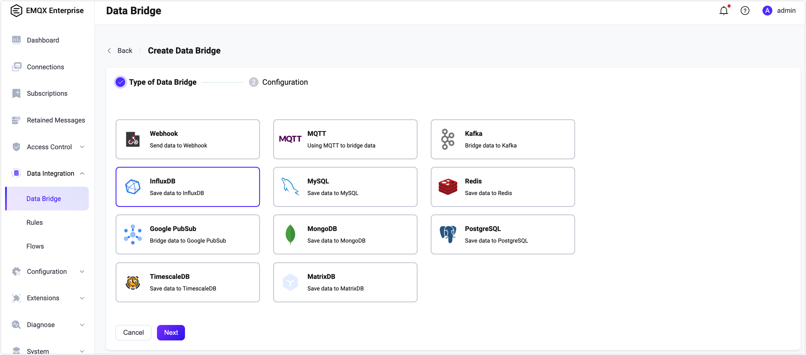

# Ingest Data into InfluxDB

InfluxDB is a database for storing and analyzing time series data. Its powerful data throughput capability and stable performance make it very suitable to be applied in the field of Internet of Things (IoT).

EMQX now supports connection to mainstream versions of InfluxDB Cloud, InfluxDB OSS, or InfluxDB Enterprise.


:::tip
EMQX Enterprise Edition features. EMQX Enterprise Edition provides comprehensive coverage of key business scenarios, rich data integration, product-level reliability, and 24/7 global technical support. Experience the benefits of this [enterprise-ready MQTT messaging platform](https://www.emqx.com/en/try?product=enterprise) today.
:::


:::tip Prerequisites

- Knowledge about [InfluxDB line protocol](https://docs.influxdata.com/influxdb/v2.5/reference/syntax/line-protocol/), as EMQX will follow this protocol when writing data into InfluxDB

- Knowledge about EMQX data integration [rules](./rules.md)

- Knowledge about [data bridge](./data-bridges.md)

  :::

## Feature List

- [Connection pool](./data-bridges.md) <!-- TODO 确认改版后知否支持-->
- [Async mode](./data-bridges.md)
- [Batch mode](./data-bridges.md)
- [Buffer queue](./data-bridges.md)

<!--[Configuration parameters](#Configuration) TODO 链接到配置手册对应配置章节。 -->

## Quick Start Tutorial

This section introduces how to use the InfluxDB data bridge, covering topics like how to set up the InfluxDB server, create a data bridge and rule for forwarding data to InfluxDB and test the data bridges and rules.

This tutorial assumes that you run both EMQX and InfluxDB on the local machine. If you have InfluxDB and EMQX running remotely, adjust the settings accordingly.

### Install InfluxDB Server

1. [Install InfluxDB](https://docs.influxdata.com/influxdb/v2.5/install/) via Docker, and then run the docker image.

```bash
# TO start the InfluxDB docker image
docker run --name influxdb -p 8086:8086 influxdb:2.5.1
```

2. With InfluxDB running, visit [http://localhost:8086](http://localhost:8086). Set the **Username**, **Password**, **Organization Name**, and **Bucket Name**.
3. In the InfluxDB UI, click **Load Data** -> **API Token** and then follow the instructions to [create all-access tokens](https://docs.influxdata.com/influxdb/v2.5/install/#create-all-access-tokens).

### Create InfluxDB Data Bridge

1. Go to EMQX Dashboard, click **Data Integration** -> **Data Bridge**.

2. Click **Create** on the top right corner of the page.

3. In the **Create Data Bridge** page, click to select **InfluxDB**, and then click **Next**.

   

4. Input a name for the data bridge. The name should be a combination of upper/lower case letters and numbers. Select the InfluxDB version as needed, by default v2 is selected.

6. Input the connection information.
   - For **Server Host**, input `127.0.0.1:8086`. If you are creating a connection to InfluxDB Cloud, use 443 as the port No., that is, input `{url}:443` and enable TLS  connection.
   - Input the **Organization**, **Bucket**, and **Token** you set in the [Install InfluxDB](#install) step.
   
6. In **Define Data Parsing** section, select **Data Format** as **JSON** or **LINE PROTOCOL**. 

   - For **JSON** format, define data parsing method, including **Measurement**, **Timestamp**, **Fields** and **Tags**. 

     Note: All key values can be variables and you can also follow the [InfluxDB line protocol](https://docs.influxdata.com/influxdb/v2.5/reference/syntax/line-protocol/) to set them.

     ::: tip

     - To write an integer type value to InfluxDB 1.x or 2.x, add `i` as the type identifier after the placeholder, for example `${payload.int}i`. See also [InfluxDB 1.8 write integer value](https://docs.influxdata.com/influxdb/v1.8/write_protocols/line_protocol_reference/#write-the-field-value-1-as-an-integer-to-influxdb).
     - To write an integer type value to InfluxDB 1.x or 2.x, add `i` as the type identifier after the placeholder, for example `${payload.int}i`. See also [InfluxDB 1.8 write integer value](https://docs.influxdata.com/influxdb/v1.8/write_protocols/line_protocol_reference/#write-the-field-value-1-as-an-integer-to-influxdb).

     :::

   - For **LINE PROTOCOL** format, specify a text-based format that provides the measurement, tag set, field set, timestamp of a data point, and placeholder supported according to the [InfluxDB line protocol](https://docs.influxdata.com/influxdb/v2.3/reference/syntax/line-protocol/) syntax.

7. Advanced settings (optional): Choose whether to use **sync** or **async** query mode, and whether to enable queue or batch. For details, see [Configuration](./data-bridges.md).

8. Before clicking **Create**, you can click **Test Connectivity** to test that the bridge can connect to the InfluxDB server.

9. Click the **Create** button to finish the setup.

Now the InFluxDB data bridge should appear in the data bridge list (**Data Integration** -> **Data Bridge**) with **Resource Status** as **Connected**.

### Create a Rule for InfluxDB Bridge

You can continue to create rules to specify the data to be saved into InfluxDB.

1. Go to EMQX Dashboard, and click **Data Integration** -> **Rules**.

2. Click **Create** on the top right corner of the page.

3. Input `my_rule` as the rule ID, and set the rules in the **SQL Editor**. Here we want to save the MQTT messages under topic `t/#`  to InfluxDB, we can use the SQL syntax below. 

   Note: If you want to specify your own SQL syntax, make sure that you have included all fields required by the data bridge in the `SELECT` part.

  ```sql
  SELECT
    *
  FROM
    "t/#"
  ```

4. Click the **Add Action** button, select **Forwarding with Data Bridge** from the dropdown list, and then select the data bridge we just created under **Data Bridge**. Then click the **Add** button.
4. Click **Create** at the page bottom to finish the creation.

Now a rule to forward data to InfluxDB via an InfluxDB bridge is created. You can click **Data Integration** -> **Flows** to view the topology. It can be seen that the messages under topic `t/#`  are sent and saved to InfluxDB after parsing by rule  `my_rule`.

### Test the Data Bridge and Rule

Use MQTTX  to send a message to topic  `t/1`  to trigger an online/offline event.

```bash
mqttx pub -i emqx_c -t t/1 -m '{ "msg": "hello InfluxDB" }'
```

Check the running status of the two data bridges, there should be one new incoming and one new outgoing message.

In the InfluxDB UI, you can confirm whether the message is written into the InfluxDB via the **Data Explorer** window.
