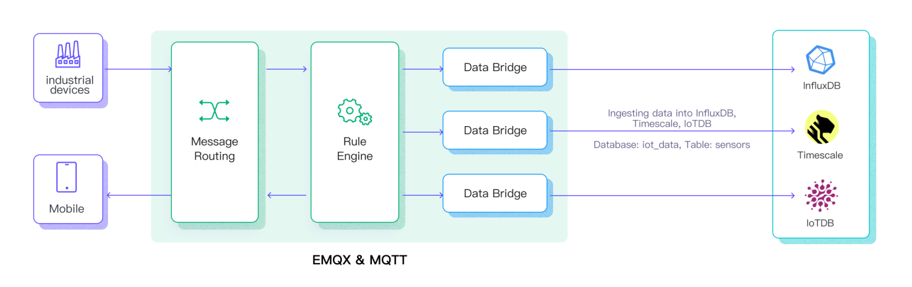

# Ingest MQTT Data into Apache IoTDB

[Apache IoTDB](https://iotdb.apache.org/) is a high-performance and scalable time series database designed to handle massive amounts of time series data generated by various IoT devices and systems.

EMQX provides seamless data integration with Apache IoTDB, enabling real-time MQTT messages ingested by EMQX to be forwarded to IoTDB through the [REST API V2](https://iotdb.apache.org/UserGuide/latest/API/RestServiceV2.html). This integration supports a one-way data flow, writing MQTT data into IoTDB for efficient time-series storage and analysis.

This page introduces how to integrate EMQX with Apache IoTDB and provides step-by-step instructions for creating and validating the integration.

## How It Works

The Apache IoTDB data integration is a built-in feature of EMQX that enables MQTT-based time-series data to be ingested into Apache IoTDB without additional coding. By leveraging EMQX’s built-in [rule engine](./rules.md), the integration simplifies data filtering, transformation, and forwarding for efficient storage and querying in IoTDB.

The following diagram illustrates a typical data integration architecture between EMQX and IoTDB. <!-- This image needs to be modified to be IoTDB specific-->



The workflow of the data integration is as follows:

1. **Message publication and reception**: Devices connect to EMQX over MQTT and publish messages containing telemetry data, status updates, or event information. The rule engine evaluates incoming messages.
2. **Rule-based processing:** Messages that match defined rules are selected for further processing. Optional transformations can be applied, such as filtering fields, converting data formats, or enriching payloads.
3. **Data buffering**: To improve reliability, EMQX buffers messages in memory when IoTDB is temporarily unavailable. If necessary, buffered data can be offloaded to disk to avoid memory pressure. Buffered data is not retained if the integration or EMQX node restarts.
4. **Data ingestion into IoTDB**: For matched rules, EMQX triggers the IoTDB Sink to forward processed data and write it into IoTDB as time-series data.
5. **Data Storage and Utilization**: Once stored in IoTDB, the data can be queried and analyzed for downstream applications such as device monitoring, asset tracking, predictive maintenance, and operational optimization.

## Features and Benefits

The data integration with IoTDB offers a range of features and benefits tailored to ensure effective data handling and storage:

- **No-Code IoT Data Pipeline**

  Build a complete MQTT-to-time-series data pipeline between EMQX and Apache IoTDB using built-in rules and sinks, without custom code or external services.

- **Flexible Mapping from MQTT to IoTDB Models**

  Support both Tree and Table data models, allowing MQTT data to be written to IoTDB in a structure that matches your device modeling and query requirements.

- **Decoupled Ingestion and Storage**

  EMQX absorbs bursty, high-frequency MQTT traffic while IoTDB focuses on durable time-series storage, improving system stability and resilience.

- **Production-Ready Scalability**

  The integration scales horizontally with device count and data volume, making it suitable for large-scale IoT, IIoT, and energy scenarios.

- **Analytics-Ready Time-Series Data**

  Data written to IoTDB can be directly queried, aggregated, and analyzed, or integrated with big data engines for advanced analytics and long-term insights.

## Before You Start

This section describes the preparations you must complete before creating the Apache IoTDB data integration in EMQX Dashboard.

### Prerequisites

- Knowledge about EMQX data integration [rules](./rules.md)
- Knowledge about [data integration](./data-bridges.md)

### Start an Apache IoTDB Server

This section introduces how to start an Apache IoTDB server using [Docker](https://www.docker.com/). Make sure to have `enable_rest_service=true` in your IoTDB's configuration.

Run the following command to start an Apache IoTDB server with its REST interface enabled:

```bash
docker run -d --name iotdb-service \
              --hostname iotdb-service \
              -p 6667:6667 \
              -p 18080:18080 \
              -e enable_rest_service=true \
              -e cn_internal_address=iotdb-service \
              -e cn_target_config_node_list=iotdb-service:10710 \
              -e cn_internal_port=10710 \
              -e cn_consensus_port=10720 \
              -e dn_rpc_address=iotdb-service \
              -e dn_internal_address=iotdb-service \
              -e dn_target_config_node_list=iotdb-service:10710 \
              -e dn_mpp_data_exchange_port=10740 \
              -e dn_schema_region_consensus_port=10750 \
              -e dn_data_region_consensus_port=10760 \
              -e dn_rpc_port=6667 \
              apache/iotdb:2.0.5-standalone
```

You can find more information about running [IoTDB in Docker on Docker Hub](https://hub.docker.com/r/apache/iotdb).

### Create a Database

IoTDB supports two data models: Tree Model and Table Model.  Before creating a database, confirm the **SQL Dialect** (Tree or Table) to be used in the Connector and Sink, and create the corresponding database accordingly.

- For the **Tree Model**, only a database is required.
- For the **Table Model**, you must first create a database, then create tables for data ingestion.

For detailed steps, see the IoTDB User Guide:

- [Create a database for the Tree Model](https://iotdb.apache.org/UserGuide/latest/Basic-Concept/Operate-Metadata_apache.html#_1-1-create-database)
- [Create a database for the Table Model](https://iotdb.apache.org/UserGuide/latest-Table/Basic-Concept/Database-Management_apache.html#_1-1-create-a-database)
- [Create tables for the Table Model](https://iotdb.apache.org/UserGuide/latest-Table/Basic-Concept/Table-Management_apache.html#_1-1-create-a-table)

## Create an IoTDB Connector

To create the Apache IoTDB data integration, you need to create a Connector to connect the Apache IoTDB Sink to the Apache IoTDB server.

EMQX supports communication with IoTDB through the REST API or Thrift protocol.

1. Go to the EMQX Dashboard and navigate to **Integrations** -> **Connectors**.

2. Click **Create** in the top-right corner.

3. On the **Create Connector** page, select **Apache IoTDB**.

4. Configure the connector:

   - **Connector Name**: Enter a unique name for the connector. Use a combination of uppercase/lowercase letters or numbers, for example, `my_iotdb`.
   - **Description**: (Optional) A brief description of the connector.
   - **Driver**: Select the protocol used to connect to IoTDB.
     - `REST API`: Enter the IoTDB REST service endpoint, for example, `http://localhost:18080`, as the **IoTDB REST Service Base URL**.
     - `Thrift Protocol`: Enter the IoTDB Thrift server address in the **Server Host** field.

   - **SQL Dialect**: Select the IoTDB data model that determines how EMQX writes device data into IoTDB.
     - `Tree Model`: Writes data as hierarchical time-series paths, suitable for path-based device and measurement management.
     - `Table Model`: Writes data into relational tables, suitable for managing device data by device type or category.
   - **Database Name**: When the **SQL Dialect** is set to `Table Model`, you must specify the name of the database to connect to.
   - **Username** and **Password**: Enter credentials used by EMQX to authenticate with the Apache IoTDB server.
   - **IoTDB Version**: Select the version of your Apache IoTDB deployment.
   - **Enable TLS**: Enable this option to establish an encrypted connection to the Apache IoTDB server. For more information, see [TLS for External Resource Access](../network/overview.md#tls-for-external-resource-access).
   - For optional tuning, see **Advanced Settings** in [Advanced Configurations](#advanced-configurations).

5. (Optional) Click **Test Connectivity** to verify that the connector can successfully connect to the Apache IoTDB server.

6. Click **Create** to finish creating the connector.

   In the dialog that appears, you can choose **Back to Connector List** or **Create Rule** to continue configuring a rule and an Apache IoTDB Sink. For detailed steps, see [Create a Rule and Apache IoTDB Sink](#create-a-rule-and-apache-iotdb-sink).


## Create a Rule with Apache IoTDB Sink

This section demonstrates how to create a rule in EMQX to process messages from the source MQTT topic `root/#`  and send the processed results through the configured Apache IoTDB Sink to store the time series data to Apache IoTDB.

### Create a Rule with Defined SQL

1. Go to the EMQX Dashboard, and click **Integration** -> **Rules**.

2. Click **Create** on the top right corner of the page.

3. Enter a rule ID, for example, `my_rule`.

4. Enter the following statement in the **SQL editor**, which will forward the MQTT messages matching the topic pattern `root/#`:
   ```sql
   SELECT
     *
   FROM
     "root/#"
   ```

   ::: tip

   If you are a beginner, you can click **SQL Examples** and **Enable Test** to learn and test SQL rules.

   :::

5. Add an Apache IoTDB Sink to the rule to write the processed results into IoTDB. For detailed steps, see [Add an Apache IoTDB Sink](#add-an-apache-iotdb-sink).

6. On the **Create Rule** page, review your configuration and click **Save** to create the rule.

Once the rule is created, it will appear in the **Rules** list. Click the **Actions (Sink)** tab to view the IoTDB Sink associated with this rule.

You can also go to **Integrations** -> **Flow Designer** to view the topology graph. It will show messages from topic `root/#` being processed by the `my_rule` rule and written to IoTDB.

### Add an Apache IoTDB Sink

1. Click the **Add Action** button on the right to define an action that will be triggered when the rule is matched. This action forwards the processed data to IoTDB.

2. In the **Type of Action** dropdown, select `Apache IoTDB`. Keep the **Action** dropdown set to the default `Create Action`. You can also select an existing IoTDB Sink. This example assumes you are creating a new Sink.

3. Enter the name and description of the Sink.

4. In the **Connector** dropdown, select the Connector `my_iotdb` you just created. If no connector is available, you can create one by clicking the adjacent button. See [Create an IoTDB Connector](#create-an-iotdb-connector).

5. Configure the following information for the Sink:

      * **SQL Dialect**: Select how the Apache IoTDB Sink writes data into IoTDB. This option must be consistent with the SQL dialect selected in the Connector.

        * `Tree Model`: Writes data as time-series paths in IoTDB. Each Sink record is inserted into a device path, with measurements written as individual time series under that device. When selecting this model, you can specify the **Device ID** field.
        * `Table Model`: Writes data into IoTDB relational tables. Each Sink record is inserted as a row in the specified table, with fields mapped to table columns. When selecting this model, you must specify the **Table** field.
        
      * **Device ID** (optional): Enter a specific device ID to be used as the device name for forwarding and inserting timeseries data into the IoTDB instance.

        :::tip

        If left empty, the device ID can still be specified in the published message or configured within the rule. For example, if you publish a JSON-encoded message with a `device_id` field, the value of that field will determine the output device ID. To extract this information using the rule engine, you can use SQL similar to the following:

        ```sql
        SELECT
         payload,
         `my_device` as payload.device_id
        ```

        However, the fixed device ID configured in this field takes precedence over any previously mentioned methods.

        :::

      - **Table**: The name of the IoTDB table to which the data will be written.

      - **Align Timeseries**: Disabled by default. Once enabled, the timestamp columns of a group of aligned timeseries are stored only once in IoTDB, rather than duplicating them for each individual timeseries within the group. For more information, see [Aligned timeseries](https://iotdb.apache.org/UserGuide/V1.1.x/Data-Concept/Data-Model-and-Terminology.html#aligned-timeseries).

      - Configure the **Write Data** to specify the ways to generate IoTDB data from MQTT messages.

        You can define a template in the **Write Data** section, including as many items as needed, each with the required contextual information per row. When this template is provided, the system will generate IoTDB data by applying it to the MQTT message. The template for writing data supports batch setting via CSV file. For details, refer to [Batch Setting](#batch-setting).

        For example, consider this template:

        ::: tip Note
        
        The **Column Category** only appears when you select `Table Model` as the SQL dialect.
        
        :::
        
        | Column Category | Timestamp | Measurement | Data Type | Value    |
        | --------------- | --------- | ----------- | --------- | -------- |
        | field           |           | index       | INT32     | ${index} |
        |                 |           | temperature | FLOAT     | ${temp}  |

        `Timestamp` and `Value` support placeholder syntax to fill it with variables. If the `Timestamp` is omitted, it will be automatically filled with the current system time in milliseconds.

        Then, your MQTT message can be structured as follows:

          ```json
        {
          "index": "42",
          "temp": "32.67"
          }
          ```

6. **Fallback Actions**:  (Optional) If you want to improve reliability in case of message delivery failure, you can define one or more fallback actions. These actions will be triggered if the primary Sink fails to process a message. See [Fallback Actions](./data-bridges.md#fallback-actions) for more details.

7. **Advanced settings**:  (optional) See [Advanced Configurations](#advanced-configurations).

8. (Optional) click **Test Connectivity** to test if the sink can be connected to the Apache IoTDB server.

### Batch Setting

In Apache IoTDB, writing hundreds of data entries simultaneously can be challenging when configuring on the Dashboard. To address this issue, EMQX offers a functionality for batch setting data writes.

When configuring **Write Data**, you can use the batch setting feature to import fields for insertion operations from a CSV file.

1. Click the **Batch Setting** button in the **Write Data** table to open the **Import Batch Setting** popup.

2. Follow the instructions to download the batch setting template file, then fill in the data writing configuration in the template file. The default template file content is as follows:

   ::: tip Note

   Below is the default template for `Table Model`.  The **Column Category** column is not available in `Tree Model`.

   :::

   | Column Category | Timestamp | Measurement | Data Type | Value             | Remarks (Optional)                                           |
   | --------------- | --------- | ----------- | --------- | ----------------- | ------------------------------------------------------------ |
   | tag             | now       | clientid    | text      | ${clientid}       |                                                              |
   | field           | now       | temp        | float     | ${payload.temp}   | Fields, values, and data types are mandatory. Available data type options include: boolean, int32, int64, float, double, text |
   | attribute       | now       | hum         | text      | ${payload.hum}    |                                                              |
   | attribute       | now       | status      | text      | ${payload.status} |                                                              |

   - **Column Category**: The data model of the column. Supported values are `tag`, `field`, and `attribute`. `tag` must be a string; `field` or `attribute` is recommended.
   - **Timestamp**: Supports placeholders in ${var} format, requiring timestamp format. You can also use the following special characters to insert system time:
     - now: Current millisecond timestamp
     - now_ms: Current millisecond timestamp
     - now_us: Current microsecond timestamp
     - now_ns: Current nanosecond timestamp
   - **Measurement**: Field name.
   - **Data Type**: Data type, with options including boolean, int32, int64, float, double, and text.
   - **Value**: The data value to be written, supports constants or placeholders in ${var} format, and must match the data type.
   - **Remarks**: Used only for notes within the CSV file, cannot be imported into EMQX.

   Note that only CSV files under 1M and with data not exceeding 2000 lines are supported.

3. Save the filled template file and upload it to the **Import Batch Setting** popup, then click **Import** to complete the batch setting.

4. After importing, you can further adjust the data in the **Write Data** table.

## Test the Rule

You can use the built-in WebSocket client in the EMQX dashboard to test your Apache IoT Sink and rule.

1. Click **Diagnose** -> **WebSocket Client** in the left navigation menu of the Dashboard.

2. Fill in the connection information for the current EMQX instance.

   - If you run EMQX locally, you can use the default value.
   - If you have changed EMQX's default configuration. For example, the configuration change on authentication can require you to type in a username and password.

3. Click **Connect** to connect the client to the EMQX instance.

4. Scroll down to the publish area. Specify the device id in the message and type the following:

   - **Topic**: `root/sg27`

     :::tip

     If your topic does not start with `root` it will automatically be prefixed. For example, if you publish the message to `test/sg27` the resulting device name will be `root.test.sg27`. Make sure your rule and topic are configured correctly, so it forwards messages from that topic to the Sink.

     :::

   - **Payload**:

     ```json
      {
       "value": "37.6",
       "device_id": "root.sg27"
      }
     ```
     
      ::: tip
     
      The `Write Data` template is:
     
     ```
      now, "temp", float, "${payload.value}"
     ```
     
      :::
     
   - **QoS**: `2`

7. Click **Publish** to send the message.

   If the Sink and rule are successfully created, the messages should have been published to the specified time series table in the Apache IoTDB server.

8. Check the messages by using IoTDB's command line interface. If you're using it from docker as shown above, you can connect to the server by using the following command from your terminal:

   ```shell
       $ docker exec -ti iotdb-service /iotdb/sbin/start-cli.sh -h iotdb-service
   ```

9. In the console, continue to type the following:

   ```sql
   IoTDB> select * from root.sg27
   ```

   You should see the data printed as follows:

   ```
   +------------------------+--------------+
   |                    Time|root.sg27.temp|
   +------------------------+--------------+
   |2023-05-05T14:26:44.743Z|          37.6|
   +------------------------+--------------+
   ```

## Advanced Configurations

This section describes some advanced configuration options that can optimize the performance of your Connector and customize the operation based on your specific scenarios. When creating the Connector, you can unfold the **Advanced Settings** and configure the following settings according to your business needs.

| Fields                   | Descriptions                                                 | Recommended Values |
| ------------------------ | ------------------------------------------------------------ | ------------------ |
| HTTP Pipelining          | Specifies the number of HTTP requests that can be sent to the server in a continuous sequence without waiting for individual responses. This option takes a positive integer value that represents the maximum number of HTTP requests that will be pipelined. <br />When set to `1`, it indicates a traditional request-response model where each HTTP request will be sent, and then the client will wait for a server response before sending the next request. Higher values enable more efficient use of network resources by allowing multiple requests to be sent in a batch, reducing the round-trip time. | `100`              |
| Pool Type                | Defines the algorithmic strategy used for managing and distributing connections in the Connector between EMQX and Apache IoTDB. <br />When set to `random`, connections to the Apache IoTDB server will be randomly selected from the available connection pool. This option provides a simple, balanced distribution.<br />When set to `hash`, a hashing algorithm is used to consistently map requests to connections in the pool. This type is often used in scenarios where a more deterministic distribution of requests is required, such as load balancing based on client identifiers or topic names.<br />**Note**: Choosing the appropriate pool type depends on your specific use case and the distribution characteristics that you aim to achieve. | `random`           |
| Connection Pool Size     | Specifies the number of concurrent connections that can be maintained in the connection pool when interfacing with the Apache IoTDB service. This option helps in managing the application's scalability and performance by limiting or increasing the number of active connections between EMQX and Apache IoTDB.<br />**Note**: Setting an appropriate connection pool size depends on various factors such as system resources, network latency, and the specific workload of your application. Too large a pool size may lead to resource exhaustion, while too small a size may limit throughput. | `8`                |
| Connect Timeout          | Specifies the maximum amount of time, in seconds, that the EMQX will wait while attempting to establish a connection with the Apache IoTDB HTTP server.<br />**Note**: A carefully chosen timeout setting is crucial for balancing system performance and resource utilization. It is advisable to test the system under various network conditions to find the optimal timeout value for your specific use case. | `15`               |
| HTTP Request Max Retries | Specifies the maximum number of times an HTTP request will be retried if it fails to successfully complete during communication between the EMQX and Apache IoTDB. | `2`                |
| Start Timeout            | Determines the maximum time interval, in seconds, that the Connector will wait for an auto-started resource to reach a healthy state before responding to resource creation requests. This setting helps ensure that the integration does not proceed with operations until it verifies that the connected resource, such as a database instance in Apache IoTDB, is fully operational and ready to handle data transactions. | `5`                |
| Buffer Pool Size         | Specifies the number of buffer worker processes that will be allocated for managing data flow in egress-type bridges between EMQX and Apache IoTDB. These worker processes are responsible for temporarily storing and handling data before it is sent to the target service. This setting is particularly relevant for optimizing performance and ensuring smooth data transmission in egress (outbound) scenarios. For bridges that only deal with ingress (inbound) data flow, this option can be set to "0" as it is not applicable. | `18`               |
| Request TTL              | The "Request TTL" (Time To Live) configuration setting specifies the maximum duration, in seconds, that a request is considered valid once it enters the buffer. This timer starts ticking from the moment the request is buffered. If the request stays in the buffer for a period exceeding this TTL setting or if it is sent but does not receive a timely response or acknowledgment from Apache IoTDB, the request is deemed to have expired. | `45`               |
| Health Check Interval    | Specifies the time interval, in seconds, at which the Connector will perform automated health checks on the connection to Apache IoTDB. | `15`               |
| Max Buffer Queue Size    | Specifies the maximum number of bytes that can be buffered by each buffer worker in the Apache IoTDB data integration. Buffer workers temporarily store data before it is sent to IoTDB, serving as an intermediary to handle data flow more efficiently. Adjust the value according to your system's performance and data transfer requirements. | `265`              |
| Query Mode               | Allows you to choose `asynchronous` or `synchronous` query modes to optimize message transmission based on different requirements. In asynchronous mode, writing to IoTDB does not block the MQTT message publish process. However, this might result in clients receiving messages ahead of their arrival in IoTDB. | `Async`            |
| Inflight Window          | An "in-flight query" refers to a query that has been initiated but has not yet received a response or acknowledgment. This setting controls the maximum number of in-flight queries that can exist simultaneously when the Connector is communicating with Apache IoTDB. <br />When the `query_mode` is set to `async` (asynchronous), the "Inflight Window" parameter gains special importance. If it is crucial for messages from the same MQTT client to be processed in strict order, you should set this value to 1. | `100`              |

## More Information

EMQX provides bunches of learning resources on the data integration with Apache IoTDB. Check out the following links to learn more:

**Blogs:**

[Time-Series Database (TSDB) for IoT: The Missing Piece](https://www.emqx.com/en/blog/time-series-database-for-iot-the-missing-piece)

