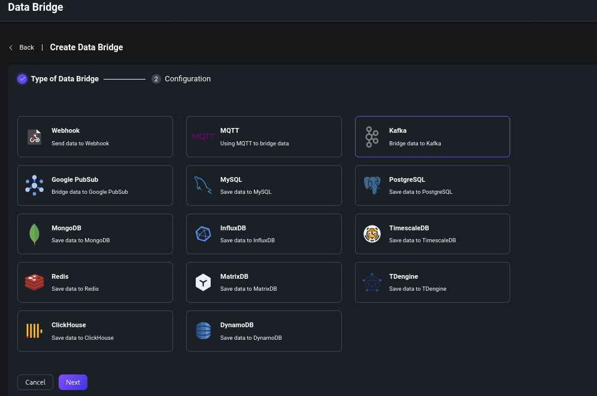

# Apache Kafka Consumer

Apache Kafka is a widely-used open-source distributed event streaming
platform. EMQX's integration with Apache Kafka/Confluent presents our
users with reliable bi-directional data transport and processing
capability under high-throughput scenarios.

Being a top IoT data infrastructure provider, EMQX currently supports
authenticating with Apache Kafka/Confluent via SASL/SCRAM or
SASL/GSSAPI.


:::tip

EMQX Enterprise Edition features. EMQX Enterprise Edition provides
comprehensive coverage of key business scenarios, rich data
integration, product-level reliability, and 24/7 global technical
support. Experience the benefits of this [enterprise-ready MQTT
messaging platform](https://www.emqx.com/en/try?product=enterprise)
today.

:::


The following steps will guide you to use this configuration.

## Setup

:::tip Prerequisites

- Knowledge about EMQX data integration [rules](./rules.md)
- Knowledge about [data bridge](./data-bridges.md)
- Relevant Kafka topics should be created before creating the data bridge.

:::

### Configure Kafka Consumer Bridge via Dashboard

Go to the EMQX Dashboard, select the _"Data Integration"_ item on the
menu on the left, then _"Data Bridges"_.  Then, click _"+ Create"_.

In the dialog, select the _Kafka_ bridge type, click next.  In the
_Kafka Role_ field, select _Consumer_.  Fill the required fields for
that bridge (those are marked with an asterisk).  The _Topic Mapping_
field must contain at least one Kafka-to-MQTT topic mapping.  The
_MQTT Payload Template_ subfield specifies the MQTT payload that
should be used, and has the following Kafka message fields available
for templating:

| Field Name | Description                                                               |
|------------|---------------------------------------------------------------------------|
| `headers`  | an object containing string key-value pairs                               |
| `key`      | Kafka message key (encoded by the chosen key encoding)                    |
| `offset`   | offset for the message in Kafka's topic partition                         |
| `topic`    | Originating Kafka topic                                                   |
| `ts`       | message timestamp                                                         |
| `ts_type`  | message timestamp type, which is one of `create`, `append` or `undefined` |
| `value`    | Kafka message value (encoded by the chosen value encoding)                |

The default value for _MQTT Payload Template_ is `${.}`, which will
include all available data encoded as a JSON object.  For example,
choosing `${.}` as a template would produce the following for a Kafka
message:

```json
{
  "value": "value",
  "ts_type": "create",
  "ts": 1679665968238,
  "topic": "my-kafka-topic",
  "offset": 2,
  "key": "key",
  "headers": {"header_key": "header_value"}
}
```

Subfields from the Kafka message may be accessed with dot notation.
For example: `${.value}` will resolve to the Kafka message value, and
`${.headers.h1}` will resolve to the value of the `h1` Kafka header,
if present.  Absent values will be replaced by empty strings.

:::tip

Each Kafka-to-MQTT topic mapping must contain a unique Kafka topic
name.  That is, the Kafka topic must not be present in more than one
mapping.

:::

Finally, after clicking _"Create"_, you'll be offered the option of
creating an associated rule.  This will allow Kafka messages matching
the rule to be further transformed and filtered if needed, and then
forwarded to other rule actions, like different bridges.  Refer to the
[_Rules_](./rules.md) for more info on creating rules.

Note that it's not strictly necessary to create an associated rule.
The MQTT topics defined in _Topic Mapping_ will start having messages
published to them without further configuration.





## Configure Kafka Consumer Bridge via Configuration File

Add the following configuration to the end of the `emqx.conf` file if
you wish to configure this bridge using the configuration file.

```js
bridges.kafka_consumer.my_consumer {
  enable = true
  bootstrap_hosts = "kafka-1.emqx.net:9092"
  connect_timeout = 5s
  min_metadata_refresh_interval = 3s
  metadata_request_timeout = 5s
  authentication = {
    mechanism = plain
    username = emqxuser
    password = password
  }
  kafka {
    max_batch_bytes = 896KB
    max_rejoin_attempts = 5
    offset_commit_interval_seconds = 3
    offset_reset_policy = reset_to_latest
  }
  topic_mapping = [
    {
      kafka_topic = "kafka-topic-1"
      mqtt_topic = "mqtt/topic/1"
      qos = 1
      payload_template = "${.}"
    },
    {
      kafka_topic = "kafka-topic-2"
      mqtt_topic = "mqtt/topic/2"
      qos = 2
      payload_template = "v = ${.value}"
    }
  ]
  key_encoding_mode = none
  value_encoding_mode = none
  ssl {
    enable = false
    verify = verify_none
    server_name_indication = "auto"
  }
}
```
