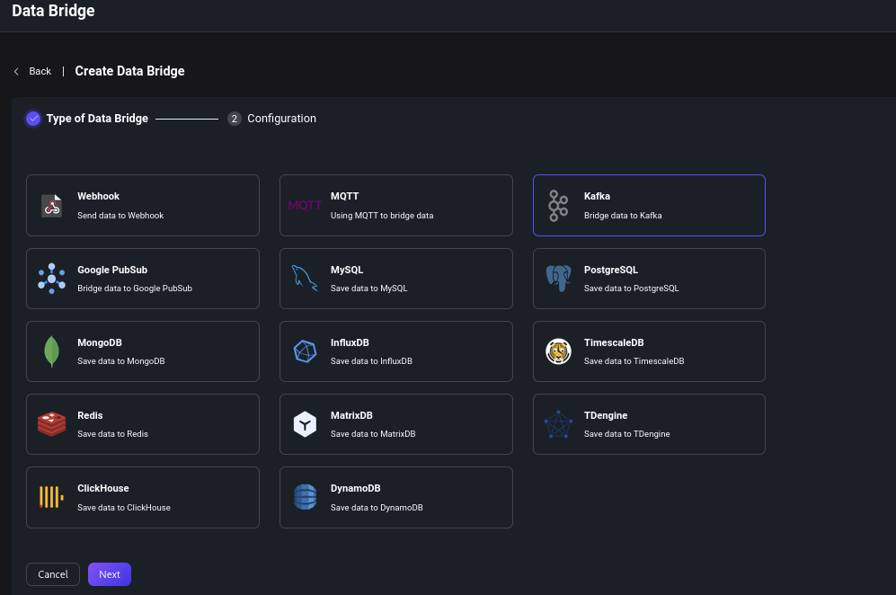

# Stream Data into Apache Kafka

<!-- 提供一段简介，描述支数据桥接的基本工作方式、关键特性和价值，如果有局限性也应当在此处说明（如必须说明的版本限制、当前未解决的问题）。 -->

[Apache Kafka](https://kafka.apache.org/) is a widely-used open-source distributed event streaming platform. EMQX's integration with Apache Kafka/Confluent presents our users with reliable bi-directional data transport and processing capability under high-throughput scenarios. Streaming data into Apache Kafka involves creating data bridges to Kafka in two roles: producer (sends messages to Kafka) and consumer (receives messages from Kafuka). EMQX enables you to create data bridges in either or both of the roles.

As a top IoT data infrastructure provider, EMQX currently supports authenticating with Apache Kafka/Confluent via SASL/SCRAM or SASL/GSSAPI. 


:::tip
EMQX Enterprise Edition features. EMQX Enterprise Edition provides comprehensive coverage of key business scenarios, rich data integration, product-level reliability, and 24/7 global technical support. Experience the benefits of this [enterprise-ready MQTT messaging platform](https://www.emqx.com/en/try?product=enterprise) today.
:::


:::tip Prerequisites

<!-- 根据情况编写，包含必须的前置知识点、软件版本要求、需要预先创建/初始化的操作。 -->
- Knowledge about EMQX data integration [rules](./rules.md)
- Knowledge about [data bridge](./data-bridges.md)

<!-- 列举功能或性能方面的亮点，如支持批处理、支持异步模式、双向数据桥接，链接到对应的功能介绍章节。 -->

:::

## Feature List

- [Connection pool](./data-bridges.md#connection-pool) <!-- TODO 确认改版后知否支持-->
- [Async mode](./data-bridges.md#async-mode)
- [Batch mode](./data-bridges.md#batch-mode)
- [Buffer queue](./data-bridges.md#buffer-queue)

<!--  Configuration parameters TODO 链接到配置手册对应配置章节。 -->

## Quick Start Tutorial
<!-- 从安装测试所需步骤，如果有不同的用法增加章节介绍。 -->

This section introduces how to stream data into Kafka, covering topics like how to set up a Kafka server, how to create a bridge and a rule for forwarding data to the bridge and how to test the data bridge and rule.

This tutorial assumes that you run both EMQX and Kafka on the local machine. If you have Kafka and EMQX running remotely, please adjust the settings accordingly.

### Install Kafka

This section takes macOS as an example to illustrate the process. You can install and run Kafka with the commands below:

```bash
wget https://archive.apache.org/dist/kafka/3.3.1/kafka_2.13-3.3.1.tgz

tar -xzf  kafka_2.13-3.3.1.tgz

cd kafka_2.13-3.3.1

# Use KRaft to run Kafka (optional)
KAFKA_CLUSTER_ID="$(bin/kafka-storage.sh random-uuid)"

bin/kafka-storage.sh format -t $KAFKA_CLUSTER_ID -c config/kraft/server.properties

bin/kafka-server-start.sh config/kraft/server.properties
```

For detailed operation steps, you may refer to the [Quick Start section in Kafka Documentation](https://kafka.apache.org/documentation/#quickstart).

### Create Kafka Topics

Relevant Kafka topics should be created before creating the data bridge in EMQX. Use the commands below to create two topics in Kafka:  `testtopic-in` and `testtopic-out`. 

```bash
bin/kafka-topics.sh --create --topic testtopic-in --bootstrap-server localhost:9092

bin/kafka-topics.sh --create --topic testtopic-out --bootstrap-server localhost:9092
```

### Create Kafka Data Bridge

This section demonstrates how to create Kafka producer and consumer data bridges via Dashboard.

1. Go to EMQX Dashboard, click **Data Integration** -> **Data Bridge**.

2. Click **Create** on the top right corner of the page.

3. In the **Create Data Bridge** page, click to select **Kafka**, and then click **Next**.

   

4. In **Bridge Role** field, select **Producer** or **Consumer**. Click the corresponding tabs for the configuration of each role. 
   
   :::: tabs type:card
   
   ::: tab Configure as Producer Role
   
   - Fill in the required fields (marked with an asterisk).
   
   - Input a name for the data bridge. The name should be a combination of upper/lower case letters and numbers.
   
   - Input the connection information. Input `127.0.0.1:9092` for the **Bootstrap Hosts**. For the other fields set as the actual condition.
   
   - **Source MQTT Topic**: Set the MQTT topics to create the data bridge. In this example, it is set to `t/#`, indicating all MQTT messages matching this topic will be sent to Kafka. You can also leave it blank, and create a [rule](#create-rule-for-kafka-producer-data-bridge) to specify data to be sent to Kafka.
   
   - **Kafka Topic Name**: Input `testtopic-in` (the Kafka topic created before). Note: Variables are not supported here.
   
   - **Message Key**: Kafka message key. Insert a string here, either a plain string or a string containing placeholders (${var}).
   
   - **Message Value**: Kafka message value. Insert a string here, either a plain string or a string containing placeholders (${var}).
   
   - Advanced settings (optional): Set the **Max Batch Bytes**, **Compression**, and **Partition Strategy** as your business needs.
   
   :::
   
   ::: tab Configure as Consumer Role
   
   - Fill the required fields (marked with an asterisk). 
   
   - Input a name for the data bridge. The name should be a combination of upper/lower case letters and numbers.
   
   - Input the connection information. Input `127.0.0.1:9092` for the **Bootstrap Hosts**. For the other fields set as the actual condition.
   
   - The **Topic Mapping** field must contain at least one Kafka-to-MQTT topic mapping. The **MQTT Payload Template** subfield specifies the MQTT payload that should be used, and has the following Kafka message fields available for templating:
   
     | Field Name | Description                                                  |
     | ---------- | ------------------------------------------------------------ |
     | `headers`  | An object containing string key-value pairs                  |
     | `key`      | Kafka message key (encoded by the chosen key encoding)       |
     | `offset`   | Offset for the message in Kafka's topic partition            |
     | `topic`    | Originating Kafka topic                                      |
     | `ts`       | Message timestamp                                            |
     | `ts_type`  | Message timestamp type, which is one of `create`, `append` or `undefined` |
     | `value`    | Kafka message value (encoded by the chosen value encoding)   |
   
     The default value for **MQTT Payload Template** is `${.}`, which includes all available data encoded as a JSON object.  For example, choosing `${.}` as a template will produce the following for a Kafka message:
     
     ```json
     {
           "value": "value",
           "ts_type": "create",
           "ts": 1679665968238,
           "topic": "my-kafka-topic",
           "offset": 2,
           "key": "key",
           "headers": {"header_key": "header_value"}
          }
     ```
     
     Subfields from the Kafka message may be accessed with dot notation. For example: `${.value}` will resolve to the Kafka message value, and `${.headers.h1}` will resolve to the value of the `h1` Kafka header, if present.  Absent values will be replaced by empty strings.
     
     **Note**: Each Kafka-to-MQTT topic mapping must contain a unique Kafka topic name.  That is, the Kafka topic must not be present in more than one mapping.
     
   
   :::
   
   ::::
   
5. Before clicking **Create**, you can click **Test Connection** to test that the bridge can connect to the Kafka server.

6. Click **Create**, you'll be offered the option of creating an associated rule. 

   - For the Kafka producer data bridge, click **Create Rule** to create an associated rule. For detailed operating steps, see [Create Rule for Kafka Producer Data Bridge](#create-rule-for-kafka-producer-data-bridge). 
   - For the Kafka consumer data bridge, It's not strictly necessary to create a rule.

::: tip

   By creating a rule, it allows Kafka messages matching the rule to be further transformed and filtered if needed, and then forwarded to other rule actions, like different bridges. Refer to the [Rules](./rules.md) for more information on creating rules. The MQTT topics defined in **Topic Mapping** will start having messages published to them without further configuration.

:::

Now the Kafka data bridge should appear in the data bridge list (**Data Integration** -> **Data Bridge**) with **Resource Status** as **Connected**.

### Create Rule for Kafka Producer Data Bridge

1. Go to EMQX Dashboard, click **Data Integration** -> **Rules**.

2. Click **Create** on the top right corner of the page.

3. Input, for example, `my_rule` as the rule ID.

4.  Input the following statement in the **SQL Editor** if you want to save the MQTT messages under topic `t/#`  to Kafka. 

   Note: If you want to specify your own SQL syntax, make sure that you have included all fields required by the data bridge in the `SELECT` part.

```sql
SELECT
  *
FROM
  "t/#"
```

5. Click the **Add Action** button, select **Forwarding with Data Bridge** from the dropdown list and then select the data bridge you just created under **Data bridge**. Then click the **Add** button.

6. Click **Create** at the page bottom to finish the creation.

Now we have successfully created the data bridge to Kafka producer data bridge. You can click **Data Integration** -> **Flows** to view the topology. It can be seen that the messages under topic `t/#`  are sent and saved to Kafka after parsing by rule  `my_rule`.

### Test the Data Bridge and Rule

 Use MQTTX to send messages to topic  `t/1`:

```bash
   mqttx pub -i emqx_c -t t/1 -m '{ "msg": "Hello Kafka" }'
```

Check the running status of the two data bridges, there should be one new incoming and one new outgoing message.

Check whether messages are written into the topic `testtopic-in`  with the following Kafka command:

   ```bash
   bin/kafka-console-consumer.sh --bootstrap-server 127.0.0.1:9092  --topic testtopic-in --from-beginning
   ```

   
